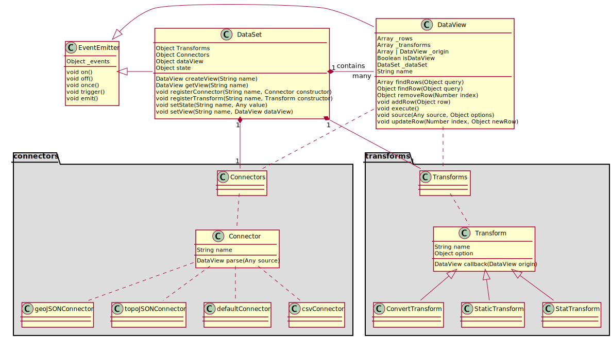

[link](https://antv-g2.gitee.io/zh/docs/manual/dataset/overview)

# DataSet

## 1. 快速入门

DataSet 的目标是为数据可视化场景提供状态驱动 (state driven) 的，丰富而强大的数据处理能力。

### 1.1 术语表

| 术语     | 英文      | 描述                                                         |
| -------- | --------- | ------------------------------------------------------------ |
| 数据集   | DataSet   | 一组数据集合。                                               |
| 数据视图 | DataView  | 单个数据视图，目前有普通二维数据（类似一张数据库表），树形数据，图数据和地理信息数据几种类型。 |
| 状态量   | state     | 数据集内部流转的控制数据状态的变量。                         |
| 变换     | Transform | 数据变换函数，数据视图做数据处理时使用，包括图布局，数据补全，数据过滤等。 |
| 连接器   | Connector | 数据接入函数，用于把某种数据源（譬如 csv）载入到某个数据视图上。 |

### 1.2 简介

DataSet 作为数据处理模块，为数据可视化中数据预处理环节提供了强大的功能。首先我们把数据处理分为两个大的步骤：数据连接 (Connector) 和数据转换 (Transform)。Connector 负责导入和归一化数据（譬如导入 CSV 数据，导入 GeoJSON 数据等），Transform 负责进行各种数据转换操作（譬如图布局，数据统计，数据补全等）。通过这样的分层，支持了前端社区非常全面的数据处理相关的算法和模块。其次，我们在单个数据视图 (DataView) 的基础上增加了数据集 (DataSet) 的概念，通过统一的 DataSet 管理，实现了各个数据视图之间的状态同步和交互。



### 1.3 功能介绍

DataSet 主要完成了以下功能：

- 源数据的解析，将 CSV, DSV, GeoJSON 转成标准的 JSON, 查看 Connector。
- 数据处理，查看 Transform：
  - 加工数据，包括 filter, map, fold(补数据)等操作。
  - 统计函数，汇总统计，百分比，封箱等统计函数。
  - 特殊数据处理，包括地理数据，矩形树图，桑基图，文字云的数据处理。

### 1.4 安装

##### 浏览器引入

可以通过 `<script>`标签引入在线资源或者本地脚本。

```html
<!-- 引入在线资源 -->
<script src="https://unpkg.com/@antv/data-set"></script>
<!-- 引入本地脚本 -->
<script src="./data-set.js"></script>
```

这样，就可以在后续脚本中得到全局变量 DataSet。

```html
<script>
	const dv = new DataSet.DataView();
</script>
```

##### 通过 npm 安装

```sh
npm install @antv/data-set --save
```

安装后即可使用 `import` 或者 `require` 进行引用。

```js
import { DataView } from '@antv/data-set';
const dv = new DataView();
```

### 1.5 使用示例

在下面的例子中，我们将使用 DataSet 模块计算数据集的平均身高和平均体重：

```js
import DataSet from '@antv/data-set';

const data = [
  { gender: 'female', height: 161.2, weight: 51.6 },
  { gender: 'female', height: 167.5, weight: 59 },
  { gender: 'female', height: 159.5, weight: 49.2 },
  { gender: 'female', height: 157, weight: 63 },
  { gender: 'female', height: 155.8, weight: 53.6 },
  { gender: 'female', height: 170, weight: 59 },
  { gender: 'female', height: 159.1, weight: 47.6 },
  { gender: 'female', height: 166, weight: 69.8 },
  { gender: 'female', height: 176.2, weight: 66.8 },
  { gender: 'female', height: 160.2, weight: 75.2 },
  { gender: 'female', height: 172.5, weight: 55.2 },
  { gender: 'female', height: 170.9, weight: 54.2 },
  { gender: 'female', height: 172.9, weight: 62.5 },
];

const ds = new DataSet();

const dv = ds.createView().source(data);

dv.transform({
  type: 'aggregate',
  fields: ['height', 'weight'], // 统计字段集
  operations: ['mean', 'mean'], // 统计操作集
  as: ['avgHeight', 'avgWeight'],
});

// 统计结果以 JSON 数组的格式存储在 dv.rows 中
const { avgHeight, avgWeight } = dv.rows[0];

console.log(avgHeight, avgWeight);
```

## 2. DataSet

全局命名空间 `DataSet`，同时也是数据集类的构造函数。

### 2.1 常量 Constants

#### DataSet.CONSTANTS

常量，譬如 `DataSet.HIERARCHY` 是树形结构的名称。

#### DataSet.connectors

存储已注册的 Connector (key-value 对)。

#### DataSet.transforms

存储已注册的 Transform (key-value 对)。

### 2.2 类 Classes

#### DataSet

数据集构建函数。

##### new DataSet()

`new DataSet(options = {})` 创建并返回 DataSet 实例。

| 参数    | 类型   | 是否可选 |
| ------- | ------ | -------- |
| options | Object | 是       |

```js
const ds = new DataSet({
  state: {
    // 指定初始化状态量
    foo: 'bar'
  }
});
```

##### ds.isDataSet

判断是否是 DataSet 时使用，`ds.isDataSet === true`

##### ds.views

存储所有挂在数据集上的数据视图 (key-value 对)。

##### ds.state

存储数据集上的状态量 (key-value 对)。

##### ds.createView()

> Alias: ds.view()

`ds.createView([name, ]options = {})` 创建并返回一个数据视图实例。

| 参数    | 类型   | 是否可选 |
| ------- | ------ | -------- |
| name    | String | 是       |
| options | Object | 是       |

```js
const dv0 = ds.createView();
const dv1 = ds.createView('foo');
const dv2 = ds.createView('bar', {
  watchingStates: ['fakeState'],
});
```

**options.watchingStates**

创建数据视图实例时，传入的 `watchingStates` 是用于指定该数据视图监听的 `states`状态量的。默认监听所有状态量（也就是任何状态量变更都会导致数据视图重新计算），如果指定为空数组 []，则不监听任何状态量，如果指定为非空数据，则只监听数组元素对应的状态量变更。

##### ds.getView()

`ds.getView(name)`返回 name 对应的数据视图实例。

| 参数 | 类型   | 是否可选 |
| ---- | ------ | -------- |
| name | String | 否       |

```js
const dv = ds.getView('foo');
```

##### ds.setView()

`ds.setView(name, dv)`设置 name 对应的数据视图实例为 dv。

| 参数 | 类型         | 是否可选 |
| ---- | ------------ | -------- |
| name | String       | 否       |
| dv   | DataSet.View | 否       |

```js
ds.setView('foo', new DataSet.View());
```

##### ds.setState()

`ds.setState(name, value)`设置状态量 name 的值为 value。

> 注意：
>
> 这个操作会使得关联了状态量 name 的数据视图对象重新执行所有数据处理流程。这个接口为数据集合上挂载的数据视图之间提供了通信通道。
>
> 更改状态量必须调用这个接口，而不能直接用 `ds.state.xxx = 'yyy'`这种方式。

| 参数  | 类型   | 是否可选 |
| ----- | ------ | -------- |
| name  | String | 否       |
| value | Any    | 否       |

```js
ds.setState('foo', 'bar');
```

##### ds.on()

`ds.on(name, callback)`监听数据集上的 name 事件。

| 参数     | 类型     | 是否可选 |
| -------- | -------- | -------- |
| name     | String   | 否       |
| callback | Function | 否       |

目前支持的事件有：

- `statechange`状态量变化事件，在调用 `setState()`方法后触发。

  > 注意：
  >
  > 这个事件在状态量改变后不是同步触发的，而是在 setState 被调用后异步触发的。
  >
  > 目前搜索监听了某个 state 值的数据视图自动监听这个事件。

```js
ds.on('statechange', (name, value) => {
  console.log(`state ${name}'s value has been changed to ${value}'`);
});
```

##### ds.emit()

`ds.emit(name, ...params)`手动触发数据集上的 name 事件。

| 参数   | 类型      | 是否可选 |
| ------ | --------- | -------- |
| name   | String    | 否       |
| params | Arguments | 是       |

目前支持的事件有：

- `statechange`状态量变化事件，触发后状态量关联的数据视图会重新执行所有数据处理流程。

#### DataSet.DataView

> alias: DataSet.View

数据视图构造函数。

##### new DataView()

> Alias: DataSet.View

`const dv = new DataSet.DataView(ds, options = {})`创建并返回数据视图类型。

| 参数    | 类型    | 是否可选 |
| ------- | ------- | -------- |
| ds      | DataSet | 是       |
| options | Object  | 是       |

```js
const dv0 = new DataSet.DataView();
const dv1 = new DataSet.DataView(ds, {
  watchingStates: ['foo'], // 监听 'foo' 状态量变化，默认监听 ds 上所有状态量
});
```

##### dv.isView

> alias: dv.isDataView

##### dv.loose

是否关联了数据集。`ds.createView()`方式创建的数据视图实例为 `false`, `new DataSet.DataView(options)`方式创建的则为 `true`。

##### dv.dataType

数据类型，默认为 `DataSet.TABLE`，可选值有：

- `DataSet.TABLE`: 普通二维数据
- `DataSet.GEO`: 地理数据
- `DataSet.HIERARCHY`: 树构建数据
- `DataSet.GRAPH`: 图数据

##### dv.origin

存储原始数据。

##### dv.rows

存储处理后的数据。

##### dv.transforms

存储已应用的 transfrom (数组)。

##### dv.source()

`dv.srouce(data, options)`载入数据。

| 参数    | 类型                               | 是否可选 |
| ------- | ---------------------------------- | -------- |
| data    | String / Array / Object / DataView | 否       |
| options | Object                             | 是       |

`data`是原始数据，可能是字符串，也可能是数组，对象，或者另一个数据视图实例。`options`里指定了载入数据使用的 `connector`和载入时使用的配置项。详细文档见 Connector API。

##### dv.transform()

`dv.transform(options)`执行数据处理。

| 参数    | 类型   | 是否可选 |
| ------- | ------ | -------- |
| options | Object | 否       |

`options`里指定了处理数据使用的 `transform`和数据处理的配置项。详细文档见 Transform API。

### 2.3 方法 Functions

#### DataSet.registerConnector()

`DataSet.registerConnector(name, callback)`注册一个数据连接函数，注册后所有数据视图都可以使用 `name`来引用这个数据连接函数，从而接入某种数据源。

| 参数     | 类型     | 是否可选 |
| -------- | -------- | -------- |
| name     | String   | 否       |
| callback | Function | 否       |

`callback`接受两个参数：原始数据和配置项。返回值就是 DataView 实例所需要的数据。

注册一个接入 CSV 数据的 Connector 的例子：

```typescript
import DataSet from '@antv/data-set';
import { csvParse, dsvFormat } from 'd3-dsv';
import { isString } from 'lodash';

DataSet.registerConnector(
    'csv',
    (data, options: { delimiter?: string } = {}) => {
        const delimiter = options.delimiter || ',';
        if (!isString(delimiter)) {
            throw new TypeError('Invalid delimiter: must be a string!');
        }
        return dsvFormat(delimiter).parse(data);
    }
);

const testCSV = `Expt,Run,Speed
 1,1,850
 1,2,740
 1,3,900
 1,4,1070`;

const dv = new DataSet.View().source(testCSV, { type: 'csv' });

console.log(dv.rows);
// [
//     {"Expt": " 1","Run": "1","Speed": "850"},
//     {"Expt": " 1","Run": "2","Speed": "740"},
//     {"Expt": " 1","Run": "3","Speed": "900"},
//     {"Expt": " 1","Run": "4","Speed": "1070"}
// ]
```

#### DataSet.getConnector()

`DataSet.getConnector(name)`返回 `name`对应的 Connector。

| 参数 | 类型   | 是否可选 |
| ---- | ------ | -------- |
| name | String | 否       |

#### DataSet.registerTransform()

`DataSet.registerTransform(name, callback)`注册一个数据处理函数，注册后所有数据视图都可以使用 `name`来引用这个数据处理函数，从而进行某种数据处理。

| 参数     | 类型     | 是否可选 |
| -------- | -------- | -------- |
| name     | String   | 否       |
| callback | Function | 否       |

`callback`接受两个参数：数据视图 (DataSet.View) 实例和配置项。

注册一个过滤数据的 Transform 的例子：

```typescript
// 接上一个例子
DataSet.registerTransform(
    'filter',
    (dv, options: { callback?: Function } = {}) => {
        dv.rows = dv.rows.filter(options.callback || ((row) => !!row));
    }
);

dv.transform({
    type: 'filter',
    callback: (row) => row.Run !== '1',
});

console.log(dv.rows);
// [
//     {"Expt": " 1","Run": "2","Speed": "740"},
//     {"Expt": " 1","Run": "3","Speed": "900"},
//     {"Expt": " 1","Run": "4","Speed": "1070"}
// ]
```

#### DataSet.getTransform()

`DataSet.getTransform(name)`返回 `name`对应的 Transform。

| 参数 | 类型   | 是否可选 |
| ---- | ------ | -------- |
| name | String | 否       |

## 3. Connector 数据接入

一个数据视图（DataSet.DataView）实例在接入数据时就会用到 Connector，其语法如下：

```js
dv.source(data, {
  type: `${connectorName}`,
  ...otherOptions,
});
```

目前 DataSet 支持以下几种常用的 Connector：

### 3.1 默认

直接调用 `dv.source(data)`，不通过配置项指定使用的 Connector 时，则有以下两种默认的情形：

第一种，data 传入的是具体数组数据，那么

```js
dv.rows = deepClone(data);
```

第二种，data 传入的是另一个 DataView 的实例或者实例的名称，那么

```js
dv.rows = deepClone(ds.getView(otherDv).rows);
```

### 3.2 dsv

```js
dv.source(dsvStr, {
  type: 'dsv', // 指定使用 dsv connector
  delimiter: '|', // 指定分隔符
});
```

### 3.3 csv

```js
dv.source(csvStr, {
  type: 'csv', // 指定使用 csv connector
  delimiter: ',', // 指定分隔符
});
```

### 3.4 tsv

```js
dv.source(tsvStr, {
  type: 'tsv', // 指定使用 tsv connector
});
```

### 3.5 GeoJSON

```js
dv.source(geojsonData, {
  type: 'GeoJSON', // 别名 geo / geojson
});
```

> dv.dataType 会被更改为 'geo'，从而 dv 可以执行一些 Geo 相关的实例方法。

### 3.6 TopoJSON

```js
dv.source(topojsonData, {
  type: 'TopoJSON', // 别名 topojson
  object: 'xxx', // TopoJSON 相当于多个 GeoJSON 合并起来做了压缩，其中每一个 object 都相当于一份 GeoJSON 数据，指定 object 就是从中提取一份 Geo 数据
});
```

> dv.dataType 会被更改为 'geo'，从而 dv 可以执行一些 Geo 相关的实例方法。

### 3.7 hierarchy

```js
dv.source(tree, {
  type: 'hierarchy', // 别名 tree
  children: (d) => d.children, // 可选函数，返回子树
});
```

> dv.dataType 会被变更为 'hierarchy'，从而 dv 可以执行一些树形结构的实例方法和 Transform。
>
> dv.root 为根节点。

### 3.8 graph

```js
dv.source(graph, {
  type: 'graph',
  nodes: (d) => d.nodes, // 节点集对应字段
  edges: (d) => d.edges, // 边集对应字段
});
```

> dv.dataType 会被变更为 'graph'，从而 dv 可以执行图相关的实例方法和 Transform。

## 4. Transform 数据转换

一个数据视图（DataSet.View）通过 Transform 来进行数据转换操作。

```js
dv.transform({
  type: connectorName,
  ...otherOptions,
});
```

### 4.1 静态处理相关

#### filter 数据过滤

```typescript
import DataSet from '@antv/data-set';

const data = [
    { year: 1990, sales: 200 },
    { year: 1992, sales: 100 },
    { year: 1994, sales: 120 },
    { year: 1995, sales: 85 },
];

const dv = new DataSet().createView().source(data);
dv.transform({
    type: 'filter',
    callback: (row) => row.sales < 100,
});

console.log(dv.rows);
// [{ year: 1995, sales: 85 }];
```

#### map 数据加工

```typescript
import DataSet from '@antv/data-set';

const data = [
    { x: 'a', y: 1 },
    { x: 'b', y: 11 },
    { x: 'c', y: 21 },
];

const dv = new DataSet.DataView().source(data);
dv.transform({
    type: 'map',
    callback: (row) => ({ ...row, z: 'z' }),
});

console.log(dv.rows);

// [
//     { x: 'a', y: 1, z: 'z' },
//     { x: 'b', y: 11, z: 'z' },
//     { x: 'c', y: 21, z: 'z' },
// ]
```

#### pick 字段过滤

```typescript
import DataSet from '@antv/data-set';

const data = [
    { x: 1, y: 11 },
    { x: 2, y: 12 },
    { x: 3, y: 13 },
    { x: 4, y: 14 },
    { x: 5, y: 15 },
];

const dv = new DataSet.DataView().source(data);
dv.transform({
    type: 'pick',
    fields: ['x'],
});

console.log(dv.rows);
/*
[
  { x: 1 },
  { x: 2 },
  { x: 3 },
  { x: 4 },
  { x: 5 }
]
*/
```

#### rename 字段重命名

> alias: rename-fields

```typescript
import DataSet from '@antv/data-set';

const data = [{ a: 1, b: 2 }];
const dv = new DataSet().createView().source(data);
dv.transform({
    type: 'rename', // rename-fields
    map: {
        a: 'x',
        b: 'y',
    },
});

console.log(dv.rows);
// [ { x: 1, y: 2 } ]
```

#### reverse 逆序排列

```typescript
import DataSet from '@antv/data-set';

const data = [
    { x: 1, y: 1 },
    { x: 2, y: 2 },
    { x: 3, y: 3 },
];

const dv = new DataSet().createView().source(data);
dv.transform({
    type: 'reverse',
});

console.log(dv.rows);
/*
[
  { x: 3, y: 3 },
  { x: 2, y: 2 },
  { x: 1, y: 1 }
]
*/
```

#### sort 数据排序

```typescript
import DataSet from '@antv/data-set';

const data = [
    { year: 2000, total: 1000 },
    { year: 1999, total: 899 },
    { year: 2001, total: 1004 },
];

const dv = new DataSet.DataView().source(data);
dv.transform({
    type: 'sort',
    callback: (a, b) => a.year - b.year, // 排序依据，和原生 JS 的排序 callback 一致
});

console.log(dv.rows);
```

#### sort-by 按字段排序

> alias: sortBy

```typescript
import DataSet from '@antv/data-set';

const data = [
    { year: 2000, total: 1000 },
    { year: 1999, total: 899 },
    { year: 2001, total: 1004 },
];

const dv = new DataSet().createView().source(data);
dv.transform({
    type: 'sort-by', // sortBy
    fields: ['year'], // 根据指定的字段集进行排序，与 lodash 的 sortBy 行为一致
    order: 'DESC', // 默认为 ASC, DESC 则为逆序
});

console.log(dv.rows);
```

#### subset 获取子集

```typescript
import DataSet from '@antv/data-set';

const data = [
    { year: 2000, total: 1000 },
    { year: 1999, total: 899 },
    { year: 2001, total: 1004 },
];

const dv = new DataSet.DataView().source(data);
dv.transform({
    type: 'subset',
    startRowIndex: 1, // 保留行的起始索引
    endRowIndex: 2, // 保留行的结束索引
    fields: ['year'], // 保留字段集
});

console.log(dv.rows);

// [
//     {
//         year: 1999,
//     },
//     {
//         year: 2001,
//     },
// ];
```

#### partition 数据分组

```typescript
import DataSet from '@antv/data-set';

const data = [
    { year: 2000, month: 1, total: 1000 },
    { year: 1999, month: 1, total: 899 },
    { year: 2001, month: 1, total: 1004 },
    { year: 2000, month: 2, total: 222 },
    { year: 1999, month: 2, total: 222 },
    { year: 2001, month: 2, total: 222 },
];

const dv = new DataSet.DataView().source(data);
dv.transform({
    type: 'partition', // group groups
    groupBy: ['year'], // 以 year 字段进行分组
    orderBy: ['month'], // 以 month 字段进行排序
});

console.log(dv.rows);

// {
//     "_2000": [
//         {
//             "year": 2000,
//             "month": 1,
//             "total": 1000
//         },
//         {
//             "year": 2000,
//             "month": 2,
//             "total": 222
//         }
//     ],
//     "_1999": [
//         {
//             "year": 1999,
//             "month": 1,
//             "total": 899
//         },
//         {
//             "year": 1999,
//             "month": 2,
//             "total": 222
//         }
//     ],
//     "_2001": [
//         {
//             "year": 2001,
//             "month": 1,
//             "total": 1004
//         },
//         {
//             "year": 2001,
//             "month": 2,
//             "total": 222
//         }
//     ]
// }
```

### 4.2 数据形变 / 数据补全相关

#### fill-rows 补全行

> alias: fillRows

先按照 `groupBy`和 `orderBy`进行分组，如果以分组作为补全依据（`fillBy: 'group'`），那么就对比每个分组，以 `orderBy`序列字段值最全的分组为标准补全数据行数不足的分组。如果以序列作为补全数据（`fillBy: 'order'`），那么就取所有 `orderBy`序列字段的组合，为每个分组都补充全量的序列。

> 注意：如果原始数据有除 groupBy 和 orderBy 指定的字段以外的字段，那么补充的数据行里会缺失这些字段。这时可以结合 impute Transform 来做字段数据补全。

fillBy: group

```typescript
import DataSet from '@antv/data-set';

const data = [
    { a: 0, b: 0 },
    { a: 0, b: 1 },
    { a: 0, b: 2 },
    { a: 1, b: 1 },
    { a: 1, b: 2 },
    { a: 1, b: 3 },
    { a: 2, b: 0 },
];

const dv = new DataSet.DataView().source(data).transform({
    type: 'fill-rows', // fillRows
    groupBy: ['a'],
    orderBy: ['b'],
    fillBy: 'group', // 默认为 group, 可选值为 order
});

console.log(dv.rows);
/*
 * dv.rows 变为:
 * [
 *   { a: 0, b: 0 }, // 分组1 作为第一个序列字段最全（b:0-2）的组，被选为基准
 *   { a: 0, b: 1 },
 *   { a: 0, b: 2 },
 *   { a: 1, b: 1 }, // 分组2 序列字段个数和基准组一致，所以不补充数据
 *   { a: 1, b: 2 },
 *   { a: 1, b: 3 },
 *   { a: 2, b: 0 }, // 分组3 缺省数据，根据基准组进行数据补全
 *   { a: 2, b: 1 }, // 这行数据被补充 (b:1)
 *   { a: 2, b: 2 }, // 这行数据被补充 (b:2)
 * ]
 */
```

fillBy: order

```typescript
import DataSet from '@antv/data-set';

const data = [
    { a: 0, b: 0 },
    { a: 0, b: 1 },
    { a: 0, b: 2 },
    { a: 1, b: 1 },
    { a: 1, b: 2 },
    { a: 1, b: 3 },
    { a: 2, b: 0 },
];

const dv = new DataSet.DataView().source(data).transform({
    type: 'fill-rows',
    groupBy: ['a'],
    orderBy: ['b'],
    fillBy: 'order',
});

console.log(dv.rows);
/*
 * dv.rows 变为:
 * [
 *   { a: 0, b: 0 }, // 分组1
 *   { a: 0, b: 1 },
 *   { a: 0, b: 2 },
 *   { a: 0, b: 3 }, // 分组1 补充了这行数据，因为全量的序列字段（b:3）有这个值
 *   { a: 1, b: 0 }, // 分组2 补充了这行数据，因为全量的序列字段（b:0）有这个值
 *   { a: 1, b: 1 },
 *   { a: 1, b: 2 },
 *   { a: 1, b: 3 },
 *   { a: 2, b: 0 }, // 分组3 缺省数据，根据基准组进行数据补全
 *   { a: 2, b: 1 }, // 这行数据被补充 b:1
 *   { a: 2, b: 2 }, // 这行数据被补充 b:2
 *   { a: 2, b: 3 }, // 这行数据被补充 b:3
 * ]
 */
```

#### impute 补全列 / 补全字段

根据配置规则为某个字段补全缺失值。

```typescript
import DataSet from '@antv/data-set';

const data = [
    { x: 0, y: 1 },
    { x: 0, y: 2 },
    { x: 0, y: 3 },
    { x: 0 },
    { x: 1, y: 5 },
    { x: 1, y: 6 },
    { x: 1, y: 7 },
    { x: 1 },
    { x: 1, y: 9 },
    { x: 2 },
];

const dv = new DataSet.DataView().source(data).transform({
    type: 'impute',
    field: 'y', // 待补全字段
    groupBy: ['x'], // 分组字段集 （传空则不分组）
    method: 'max', // 补全字段值时执行的规则
});

console.log(dv.rows);
/*
 dv.rows 变为
[
  { x: 0, y: 1 },
  { x: 0, y: 2 },
  { x: 0, y: 3 },
  { x: 0, y: 3 },
  { x: 1, y: 5 },
  { x: 1, y: 6 },
  { x: 1, y: 7 },
  { x: 1, y: 7 },
  { x: 1, y: 9 },
  { x: 2, y: 9 }
]
 */
```

补全字段的规则 (method) 有常见的统计函数：

- max: 最大值

- min: 最小值

- median: 中间值 （把一组序列按照升序的方式排列，然后取中间的那个值，偏态分布）

  中间值非常适合偏态分布，因为它源自集中趋势，因此它是更稳健和明智的。

- mean: 均值（把一组序列中的所有值加起来，然后除以总个数，就是均值，正态分布）

  均值不是一个稳健的衡量工具，因为它会被异常值大大的影响到。

- value: 补充固定值

  ```js
  dv.transform({
    type: 'impute',
    field: 'y',
    groupBy: ['x'],
    method: 'value',
    value: 10, // 补全常量10
  });
  ```

#### fold 字段展开

以指定字段集为 key，展开数据。

```typescript
import DataSet from '@antv/data-set';

const data = [
    { country: 'USA', gold: 10, silver: 20 },
    { country: 'Canada', gold: 7, silver: 26 },
];

const dv = new DataSet()
    .createView()
    .source(data)
    .transform({
        type: 'fold',
        fields: ['gold', 'silver'], // 展开字段集
        key: 'key', // key 字段名
        value: 'value', // value 字段名
        retains: ['country'], // 保留字段集，默认为除 fields 以外的所有字段
    });

console.table(dv.rows);
/*
 dv.rows 变为
[
  { key: gold, value: 10, country: "USA" },
  { key: silver, value: 20, country: "USA" },
  { key: gold, value: 7, country: "Canada" },
  { key: silver, value: 26, country: "Canada" }
]
 */
```

### 4.3 数据比例（百分比）相关

#### percent 总和百分比

统计某个维度下某个字段的值的和占总和的比例（可以分组）。

`field`是统计发生在字段（求和，求百分比），`dimension`是统计的维度字段，也就是“每个不同的 `dimension`下，`field`值占总和的百分比”，`groupBy`则是分组字段，每一个分组内部独立求百分比（每一个分组内，最后的 `percent`字段相加之和为1）。

```typescript
import DataSet from '@antv/data-set';

const data = [
    { year: 2000, category: 'Intel', sold: 15000 },
    { year: 2000, category: 'AMD', sold: 1800 },
    { year: 2020, category: 'Intel', sold: 150000 },
    { year: 2020, category: 'AMD', sold: 58000 },
];

const dv = new DataSet().createView().source(data);
dv.transform({
    type: 'percent',
    field: 'sold', // 统计销量
    dimension: 'year', // 每年的占比
    groupBy: ['category'], // 以不同产品类别为分组，每个分组内部各自统计占比
    as: 'percent', // 结果存储在 percent 字段
});

console.log(dv.rows);
```

#### propotion 行数百分比

统计某个维度下某个字段的数据条数占总条数的比例（可以分组）。和 percent Transform 类似，但统计的是数据条目的占比，而不是数据总和的占比。

```js
dv.transform({
  type: 'proportion',
  dimension: 'year', // 每年的占比
  groupBy: ['category'], // 以不同产品类别为分组，每个分组内部各自统计占比
  as: 'proportion', // 结果存储在 proportion 字段
});
```

### 4.4 数据统计相关

#### aggregate 聚合统计

统计处理，支持并行的多种统计。

```typescript
dv.transform({
  type: 'aggregate', // 别名 summary
  fields: [], // 统计字段集
  operations: [], // 统计操作集
  as: [], // 存储字段集
  groupBy: [], // 分组字段集
});
// fields, operations, as 这三个数组元素需要一一对应。
// 对某个字段fields[0]进行某种统计操作operation[0]的结果存储在某个字段上as[0]
```

支持的 operations: [详见 simple-statistics](https://simplestatistics.org/)

- count: 总数
- max: 最大值
- min: 最小值
- mean: 均值
- median: 中间值
- mode: 众数 (most often 出现最多的)
- product: 平均乘积？
- standardDeviation: 标准差
- sum: 总和
- sumSimple: 
- variance

#### regression 回归曲线

计算两个字段的回归拟合曲线。

```js
dv.transform({
  type: 'regression',
  method: 'linear', // 回归算法类型
  fields: ['x', 'y'], // 统计字段
  bandwidth: 0.1, // 步长
  extent: [0, 4], // 结果集里，x 的数值范围
  as: ['x', 'y'], // 结果字段
});
```

支持的回归算法类型：

- linear
- exponential
- logarithmic
- power
- polynomial

### 4.5 数据分箱相关

#### bin.histogram 直方图分箱

> alias: bin.dot

单字段

```js
dv.transform({
  type: 'bin.histogram',
  field: 'a', // 对应数轴上的一个点
  bins: 30, // 分箱个数
  binWidth: 10, // 分箱步长 (会覆盖 bins 选项)
  offset: 0, // 分箱偏移量
  groupBy: [], // 分组（用于层叠直方图）
  as: ['x', 'count'], // x 为数组，存储了某个分箱的上下限 [x0, x1]
});
```

#### bin.quantile 分位值分箱

单字段

```js
dv.transform({
  type: 'bin.quantile',
  field: 'y', // 计算分位值的字段
  as: '_bin', // 保存分位值的数组字段
  groupBy: [], // 分组
  fraction: 4, // 可选，默认四分位
  p: [0.5, 0.3], // 可选，p 参数列表，与 fraction 二选一
});
```

#### bin.hexagon 六边形分箱

> alias: bin.hex | hexbin

双字段

```js
dv.transform({
  type: 'bin.hexagon', // bin.hex | hexbin
  fields: ['a', 'b'], // 对应坐标轴上的一个点
  bins: [30, 30], // 两个方向上的分箱个数
  binWidth: [10, 10000], // 两个方向上的分箱步长（会覆盖 bins 的配置）
  offset: [0, 0], // 两个方向上的分箱偏移量
  sizeByCount: false, // 是否根据分箱个数调整分箱大小（六边形的半径）
  as: ['x', 'y', 'count'], // 这个点落在六边形的顶点坐标集，以及每个分箱内的数据条数
  // x: [x0, x1, x2, x3, x4, x5], y: [y0, y1, y2, y3, y4, y5]
  // count: Number
});
/*
* 顶点顺序：
* 		3
* 4				2
*
* 5				1
* 		0
*/
```

#### bin.rectangle 矩形分箱

> alias: bin.rect

双字段

```js
dv.transform({
  type: 'bin.rectangle',
  fields: ['a', 'b'], // 对应坐标轴上的一个点
  bins: [30, 30], // 两个方向上的分箱个数
  binsWidth: [10, 10], // 两个方向上的分箱步长（会覆盖 bins 配置）
  offset: [0, 0], // 两个方向上的分箱偏移量
  sizeByCount: false, // 是否根据分箱个数调整分箱大小
  as: ['x', 'y', 'count'], // 这个点落在矩形的顶点坐标集
  // x: [x0, x1, x2, x3], y: [y0, y1, y2, y3]
  // count: Number
});
/*
* 顶点顺序：
* 3 - 2
* |   |
* 0 - 1
*/
```

### 4.6 核函数相关

#### kernel-smooth.regression 核函数概率密度回归

用于画核函数概率密度回归曲线，支持单字段或双字段。

```js
dv.transform({
  type: 'kernel-smooth.regression',
  fields: ['x', 'y'], // 必填，1 或 2 个字段
  method: 'gaussian', // 采用的核函数类型。也可以指定为自定义函数
  extent: [min(x), max(x)], // 数值范围，默认为 x 字段的数值范围
  bandwidth: 0.4, // 步长，默认采用 silverman 的算法计算
  as: ['x', 'y'], // 结果字段，单字段时，y 为 x 值对应的概率
});
```

支持的核函数类型：

- cosine
- epanechnikov
- gaussian (default)
- quartic
- triangular
- tricube
- triweight
- uniform

#### kernel-smooth.density 核函数概率密度分布

用于画核函数概率密度分布热力图，双字段。

```js
dv.transform({
  type: 'kernel-smooth.density',
  fields: ['x', 'y'], // 必填
  method: 'gaussian', // 采用的核函数类型。也可以指定为自定义函数
  extent: [
    [min(x), max(x)],
    [min(y), max(y)],
  ], 数值范围，默认为 x 以及 y 字段各自的数值范围
  bandwidth: 0.4, // 步长，默认采用 silverman 的算法计算
  as: ['x', 'y'], // 结果字段
});
```

> silverman 提出的 bandwidth 计算算法：[paper](https://ned.ipac.caltech.edu/level5/March02/Silverman/paper.pdf)

支持的核函数类型同上。

### 4.7 树相关

#### hierarchy.treemap 树形图

> alias: treemap

根据树形数据生成树形图 Treemap 布局。

```js
dv.transform({
  type: 'hierarchy.treemap', // treemap
  field: 'value',
  tile: 'treemapSquarify', // 布局类型
  size: [1, 1], // width, height
  round: false,
  // ratio: 1.618033988749895, // golden ratio
  padding: 0, // 各种 padding 配置
  paddingInner: 0,
  paddingOuter: 0,
  paddingTop: 0,
  paddingRight: 0,
  paddingBottom: 0,
  paddingLeft: 0,
  as: ['x', 'y'], // 矩形的顶点集
  // x: [x0, x1, x2, x3], y: [y0, y1, y2, y3]
});
```

支持的布局类型：

- treemapBinary
- treemapDice
- treemapSlice
- treemapSliceDice
- treemapSquarify
- treemapResquarify

#### hierarchy.partition 相邻层次图

> alias: adjacency

根据树形数据生成相邻层次图 Adjacency Diagram 布局，可以通过坐标变换变形为 Sunburst 图。

```js
dv.transform({
  type: 'hierarchy.partition', // adjacency
  field: 'value',
  size: [1, 1], // width, height
  round: false,
  // ratio: 1.618033988749895, // golden ratio
  padding: 0, // 各种 padding 配置
  as: ['x', 'y'], // 矩形的顶点集
  // x: [x0, x1, x2, x3], y: [y0, y1, y2, y3]
});
```

### 4.8 图相关

#### diagram.arc 弧长链接图

> Alias: arc

弧长链接图 (Arc Diagam) 可以变形为和弦图 (Chord Diagram)。

```js
dv.transform({
  type: 'diagram.arc',
  y: 0,
  thickness: 0.05, // 节点高度，区间 (0, 1)
  weight: false, // 是否带权重，无权重为弧长链接图，带权重为和弦图
  marginRatio: 0.1, // 空隙比例，区间 [0, 1)
  id: node => node.id, // 获取节点 id
  source: edge => edge.source, // 获取边起始点 id
  target: edge => edge.target, // 获取边结束点 id
  sourceWeight: edge => edge.value, // 获取边起始点权重
  targetWeight: edge => edge.value1, // 获取边结束点权重
  sortBy: null, // 排序，可以按照 id, 权重 weight 或者边数量 frequency 排序，也可以自定义排序函数
});
```

> 注意：这个 Transform 做完之后，有两部分数据（顶点和边数据），G2 在使用时不能直接通过 chart.source(dv) 来导入数据，只能分别导入顶点和边集合，例如：

```js
const nodeView = chart.view();
nodeView.source(dv.nodes);

const edgeView = chart.view();
edgeView.source(dv.edges);
```

#### diagram.sankey 桑基图

> Alias: sankey

```js
dv.transform({
  type: 'diagram.sankey', // sankey
  source: edge => edge.source, // 边起点 id
  target: edge => edge.target, // 边终点 id
  nodeAlign: 'sankeyJustify', // sankeyLeft / sankeyRight / sankeyCenter
  nodeWidth: 0.02, // 节点宽，范围 (0, 1)
  nodePadding: 0.02, // 节点上下间距，范围 (0, 1)
  sort: undefined | null | ((a: any, b: any) => number); // 同列节点排序
  // undefined: 默认值，在每次迭代过程中按宽度递增
  // null: 按照数据排序，并不重新排序
  // function: 根据指定函数进行排序，并在初始化的时候排序一次
});
```

> 注意：这个 Transform 做完后同样需要注意上述 arc transform 一样的数据导入问题。

#### diagram.voronoi

> alias: voronoi

voronoi 图

```js
dv.transform({
  type: 'diagram.voronoi', // voronoi
  fields: ['field0', 'field1'], // 对应坐标轴上的一个点
  extend: [
    [x0, y0],
    [x1, y1],
  ], // 范围
  size: [width, height], // 范围
  as: ['x', 'y'], // 每个点包围多边形的顶点集
  // x: [x0, x1, x2, ...], y: [y0, y1, y2, ...]
});
```

### 4.9 Geo 地理数据相关

#### geo.projection 地理映射

```js
dv.transform({
  type: 'geo.projection',
  projection: 'geoAiry', // 指定映射类型
  as: ['x', 'y', 'centroid_x', 'centroid_y'], // x, y 是对应多边形的顶点集
  // centroid_x 是中心点的 x 坐标
  // centroid_y 是中心点的 y 坐标
});
```

#### geo.centroid 由地名获取地理位置点

```js
dv.transform({
  type: 'geo.centroid',
  field: 'name', // 标注地名的字段
  geoDataView: geoDataView, // 使用的 geo 数据来源，可以是 DataView 实例，也可以是 DataView 实例的 name
  as: ['_centroid_x', '_centroid_y'], 
  // _centroid_x 是中心点的 x 坐标
  // _centroid_y 是中心点的 y 坐标
});
```

#### geo.region 由地名获取地理位置区域

```js
dv.transform({
  type: 'geo.region',
  field: 'name', // 标注地名的字段
  geoDataView: geoDataView, // 使用的 geo 数据来源，可以是 DataView 实例，也可以是 DataView 实例的 name
  as: ['_x', '_y'], // 多边形的顶点集
  // _x: [x0, x1, x2, ...], _y: [y0, y1, y2, ...]
});
```

### 4.10 其他

#### tag-cloud 词云布局

> alias: word-cloud

```js
dv.transform({
  type: 'tag-cloud',
  fields: ['text', 'value'], // 参与标签云 layout 的字段集（前者为文本内容，后者为权重值）
  font: 'serif', // 标签字体
  size: [500, 500], // 画布 size, [width, height]
  padding: 0,
  spiral: 'archimdean', // 标签螺旋排布规律函数 'archimedean' | 'rectangular' | function
  fontSize(d) {
    return d.value;
  }, // 计算标签字体大小的回调函数，d 为一行数据
  timeInterval: Infinity, // 最大迭代时间，默认为无限大
  imageMask: { Image }, // Image 的实例，必须是 loaded 状态
});
// 带图片形状的词云布局实例
const imageMask = new Image();
imageMask.crossOrigin = '';
imageMask.src = '';
imageMask.onload = () => {
  // image 是 loaded 状态了
};
```

