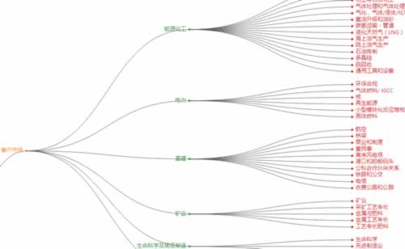

# 1. 安装

npm:

```
npm i d3
```

或 script 引入

```html
<script src="https://d3js.org/d3.v5.js"></script>
<!-- 或者使用 minified 版本 -->
<script src="https://d3js.org/d3.v5.min.js"></script>
```

# 2. Hello World

```html
<body>
    <p>    </p>
    <p>    </p>
    <script>
    	const p = d3.select('body')
        	.selectAll('p')
        p.text('Hello World')
    </script>
</body>
```

引用 d3 后，可以使用 d3.selectXX （类似 JQuery）语法，获取到页面上的 p 标签，然后调用 `.text` 方法即可往 p 标签里面写入文字

# 3. 选择元素和绑定数据

## 3.1 选择元素

- d3.select()
- d3.selectAll()

```javascript
const body = d3.select('body') // 选择文档中的 body 元素
const svg = body.select('svg') // 选择 body 中的 svg 元素
const p = body.selectAll('p') // 选择 body 中的所有 p 元素
const p1 = body.select('p') // 选择 body 中第一个 p 元素
```

## 3.2 绑定数据

D3.js 能将数据绑定到  DOM 上，绑定后，未来可以很方便的通过这个数据来操作对应的元素。

- data() : 将一个数组绑定到选择集上，数组各项和选择集中各元素绑定，也就是一一对应的关系。
- datum() : 将一个数据绑定到所有选择集上。

相比较而言，data() 更常用

datum() 的使用

```html
<body>
    <p>dog</p>
    <p>cat</p>
    <p>pig</p>

    <script>
        const str = "is an animal"
        const p = d3.select("body").selectAll("p")

        p.datum(str).text((d, i) => `第${i}个元素:${d}`)
    </script>
</body>
```

datum 是将 str 分别绑到三个 p 元素上

data() 的使用

```html
<body>
    <p>dog</p>
    <p>cat</p>
    <p>pig</p>

    <script>
        const arr = ["so cute", "cute", "fat"]
        const p = d3.select("body").selectAll("p")

        p.data(arr).text((d, i) => `第${i}个动物:${d}`)
    </script>
</body>
```

data 其实就是遍历数组并分别绑到 p 元素上

# 4. 理解 Update、Enter、Exit

图表操作大部分情况下其实就是将数据源（数组）中的数据，一一对应的用图形（可以是文字，可以是矩形，可以是线等等）表现出来，因为数据源里的数据个数是可变的，那么在和图形一一对应时，必然会出现数据多图形元素少，或者数据少图形元素多的情况，在 D3.js 中分别是用 Update、Enter、Exit来表现的

在使用 data() 时，如果数组数量与元素集的数量不匹配时，就会涉及 Enter、Exit。


## 4.1 Update 与 Enter 的使用

```html
<body>
    <p>dog</p>
    <p>cat</p>
    <p>pig</p>

    <script>
        const dataset = [3, 6, 9, 12, 15]
        const p = d3.select("body").selectAll("p")

        const update = p.data(dataset) // 绑定数据，并得到 update 部分
        const enter = update.enter() // 得到 enter 部分

        // 对 update 的处理
        update.text((d, i) => `update: ${d}, index: ${i}`)

        // 对 enter 的处理
        // 要先添加足够多的 p 标签
        const pEnter = enter.append("p")
        // 然后再添加文本
        pEnter.text((d, i) => `enter: ${d}, index: ${i}`)
    </script>
</body>
```

## 4.2 Update 与 Exit 的使用

```html
<body>
    <p>dog</p>
    <p>cat</p>
    <p>pig</p>
    <p>rat</p>

    <script>
        const dataset = [3, 6]
        const p = d3.select("body").selectAll("p")

        const update = p.data(dataset) // 绑定数据，并得到 update 部分
        // 对 update 的处理
        update.text((d, i) => `update: ${d}, index: ${i}`)

        const exit = update.exit() // 得到 exit 部分
        // 对 exit 的处理
        exit.text((d, i) => "exit")
    </script>
</body>
```

# 5. 选择、插入、删除元素

## 5.1 选择元素

### (1)

```html
<body>
    <p>dog</p>
    <p>cat</p>
    <p>pig</p>
    <p>rat</p>
</body>
```

选择第一个 p 元素并将字体颜色设置为红色：

```javascript
d3.select('body').select('p').style('color', 'red')
```

选择全部 p 元素并将字体颜色设置为红色

```javascript
d3.select('body').selectAll('p').style('color', 'red')
```

### (2)

```html
<body>
    <p>dog</p>
    <p class='myP2'>cat</p>
    <p id='myP3'>pig</p>
    <p>rat</p>
</body>
```

选择 class='myP2' 的元素并将字体颜色设置为红色

```javascript
d3.select('body').selectAll('.myP2').style('color', 'red')
```

选择 id='myP3' 的元素并将字体颜色设置为红色

```javascript
d3.select('body').select('#myP3').style('color', 'red')
```

### (3)

```html
<body>
    <p>dog</p>
    <p>cat</p>
    <p>pig</p>
    <p>rat</p>

    <script>
        const dataset = [3, 6, 9, 12]
        const p = d3
        .select("body")
        .selectAll("p")
        .data(dataset)
        .text(function (d, i) {
            if (i == 3) {
                // this 只能通过 function 正常获取，意味着 () => {} 不能在这里使用，后续会继续研究有没有解决这个问题的方案
                d3.select(this).style("color", "red")
            }
            return d
        })
    </script>
</body>
```

## 5.2 插入元素

- append() : 在选择集尾部插入元素
- insert() : 在选择集前面插入元素

```javascript
d3.select('body').append('p').text('another animal') // 在最后添加一个新的 p 元素
d3.select('body').insert('p', '#myP3').text('insert an animal') // 在 id='myP3' 的元素前插入一个新的 p 元素
```

## 5.3 删除元素

```javascript
d3.select('body').select('#myP3').remove() // 选择 id='myP3' 的元素并删除
```

# 6. 做一个简单的图表

新的知识点：

- svg: 是用来绘制矢量图的画布（对应的 canvas 是 js 用来绘制位图的画布）
- rect: 是 D3.js 在 svg 中绘制**矩形**的元素
- g: 分组时使用

# 7. 比例尺的使用

D3.js 中的比例尺可以理解为是一种映射关系

常见的比例尺：

- 线性比例尺
- 序数比例尺

## 7.1 线性比例尺

```javascript
const dataset = [1.2, 2.3, 0.9, 1.5, 3.3]
const min = d3.min(dataset) // 得到最小值
const max = d3.max(dataset) // 得到最大值
const scaleLinear = d3.scaleLinear().domain([min, max]).range([0, 300]) // 0.9-3.3 对应 0-300
document.write("scaleLinear(1) 输出：" + scaleLinear(1)) // 12.4999999999996
d3.select("body").append("br")
document.write("scaleLinear(2) 输出：" + scaleLinear(2)) // 137.5
d3.select("body").append("br")
document.write("scaleLinear(3.3) 输出：" + scaleLinear(3.3)) // 300 因为domain中的3.3对应的就是range中的300
d3.select("body").append("br")
```

## 7.2 序数比例尺

```javascript
const dataset = [0, 1, 2, 3, 4]
const color = ["red", "blue", "yellow", "black", "green"]
const scaleOrdinal = d3.scaleOrdinal().domain(dataset).range(color) // domain 和 range 是离散，并一一对应的
document.write("scaleOrdinal(1) 输出：" + scaleOrdinal(1)) // 1: blue
d3.select("body").append("br")
document.write("scaleOrdinal(2) 输出：" + scaleOrdinal(2)) // 2: yellow
d3.select("body").append("br")
document.write("scaleOrdinal(4) 输出：" + scaleOrdinal(4)) // 4: green
d3.select("body").append("br")
```

之前 6 的图表例子中，如果数据源里面的数字非常大，绘制的矩形会撑出浏览器。使用线性比例尺后可以让矩形的宽度在一个合理的范围内。

# 8. 坐标轴

新的知识点：call()

```javascript
const xAxis = d3.axisBottom(scaleLinear) // 从 scaleLinear 比例尺创建出一个坐标轴, Bottom 表示刻度是在下面
	.ticks(7) // 设置刻度数目

g.call(xAxis) // call 可以将 g 传给 xAxis 执行
// 或者反过来也可以
xAxis(g)
```

# 9. 完整的柱状图

新的知识点：

- d3.scaleBand() : 根据长度等分区域
- d3.range() : 返回等差数列，如：d3.range(5) 返回 [0,1,2,3,4]

# 10. 让图表动起来

新的知识点：

- .attr(xxx).transition().attr(xxx) : transition() 表示过渡，即从前一个属性过滤到后一个属性
- .duration(2000) : 表示过渡时间持续2秒
- .delay(500) : 表示延迟500毫秒
- .ease(d3.easeElasticInOut) : 过渡方式

# 11. 交互式操作

新的知识点：

- on('eventName', function) : 监听事件
- d3.select(this) : 选择当前元素

常见的事件类型：

- click : 鼠标单击，相当于 mousedown 和 mouseup 的组合
- mouseover
- mouseout
- mousemove
- mousedown
- mouseup
- dblclick

# 12. 图形

D3.js 中一些常见的图形：

## 12.1 bubble 泡泡图


## 12.2 packing 打包图


## 12.3 bundling 捆图


## 12.4 force 力导向图


## 12.5 chord 弦图


## 12.6 pie 饼状图


## 12.7 tree 树状图



## 12.8 中国地图


# 13. 饼状图

新的知识点：

- d3.arc() : 弧形生成器，用以绘制弧形
- d3.pie() : 饼状图生成器
- d3.arc().centroid() : 扇形区域的相对中心点
- d3.schemeCategory10 : 离散的色彩

# 14. 力导向图

新的知识点：

- d3.forceSimulation() : 新建一个力导向图
- d3.forceSimulation().force() : 添加或者移除一个力
- d3.forceSimulation().nodes() : 将输入的数组进行转换，添加上坐标等
- d3.forceLink.links() : 对输入的数组（边集）进行转换
- tick : 不断执行以用来更新节点和连线位置
- d3.drag() : 拖动

# 15. 树状图

新的知识点

- d3.hierarchy() : 层级布局，需要和 tree 生成器一起使用，来得到绘制树所需要的节点数据和边数据
- d3.hierarchy().sum() : 后序遍历
- d3.tree() : 创建一个树状图生成器
- d3.tree().size() : 定义树的大小
- d3.tree().separation() : 定义邻居节点的距离
- node.descendants() : 得到所有节点，已经是经过转换的数据
- node.links() : 得到所有的边，已经是经过转换的数据
- d3.linkHorizontal() : 创建一个贝塞尔曲线生成器，这个是水平的，还有垂直的 (d3.linkVertical())

# 16. 中国地图

[中国地图JSON数据源](http://datav.aliyun.com/tools/atlas)

# Animated Treemap

[参考](https://observablehq.com/@d3/animated-treemap)

新的知识点：

- join() : 会自动让选择的元素集与数据源的个数相同。即自动完成了enter和exit，并返回合并后的元素集。也可以传入若干个方法来自定义enter, update, exit 的行为。如：`join(enter => enter.append(''), update => update, exit => exit.remove())`
- Node.textContent : 可以直接访问到显示的文本，也可以直接设置修改显示的文本
- d3.interpolate(a, b) : 会返回一个计算a到b之前插值的方法fn，通过调用这个方法fn(t)，t: 0-1，返回a到b之前的值
- d3.interpolateRgb() : 返回二个颜色之前的插值函数
- transition.tween(name, fn) : 自定义tween
- d3.range(x, y, step) : 生成一个从 x 到 y 步长为 step 的区间数组
- d3.csvParse() : csv转换
- d3.tsvParse() : tsv转换
- d3.nest() : 将数组中某些关联数据组成树状结构。如：`[{name:'张三', value: 100, type:1}, {name:'张三', value:50, type:2}] 可以转换为 [{key:'张三',values:[...包含所有name为张三的数据]}]`

