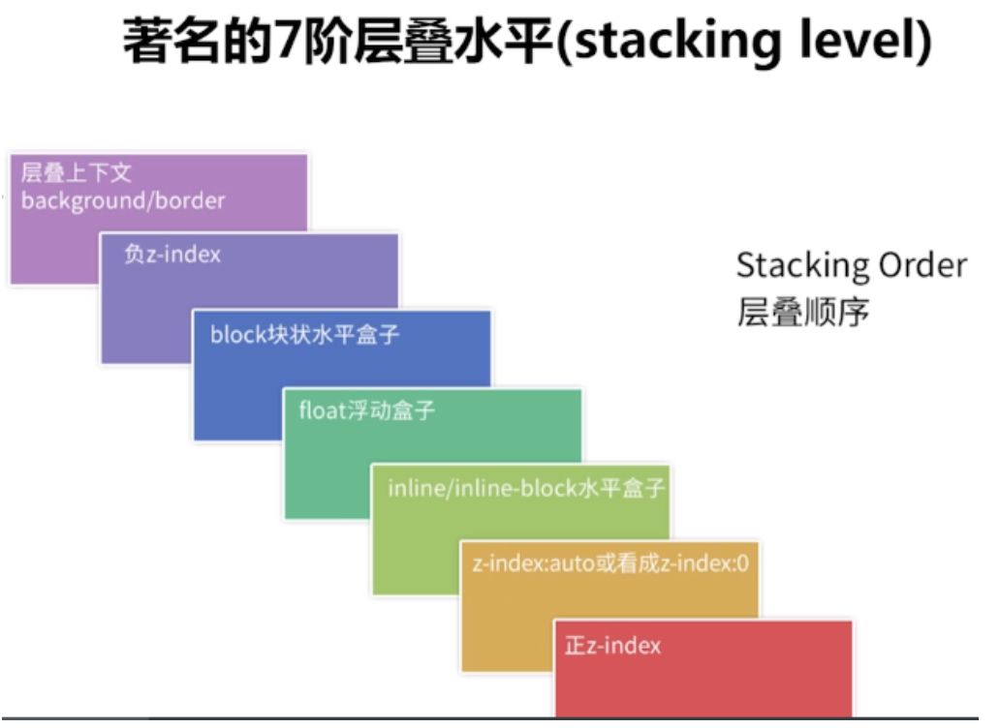

# 1. 左边框的多种实现方式

假设有一个单标签 `div`：

```html
<div></div>
```

通用 CSS ：

```css
div {
  position: relative;
  width: 200px;
  height: 60px;
  background: #ddd;
}
```

## 1.1 `border`

```css
.border {
  border-left: 5px solid deeppink;
}
```

## 1.2 使用伪元素

一个标签，算上 `::before`和 `::after`伪元素，其实总共有三个标签。

```css
.cls-2::before {
  content: "";
  width: 5px;
  height: 60px;
  position: absolute;
  top: 0;
  left: 0;
  background: deeppink;
}
```

## 1.3 外 `box-shadow`

```css
.box-shadow {
  box-shadow: -5px 0px 0 0 deeppink;
}
```

## 1.4 内 `box-shadow`

```css
.inset-box-shadow {
  box-shadow: inset 5px 0 0 0 deeppink;
}
```

## 1.5 `drop-shadow`

```css
.drop-shadow {
  filter: drop-shadow(-5px 0 0 deeppink);
}
```

## 1.6 渐变 `linearGradient`

```css
.linear-gradient {
  background-image: linear-gradient(90deg, deeppink 0px, deeppink 5px, transparent 5px);
}
```

## 1.7 轮廓 `outline`

`outline`轮廓是绘制于元素周围的一条线，位于边框边缘的外围，可起到突出元素的作用。内容需要定义到伪元素的 `content`中。

```css
.outline {
  margin-left: 25px;
  height: 50px;
  outline: 5px solid deeppink;
}
.outline::after {
  position: absolute;
  content: "";
  top: -5px;
  bottom: -5px;
  left: 0;
  right: -5px;
  background: #ddd;
}
```

## 1.8 滚动条

```css
.scrollbar {
  width: 205px;
  background: deeppink;
  overflow-y: scroll;
}
.scrollbar::-webkit-scrollbar {
  width: 200px;
  background-color: #ddd;
}
```

## 1.9 使用下划线

```css
.text-decoration {
  overflow: hidden;
}
.text-decoration::before {
  position: absolute;
  content: "____";
  font-size: 40px;
  color: #000;
  bottom: 0;
  text-decoration: underline;
  color: deeppink;
  line-height: 60px;
  transform: rotate(90deg);
  right: 142px;
}
```

## 1.10 使用 `::first-letter`伪元素

与 `::before`，`::after`伪元素类似，还可以使用 `::first-letter`伪元素。当然这要求标签内存在内容，然后利用定位即可。

```css
.first-letter {
  position: relative;
  overflow: hidden;
}
.first-letter::first-letter {
  background: deeppink;
  color: transparent;
  width: 5px;
  position: absolute;
  left: 0;
  top: 0;
  padding: 34px 0;
  margin-left: -196px;
}
```

## 1.11 使用 `list-style`实现

这个属于脑洞大开的想法。通过 `list-style`设置列表的装饰符号，并通过 `font-size`和 `color`控制 `list-style-type`的大小和颜色，然后无限放大这个 `list-style-type`，再给容器设置一个 `padding-left`即可。

```css
.list-style {
  display: list-item;
  list-style-type: square;
  list-style-position: inside;
  font-size: 600px;
  padding-left: 5px;
  background: deeppink;
  color: #ddd;
  line-height: 0;
  overflow: hidden;
}
```

# 2. 条纹边框的多种实现方式

假设有一个单标签 `<div>`，通用 CSS ：

```css
div {
  position: relative;
  width: 180px;
  height: 180px;
}
```

## 2.1 使用 `background`和 `border`配合

给 `div`添加样式：

```css
.background-border {
  background: #9c27b0;
  border: 20px dashed #2196f3;
}
```

有一点需要注意，`background-color`是从元素的边框左上角起到右下角止的。而 `background-image`却不一样，它是从 `padding`边缘的左上角起然后到 `border`的右下角边缘为止。

`background-image`由两个因素决定了其绘图的区域：

1. background positioning area: `background-origin`属性决定了其相对定位位置，默认为 `padding-box`。所以默认的背景图片绘制是从 padding box 的左上角顶点开始的。
2. background painting area: `background-clip`属性决定了绘制区间，默认为 `border-box`，所以当 `background-repeat: repeat`的情况下，背景图片会绘制到 border box 的右下角位置。

通过改变 `background-clip`属性的值就能可以自由决定背景图片右下角绘制点的位置：

```css
background-clip: border-box; /* 背景延伸到边框外沿（但在边框之下） */
background-clip: padding-box; /* 背景延伸到内边距外沿，即边框下没有背景 */
background-clip: content-box; /* 背景裁剪到内容区外沿 */
```

接下来只需要用伪元素将中间部分填充回白色即可。

```css
.background-border::after {
  content: "";
  position: absolute;
  top: 0;
  left: 0;
  bottom: 0;
  right: 0;
  background: white;
}
```

## 2.2 反过来

```css
.background-border-2 {
  background: #fff;
  background-clip: padding-box;
  border: 20px dashed #cccc99;
}
.background-border-2::before {
  content: "";
  position: absolute;
  top: -20px;
  left: -20px;
  bottom: -20px;
  right: -20px;
  background: #996699;
  z-index: -1;
}
```

# 3. 层叠顺序与堆栈上下文

根据 `z-index`的高低可以用来决定层叠的优先级。

定义两个 `div`标签，HTML 结构如下：

```html
<div class="container">
  <div class="inline-block">#divA display: inline-block</div>
  <div class="float">#divB float: left</div>
</div>
```

CSS 定义如下：

```css
.container {
  position: relative;
  background: #ddd;
}
.container > div {
  width: 200px;
  height: 200px;
}

.float {
  float: left;
  background-color: deeppink;
}

.inline-block {
  display: inline-block;
  background-color: yellowgreen;
  margin-left: -100px;
}
```

会发现如何怎样调整 `divA`和 `divB`的先后顺序，始终是 `inline-block`的 `div`叠在上方。

这里其实涉及了层叠水平（stacking level）：



根据上图可以看到，`inline-block`的 `stacking level`比 `float`高，所以无论 DOM 的先后顺序，`inline-block`总是堆叠在上面。

上图表示的可能还不是非常准确，根据 W3C 官方说法准确的 7层为：

1. 形成堆叠上下文环境的元素的背景与边框。
2. 拥有负 `z-index`的子堆叠上下文元素。
3. 正常流式布局，非 `inline-block`，无 `position`定位（static 除外）的子元素。
4. 无 `position`定位（static 除外）的 `float`浮动元素。
5. 正常流式布局，`inline-block`元素，无 `position`定位（static 除外）的子元素（包括 `display: table` 和 `display:inline`）。
6. 拥有 `z-index: 0`的子堆叠上下文元素。
7. 拥有正 `z-index`的子堆叠上下文元素。

不过！重点来了，上面的比较是基于两个 `div`都没有形成**堆叠上下文**为基础的。

假设给这二个 `div`增加一个 `opacity`属性：

```css
opacity: 0.9;
```

然后就会看到，`inline-block`的 `div`不再一定叠在 `float`的 `div`之上，而是和 HTML 中 DOM 的放置顺序有关。后添加的会叠在先添加的 `div`之上。

这里的关键点就在于，添加了 `opacity: 0.9`后让两个 `div`都生成了 `stacking context（堆叠上下文）`。此时，要对两者进行层叠排列，就需要 `z-index`。

根据 MDN 资料有如下几种方法触发一个元素形成堆叠上下文：

- 根元素（`HTML`）。
- `z-index`值不为 "auto" 的绝对/相对定位。
- 一个 `z-index`值不为 "auto" 的 flex item。即父元素 `display: flex / inline-flex`。
- `opacity`属性小于 1 的元素。
- `transform`属性不为 "none" 的元素。
- `mix-blend-mode`属性值不为 "normal" 的元素。
- `perspective`值不为 "none" 的元素。
- `isolation` 属性被设置为 "isolate" 的元素。
- `position: fixed`
- 元素的 `will-change`指定了任意属性。（即使后续没有使用任何变形或动画，但因为浏览器已经默认该元素是硬件加速的，即使用 GPU 处理的）
- `webkit-overflow-scrolling`属性被设置为 "touch"。

# 4. 从倒影说起，谈谈 CSS 继承 `inherit`

给定一张有背景图的 `div` 生成倒影。

## 4.1 `-webkit-box-reflect`

> -webkit- 内核的浏览器才支持

```css
.reflect {
  -webkit-box-reflect: below;
}
```

共有四个方向可以选择，`below | above | left | right`代表上下左右。

## 4.2 `inherit`使用继承

`inherit`表示每个 CSS 属性定义的概述都指出了这个属性是默认继承的(“Inherited:Yes”)还是默认不继承的(“Inherited:no")。这决定了当没有为元素的属性指定值时该如何计算值。

可以对图片容器添加一个伪元素，使用 `background-image: inherit`继承父值的背景图，最后旋转 180 度实现倒影。

```css
.inherit {
  position: relative;
}
.inherit::after {
  content: "";
  position: absolute;
  top: 100%;
  left: 0;
  right: 0;
  bottom: -100%;
  background-image: inherit;
  transform: rotateX(180deg);
}
```

说到底，CSS 属性的取值就是由默认值(initial)，继承(inherit)与加权系统构成的（还包括：未设置(unset)，还原(revert)）。

# 5. 文本单行居中，多行居左，超过两行用省略号结尾

## 5.1 `text-align`

首先单行居中，多行居左

可以将 HTML 定义为：

```html
<h2>
  <p>单行居中，标题居中</p>
</h2>
```

此时，外层 `h2` 设置为居中。并让内层的 `p`居左，并且设置 `display: inline-block`，利用 `inline-block`元素可以被父级 `text-align: center`居中的特性，实现单行居中，多行居左。CSS 如下：

```css
.demo1 h2 {
  text-align: center;
}
.demo1 p {
  display: inline-block;
  text-align: left;
}
```

完成第一步，接下来实现超过两行显示省略号。

多行省略是有专门的新 CSS 属性可以实现的：

- `display: -webkit-box` 设置 display，将对象作为弹性伸缩盒子模型显示。
- `-webkit-line-clamp: 2` 限制在一个块元素显示的文本的行数。
- `-webkit-box-orient: vertical`: 规定框的子元素应该被水平或垂直排列 

利用上述三条配合 `overflow: hidden`和 `text-overflow: ellipsis`即可实现 webkit 内核下的多行省略。

CSS 如下：

```css
text-align: left;
overflow: hidden;
text-overflow: ellipsis;
display: -webkit-box;
-webkit-line-clamp: 2;
-webkit-box-orient: vertical;
```

## 
