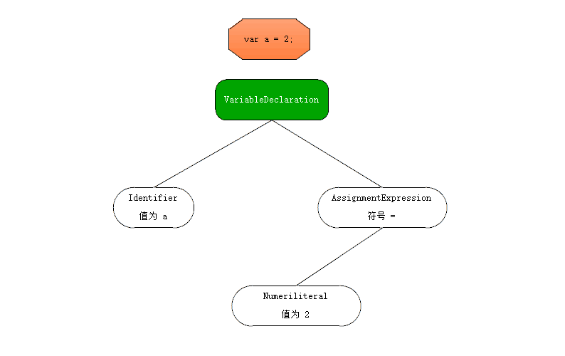

# Part1. 作用域和闭包

## 1. 作用域是什么?

几乎所有编程语言最基本的功能之一就是能够储存变量中的值, 并在之后对其进行访问或修改. 这种能力使得程序有了状态.

那么变量中的值放在哪里? (或者说储存在哪里?)

更重要的是程序如何找到它们? 这需要设计一套良好的规则来储存变量, 并在之后方便的找到它们, 这套规则称为作用域.

### 1.1 编译原理

通常称 Javascript 为 "解释执行" 或 "动态" 语言, 但事实上它是一门编译语言. 只不过它不是提前编译的, 编译结果也不能在分布式系统上进行移植.

传统编译语言, 一段源代码在执行之前的三个步骤: (统称为编译)

1. 分词 / 词法分析 (Tokenizing / Lexing)

   将字符串分解成有意义的代码块, 这些代码块被称为词法单元 (token)

   ```
   如: var a = 2;
   会被分析为: var、a、=、2、;
   空格取决于在这门语言中是否有意义 (如 python 之类用空格缩近作为语句层级的语言)
   ```

2. 解析 / 语法分析 (Parsing)

   这个过程会将词法单元流 (往往是一个数组), 转换成 "抽象语法树" (AST: Abstract Syntax Tree)

   ```
   如: var a = 2; 通过步骤1的词法分析转换成了类似这样一个数组 ['var','a','=','2',';']
   那么转换成 AST 可能会有一个 VariableDeclaration 的顶级节点
   接下来会有一个 Identifier (它的值为a) 的子节点
   以及一个 AssignmentExpression 的子节点
   这个子节点还会有一个 Numericliteral (它的值为2) 的子节点
   ```

   可能的 AST 长这样:
   

   或者可以通过更官方的工具查看:

   [在线 AST 查看](https://astexplorer.net/)

3. 代码生成

   将 AST 转换为可执行代码的过程被称为代码生成, 这个过程与编程语言, 目标平台等息息相关.

   抛开细节, 它就是这种可以将 `var a = 2;` 的 AST 转化为一组机器指令的方法.

   ```
   创建一个叫作 a 的变量 (包含内存分配等操作), 并将一个值 (数字: 2) 存到 a 中.
   ```

比起上述的三个步骤, Javascript 引擎编译要复杂的多. 比如在语法分析和代码生成阶段会有特定步骤对运行性能进行优化, 对冗余元素进行优化等.

Javascript 引擎不会有大量时间进行优化, 因为 Javascript 代码片断往往只在被执行前的几微秒 (甚至更短) 的时间内编译, Javascript 引擎会用尽各种办法 (如: JIT 或 延迟编译, 甚至实施重编译) 来保证性能最佳.

```
更多资料可以查找 V8 TurboFan 相关内容
延迟编译: Javascript 首次编译时, 部分函数仅会标记但不编译. 只有在真的执行到时, 才会编译并执行. 最常见的例子, 鼠标点击事件函数往往仅在用户第一次点击触发事件时, 这个函数才开始编译.
```

[代码](1.html)

```
会发现在 Chrome 浏览器下 (IE 下无效果, 且很慢), 后几次点击后执行 fn 的时间会明显比前二次快.
```

代码一旦编译完成, 作好执行前的准备后, 通常就会马上执行它们了.

### 1.2 理解作用域

`var a = 2`这段代码在进行处理的过程中, 有三个部分参与:

- 引擎: 从头到尾负责整个 JavaScript 程序的编译及执行过程.
- 编译器: 负责语法分析及代码生成等脏活累活.
- 作用域: 负责收集及维护所有声明的标识符(变量)组成的一系列查询. 并实施一套非常严格的规则, 确定当前执行的代码对这些标识符的访问权限.

引擎对 `var a = 2`进行分解的步骤:

1. 遇到 `var a`编译器会询问作用域是否已经有一个该名称的变量存在于当前作用域的集合中. 如果是, 编译器会忽略该声明, 继续进行编译; 否则, 它会要求作用域在当前作用域的集合中声明一个新变量, 并命名为 a.
2. 接下来, 编译器会为引擎生成运行时所需的代码, 这些代码被用来处理 `a = 2`这个赋值操作. 引擎运行时会首先询问作用域, 在当前作用域集合中是否存在一个叫作 a 的变量. 如果是, 引擎会使用这个变量. 如果否, 引擎会继续查询 (参考 1.3).
3. 如果引擎最终找到了 a 变量, 就会将 2 赋值给它. 否则, 引擎就会抛出一个异常.

编译器术语:

"LHS查询" 和 "RHS查询".

"L" 和 "R" 表示的是一个赋值操作的左侧(L)和右侧(R).

RHS 可以简单的理解为是查找某个变量中的值. 而 LHS 则试图找到变量的容器本身.

从这个角度来讲, RHS 并不是真正意义上的 "赋值操作的右侧", 更准确的说法应该是 "非左侧".

可以将 RHS 理解为 retrieve his source value (取到它的源值), 这意味着 "得到某某的值".

举个例子:

```js
console.log(a);
```

对 a 是 RHS查询, 这里只需要查找并取得 a 的值, 并将值传给 `console.log`.

另一个例子:

```js
a = 2;
```

这里对 a 则是 LHS查询, 是为了 `= 2`这个赋值操作找到一个目标.

再一个例子:

```js
function foo(a) { // 2.
    console.log(a); // 3.
}
foo(2); // 1.
```

1. 对 foo 进行 RHS查询, 因为之后要执行, 所以最好找到的 foo 能是函数类型.
2. 这里隐藏了一个 `a = 2`的操作, 为了将 2 赋值给 a, 要对 a 进行一次 LHS查询.
3. 对 a, console 各有一次 RHS 查询, 并且还要检查 console 中是否存在 log 方法.

小测试:

```js
function foo(a) {
    var b = a;
    return a + b;
}
var c = foo(2);
```

共执行了 3 处 LHS 查询和 4 处 RHS查询

### 1.3 作用域嵌套

当一个块或函数在哪一个块或函数中时, 就发生了作用域嵌套. 因此, 在当前作用域无法找到某个变量时, 引擎会在外层嵌套的作用域中继续查找, 直到找到该变量或抵达最外层作用域 (也就是全局作用域) 为止.

```js
function foo(a) {
    console.log(a + b);
}
var b = 2;
foo(2); // 4
```

对 b 进行 RHS查询是无法在函数 foo 中完成的, 但可以在上一级作用域中完成.

### 1.4 异常

为什么区分 LHS查询和 RHS查询是一件非常重要的事情?

```js
function foo(a) {
    console.log(a + b);
    b = a;
}
foo(2);
```

对 b 进行的第一次 RHS查询是无法找到该变量的. 这是一个未声明的变量. RHS查询不到变量, 引擎就会抛出一个 ReferenceError 异常.

相较之下, LHS查询如果未找到变量, 在全局作用域中就会创建一个具有该名称的变量, 并将其返回给引擎. 前提是引擎在非**"严格模式"**下.

在 ES5 的严格模式下, LHS查询失败并不会创建一个全局变量, 引擎会抛出与 RHS查询失败类似的 ReferenceError 异常.

接下来, 如果 RHS查询到了一个变量, 但尝试对这个变量的值进行不合理的操作时, 引擎就会抛出另一个异常: TypeError.

- ReferenceError: 同作用域判断失败有关.
- TypeError: 代表作用域判断成功了, 但是对结果的操作是非法或不合理的.