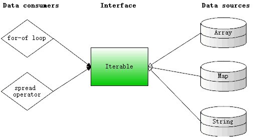
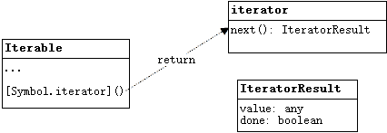
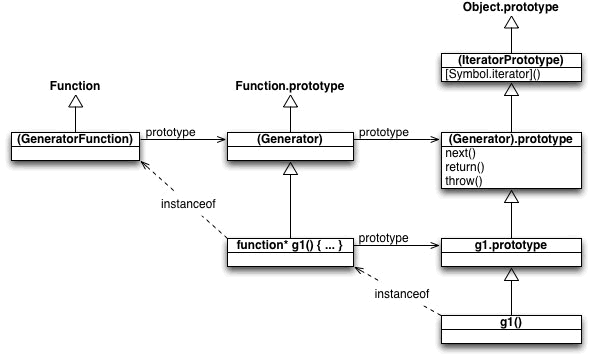

# 1: JavaScript Generators 权威指南

[参考资料](https://github.com/gajus/gajus.com-blog/blob/master/posts/the-definitive-guide-to-the-javascript-generators/index.md)

## 1-1. 创建 Generator Function

```javascript
const generatorFunction = function* () {}; // 注意*
```

还需要配合 Iterator 使用

```javascript
const iterator = generatorFunction();

console.log(iterator[Symbol.iterator]); // [Function: [Symbol.iterator]]
```

要注意的是, 获得了 Iterator 并不代表 Generator Function 执行了.

```javascript
const gf = function* () {
    console.log("a");
};
console.log(1);
const iterator = gf();
console.log(2);
// 1
// 2
// log a 并不会被执行
```

## 1-2. 使用 Generator Function

使用 `next()` 方法可以让 generator 方法开始**前进**(*注意不是执行*!!!)

```javascript
const gf = function* () {
    console.log("a");
};
console.log(1);
const iterator = gf();
console.log(2);
iterator.next();
console.log(3);
// 1
// 2
// a
// 3
```

`next()` 方法返回一个描述当前迭代(iterator)进度的对象.

```javascript
const gf = function* () {};
const iterator = gf();
console.log(iterator.next());
// { value: undefined, done: true }
```

`done` 属性用来描述生成器方法(Generator Function)体中的代码是否已经全部执行完成了.

```javascript
const gf = function* () {
    yield;
};
const iterator = gf();
console.log(iterator.next()); // { value: undefined, done: false }
console.log(iterator.next()); // { value: undefined, done: true }
```

生成器方法支持关键字 `yield`, `yield` 支持让生成器方法执行一部分(所以前面称`next()`为**前进**), 然后返回一个值. 只有方法全部执行完成了, 返回对象中的 `done` 才会是 true.

```javascript
const gf = function* () {
    let i = 0;
    while (true) { // 虽然这里是死循环, 但 generator function 其实并不会阻塞线程, 在yield处会等待下次 iterator.next() 的调用.
        yield i++;
    }
};
const iterator = gf();
for (let i = 0; i < 5; i++) {
    console.log(iterator.next());
}
// { value: 0, done: false }
// { value: 1, done: false }
// { value: 2, done: false }
// { value: 3, done: false }
// { value: 4, done: false }
```

## 1-3. 将值传递给迭代器

`yield` 关键字可以传递给迭代器任意类型, 包括 function, number, array 和 object.

也可以使用 `return` 结束生成器函数. 注意 `return` 也可以将值传递给迭代器.

```javascript
const gf = function* () {
  yield "foo";
  return "bar";
  yield "hehe";
};

const iterator = gf();
console.log(iterator.next()); // { value: 'foo', done: false }
console.log(iterator.next()); // { value: 'bar', done: true }
console.log(iterator.next()); // { value: undefined, done: true }
// 注意 return 之后的代码将不再会执行
// return 的值只会拿到一次, 后续调用 next(), value 是 undefined
```

## 1-4. 从迭代器接收数据

`yield`关键也可以接收到每次迭代器执行 `next` 时传递的参数.

```javascript
function* gf() {
  console.log(yield);
}

const iterator = gf();

iterator.next("foo");
iterator.next("bar");
// bar
```

要注意的是第一次的参数 'foo' `yield`并没有接收到, 第一个参数始终会被丢弃(tossed-away).

## 1-5. 理解执行流程

```javascript
let foo, f;
foo = function* () {
  console.debug("generator 1");
  console.debug("yield 1", yield "A");
  console.debug("generator 2");
  console.debug("yield 2", yield "B");
  console.debug("generator 3");
};

f = foo();

console.log("tick 1");
console.log(f.next("a"));
console.log("tick 2");
console.log(f.next("b"));
console.log("tick 3");
console.log(f.next("c"));
console.log("tick 4");
console.log(f.next("d"));
```

执行结果为:

| 打印结果                       | 原因                                                         |
| ------------------------------ | ------------------------------------------------------------ |
| tick 1                         | main console.log('tick 1')                                   |
| generator 1                    | *f 执行了第一个console.debug                                 |
| {value: 'A', done: false}      | *f 中断在了console.debug("yield 1"), 因为 yield 它先把 'A' 返回给迭代器了, 所以 main 的 console.log(f.next("a")) 执行了 |
| tick 2                         |                                                              |
| yield 1 b                      | 因为 f.next('b') 执行后, 先触发了 *f 的第二行 debug, 此时 yield 接收到了 'b' |
| generator 2                    |                                                              |
| {value: 'B', done: false}      | 显示在*f 的第四行执行时中断了, 先把 'B' 传递给了迭代器       |
| tick3                          |                                                              |
| yield 2 c                      | 执行 f.next('c') 时, *f 的 yield 拿到 'c' 了                 |
| generator 3                    |                                                              |
| {value: undefined, done: true} | *f 已经全部执行完了.                                         |
| tick 4                         |                                                              |
| {value: undefined, done: true} | 此是 *f 已经早就执行结果了.                                  |

## 1-6. 使用`for...of`遍历迭代器

生成器函数返回的迭代器是符合 iterable 协议的, 也就是说可以直接使用 `for...of` 表达式遍历它.

```javascript
const gf = function* () {
  yield 1;
  yield 2;
  yield 3;
  return 4;
};

const iterator = gf();
for (const index of iterator) {
  console.log(index);
}
// 1
// 2
// 3
```

- 只要 `done` 为 `false`, 遍历将会继续.
- 如果需要将数据传递给生成器函数, `for...of` 并不适用这种场景.
- `for...of` 将始终丢弃 `return` 返回的值.

## 1-7. 委托 yield

yield* 可以委托给其他的生成器.

```javascript
const foo = function* () {
  yield "foo";
  yield* bar();
};

const bar = function* () {
  yield "bar";
  yield* baz();
};

const baz = function* () {
  yield "baz";
};

const interator = foo();

for (const index of interator) {
  console.log(index);
  console.log("-----");
}
// foo
// -----
// bar
// -----
// baz
// -----
```

## 1-8. Throw

除了使用`next()`推进生成器函数的执行之外, 也可以使用throw(). 抛出的错误将会被传进生成器函数, 也就是说你可以自由选择是在生成器函数的内部还是外部处理错误.

```javascript
const gf = function* () {
  while (true) {
    try {
      yield;
    } catch (e) {
      if (e != "a") {
        throw e;
      }
      console.log("Generator内部处理", e);
    }
  }
};

const iterator = gf();
iterator.next();

try {
  iterator.throw("a");
  iterator.throw("b");
} catch (e) {
  console.log("未在Generator处理的错误", e);
}
// Generator内部处理 a
// 未在Generator处理的错误 b
```

和 yield 同样的你可以抛出任何类型的错误, 包括 function, number, array 和 object.

## 1-9. 生成器函数的使用场景1

在 JavaScript 中, I/O 操作通常都是异步的, 一般都需要一个 callback 在操作完成后处理后续功能, 举个例子:

```javascript
const foo = (name, callback) => {
  setTimeout(() => {
    callback(name);
  }, 100);
};
```

如果需要连续执行异步方法, 代码往往会写成这样:

```javascript
foo("a", (a) => {
  foo("b", (b) => {
    foo("c", (c) => {
      console.log(a, b, c);
    });
  });
});
```

这就是臭名昭著的回调地狱.

要解决这类问题, 解决方法就是使用 Promise(async/await) 或者生成器函数.

[代码](1-9.js)

```javascript
controller(function* () {
  const a = yield curry(foo, "a");
  const b = yield curry(foo, "b");
  const c = yield curry(foo, "c");
  console.log(a, b, c);
});
```

## 1-10. 生成器函数的使用场景2 (错误处理)

如果要处理异步方法的错误, 通常是这样写的:

```javascript
const foo = (name, callback) => {
  callback(null, name);
};

foo("a", (error1, result1) => {
  if (error1) {
    throw new Error(error1);
  }
  foo("b", (error2, result2) => {
    if (error2) {
      throw new Error(error2);
    }
    foo("c", (error3, result3) => {
      if (error3) {
        throw new Error(error3);
      }
      console.log(result1, result2, result3);
    });
  });
});
```

如果有 1-9 的生成器函数处理, 只需要在统一的位置加 `try...catch` 即可.

```javascript
const curry = (method, ...args) => {
  return (callback) => {
    args.push(callback);
    return method.apply({}, args);
  };
};

const controller = (generator) => {
  const iterator = generator();

  const advancer = (response) => {
    if (response && response.error) { // 发现错误用迭代器抛出
      return iterator.throw(response.error);
    }
    const state = iterator.next(response);
    if (!state.done) {
      state.value(advancer); // 执行curry返回的method
    }
  };
  advancer();
};

controller(function* () {
  let a, b, c;
  try { // 加 try/catch 统一处理任务
    a = yield curry(foo1, "a");
    b = yield curry(foo1, { error: "sth err" });
    c = yield curry(foo1, "c");
  } catch (e) {
    console.log(e);
  }
  console.log(a, b, c);
});
```

# 2: ES6 Generators

[参考资料](https://davidwalsh.name/es6-generators)

## 2-1. ES6 Generators 基础

ES6 中最激动人心的新功能之一就是 Generator.

### 运行到完成

通常情况下 JavaScript 的函数一旦开始运行, 只有在他运行完成后其他的 JS 代码才能开始运行. 比如:

```javascript
setTimeout(function() {
    console.log('Hello World');
}, 1);

function foo() {
    // 真实情况下永远不要这么做
    for(let i=0; i<=1E10; i++) {
        console.log(i);
    }
}
foo();
// 0...1E10
// Hello World
```

以上代码里, `for` 循环需要花费相当长的时间才能完成 (肯定大于1毫秒), 所以 `setTimeout` 的代码只能等待 `foo()` 函数运行完成后才能执行.

如果想让代码按理解的顺序运行, 则 `foo()` 必须能够被打断, 即让 `setTimeout` 在 `foo()` 执行过程中运行. 但这又会带来其他多线程编程面临的问题.

不过, JS 始终是单线程的.(即在任何给定时间仅执行一个命令或函数)

> 注意: Web Workers 是一种多线程机制, 但它不会给我们带来多线程的复杂性. 因为 Web Workers 与 JS 主线程之间只能通过异步事件互相通信, 而异步事件始终遵守着执行的当前运行时线程必须全部执行完毕才会发送事件的规则.

### 运行...停止...运行

ES6 Generators 不同于普通的 function, 它允许我们在 Generators 中暂停一次或者多次, 然后再需要时再恢复. 其中其他代码可以在暂停期间运行的.

如果了解过有关并发或多线程的资料, 那么可能会看到**"合作(cooperative)"**这一词. 它的意思大致是表示一个进程(在 JS 中是一个函数)自己可以选择在什么时候中断, 以便于它能和其他代码合作. 这个概念和"**抢先式(preemptive)**"形成先明的对比, "抢先式"表示功能可能在其自己意想不到的时候被中断.

ES6 Generators 的并发行为是合作式的. 在ES6 Generators 函数中, 可以使用一个新关键字 `yield` 从内部暂停自己的执行. 要注意的是, 并没有其他方式从 Generators 外部暂停它, 唯一的方式就是在内部用 `yield` 暂停.

另外, 一旦使用 `yield` 暂停了 Generators, 函数自身将没有办法让自己恢复执行. 恢复执行的唯一途径是使用函数外部的一个控制器.

可以这样说 Generators 函数可以随时暂停随时重新启动, 且次数不限. 因此在实际使用时你甚至可以在 Generators 中使用无限循环(即 `while(true) {...}`). 这种用法在普通的 JS 程序中基本上是不会使用的, 但在 Generators 函数中, 它是合理的操作.

更重要的是, 这种停止和再次执行并不仅仅是针对 Generators 函数执行的控制, 还能使用双路消息(2-way)发送与接受数据. 例如使用普通函数, 可以在函数的开头获取参数, 在结尾用 `return` 返回值. 使用 Generators 可以在每次 `yield` 时获取消息(返回值), 并在每次重新启动时发送消息(传参数).

### 语法

Generators 声明语法:

```javascript
function * foo() {
    // ...
}
```

`*` 就是与普通 function 的不同之处, 它看起来有些奇怪. 对于其他语言而言, 它看起来很像函数的返回值指针, 但在 JS 中它只是表明这是一个 Generators 函数的方式而已.

> 注意: `function* foo() {}` 和 `function *foo() {}` (注意 `*` 位置有所不同) 两者都是有效的.

然后开始考虑 Generators 函数的内容. 在大多数时候, Generators 函数只是普通的 JS 函数. 在函数内部几乎没有什么新语法需要学习. (即, 之前学习的几乎所有 JS 内容都是可以在 Generators 函数内部使用的)

Generators 函数中唯一的新内容就是新的关键字 `yield`, 要注意的是 `yield` 准确来说应该称其为 "`yield` 表达式" (而不是语句). 这是因为, 当重新启动 Generators 时, 我们可以向其发送一个值, 而发送的任何内容其实都是 `yield` 表达式的执行结果.

举个例子:

```javascript
function *foo() {
    let x = 1 + (yield 'foo'); // yield 表达式接收到 100, 执行 1+100
    console.log(x); // 101
}

const iterator = foo();
console.log(iterator.next()); // { value: 'foo', done: false }
iterator.next(100); // 100 发送给 *foo
```

`yield 'foo'` 表达式会在 Generators 第一次暂停时发送字符串 `'foo'` (`iterator.next()` 的返回值中的`value`). 当 Generators 在任意时间被重新启动时, 可以再发送一个任意值给 Generators, 在 Generators 内部这个值将会与 1 相加并赋值给 `x`.

这就是两路通讯(2-way communication), 将值 `'foo'` 发送出去并暂停自己. 然后在某个时刻 (可能是立即, 也可能是很久以后), Generators 将重新启动并提供一个值. 这个值就像 `yield` 关键字的请求值一样.

可以在任意表达式的位置使用 yield, 如果不指定发送的值, yield 默认会接收一个 `undefined`.

```javascript
const foo = (x) => console.log("x: " + x);

const bar = function* () {
    yield;
    foo(yield);
};

const i = bar();
i.next();
i.next();
i.next(1024); // 如果不传值, 会打印 x: undefined
// x: 1024
```

### Generator Iterator

迭代器(Iterator)是一种特殊的行为, 它其实上属于一种设计模式. 通过调用 `next()` 来遍历一组有序的值.

例如在数组 `[1,2,3,4,5]`上使用迭代器, 第一次调用 `next()` 将返回 `1`, 第二次调用 `next()` 返回 `2`, 以此类推. 返回所有值后, 调用 `next()` 将返回 `null` 或 `false`, 通知你已经遍历了数据容器中所有的值.

从外部控制 Generator 功能使用的就是迭代器, 迭代器负责与 Generator 交互. 举个简单的例子:

```javascript
function *foo() {
    yield 1;
    yield 2;
    yield 3;
    yield 4;
    yield 5;
}
```

怎样一步步获取到 foo 生成器函数的值呢? 使用迭代器.

```javascript
const it = foo();
```

**需要特别注意的是, 这里并不像普通函数那样, foo() 并没有执行foo**

如果需要执行生成器函数(foo), 需要执行以下操作:

```javascript
const message = it.next();
```

这将让 foo 执行到 `yield 1` 并暂停, 但这并不是我们唯一得到的内容.

```javascript
console.log(message); // {value: 1, done: false}
```

实际上, 每次调用 `next()`, 我们都会获得一个对象, 对象里面有一个属性 `value`, 表示 `yield` 返回的值, 另外还有一个布尔类型的属性 `done` 表示生成器函数是否全部执行完成.

继续执行迭代:

```javascript
console.log(it.next()); // {value: 2, done: false}
console.log(it.next()); // {value: 3, done: false}
console.log(it.next()); // {value: 4, done: false}
console.log(it.next()); // {value: 5, done: false}
```

要注意的是, 当 `value` 为 `5` 时, `done` 仍然是 `false`. 这是因为从技术上来讲, 生成器的功能并没有完全结束. 我们仍然可以调用 `next()`, 如果此时我们发送了一个值, 那么 `yield 5` 表达式的结果就是发送的这个值. 只有这样操作了以后, 生成器的功能才算完全结束.

因此:

```javascript
console.log(it.next()); // {value: undefined, done: true}
```

此时生成器函数的结果表示函数已经执行完成了(done: true), 但是 value 没有任何数据, 因为此时已经用了所有的 `yield` 语句.

你可能会想到 `return` 是否能在生成器函数中使用, 如果可以 return 的值是否有通过 value 发送出去?

```javascript
function *foo() {
    yield 1;
    return 2;
}
const it = foo();
console.log(it.next()); // {value: 1, done: false}
consoel.log(it.next()); // {value: 2, done: true}
```

看起来使用 return 也是可以的, 但这并不是一个好主意. 因为当我们使用 `for...of` 循环遍历迭代器时, 最终 return 的值将被丢弃.

#### for...of

ES6 提供了遍历迭代器的完整语法支持: `for...of`

```javascript
function *foo() {
    yield 1;
    yield 2;
    yield 3;
    yield 4;
    yield 5;
    return 6;
}
let v;
for(v of foo()) {
    console.log(v);
}
// 1 2 3 4 5
console.log(v); // 仍然是5而不是6
```

`foo...of`会自动创建迭代器来遍历 `foo()`, 遍历将直到迭代器的 `done: true` 时才会结束. 只要 `done` 是 `false`, 它就会自动提取 `value` 属性并分配给迭代变量(这里指的是 `v`).

要注意的是, `foo...of` 会忽略 `return 6` 这个值, 因为 `return` 优先把 `done` 设置为 `true` 了.

另外, 因为 `foo...of` 隐藏了调用 next() 的细节, 所以`foo...of`并不适用于我们需要传值给生成器的场景.

#### 完整的例子

这个例子将同时包含数据发送给生成器函数和从生成器函数发送数据.

```javascript
function *foo(x) {
    const y = 2 * (yield (x + 1));
    const z = yield (y / 3);
    return (x + y + z);
}

const it = foo(5);
console.log(it.next()); // {value: 6, done: false}
console.log(it.next(12)); // {value: 8, done: false}
console.log(it.next(13)); // {value: 5 + 24 + 13, done: true}
```

### 总结

以上就是生成器函数的基础知识, 后续将讨论一些进阶问题:

- 错误处理如何工作?
- 一个生成器能否调用另一个生成器?
- 异步代码如何与生成器一起使用?

## 2-2. ES6 Generators 进阶

### 错误处理

对于 ES6 Generators 而言, 即使外部迭代控制是异步进行的, 生成器内部代码仍然是**同步的**. 所以仍然能使用`try...catch`机制处理错误.

```javascript
function *foo() {
    try {
        const x = yield 3;
    } catch (err) {
        console.log('Error: ' + err);
    }
}
```

当函数执行到 `yield 3` 表达式后将暂停, 如果之后将错误发送回生成器函数, 那 try...catch 将捕获到这个错误.

```javascript
const it = foo();
const res = it.next(); // {value: 3, done: false}
// 之前是使用 it.next() 让 foo 继续执行
// 但这次使用 it.throw() 将错误抛给 foo
it.throw('Oops!'); // Error: Oops! 这里是 foo 中 catch 执行的结果
```

在这里我们使用迭代器的另一个方法 `throw()` 将错误抛给生成器, 然后 `yield` 处就会发生错误, 并被 `try...catch` 捕获到.

**注意**: 如果使用 `throw()` 将错误抛给生成器, 但是生成器函数内部没有用 `try...catch` 捕获错误, 则该错误会像正常情况一样立即传播出去:

```javascript
function *foo() {}
const it = foo();
try {
    it.throw('Oops!');
} catch (err) {
    console.log('Error: ' + err); // 因为 foo 内部没有使用 try...catch 捕获错误, 所以错误传播了出来, 并在这里被捕获到.
}
```

另外, 错误处理的方向也可以是相反的(之前是外部抛错误给生成器函数内部, 显然生成器函数内部也可以直接触发错误传播给外部)

```javascript
function *foo() {
    const x = yield 3;
    const y = x.toUpperCase(); // 可能会报类型错误
    yield y;
}
const it = foo();
it.next(); // {value: 3, done: false}
try {
    it.next(42); // 42是数字无法调用toUpperCase()
} catch (err) {
    console.log(err); // TypeError 来自于 42.toUpperCase()
}
```

### 委托 Generators

在某些时候, 我们可能会需要在生成器函数中调用另一个生成器函数, 此时除了在当前生成器函数中创建迭代器以外, 也可以将要调用的生成器函数委托给外部的迭代器. 如果要这样做, 就要使用 `yield` 关键字的变体: `yield *`.

```javascript
function* foo() {
  let x = yield 3;
  x = yield 4;
}

function* bar() {
  yield 1;
  yield 2;
  yield* foo();
  yield 5;
}

for (const v of bar()) {
  console.log(v);
}
// 1 2 3 4 5
```

此时, 一开始迭代器是被用来控制 bar() 的, 但当执行到 yield* foo() 时, 迭代器被委托用来控制 foo(), 可以这样理解:

```javascript
const it = bar();
console.log(it.next()); // {value: 1, done: false}
console.log(it.next()); // {value: 2, done: false}
console.log(it.next()); // {value: 3, done: false}
console.log(it.next("x value")); // {value: 4, done: false} 此时 foo 中 x 变量的值为 "x value"
```

另外一个 `yield *` 的技巧是从 `return` 中获取代理的生成器的结束返回值.

```javascript
function* foo() {
    yield 2;
    yield 3;
    return "foo";
}

function* bar() {
    yield 1;
    const v = yield* foo(); // 可以获取 foo return 的值, yield 的返回值是拿不到的
    console.log("v: " + v);
    yield 4;
}

for (const v of bar()) {
    console.log(v);
}
// 1 2 3
// v: foo
// 4
```

如例子所示, `yield* foo()` 会委托迭代控制(`next()` 调用), 一旦 `foo()` 全部执行完成了, 就会获取到 `foo` 中 `return` 的值(在这里是字符串 `"foo"`), 并将值分配给变量 `v`.

这也是 `yield` 和 `yield *` 的区别, 对于 `yield` 表达式, 得到的结果是 `next()` 传递的内容. 但是对于 `yield *` 表达式, 它仅能接收到委托的生成器中的 `return` 的内容. (因为 `next()` 发送的值被委托出去了)

另外也可以在 yield * 委托时处理错误

```javascript
function* foo() {
    try {
        yield 2;
    } catch (error) {
        console.log("foo caught: " + error);
    }
    yield 3;
    throw "Oops!";
}

function* bar() {
    yield 1;
    try {
        yield* foo();
    } catch (error) {
        console.log("bar caught: " + error);
    }
}

const it = bar();

console.log(it.next()); // {value: 1, done: false}
console.log(it.next()); // {value: 2, done: false}

console.log(it.throw("Uh oh!")); // foo caught: Uh oh!
// {value: 3, done: false}

console.log(it.next()); // bar caught: Oops!
// {value: undefined, done: true}
```

### 总结

因为生成器函数内部也是同步执行的, 这意味着可以像往常一样使用 `try...catch` 处理 `yield` 中的错误. 迭代器还有一个 `throw()` 方法可以在生成器暂停的位置向生成器抛错误, 这个错误也可以被生成器内部的 `try...catch` 捕获到.

`yield *` 允许将迭代控制从当前生成器委托给另一个生成器.

目前为止, 讨论的都是生成器函数的同步执行, 接下要讨论的就是生成器如何与异步代码一起使用.

## 2-3. ES6 Generators 处理异步

生成器的主要优点在于, 它提供了单线程的, 具有同步代码样式的外观, 同时又允许你将异步的实现细节隐藏起来. 这个优点将让我们可以非常自然的表达程序的步骤与流程, 而不用关心异步语法的陷阱和问题(如回调地狱).

换句话说, 通过将生成器的逻辑与迭代器的实现细节分开, 我们实现了功能/关注点的分离.

这样做的结果就是, 所有异步代码的功能, 都有了同步代码的外观, 提高了可读性和可维护性.

### 最简单的异步

先来一个最简单的使用生成器函数处理异步的例子.

```javascript
function makeAjaxCall(url, cb) {
  setTimeout(() => {
    cb(
      JSON.stringify({
        url,
        code: 200,
        t: Date.now(),
      })
    );
  }, 100);
}

makeAjaxCall("http://url1", function (result1) {
  const data = JSON.parse(result1);
  makeAjaxCall("http://url2/?id=" + data.t, function (result2) {
    const resp = JSON.parse(result2);
    console.log(resp);
  });
});
```

上面体现了异步代码常见的问题, **回调地狱**. 现在来看一下使用生成器函数来处理类似的需求.

```javascript
let it;
function request(url) {
  makeAjaxCall(url, function (response) {
    it.next(response);
  });
}
function* main() {
  const result1 = yield request("http://url1");
  const data = JSON.parse(result1);
  const result2 = yield request("http://url2/?id=" + data.t);
  const resp = JSON.parse(result2);
  console.log(resp);
}

it = main();
it.next();
```

要注意的是 `request()` 包装了 `makeAjaxCall`, 并确保在回调时调用迭代器的 `next()` 方法.

要注意的是这里的 `request()` 调用并没有返回值. 就是说这里的 `yield` 其实发送的是 `undefined`, 后续我们会改进, 不过在这里这并不重要, 因为我们调用 `yield` 主要是为了暂停生成器, 并且在 `makeAjaxCall` 回调调用了 `it.next()` 后才恢复. 

此时因为 `it.next(response)` 已经把返回值(response)发送回生成器了, 所以 `result1/result2` 就能拿到异步请求的数据了.

此时在 `main` 中的 `result1 = yield request()` 看起来就像是请求数据并隐藏了实现细节. 阅读代码时看起来就像是一连串同步的方法, 这样看代码阅读起来会非常清晰, 唯一的代价就是 `yield`, 而与 `yield` 这个非常小的语法开销相比, 嵌套回调地狱将可怕的多!

另外因为 request 已经隐藏了实现细节, 所以要为 request 增加功能是很简单的事, 比如说增加一个缓存功能:

```javascript
const cache = {};
function request(url) {
    if(cache[url]) {
        setTimeout(function() {
            it.next(cache[url])
        }, 0);
    } else {
        makeAjaxCall(url, function(resp) {
            cache[url] = resp;
            it.next(resp);
        });
    }
}
```

>  注意: 这里使用了 setTimeout(...,0), 是因为这里如果直接调用, 会报 `Generator is already running`错误, 因为此时生成器函数还没有处于暂停状态, 所以暂时先用 setTimeout(...,0) hack 将立即执行改为稍后调用. 后面将提供更好的方案.

这个例子主要是将异步调用抽象后, 细节分离开将带来更清楚的代码可读性与维护性.

### 更好的异步

上个例子实现了一个简单的异步生成器, 但功能有限. 因此我们需要一个更强大的异步机制来与生成器配合, 从而能够处理更复杂的工作, 这个异步机制就是 Promise.

上个例子有以下几个问题:

1. 没有明确的错误处理方法. 当然我们也可以手动检测 makeAjaxCall 是否发生错误, 并将该错误以 it.throw() 的形式抛出. 然后在生成器函数中使用 try...catch 来处理它, 但如果我们的程序中大量使用生成器, 就可能需要手动实现这些重复的代码.
2. 如果 makeAjaxCall 是一个第三方类库且并不在我们的控制之下, 然后又碰巧多次调用了回调, 或者回调即可能是发送成功通知也可能是发送错误通知等. 这时生成器为了处理和预防这些问题可能需要大量的手动工作(**第1点和第2点其实最终都需要大量代码写在生成器函数中, 但这样一来就和生成器函数的优点: 隐藏细节背道而驰了**), 而且可能也无法移植.
3. 很多时候, 我们需要"并行"执行多个任务(如, 同时执行两个 AJAX 请求). 由于生成器 yield 是单个暂停的, 所以并不能实现两个或多个同时运行的需求, 因为它们必须一次运行一个.

以上这些问题其实都是可以解决的, 但为了防止每次重新发明解决方案. 我们需要一个更强大的模式, 该模式应该是可信赖, 可重用的解决方案并且是专门为生成器异步编码而设计的.

首先将 request 改造成 promise 版本.

```javascript
function request(url) {
  return new Promise((resolve, reject) => {
    makeAjaxCall(url, resolve);
  });
}
```

将下来需要有一段程序用来控制生成器的迭代器.

```javascript
function runGenerator(g) {
  let it = g(), ret;
  (function iterate(val) {
    ret = it.next(val);
    if (!ret.done) {
      if ("then" in ret.value) {
        ret.value.then(iterate);
      } else {
        setTimeout(() => iterate(ret.value), 0);
      }
    }
  })();
}
```

在 runGenerator 中需要注意的是:

1. 自动初始化生成器的迭代器 (`it`), 然后异步运行 `it` , 直到 `done: true`.
2. 根据 promise 的规则, 等待其 `then()` 调用时继续迭代器的运行.
3. 如果返回的不是 promise, 则直接将该发送给生成器.

现在使用新的方案:

```javascript
runGenerator(function* () {
  const result1 = yield request("url1");
  const data = JSON.parse(result1);
  const result2 = yield request("url2" + data.t);
  const resp = JSON.parse(result2);
  console.log(resp);
});
```

代码看起来和之前的生成器代码非常类似. 这主要还是归功于生成器本身将细节都隐藏了起来. 接下来我们将更方便的处理之前提到的问题.

#### 错误处理

```javascript
function request(url) {
    return new Promise((resolve, reject) => {
        makeAjaxCall(url, function(err, text) {
            if(err) reject(err);
            else resolve(text);
        })
    });
}

runGenerator(function* () {
  let result1;
  try {
      result1 = yield request("url1");
  }
  catch(err) {
      console.log('Error:' + err);
      return;
  }
  const data = JSON.parse(result1);
  let result2;
  try {
      result2 = yield request("url2" + data.t);
  }
  catch(err) {
      console.log('Error: ' + err);
      return;
  }
  const resp = JSON.parse(result2);
  console.log(resp);
});
```

#### 并发操作

```javascript
const search_terms = yield Promise.all([
    request("url1"),
    request("url2"),
    request("url3"),
]);
```

使用 Promise.all([...]) 即可实现并发操作.

### ES7 async

其实上述的使用 Generators + Promise 的方案, 在 ES7 中有一个很类似的功能可以代替, 就是 `async / await`. 使用它的话代码类似这样:

```javascript
async function main() {
    const result1 = await request('url1');
    const data = JSON.parse(result1);
    
    const result2 = await request('url2?id=' + data.id);
    const resp = JSON.parse(result2);
    console.log(resp);
}
main();
```

### 总结

简而言之, 使用 `generators` + `yield` Promise, 结合两者的优势, 可以获得一个真正强大和优雅的并且看起来像是同步的异步流程控制.

在 ES7 则可以直接使用 `async function` 实现.

# 3: ES6 迭代与生成器

[参考资料](https://2ality.com/2015/02/es6-iteration.html)

## 3-1. ECMAScript 6 中的可迭代项和迭代器

ES6 引入了新的迭代接口 Iterable, 这篇将会介绍它是如何工作的, 哪些语法可以使用它(如: for-of 循环), 以及哪些数据源可以通过它提供数据(如: 数组).

### 3-1-1 Iterability

可迭代性包含二部分内容:

- **数据消费者(Data consumers):** 例如: `for-of` 循环遍历, `...`解构运算符等.
- **数据源(Data sources):** 数据使用者可以从各种数据来源中获得数据. 例如: 遍历数组元素, 从 Map 中获取键值或从字符串中提取字符.

数据消费者要支持所有的数据来源可能是不切实际的, 尤其是自定义的数据消费者和来源. 因此 ES6 引入了接口 Iterable, 数据消费者使用它, 数据源实现它.



鉴于 JavaScript 是没有接口的, 所以 Iterable 更多的是约定:

- **Source**: 当一个值拥有 key 为 symbol(Symbol.iterator) 的方法时, 则该值被认为是可迭代的. 调用该方法返回的对象称为迭代器(*iterator*). 迭代器有一个方法 `next()` 它是用来迭代数据的.
- **Consumption**: 消费者使用迭代器中数据源中遍历获取数据.

举个 Array 的例子:

```javascript
const arr = ['a', 'b', 'c'];
const iter = arr[Symbol.iterator]();

console.log(iter.next()); // { value: 'a', done: false }
console.log(iter.next()); // { value: 'b', done: false }
console.log(iter.next()); // { value: 'c', done: false }
console.log(iter.next()); // { value: undefined, done: true }
```

会发现 `next()` 返回的对象中, 属性 `value` 表示迭代的数值, `done` 表示迭代是否完成.

### 3-1-2 可迭代的数据源

1. array

   ```javascript
   for (const x of ["a", "b"]) {
     console.log(x);
   }
   // 'a'
   // 'b'
   ```

2. string

   字符串也可以迭代, 但是迭代的是 Unicode 值, 所以迭代的值可能是 1 或者 2 个字符(characters).

   ```javascript
   for (const x of "a\uD83D\uDC0A") {
     console.log(x);
   }
   // 'a'
   // '\uD83D\uDC0A' (emoji)
   ```

3. Map

   Map 迭代返回的是一个 [key, value] 的数组. 迭代的顺序是确定的, 即始终是以添加进 Map 的顺序迭代的.

   ```javascript
   const map = new Map().set("a", 1).set("b", 2);
   for (const pair of map) {
     console.log(pair);
   }
   // ['a', 1]
   // ['b', 2]
   ```
   注意:  WeakMap 不可迭代.

4. Set

   Set 迭代的顺序和添加进 Set 的顺序是相同的.

   ```javascript
   const set = new Set().add("a").add("b");
   for (const x of set) {
     console.log(x);
   }
   // 'a'
   // 'b'
   ```

   注意: WeakSet 不可迭代

5. arguments

   ```javascript
   function printArgs() {
     for (const x of arguments) {
       console.log(x);
     }
   }
   printArgs("a", "b");
   // 'a'
   // 'b'
   ```

6. DOM

   大多数的 DOM 数据结构最终也是可以迭代的.

   ```javascript
   for (const node of document.querySelectorAll("div")) {
     console.log(node);
   }
   ```

7. 通过计算的可迭代数据

   并非所有的可迭代数据都必须来自于一个特定的数据结构, 也可以是通过计算获得的. 例如: 所有主要的 ES6 数据结构 (数组, 映射, 集合等) 都有三种返回可迭代对象的方法:

   - **entries():** 返回的是 [key, value] 数组. 对于数组, 键代表是它们的索引. 对于集合每个键和值都是相同的.
   - **keys():** 返回由键组成的迭代器.
   - **values():** 返回由值组成的迭代器.

8. 普通对象是不可迭代的

   ```javascript
   for (let x of {}) { // TypeError
     console.log(x);
   }
   ```

   主要原因在于, 迭代 {} 其实需要做二件事情:

   1. 通过反射分析数据结构
   2. 迭代数据

   会发现, 其实第1步操作与迭代数据是无关的, 如果要实现普通对象的迭代可能需要你手动给 Object.prototype 添加 [Symbol.iterator] 方法, 但这依然可能会有问题:

   - 如果是使用 `Object.create(null)` 创建的对象, 无法通过原型链得到迭代支持.
   - 动态往对象上添加属性可能会破坏可迭代性.

   **如果使用的是 ES6, 更推荐使用 Map 代替 Object 实现映射这种数据结构**

### 3-1-3 ES6 内置的迭代语法

1. 数组解构模式

   ```javascript
   const set = new Set().add("a").add("b").add("c");
   
   const [x, y] = set;
   console.log(x, y); // 'a' 'b'
   
   const [first, ...rest] = set;
   console.log(first, rest); // 'a' ['b', 'c']
   ```

2. `for-of` 循环

   ```javascript
   for(let x of iterable) {
       // ...
   }
   ```

3. `Array.from()`

   ```javascript
   const map = new Map().set(false, "no").set(true, "yes");
   console.log(Array.from(map)); // map 是可迭代的
   console.log(Array.from({ length: 3, 0: "a", 2: "c" })); // ArrayLike 是可迭代的
   /* ArrayLike 约定:
   interface ArrayLike<T> {
       readonly length: number;
       readonly [n: number]: T;
   }
   */
   ```

4. 解构操作符 `...`

5. `Map` 和 `Set`

   ```javascript
   new Map([['key', 'value'], ['uno', 'one']]);
   new Set(['red', 'green', 'yellow']);
   // WeakMap 和 WeakSet 类似, 四者的构造函数都可以接受可迭代的数据源
   ```

6. `Promise`

   ```javascript
   Promise.all(...);
   Promise.race(...);
   ```

7. `yield*`

### 3-1-4 实现 iterables


```javascript
const iterable = {
    [Symbol.iterator]() {
        let step = 0;
        let iterator = {
            next() {
                if (step <= 2) step++;
                switch (step) {
                    case 1:
                        return { value: 'hello', done: false };
                    case 2:
                        return { value: 'world', done: false };
                    default:
                        return { value: undefined, done: true };
                }
            },
        };
        return iterator;
    },
};

for (let x of iterable) {
    console.log(x);
}
// hello
// world
```

#### (一) 可迭代项本身也是迭代器

```javascript
function iterateOver(...args) {
    let index = 0;
    let iterable = {
        [Symbol.iterator]() {
            return this; // 重点就是这一行
        },
        next() {
            if (index < args.length) {
                return { value: args[index++] };
            } else {
                return { done: true };
            }
        },
    };
    return iterable;
}

for (let x of iterateOver('a', 'b', 'c', 'd')) {
    console.log(x);
}
```

ES6 中所有内置的迭代器都遵循了这种模式, 例如数组:

```javascript
const arr = [];
const iterator = arr[Symbol.iterator]();
console.log(iterator[Symbol.iterator]() === iterator); // true
```

另外要注意迭代数组本身和数组的iterator的区别:

```javascript
for (let x of arr) {
    console.log(x);
    break;
}
// 1
for (let x of arr) {
    console.log(x);
}
// 1 2
// 因为二次迭代数组都是创建了一个新的迭代器
```

```javascript
const iterable = arr[Symbol.iterator]();
for (let x of iterable) {
    console.log(x);
    break;
}
// 1
for (let x of iterable) {
    console.log(x);
}
// 2
// arr.values() 也是类似的情况
```

#### (二) 可选的迭代器方法: `return()` 和 `throw()`

迭代器还有两个可选方法:

- **return():** 如果迭代器过早结束, 则为迭代器提供清理的机会.
- **throw():** 提供生成器函数 yield* 的支持.

通过 return() 关闭迭代器: 

可选的 return() 方法提供了迭代器没有迭代到最后时的清理操作(关闭迭代器). 比如说在 for-of 中, 以下情况都有可能中断迭代:

- break
- continue (可能由于某些外部操作, 让 continue 类似 break)
- throw
- return

在以上几种情况下, for-of 都需要让迭代器知道迭代不会正常运算到最后了. 

```javascript
function readLinesSync(fileName) {
    let file = ...;
    return {
        [Symbol.iterator]() {
            return this;
        },
        next() {
            if(file.isAtEndOfFile()) {
                file.close();
                return {done: true}
            }
            // return file stream
        },
        return() {
            file.close();
            return {done: true};
        }
    }
}

for(const line of readLinesSync(fileName)) {
    console.log(x);
    break; // 因为加了 return(), 即使 break 文件也能正确关闭了.
}
```

### 3-1-5 例子

#### (一) 迭代对象属性

```javascript
function objectEntries(obj) {
    let index = 0;
    const propKeys = Reflect.ownKeys(obj); // IE 全系不支持
    // 与 Object.keys(obj) 一样, 并不会获取原型链上的属性

    return {
        [Symbol.iterator]() {
            return this;
        },
        next() {
            if (index < propKeys.length) {
                const key = propKeys[index++];
                return { value: [key, obj[key]] };
            } else {
                return { done: true };
            }
        },
    };
}
const obj = { first: 'hello', last: 'world' };
for (const [key, value] of objectEntries(obj)) {
    console.log(`${key}: ${value}`);
}
```

#### (二) 迭代组合器

- take(): 迭代指定数量

  ```javascript
  function take(n, iterable) {
      const iter = iterable[Symbol.iterator]();
      return {
          [Symbol.iterator]() {
              return this;
          },
          next() {
              if (n > 0) {
                  n--;
                  return iter.next();
              } else {
                  return { done: true };
              }
          },
      };
  }
  const arr = ['a', 'b', 'c', 'd'];
  for (let x of take(2, arr)) {
      console.log(x);
  }
  // 'a' 'b'
  ```

- zip(): 合并数组每一项

  ```javascript
  function zip(...iterables) {
      const iterators = iterables.map((i) => i[Symbol.iterator]());
      let done = false;
      return {
          [Symbol.iterator]() {
              return this;
          },
          next() {
              if (!done) {
                  const items = iterators.map((i) => i.next());
                  done = items.some((item) => item.done);
                  if (!done) {
                      return { value: items.map((i) => i.value) };
                  }
                  for (const iterator of iterators) {
                      iterator.return && iterator.return();
                  }
              }
  
              return { done };
          },
      };
  }
  const zipped = zip(['a', 'b', 'c'], [1, 2, 3, 4]);
  for (const x of zipped) {
      console.log(x);
  }
  // ['a', 1]
  // ['b', 2]
  // ['c', 3]
  ```

#### (三) 无限迭代

```javascript
function naturalNumbers() {
    let n = 0;
    return {
        [Symbol.iterator]() {
            return this;
        },
        next() {
            return { value: n++ };
        },
    };
}
for (let x of naturalNumbers()) {
    if (x > 2) break;
    console.log(x);
}
// 0
// 1
// 2

const [a, b, c] = naturalNumbers();
console.log(a, b, c);
// 0 1 2
```

另外也可以和之前的方法混合使用:

```javascript
for (let x of take(3, naturalNumbers())) {
    console.log(x);
}
// 0
// 1
// 2

const zipped = zip(['一', '二', '三'], naturalNumbers());
for (let x of zipped) {
    console.log(x);
}
// [ '一', 0 ]
// [ '二', 1 ]
// [ '三', 2 ]
```

## 3-2. 深入ES6 生成器

### 3-2-1 概述

生成器有二个重要的功能分别是:

- 实现可迭代
- 等待异步函数的执行

#### (一) 通过生成器实现迭代

```javascript
function* objectEntries(obj) {
    const propKeys = Reflect.ownKeys(obj);
    for (let key of propKeys) {
        yield [key, obj[key]];
    }
}
for (const [key, value] of objectEntries({ first: 1, last: 2 })) {
    console.log(key, value);
}
// first 1
// last 2
```

#### (二) 等待异步函数调用

```javascript
function* () {
    try {
        const [croftStr, bondStr] = yield Promise.all([
            getFile('1.json'),
            getFile('2.json'),
        ]);
        const croftJson = JSON.parse(croftStr);
        const bondJson = JSON.parse(bondStr);
    } catch (e) {
        console.log('Failure to read:' + e);
    }
}
```

这里使用**异步 getFile()** 获取两个文件的内容, 注意 `yield Promise.all()` 这里会等到二个文件都加载好再继续往下执行, 这里异步执行的操作看起来像是同步代码一样. (需要额外的调度器代码来实现, 请*参考3-2-5(二)*)

### 3-2-2 什么是生成器?

生成器具有暂停和恢复的功能

```javascript
function* genFunc() {
    console.log('First');
    yield;
    console.log('Seconde');
}
```

相比普通函数它有两个特点:

- 以关键字 `function*` 开头
- 函数中以 `yield` 关键字暂停

调用 `genFunc`并不会执行函数, 相反, 它会返回一个生成器对象, 让我们可以控制 `genFunc` 的执行与暂停.

```javascript
const genObj = genFunc();
```

`genFunc()` 最初是属于暂停状态, 只有调用了 `genObj.next()` 后 `genFunc` 才开始执行, 直到遇见下一个 `yield`:

```javascript
genObj.next(); // 返回一个对象 {value: undefined, done: false} 是的就是一个迭代器迭代时返回的对象
// First
```

此是 `genFunc` 暂停了, 如果再次调用 `next()`, 将继续执行:

```javascript
genObj.next(); // {value: undefined, done: true}
// Second
```

之后函数已经全部执行完成了, 再次调用 `genObj.next()` 无效. (当然仍然会返回 `{value: undefined, done: true}`)

#### (一) 生成器的创建方式

1. 通过生成器函数声明:

   ```javascript
   function* genFunc() {}
   const genObj = genFunc();
   ```

2. 通过生成器函数表达式:

   ```javascript
   const genFunc = function* () {};
   const genObj = genFunc();
   ```

3. 通过对象中的生成器方法定义:

   ```javascript
   const obj = {
       * generatorMethod() {}
   };
   const genObj = obj.generatorMethod();
   
   ```

4. 通过类中生成器方法定义(可以是函数声明或表达式):

   ```javascript
   class MyClass {
       * generatorMethod() {}
   }
   const myInst = new MyClass();
   const genObj = myInst.generatorMethod();
   ```

#### (二) 生成器扮演的角色

生成器扮演的三个角色:

1. **迭代器(数据生产者):** 生成器函数中每次 `yield` 都可以返回一个值给 `next()`, 这就意味着生成器可以通过循环等方式来生成值的序列. 由于生成器对象又实现了接口 `Iterable`, 因此可以通过任何支持迭代的 `ES6` 语法来处理这些数据, 比如: `for-of`循环和`...`解析运算符等.
2. **观察者(数据消费者):** `yield` 也可以接收 `next()` 传递的参数. 这意味着生成器成为了数据的使用方, 它可以一直暂停等待直到有数据通过 `next()` 推进生成器函数.
3. **协同程序(数据生产者和消费者):** 因为生成器可以暂停, 又可以既当数据生产者又当数据消费者, 因此不需要太多工作就可以将它们转变为协程(协作式多任务).

### 3-2-3 生成器作为迭代器 (数据生产者)

生成器产生(通过 `yield`)的数据, 通过 `next()` 返回值可以获取到, 要注意的是生成器同时实现了 `Iterable`和 `Iterator`.

```javascript
function* genFunc() {
    yield 'a';
    yield 'b';
}
const genObj = genFunc();
genObj.next(); // {value: 'a', done: false}
genObj.next(); // {value: 'b', done: false}
genObj.next(); // {value: 'c', done: true}
```

#### (一) 迭代生成器的方式

`for-of`:

```javascript
for(const x of genFunc()) {
    console.log(x);
}
// a
// b
```

`...` 解构运算符:

```javascript
let arr = [...genFunc()]; // ['a', 'b']
```

数组解构:

```javascript
const [x, y] = genFunc();
// x: 'a', y: 'b'
```

#### (二) 从生成器中 return

不包含显式 `return` 等效于 `return undefined`

```javascript
function* genFuncWithReturn() {
    yield 'a';
    yield 'b';
    return 'result';
}
const genObj = genFuncWithReturn();
genObj.next(); // {value: 'a', done: false}
genObj.next(); // {value: 'b', done: false}
genObj.next(); // {value: 'result', done: true}
```

要特别注意的是大部分迭代语法会忽略 `done: true` 时的值.

```javascript
for(let x of genFuncWithReturn()) {
    console.log(x);
}
// a
// b
let arr = [...genFuncWithReturn()]; // ['a', 'b']
```

#### (三) 例子: 迭代对象属性

```javascript
function* objectEntries(obj) {
    const propKeys = Reflect.ownKeys(obj);
    for (let key of propKeys) {
        yield [key, obj[key]];
    }
}
for (const [key, value] of objectEntries({ first: 1, last: 2 })) {
    console.log(key, value);
}
```

代码比非生成器的实现要简单得多.

#### (四) 通过 `yield*` 输出

```javascript
function* foo() {
    yield 'a';
    yield 'b';
}
function* bar() {
    yield 'x';
    yield* foo();
    yield 'y';
}
const arr = [...bar()]; // ['x', 'a', 'b', 'y']
```

`yield*` 内部的大致工作如下:

```javascript
function* bar() {
    yield 'x';
    for(let value of foo()) {
        yield value;
    }
    yield 'y';
}
```

另外 `yield*`并不必须是生成器对象, 也可以是任何可迭代的.

```javascript
function* bla() {
    yield 'sequence';
    yield* ['of', 'yielded'];
    yield 'values';
}
let arr = [...bla()]; // ['sequence', 'of', 'yielded', 'values']
```

1. **`yield*`return:** 

   ```javascript
   function* genFuncWithReturn() {
       yield 'a';
       yield 'b';
       return 'The result';
   }
   function* logReturned(genObj) {
       let result = yield* genObj;
       console.log(result);
   }
   const arr = [...logReturned(genFuncWithReturn())];
   console.log(arr);
   // console.log(result): The result
   // console.log(arr): ['a', 'b']
   ```

2. **遍历树:** 传统方法遍历树往往使用到递归, 非递归的版本代码编写会非常复杂. 但使用生成器将会非常简单

   ```javascript
   class BinaryTree {
       constructor(value, left = null, right = null) {
           this.value = value;
           this.left = left;
           this.right = right;
       }
   
       *[Symbol.iterator]() {
           yield this.value;
           if (this.left) {
               yield* this.left;
           }
           if (this.right) {
               yield* this.right;
           }
       }
   }
   
   let tree = new BinaryTree(
       'a',
       new BinaryTree('b', new BinaryTree('c'), new BinaryTree('d')),
       new BinaryTree('e')
   );
   for (let x of tree) {
       console.log(x);
   }
   ```

#### (五) yield 只能在生成器中使用

生成器有一个重要的限制, yield 只能在生成器函数内部使用, 不能在回调中使用:

```javascript
function* genFunc() {
    ['a', 'b'].forEach(x => yield x); // SyntaxError
}
```

需要改成这样

```javascript
function* genFunc() {
    for(let x of ['a', 'b']) {
        yield x;
    }
}
```

### 3-2-4 生成器作为观察者 (数据消费者)

作为数据的消费者, 生成器对象实现了 Observer 观察者接口:

```javascript
interface Observer {
    next(value?: any): void;
    return(value?: any): void;
    throw(error): void;
}
```

作为观察者, 生成器会暂停直到接收到输入, 接口的三种方法分别表示传入的输入类型:

- **next():** 发送普通输入.
- **return():** 终止生成器.
- **throw():** 抛入错误.

#### (一) 通过`next()`发送数据

```javascript
function* dataConsumer() {
    console.log('Started');
    console.log('1.' + yield);
    console.log('2.' + yield);
    return 'result';
}
const genObj = dataConsumer();
genObj.next();
// Started
genObj.next('a');
// 1. a
genObj.next('b'); // {value: 'result', done: true}
// 2. b
```

要特别注意的是, `next()`的调用是不对称的, 第一次调用的唯一目的是启动观察者, 让它准备在之后接受输入. 所以第一次调用 `next(1)`传递的任何参数都是没有意义的.

可以用以下方法解决这个问题:

```javascript
const normal = function* () {
    console.log('input: ' + yield);
};
const genObj = normal();
genObj.next('Hello'); // 第一次只是启动, 参数'Hello'没有任何意义
genObj.next('World'); // input: World

function coroutine(generatorFunction) {
    return function (...args) {
        let generatorObject = generatorFunction(...args);
        generatorObject.next();
        return generatorObject;
    };
}
const wrapped = coroutine(function* () {
    while (true) {
        const x = yield;
        if (x === 'DONE') {
            return x;
        }
        console.log('input: ' + x);
    }
});
wrapped().next('Hello'); // input: Hello
```

#### (二)`yield`的优先级

`yield`的优先级是非常低的, 因此我们不需要将操作数放在小括号内:

```javascript
yield a + b + c;
// 等价于
yield (a + b + c);
// 而不是 (yield a) + b + c;
```

但由于 `yield` 优先级较低, 如果将 `yield`作为操作数时, 则必须给自己加上括号, 例如:

```javascript
console.log('Hello' + yield); // SyntaxError
console.log('Hello' + yield 123); // SyntaxError
const x = 'Hello' + yield; // SyntaxError

console.log('Hello' + (yield)); // 正确
console.log('Hello' + (yield 123)); // 正确
const x = 'Hello' + (yield); // 正确
```

以下情况则不需要加括号:

```javascript
foo(yield 'a', yield 'b');
const input = yield;
```

#### (三)`return()`和`throw()`

现在回顾一下 `next(x)`的工作流程:

1. 当生成器遇到`yield`时暂停.
2. 将值`x`发送给`yield`, 这意味着生成器将处理 `x`.
3. 继续执行直到遇到下一个 `yield`或 `return`

在步骤 2 处, `return()`和 `throw()`的行为类似 `next()`, 但也有些不同之处.

#### (四) `return()`停止生成器

```javascript
function* genFunc1() {
    try {
        console.log('Started');
        yield;
        console.log('A Exiting');
    } finally {
        console.log('B Exiting');
    }
}

const genObj1 = genFunc1();
console.log(genObj1.next()); 
// Started
// {value: undefined, done: false}
console.log(genObj1.return('Result')); 
// B Exiting
// {value: 'Result', done: true}
```

`return()`将会停止生成器函数的执行, 所以 `A Exiting`将永远不会执行到. 不过需要注意的, `finally`中的代码仍然会在 `return()`后执行.

另外, 如果 `return()`时在 `finally`中执行 `yield xxx`, 则优先执行 `yield`语句, `return`的内容将排队在下一次执行 `next()`时才完成, 比如:

```javascript
function* genFunc2() {
    try {
        console.log('Started');
        yield;
    } finally {
        yield 'Not done, yet!';
    }
}
const genObj2 = genFunc2();
console.log(genObj2.next());
// Started
// {value: undefined, done: false}
console.log(genObj2.return('Result')); // return('Result') 将排队
// {value: 'Not done, yet!', done: false}
console.log(genObj2.next());
// {value: 'return', done: true}
```

也允许直接从新创建的生成器(尚未启动)中返回值:

```javascript
function* genFunc() {}
console.log(genFunc().return('yes'));
```

#### (五)`throw()`抛出错误异常

`throw()`将会在生成器因为`yield`暂停的位置抛出异常.

```javascript
function* genFunc1() {
    try {
        console.log('Started');
        yield;
    } catch (error) {
        console.log('Caught: ' + error);
    }
}
const genObj1 = genFunc1();
genObj1.next(); // {value: undefined, done: false}
// Started
genObj1.throw(new Error('Problem!')); // {value: undefined, done: true}
// Caught: Error: Problem!
```

如果在生成器内部没有使用 `try...catch`捕获异常, 异常将直接抛到外部.

```javascript
function* genFunc2() {
    console.log('Started');
    yield;
}
const genObj2 = genFunc2();
console.log(genObj2.next());
// Started
// { value: undefined, done: false }
console.log(genObj2.throw(new Error('Problem!')));
// Error: Problem!
```

同样的, 也允许直接在新创建的生成器上抛出错误:

```javascript
function* genFunc() {}
genFunc().throw(new Error('Problem!'));
// Error: Problem!
```

#### (六) 处理异步数据流

[代码](3-2-4.6.js)

- **splitLines**: target 是通过 chain 拿到的 numberLines, 当 file stream 读取到文本流时, 将由 splitLines 按 \n 拆分, 将每一行传递给 numberLines.
- **numberLines**: 负责记录 lineNo.
- **printLines**: 负责输出.

#### (七) `yield*`

```javascript
const yieldStarResult = yield* calleeFunc();
```

大致类似于:

```javascript
let yieldStarResult;

const calleeObj = calleeFunc();
let prevReceived = undefined;
while(true) {
    try {
        const item = calleeObj.next(prevReceived);
        if(item.done) {
            yieldStarResult = item.value;
            break;
        }
        prevReceived = yield item.value;
    } catch (e) {
        if(e instanceOf Return) {
            calleeObj.return(e.returnedValue);
            return e.returnedValue;
        } else {
            calleeObj.throw(e);
        }
    }
}
```

为了简单起见, 以上代码缺少几件事情:

- `yield*` 可以是任何可迭代的值.
- `return()`和 `throw()`是可选的迭代器方法, 应该是仅在该方法存在时才调用.
- 捕获到异常并且迭代器没有 `throw()`方法时, 如果有 `return()`它应该在异常抛出之前调用, 以便 `calleeObj`有机会进行清理工作.

看下面这个例子:

```javascript
function* callee() {
    try {
        yield 'b';
        yield 'c';
    } finally {
        console.log('finally callee');
    }
}
function* caller() {
    try {
        yield 'a';
        yield* callee();
        yield 'd';
    } catch (e) {
        console.log('[caller] ' + e);
    } finally {
        console.log('finally caller');
    }
}
```

```javascript
const genObj = caller();
genObj.next(); // value: 'a'
genObj.next(); // value: 'b'
console.log(genObj.throw(new Error('Problem!')));
// finally callee
// [caller] Error: Problem!
// finally caller
// {value: undefined, done: true}
```

可以看到 `callee`并没有捕获异常, 所以异常传递到上一层, 即 `caller`处了.

```javascript
const [x, y] = caller(); // ['a', 'b']
// finally callee
// finally caller
```

会发现 `caller`会将 `return`转发给 `callee`, `callee`结束后 `return`又像异常一样传递到了外面, 让 `caller`也能符合我们预期的结束.

但要注意 `return`与生成器函数暂停的时机:

```javascript
const [z] = caller();
// finally caller
```

 因为还没有开始执行 `callee`.

#### 如果理解 `yield*`?

- 可以理解为生成器函数之间的调用.
- 要理解 `return()`的行为, 可以考虑将被调用方的函数拷贝到调用方时, 应该处样处理.

### 3-2-5 生成器作为协同程序

#### (一) 作为协程需要实现的接口

生成器对象完整的接口是需要同时处理输出和输入的, 它其实就是结合了之前看到的两个接口: `Iterator`用于输出, `Observer`用于输入.

```javascript
interface Iterator {
    next(): IteratorResult;
    return?(value?: any): IteratorResult;
}
interface Observer {
    next(value?: any) : void;
    return(value?: any): void;
    throw(error): void;
}
// ECMAScript 规则中的生成器对象的完整接口:
interface Generator {
    next(value?:any): IteratorResult;
    throw(value?:any): IteratorResult;
    return(value?:any): IteratorResult;
}
interface IteratorResult {
    value: any;
    done: boolean;
}
```

#### (二) 多任务协作

协作式多任务处理是生成器在实际应用中经常碰到的, 在此之前先回顾一下 JavaScript 中关于多任务的内容.

JavaScript 仅能在单个进程中运行, 目前有两种方法可以消除此限制:

- **多线程**: Web Workers 可以让 JavaScript 运行在多个进程中. 在多线程编程中, 共享数据的访问往往有非常多的问题. Web Workers 是通过不共享任何数据来避免这种情况的. 也就是说, 如果要让 Web Workder 拥有一条数据, 则必须向其发送一个事件将数据传输给它, 并且之后你将无法再访问这条数据了.
- **协程**: 有许多种模式和库都在尝试提供协作式多任务处理. 这些库都有一个特点, 即虽然说起来是运行多个任务, 但实际上同一时间只能运行其中的一个任务. 每个任务都必须显式的挂起(暂停)自己才能让外部程序控制何时发生任务切换. 在这些库中, 数据通常都可以在任务间共享, 但因为有着明确的暂停机制, 所以几乎没有风险.

多任务协作被经常用来以下两种情况:

- **异步计算**: 任务一直处于阻塞(暂停)状态, 直到接收到其他长时间运行的计算结果为止.
- **数据流**: 任务按顺序处理数据流, 但没有可用数据时, 则暂停.

对于二进制流, WHATWG 当前正在研究基于回调和 Promise 的[标准建议](https://streams.spec.whatwg.org/).

对于数据流, 有一个名为 Communicating Sequential Processes (CSP)方案.

对于异步计算, Promise 是一个非常流行的 ECMAScript6 标准方案.

下面是一个用生成器简化异步代码的例子:

```javascript
function getFile(url) {
    return fetch(url)
    	.then(request => request.text());
}
co(function* () {
    try {
        const [croftStr, bondStr] = yield Promise.all([
            getFile('croft.json'),
            getFile('bond.json'),
        ]);
        const croftJson = JSON.parse(croftStr);
        const bondJson = JSON.parse(bondStr);
    } catch (e) {
        console.log('Failure to read: ' + e);
    }
});
function co(genFunc) {
    const genObj = genFunc();
    run();
    function run(promiseResult = undefined) {
        const item = genObj.next(promiseResult);
        if(!item.done) {
            item.value
            	.then(result => run(result))
            	.catch(error => genObj.throw(error));
        }
    }
}
```

#### (三) 通过生成器进行多任务协作的局限性

**协程**是**无限制**的协作式多任务的, 在协程内部, 任何函数(函数本身, 函数的调用方, 函数的调用方的调用方等等)都可以挂起整个协程.

相比之下, 生成器的多任务协作只能从生成器内部挂起生成器函数. 因为这个限制, 生成器有时候被称为*浅协程*.

生成器的局限性其实也能带来一些好处:

- 生成器与事件循环兼容, 该事件循环可以在浏览中提供简单的多任务协作功能.
- 生成器相对容易实现, 因为仅需要暂停单个功能的激活, 并且浏览器可以继续使用事件循环.

JavaScript 其实已经有了一种非常简单的多任务协作功能了, 那就是**事件循环**. 它负责调度队列中任务的执行. 每个任务都通过调用一个函数开始, 并在该函数完成后结束. 比如通过 `setTimeout()`就能将一个事件添加到队列中.

这种多任务处理方式提供了一个重要的保证: **开始运行直到完成**. 每个功能在完成之前都不会被其他任务打断. 所以函数变成了类似事务的概念, 它们可以执行完整的算法, 而没有人可以看到他们运行时操作的数据. 也就不会引入多任务并发访问共享数据的复杂性.

而相对的, 协程会阻止运行完成, 因为任何函数都可以让程序挂起. 

生成器则保留了开始运行直到完成的特性, 因为它们仅能暂停自身并返回到调用方. 之前的`co`已经提供了协程的大部分功能.

- 为生成器定义的任务提供了调度程序.
- 任务是从生成器开始的, 所以也支持在生成器中挂起.
- 可以通过 `yield*`递归控制生成器函数的调用.

### 3-2-6 例子

#### (一) map 和 filter

类似数组的 `map`和 `filter`方法的生成器版本:

```javascript
function* map(iterable, mapFunc) {
    for(let x of iterable) {
        yield mapFunc(x);
    }
}
// 可以和之前的 take, naturalNumbers 配合
const arr = [...take(4, map(naturalNumbers(), x => x * x))];
// [0, 1, 4, 9]
```

```javascript
function* filter(iterable, filterFunc) {
    for(let x of iterable) {
        if(filterFunc(x)) {
            yield x;
        }
    }
}
const arr = [...take(4, filter(naturalNumbers(), x => (x % 2) === 0))];
// [0, 2, 4, 6]
```

#### (二) 生成器延迟(lazy)计算

接下来的两个示例显示了如何使用生成器来处理字符流.

- 输入字符流
- 第 1 步, 标记化(字符 -> 单词) : 将字符分组为单词(使用正则表达式匹配字符串 `/^[A-Za-z0-9]$/`). 非单词字符将被忽略但它们会将单词分隔开. 即此步骤输入的是字符流, 输出的是单词流.
- 第 2 步, 提取数字(单词 -> 数字) : 仅保留与正则表达式匹配的数字 `/^[0-9]+$/`.
- 第 3 步, 累加数字(数字 -> 数字) : 累加流中的数字.

要注意的是所有事情都是延迟计算的 (按需递增和按需计算) : 即当第一个字符到达后才开始计算.

[延迟拉取版本](3-2-6.2.js) (生成器作为迭代器)

[延迟推送版本](3-2-6.21.js) (生成器作为观察者)

#### (三) 生成器多任务

[计数器](3-2-6.3.html)

[符合Node.js回调的多任务合作生成器](3-2-6.32.js)

[通信顺序流程 CSP](3-2-6.33.html)

### 3-2-7 生成器的继承图



说明:

- 白色空心箭头表示对象之间的原型关系 (继承). 换句话说, 从 x 开始的白色空心箭头指向 y, 表示 `Object.getPrototypeOf(x) === y`
- instanceof 从 x 到 y 的箭头表示 `x instanceof y`. 注意 `o instanceof c`等效于 `c.prototype.isPrototypeOf(o)`.
- prototype 从 x 到 y 的箭头表示 `x.prototype === y`

从图中可以看出:

首先, 生成函数 g 的工作方式非常类似于构造函数. 调用它其实将获得一个生成器对象的实例.

```javascript
function* f() {}
f.prototype.hello = function () {
    return 'hi';
};
const gen1 = f();
console.log(gen1.hello());
// hi
```

其次, 如果要让方法可用于所有生成器对象, 那么最好是将它们添加到 Generator 对象的原型链上, 访问该对象的一种方法如下:

```javascript
const genPrototype = Object.getPrototypeOf(f).prototype;
genPrototype.hi = () => console.log('hello world');

const gen2 = f();
gen2.hi();
// hello world
```

#### (一) 迭代器

在 ES6 中所有迭代器本身都是可迭代的, 这是因为它们内部都有类似这样一句:

```javascript
[Symbol.iterator]() {
    return this;
}
```

规范建议使用以下代码访问 IteratorPrototype:

```javascript
const proto = Object.getPrototypeOf.bind(Object);

const iteratorPrototype = proto(proto([][Symbol.iterator]()));
// 或
const iteratorPrototype_ = proto(proto(function* () {}.prototype)))
```

IteratorPrototype 将在即将发布的 ECMAScript 版本中直接访问到, 并且包含了 `map()`和 `filter()`等工具方法.

#### (二) 生成器中的 `this`

生成器结合了两方面的功能:

1. 它是一个返回生成器对象的函数.
2. 它包含了生成器对象逐步执行的代码.

```javascript
function* gen() {
    'use strict';
    yield this;
}
const [functionStarThis] = gen();
console.log(functionStarThis);
// 严格模式下 functionStarThis 为 undefined
// 非严格模式下 functionStarThis == 调用者(即global/window)

const obj = { method: gen };
const [methodThis] = obj.method();
console.log(methodThis == this);
```

### 3-2-8 代码风格:

生成器函数的 `*`位置可以分为以下几种:

- 前后都有空格: `function * foo(x, y)`
- 前面有一个空格: `function *foo(x, y)`
- 后面有一个空格: `function* foo(x,y)`
- 前后没有空格: `function*foo(x,y)`

以上四种都是合法的, 来看看具体在哪些场景下使用哪种方式更合理.

#### (一) 声明和表达式

首先要知道使用 `*`作为关键字的原因在于 `generator`无法作为关键字. 所以其实生成器函数声明应该是这样写的:

```javascript
generator foo(x ,y) {
    ...
}
```

作为 `generator`在 ES6 中的替代, 使用 `function`关键字并标记 `*`, 因此, `function*` 可以看作是 `generator`的同义词, 因而编写生成器函数声明时建议如下:

```javascript
function* foo(x, y) {
    
}
```

匿名生成器函数:

```javascript
const foo = function* (x, y) {
    
}
```

#### (二) 对象方法定义

在简写对象中的生成器方法时, 建议如下格式设置 `*`:

```javascript
const obj = {
  * generatorMethod(x, y) {
      
  }  
};
```

这样写的原因有三:

首先, 星号不应该成为方法名的一部分, 因为只有在定义时才需要用到星号, 在使用时并不会用星号.(即: 调用时是这样的 `obj.generatorMethod(x, y)`)

其次, 简写其实是以下语法的缩写:

```javascript
const obj = {
    generatorMethod: function* generatorMethod(x, y) {
        
    }
}
```

简写既然是省略 `function`关键字, 则星号后面当然应该还是保留空格.

最后, 这种定义方式语法上类似于 getter 和 setter (ES5 中可用):

```javascript
const obj = {
    get foo() {
        return ...
    }
    set foo(value) {
        ...
    }
}
```

星号与关键字 `get`和 `set`一样, 可以看作是方法定义的修饰符.

#### (三) 递归 `yield`

当要在生成器中递归调用时, 是这样写的:

```javascript
function* foo(x) {
    ...
    yield* foo(x-1);
    ...
}
```

此时 `*`还是紧跟关键字 `yield`写的, 所以与 `function*`一起作为习惯保持.

# 4: Generators 的三种应用

[参考资料](https://goshakkk.name/javascript-generators-understanding-sample-use-cases/)

## 4-1. 异步构建工具的线性执行 (Brunch)

Brunch 是一款前端构建工具, 它的监视模式是当每次文件发生更改时就重新构建生成的.

为了实现这种监视模式, 我们基本上需要:

- 等待初始编译
- 发现文件产生了变化
- 等待后续编译完成
- 断言更改已经反应在新版本中

用生成器函数来实现它是非常简单的:

```javascript
watch({}, function* (compilation) {
    yield compilation(); // 暂停并等待
    t.false(fs.readdirSync('./node_module').includes('lodash'));
    
    // 文件发生成变化
    const packageJson = JSON.parse(fs.readFileSync('package.json', 'utf8'));
    packageJson.dependencies.lodash = '*';
    fs.writeFileSync('package.json', JSON.stringify(packageJson, null, 2));
    
    yield compilation();
    t.true(fs.readdirSync('./node_module').includes('lodash'));
    t.end();
});
```

整个流程是线性的.

## 4-2. co

[co](https://github.com/tj/co) 是一个生成器解释工具, 可以让你编写更好, 更线性的 promise 代码.

用来代替嵌套代码:

```javascript
getUser().then(user => getComments(user));
```

使用 co:

```javascript
co(function* () {
    const user = yield getUser();
    const comments = yield getComments(user);
});
```

基本上可以看作是 async-await 的实现.

## 4-3. redux-saga

redux-sage 作为 Redux 中的中间件, 最大的作用就是用来管理 Redux 中的副作用.

它不需要分散的编写多个 action creator 和 reducer, 只需要将相关逻辑部分组合到一个名为 saga 的程序中即可.

在 redux-saga 中常用的命令:

- **take (ACTION_NAME)**: 等待 `ACTION_NAME` 的 `action`发送, 并返回 `action` 对象.
- **put (action)**: 发送 `action`.
- **call (promiseFn)**: 调用返回 `promise`的函数, 在其成功后返回 `promise`返回的内容.

```javascript
function* welcomeSaga() {
    yield take('REGISTRATION_FINISHED');
    yield put(showWelcomePopup());
}
sagaMiddleware.run(welcomeSaga);
```

