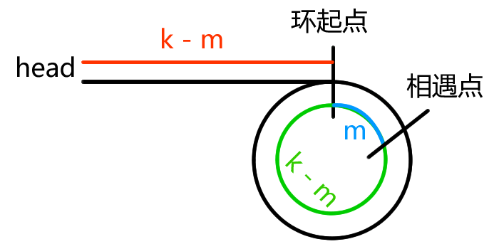

[link](https://labuladong.gitbook.io/algo/)

[link2](https://github.com/Alex660/leetcode)

[leetcode](https://leetcode-cn.com/problemset/all/)

# 0. 必读系列

## 学习算法的框架思维

求二叉树中最大路径和, 其实就是二叉树的后序遍历.

###### [Q 124.二叉树中的最大路径和](src/124.ts)

## 动态规划框架

首先, 动态规划问题的一般形式就是求最值. 求最值的核心其实就是穷举, 即把所有答案穷举出来, 然后在其中找最值.

动态规划的穷举有些特别, 即问题存在重叠子问题. 因为使用暴力穷举效率会极低, 所以一般会使用备忘录或过 DP table 来优化穷举过程, 避免重复计算.

```
明确基本情况 -> 明确状态 -> 明确选择 -> 定义 dp 数组/函数的含义
```

```
初始化基本情况
dp[0][0][...] = base
for 状态1 in 状态1的所有取值:
	for 状态2 in 状态2的所有取值:
		for ...
			dp[状态1][状态2][...] = 求最值(选择1, 选择2...)
```

### 一: 斐波那契数列

#### 1. 暴力递归

#### 2. 带备忘录的递归解法

#### 3. dp 数组的迭代解法

###### [Q 509.斐波那契数](src/509.ts)

### 二: 凑零钱问题

#### 1. 暴力递归

#### 2. 带备忘录的递归

#### 3. dp 数组的迭代解法

###### [Q 322.零钱兑换](src/322.ts)

## 回溯算法框架

#### 一: 全排列问题

###### [Q 46.全排列](src/46.ts)

#### 二: N 皇后问题

###### [Q 51.N皇后](src/51.ts)

## BFS 算法

###### [Q 111.二叉树的最小深度](src/111.ts)

###### [Q 752.打开转盘锁](src/752.ts)

### BFS 和 DFS

广度优先搜索算法（Breadth-First-Search BFS）

深度优先搜索算法（Depth-First-Search DFS）

### 二者区别

- BFS 的重点在于队列，DFS 的重点在于递归。
- BFS 用于查找单一最短路线，DFS 可用于找查所有解。
- BFS 的代价主要在于空间复杂度高，DFS 主要问题是递归的一些限制。

### 双向 BFS 优化

传统的 BFS 就是从起点开始向四周扩散，遇到终点时停止。而双向 BFS 则是从起点和终点同时开始扩散，当两边有交集的时候停止。

可以通过判断起点的队列和终点队列的 size ，挑 size 较小的先进行扩散，以优化空间增长的问题。

### 双向 BFS 的局限

必须知道终点在哪里，如果不知道终点在哪里，则无法使用双向 BFS 优化。

## 滑动窗口

[模板](src/slidingwindow.ts)

## 股票买卖问题 (DP table)

### 一: 穷举框架

以 188. 买卖股票的最佳时机 IV 举例, 这道题有一个最泛化的形式, 其他的问题都是这个形式的简化.

```
给定一个整数数组 prices ，它的第 i 个元素 prices[i] 是一支给定的股票在第 i 天的价格。
设计一个算法来计算你所能获取的最大利润。你最多可以完成 k 笔交易。
注意：你不能同时参与多笔交易（你必须在再次购买前出售掉之前的股票）。
```

其他题中, 第一题只允许交易一次, 相当于 k = 1;

第二题不限交易次数, 相当于 k = +infinity (正无穷);

第三题只进行 2 次交易, 相当于 k = 2;

剩下两道也是不限次数的, 但是加了交易 "冷冻期" 和 "手续费" 的额外条件, 其实就是第二题的变种.

利用状态进行穷举. 具体到每一天, 看看总共有几种可能的状态, 再找出每个状态对应的选择.

```
for 状态1 in 状态1的所有取值:
	for 状态2 in 状态2的所有取值:
		for ...
			dp[状态1][状态2][...] = 择优(选择1, 选择2, ...)
```

每天都有三种**选择**: 买入, 卖出, 无操作, 用 buy, sell, reset 表示这三种选择. 并不是每天都可以任意选择这三种选择, 因为 sell 必须在 buy 之后, buy 必须在 sell 之后. reset 还应该分成两种状态, 一种是 buy 之后的 reset (持有了股票), 一种是 sell 之后的 reset (没有持有股票). 最后还有交易次数 k 的限制, 即 buy 只能在 k > 0 的前提下操作.

这个问题的**状态**全部列举出来其实就三个, 第一个是天数, 第二个是允许交易的最大次数, 第三个是当前的持有状态. (1 表示持有, 0 表示没有持有)

```
dp[i][k][0 or 1]
0 <= i <= n-1, 1 <= k <= K
n 为天数, 大 K 为最多交易数
此问题共 n x K x 2 种状态

for 0 <= i < n:
	for 1 <= k <= K:
		for s in {0, 1}:
			dp[i][k][s] = max(buy, sell, rest)
```

`dp[3][2][1]`的含义就是: 今天是第三天, 持有股票, 最多进行 2 次交易.

`dp[2][3][0]`的含义就是: 今天是第二天, 没有持有股票, 最多进行 3 次交易.

最终答案是 `dp[n-1][K][0]`即最后一天, 最多允许 K 次交易, 最多获得多少利润.

### 二: 状态转移框架

###### [Q 121.买卖股票的最佳时机](src/121.ts) (k = 1)

###### [Q 122.买卖股票的最佳时机 II](src/122.ts) (k = +infinity)

###### [Q 309.最佳买卖股票时机含冷冻期](src/309.ts) (k = +infinity 冷冻期)

###### [Q 714.买卖股票的最佳时机含手续费](src/714.ts) (k = +infinity 手续费)

###### [Q 123.买卖股票的最佳时机 III (k = 2)](src/123.ts)

###### [Q 188.买卖股票的最佳时机 IV (k = any)](src/188.ts)


## 打家劫舍问题

###### [Q 198.打家劫舍](src/198.ts)

###### [Q 213.打家劫舍 II](src/213.ts)

###### [Q 337.打家劫舍 III](src/337.ts)


## 区间问题

### 区间覆盖问题

###### [Q 1288.删除被覆盖区间](src/1288.ts)

### 区间合并问题

###### [Q 56.合并区间](src/56.ts)

### 区间交集问题

###### [Q 986.区间列表的交集](src/986.ts)

# 1. 动态规划系列

# 2. 数据结构系列

## 2.5 数组题目

### 二分查找详解

#### 零: 二分查找框架

```js
const _$ = 'detail'; // 具体细节处
function binarySearch(nums, target) {
    let left = 0, right = _$;
    while(_$) {
        const mid = left + (right - left) / 2;
        if(nums[mid] == target) {
            _$;
        }
        else if(nums[mid] < target) {
            left = _$;
        }
        else if(nums[mid] > target) {
            right = _$;
        }
    }
    return _$;
}
```

分析二分查找的一个技巧是: 不要出现 else, 而是把所有 else if 写清楚. 这样可以清楚展现所有细节.

为了防止计算 mid 时溢出, 代码 `left + (right - left) / 2`和 `(left + right) / 2`的结果相同, 但是前者可以有效防止由于 `left + right`的结果太大导致的溢出.

#### 一: 寻找一个数 (基本的二分搜索)

```js
export function binarySearch(nums: number[], target: number): number {
  let left = 0;
  let right = nums.length - 1;

  while (left <= right) {
    const mid = Math.floor(left + (right - left) / 2);
    if (nums[mid] == target) {
      return mid;
    } else if (nums[mid] < target) {
      left = mid + 1;
    } else if (nums[mid] > target) {
      right = mid - 1;
    }
  }
  return -1;
}
```

1. 为什么 while 循环的条件中是 <= 而不是 < ?

   因为初始化时 `right = nums.length - 1`, 即是最后一个索引. 这样查找的区间是 `[left, right]`, 而非设置为 `right = num.length`的左闭右开区间 `[left, right)`

   另外循环的条件有可能是 `left == right`的情况, 比如 `[2,2]`, 此时如果是使用 `while(left < right)`这种时候 `[left, right]`, 明明区间是非空的, 还有一个 2, 但循环却已经终止了, 导致 2 没有被搜索. 所以循环的条件必须是 `while(left <= right)`.

   如果非要用 `while(left < right)`则需要打个补丁.

   ```js
   while(left < right) {
       // ...
   }
   return nums[left] == target ? left : -1;
   ```

2. 为什么是 `left = mid + 1`, `right = mid - 1`.

   因为搜索区间是 `[left, right]`, 那么当发现 `mid`不是 `target`时, 下一步搜索的区间就应该是 `[left, mid-1]`或 `[mid+1, right]`, 因为 `mid`已经被搜索过了, 所以应该从搜索区间中去除.

3. 此算法有什么缺陷?

   如果有序数组存在重复数字, 即 `nums = [1, 2, 2, 2, 3]`, `target`为 2, 此时, 算法返回的索引是正确的结果 2, 但是我们无法得知 `target`左侧或右侧的边界.

   当然也可以在找到 `target`后, 向左或向右线性搜索, 但是这样就难以保证二分查找的 O(log(n)) 的时间复杂度了.

#### 二: 寻找左侧边界的二分搜索

#### 三: 寻找右侧边界的二分搜索

###### [Q 34.在排序数组中查找元素的第一个和最后一个位置](src/34.ts)

###### [Q 704.二分查找](src/704.ts)

###### [Q 875.爱吃香蕉的珂珂](src/875.ts)

###### [Q 1011.在 D 天内送达包裹的能力](src/1011.ts)

### 双指针

#### 一: 快慢指针的常见算法

快慢指针一般都初始化指向链表的头结点 `head`, 前进时快指针 `fast`在前, 慢指针 `slow`在后.

##### 1. 判定链表中是否含有环

由于单链表的特点在于每个节点只能知道下一个节点, 所以一个指针是无法判断链表中是否含有环的.

如果链表中不含环, 那么指针最终会遇到空指针 `null`表示链表到头了. 类似这样:

```js
function hasCycle(head) {
    while(head != null) {
        head = head.next;
    }
    return false;
}
```

但如果链表中有环, 那么以上代码就会陷入死循环, 因为环形链表中并没有指向尾部节点的 `null`.

经典的解法就是使用两个指针, 一个跑得快, 一个跑得慢. 如果不含环, 那么跑得快的指针最终会遇到 `null`, 如果含有环, 快指针最终会超慢指针一圈, 和慢指针相遇. 说明链表含有环.

###### [Q 141.环形链表](src/141.ts)

##### 2. 返回环链表中环的起始位置

如果是环链表, 快慢指针第一次相遇时, 慢指针走了 `k`步, 那么快指针一定走了 `2k`步. 那么这多走的 `k`步其实就是快指针在环里面转圈, 所以 `k`值也就是环长度的**整数倍**.



所以只需要在相遇后, 将两个指针中的一个重新指向 head, 然后两个指针同速前进, `k - m`步后就会相遇, 且相遇之处就是环的起点.

###### [Q 142.环形链表 II](src/142.ts)

##### 3. 寻找链表的中点

快指针一次前进两步, 慢指针一次前进一步, 所以当快指针到达链表尽头时, 慢指针正好处于链表的中间位置.

###### [Q 876.链表的中间结点](src/876.ts)

##### 4. 寻找链表的倒数第 n 个元素

###### [Q 19.删除链表的倒数第N个节点](src/19.ts)

#### 二: 左右指针的常用算法

左右指针在数组中实际是指两个索引值, 一般初始化为 `left = 0, right = nums.length - 1`.

##### 1. 二分查找

##### 2. 两数之和

###### [Q 167.两数之和 II - 输入有序数组](src/167.ts)

##### 3. 反转数组

###### [Q 344.反转字符串](src/344.ts)

##### 4. 滑动窗口算法

### 滑动窗口

###### [Q 3.无重复字符的最长子串](src/3.ts)

###### [Q 76.最小覆盖子串](src/76.ts)

###### [Q 438.找到字符串中所有字母异位词](src/438.ts)

###### [Q 567.字符串的排列](src/567.ts)

### O(1) 时间操作数组中的元素

#### 实现随机集合

###### [Q 380.常数时间插入、删除和获取随机元素](src/380.ts)

#### 避开黑名单的随机数

###### [Q 710.黑名单中的随机数](src/710.ts)

### 数组去重

###### [Q 316.去除重复字母](src/316.ts)

###### [Q 1081.不同字符的最小子序列](src/316.ts)

### 原地修改数组

#### 有序数组/链表去重

###### [Q 26.删除排序数组中的重复项](src/26.ts)

###### [Q 83.删除排序链表中的重复元素](src/83.ts)

#### 移除元素

###### [Q 27.移除元素](src/27.ts)

#### 移动零

###### [Q 283.移动零](src/283.ts)

### twoSum 问题的核心思想

###### [Q 1. 两数之和](src/1.ts)

1. 双重循环穷举

   时间复杂度 O(N^2), 空间复杂度 O(1).

2. 使用哈希表减少查询时间的复杂度

   因为哈希表的查询时间为 O(1), 所以算法的时间复杂度降到了 O(N), 但是需要 O(N) 的空间复杂度来存在哈希表.

###### [Q 170. 两数之和 III - 数据结构设计](src/170.ts)

如果 find 的使用场景非常频繁, 还可以在 add 时将所有可能的和保存起来优化性能.

