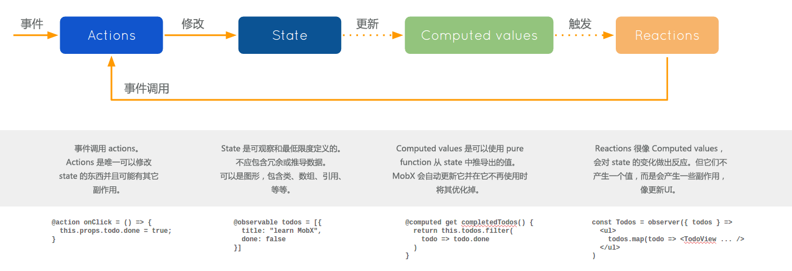
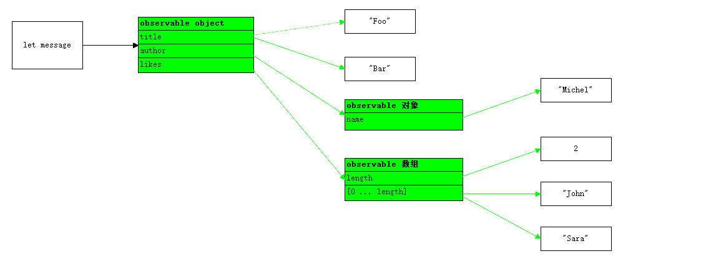

[link](https://cn.mobx.js.org/)

# 1. MobX 介绍

简单, 可扩展的状态管理

## 安装

```bash
npm i mobx
# React 绑定库
npm i mobx-react
```

## 浏览器支持

- MobX >= 5 版本运行在任何支持 ES6 Proxy 的浏览器. 如果运行在像 IE11, Node.js 6 以下版本或依靠与较旧的 JavaScriptCore 的安卓端的 React Native (需要[升级](https://github.com/react-native-community/jsc-android-buildscripts)).
- MobX 4 可以运行在任何支持 ES5 的浏览器上. MobX 4 和 5 的 API 是相同的, 并且语义上也能达到相同的效果, 只是 MobX 4 存在一些局限性 (参考 MobX 4 vs MobX 5).

> MobX 5 包的主入口点附带了 ES5 的代码, 以便向后兼容所有构建工具. 如果只在现代浏览器上运行, 可以考虑使用速度最快, 体积最小的 ES6 构建 `lib/mobx.es6.js`. 比如在 webpack 中使用别名功能: `resolve: { alias: { mobx: __dirname + "/node_modules/mobx/lib/mobx.es6.js" }}`

## 入门

MobX 它通过透明的函数响应式编程 (transparently applying functional reactive programming - TFRP) 使得状态管理变得简单和可扩展. MobX 背后的哲学很简单:

**任何源自应用状态的东西都应该自动地获得.**

其中包括 UI, 数据序列化, 服务器通讯等.



React 和 MobX 是一对强力组合. React 通过提供机制把应用状态转换为可渲染组件树并对其进行渲染. 而 MobX 提供机制来存储和更新应用状态供 React 使用.

对于应用开发中的常见问题, React 和 MobX 都提供了最优和独特的解决方案. MobX 提供了优化应用状态与 React 组件同步的机制, 这种机制就是使用响应式虚拟依赖状态图表, 它只有在真正需要的时候才更新并且永远保持是最新的.

## 核心概念

### Observable state (可观察的状态)

MobX 为现有的数据结构(如对象, 数组和类实例)添加了可观察的功能. 通过使用 `@observable`装饰器(ES.Next)来给类属性添加注解就可以简单的完成这一切.

```tsx
import { observable } from 'mobx';

class Todo {
  id = Math.random();
  @observable title = '';
  @observable finished = false;
}
```

使用 `@observable`很像把对象的属性变成 excel 的单元格. 但和单元格不同的是, 这些值不只是原始值, 还可以是引用值, 比如对象和数组.

如果环境不支持装饰器语法, 可以通过 `decorate`工具.

ES5 版本应该是这样的:

```tsx
import { decorate, observable } from 'mobx';

class Todo {
    id = Math.random();
    title = '';
    finished = false;
}
decorate(Todo, {
    title: observable,
    finished: observable
});
```

如果使用 MobX 6, 则使用 `makeObservable`.

```tsx
import { makeAutoObservable } from 'mobx';

class Todo2 {
  id = Math.random();
  title = '';
  finished = false;

  constructor() {
    makeAutoObservable(this);
  }
}
```

### Computed values (计算值)

使用 MobX, 可以定义在相关数据变化时自动更新值. 通过 `@computed`装饰器或者利用 `(extend)Observable`时调用 getter/setter 函数来使用.

```js
class TodoList {
    @observable todos = [];
	@computed get unfinishedTodoCount() {
        return this.todos.filter(todo => !todo.finished).length;
    }
}
```

当添加了一个新的 todo 或者某个 todo 的 `finished`属性发生变化时, MobX 会确保 `unfinishedTodoCount`自动更新.

### Reactions (反应)

Reactions 和计算值很像, 但它不是产生一个新的值, 而是会产生一些副作用, 比如打印到控制台, 网络请示, 递增地更新 React 组件树以修补 DOM 等. 简而言之, reactions 在响应式编程和命令式编程之间建立沟通的桥梁.

#### React 组件

如果使用 React 的话, 可以把(无状态函数)组件变成响应式组件, 方法是在组件上添加 `observer`函数/装饰器. `observer`是由 `mobx-react`包提供的.

```jsx
import React, {Component} from 'react';
import ReactDOM from 'react-dom';
import {observer} from 'mobx-react';

@observer
class TodoListView extends Component {
    render() {
        return <div>
        	<ul>
            	{this.props.todoList.todos.map(todo => <TodoView todo={todo} key={todo.id} />)}
            </ul>
            Tasks left: {this.props.todoList.unfinishedTodoCount}
        </div>
    }
}

const TodoView = observer(({todo}) => (
	<li>
    	<input type="checkbox" checked={todo.finished} onClick={() => todo.finished = !todo.finished} />{todo.title}
    </li>
	)
)
const store = new TodoList();
ReactDOM.render(<TodoListView todoList={store} />, document.getElementById('mount'));
```

`observer`会将 React (函数)组件转换为它们需要渲染的数据的衍生. 使用 MobX 时没有所谓的智能和无脑组件. 所有的组件都会以巧妙的方式进行渲染, 而只需要一种简单无脑的方式来定义它们. MobX 会确保组件总是在需要的时重新渲染, 仅此而已. 在上面的例子中, `onClick`处理方法会强制对应的 `TodoView`进行渲染, 如果未完成任务的数量(unfinishedTodoCount)已经改变, 它将导致 `TodoListView`进行渲染. 但如果将 `Tasks left:...`这行代码移除或者放到另外一个组件中. 此时点击 `checkbox`的时候, `TodoListView`将不再重新渲染.

#### 自定义 reactions

使用 `autorun`, `reaction`和 `when`函数即可简单的创建自定义 reactions.

例如, 每当 `unfinishedTodoCount`的数量发生变化时, 下面的 `autorun`会打印日志消息.

```js
autorun(() => {
    console.log('Tasks left: ' + todos.unfinishedTodoCount);
});
```

#### MobX 会对什么作出响应?

为什么每次 `unfinishedTodoCount`变化时都会打印一条新消息? 答案就是下面这条经验法则:

*MobX 会对在执行跟踪函数期间读取的任何现有的可观察属性作出反应.*

### Actions (动作)

不同于 Flux 系的一些框架, MobX 对于如何处理用户事件是完全开明的.

- 可以用类似 Flux 的方式完成
- 或者使用 RxJS 来处理事件
- 或者用最直观, 最简单的方式来处理事件, 正如上面演示所用的 `onClick`

最后全部归纳为: 状态应该以某种方式来更新.

当状态更新后, MobX 会以一种高效且无障碍的方式处理好剩下的事情.

从技术上层面来讲, 并不需要触发事件, 调用分派程序或者类似的工作. 归根究底 React 组件只是状态的展示, 而状态的衍生由 MobX 来管理.

```js
store.todos.push(
	new Todo('Get Coffee'),
    new Todo('Write simpler code')
);
store.todos[0].finished = true;
```

尽管如此, MobX 还是提供了 `actions`这个可选的内置概念. 使用 `actions`是有优势的, 它可以帮助你把代码组织的更好, 还能在状态何时何地应该被修改这个问题上帮助你做出明智的决定.

## MobX: 简单且可扩展

MobX 是状态管理库中侵入性最小的之一, 这使得 MobX 的方法不但简单, 而且可扩展性也非常好.

### 使用类和真正的引用

使用 MobX 不需要使数据标准化. 这使得库十分适合那些异常复杂的领域模型.

### 保证参照完整性

因为数据不需要标准化, 所以 MobX 会自动跟踪状态和衍生之间的关系, 获得参照完整性. 

要渲染通过三级间接寻址访问的数据? MobX 会跟踪它们, 一旦其中一个引用发生了变化 , 就会重新渲染.

### 更简单的 actions 更便于维护

MobX 修改状态非常简单, 你只需要简单的写出你的目的. MobX 会替你处理好剩下的事情.

### 细粒度的可观测性是高效的

MobX 构建应用中所有衍生的图形, 以找到保持最新状态所需的重新计算的最少次数. "衍生一切"或许听上去开销很昂贵, 但 MobX 构建虚拟衍生图以保持衍生与状态同步所需的重计算的数量最小化.

事实上, 在 Mendix 测试 MobX 时会发现使用这个库跟踪代码中的关系通常会更有效, 而不是通过使用手写事件或基于容器组件的"智能"选择器来推送更改.

简单来说, MobX 会在数据上建立更细粒度的"监听器", 而不是通过程序来控制.

其次, MobX 看到衍生之间的因果关系, 因此它可以为衍生排序, 使得衍生不会运行多次或引入缺陷.

[深入剖析 MobX](https://medium.com/hackernoon/becoming-fully-reactive-an-in-depth-explanation-of-mobservable-55995262a254)

### 易操作性

MobX 使用原生 javascript. 由于它的侵入性不强, 它可以和绝大部分 javascript 库共同使用, 而不需要特定的 MobX 风格库.

所以你可以继续使用你的路由, 数据获取和工具库. 比如 `react-router`, `director`, `superagent`, `lodash`等.

出于同样的原因, 你可以在服务端和客户端使用它, 也可以在 `react-native`这样的同构应用中使用.

## MobX 4 vs MobX 5

MobX 4 和 MobX 5 的不同之处在于后者使用了 ES6 的 proxy 来追踪属性. 因此, MobX 5 只能运行在支持 proxy 的浏览器上, 而 MobX 4 可以运行在任何支持 ES5 的环境中.

MobX 4 的重要局限性:

- Observable 数组并非真正的数组, 所以它们无法通过 `Array.isArray()`的检查. 最常见的处理方法是在传递给第三方库之前, 需要先对其进行 `.slice()`操作, 从而获得一个浅拷贝的真正数组.
- 向一个已存在的 observable 对象中添加属性不会被自动捕获. 要么使用 observable 映射来替代, 要么使用工具函数中方法来对想要动态添加属性的对象进行读/写/迭代.

MobX 6 会自动适配以决定是使用 ES6 的 Proxy 还是 ES5 的实现.

## Flow 支持

MobX 自带 Flow typings. 导入 mobx 模块时 Flow 会自动包含对应的 typings. 尽管不需要手动导入类型, 但依旧可以这样做: `import type {...} from 'mobx'`.

要想使用 MobX 自带的 flow typings, 需要:

- 在 `.flowconfig`中不能忽略 `node_modules`.
- 在 `.flowconfig`中不能在 `[libs]`部分中不能显式地导入.
- 不需要安装定义类型库 flow-typed.

# 1.1 MobX 要点

## 1. 定义状态并使其可观察

可以用任何你需要的数据结构来存储状态, 如对象, 数组, 类. 循环数据结构, 引用, 都没有状态. 只要确保所有会随时间流逝而改变的属性打上 `mobx`的标记使它们变得可观察即可.

```js
import {observable} from 'mobx';
const appState = observable({
    timer: 0
});
```

## 2. 创建视图以响应状态的变化

`appState`还没有观察到任何的东西. 可以创建视图, 当 `appState`中相关数据发生改变时视图自动更新. MobX 会以一种最小限度的方式来更新视图. 事实上这一点可以节省大量的样板文件, 并且它有着令人匪夷所思的高效.

通常来说, 任何函数都可以成为可以观察自身数据的响应式视图, MobX 可以在任何符合 ES5 的 JavaScript 环境中应用.

```jsx
import {observer} from 'mobx-react';

@observer
class TimerView extends React.Component {
    render() {
        return (
        	<button onClick={this.onReset.bind(this)}>
            	Seconds passed: {this.props.appState.timer}
            </button>
        );
    }
    
    onReset() {
        this.props.appState.resetTimer();
    }
}
ReactDOM.render(<TimerView appState={appState} />, document.body);
```

## 3. 更改状态

第三件要做的事就是更改状态. 也就是要决定应用究竟要做什么. 不像一些其它框架, MobX 不会命令你如何去做, 最佳实践就是 MobX 会帮助你以一种简单直观的方式来完成工作.

下面的代码每秒都会修改数据, 而当需要的时候 UI 就会自动更新. 无论是在改变状态的控制函数中, 还是在应该更新的视图中, 都没有明确的关系定义. 使用 `observable`来装饰状态和视图, 这足以让 MobX 检测所有关系了.

```js
appState.resetTimer = action(function reset() {
    appState.timer = 0;
});

setInterval(action(function tick() {
    appState.timer += 1;
}), 1000);
```

只有在严格模式(默认是不启用)下使用 MobX 时才需要 `action`包装. 建议使用 action, 因为它将帮助你更好地组织应用, 并表达出一个函数修改状态的意图. 同时, 它还自动应用事务以获得最佳性能.

# 1.2 概念与原则

## 概念

## 1. State (状态)

**状态**是驱动应用的数据. 通常有像待办事项列表这样的**领域特定状态**, 还有像当前已选元素的**视图状态**. 状态就像是有数据的 excel 表格.

## 2. Derivations (衍生)

**任何**源自**状态**并且不会再有任何进一步的相互作用的东西就是衍生. 衍生以多种形式存在:

- 用户界面
- 衍生数据, 比如剩下的待办事项的数量.
- 后端集成, 比如把变化发送到服务器端.

MobX 区分了两种类型的衍生:

- Computed values (计算值) - 它们是永远可以使用纯函数 (pure function)从当前可观察状态中衍生出的值.
- Reactions (反应) - Reactions 是当状态改变时需要自动发生的副作用 (side effect). 需要有一个桥梁来连接命令式编程 (imperative programming)和响应式编程 (reactive programming). 或者说得更明确一些, 它们最终都需要实现 I / O 操作.

## 3. Actions (动作)

**动作**是任一一段可以改变**状态**的代码. 用户事件, 后端数据推送, 预定事件等等.

在 MobX 中可以显式地定义动作, 它可以把代码组织的更清晰. 如果是在严格模式下使用 MobX 的话, MobX 会强制只有在动作之中才可以修改状态.

## 原则

MobX 支持单向数据流, 也就是**动作**改变**状态**, 而状态的改变会更新所有受影响的**视图**.

当状态改变时, 所有衍生都会进行原子级的自动更新. 因此永远不可能观察到中间值.

所有衍生默认都是同步更新. 这意味着例如动作可以在改变状态之后直接可以安全地检查计算值.

计算值是延迟更新的. 任何不在使用状态的计算值将不会更新, 直到需要它进行副作用操作时. 如果视图不再使用, 那么它会自动被垃圾回收.

所有的计算值都应该是纯净的. 它们不应该用来改变状态.

# 2. 核心 API

## 创建 observables

### observable(value)

用法:

- observable(value)
- @observable classProperty = value

value 可以是 JS 的基本数据类型, 引用类型, 普通对象, 类实例, 数组和映射.

注意: `observable(value)`是一个便捷的 API, 此 API 只有在它可以被转换成可观察的数据结构(数组, 映射或 observable 对象)时才会成功. 对于所有其它值, 不会执行转换.

匹配类型应用了以下转换规则, 但可以通过使用装饰器进行微调.

1. 如果 value 是 ES6 Map 的实例, 会返回一个新的 Observable Map. 如果你不只关注某个特定 entry 的更改, 而且对添加或删除其他 entry 时也做出反应的话, 那么 Observable map 会非常有用.
2. 如果 value 是数组, 会返回一个 Observable Array.
3. 如果 value 是没有原型的对象或它的原型是 `Object.prototype`, 那么对象会被克隆并且所有的属性都会被转换成可观察的. 参见 Observable Object.
4. 如果 value 是有原型的对象, JavaScript 原始数据类型或者函数, 值不会发生变化. 如果需要 Boxed Observable, 可以采用下列方式:
   - 显式地调用 `observable.box(value)`
   - 在类定义时使用 `@observable`
   - 调用 `decorate()`
   - 在类中使用 `extendObservable()`来引入属性

MobX 不会自动带有原型的对象转变成 observable, 因为那是 observable 构造函数的职责. 在构造函数中使用 `extendObservable`或在类定义中使用 `@observable`进行替代.

一些建议:

- 要想使用 `@observable`装饰器, 首先要确保在编译器(babel 或者 typescript)中装饰器是启用的.
- 默认情况下将一个数据结构转换成可观察的是有感染性的, 这意味着 `observable`被自动应用于数据结构包含的任何值, 或者将来会被该数据结构包含的值. 这个行为可以通过使用装饰器来更改.
- [MobX 4 及以下版本]要创建键是动态的对象永远都使用 maps ! 对象上只有初始化时便存在的属性会转换成可观察的, 尽管新添加的属性可以通过使用 `extendObservable`转换成可观察的.

`@observable property = value`

`observable`也可以用作属性的装饰器. 它需要启用装饰器而且它是 `extendObservable(this, {property: value})`的语法糖.

### observable.box(value, options?)

创建一个 observable 的盒子, 它用来存储 value 的 observable 引用. 使用 `get()`方法可以得到盒子中的当前 value, 而使用 `set()`方法可以更新 value. 这是所有其它 observable 创建的基础, 但实际中其实很少能使用到它.

通常盒子会自动地尝试把任何还不是 observable 的新值转换成 observable. 使用 `{deep: false}`选项会禁用这项行为.

### observable.object(value, decorators?, options?)

为提供的对象创建一个克隆并将其所有的属性转换成 observable. 默认情况下这些属性中的任何值都会转换成 observable, 但当使用 `{deep: false}`选项时, 只有属性会转换成 observable 引用, 而值不会改变(这也适用于将来分配的任何值).

`observable.object()`的第二个参数可以很好地调整装饰器的可观察性.

### observable.array(value, options?)

基于提供的值来创建一个新的 observable 数组.

如果不想数组中的值转换成 observable 请使用 `{deep: false}`选项.

### observable.map(value, options?)

基于提供的值来创建一个新的 observable 映射. 如果不想映射中的值转换成 observable 请使用 `{deep: false}`选项. 当想创建动态的键集合并且需要能观察到键的添加和移除时, 请使用 `map`. 因为内部使用了成熟的 ES6 Map, 可以自由使用任何键而不需局限于字符串.

### extendObservable

用法: `extendObservable(target, properties, decorators?, options?)`

对于 `propertyMap`中的每个键值对, 都会作为一个(新)的 observable 属性引入到 target 对象中. 还可以在构造函数中使用来引入 observable 属性, 这样就不需要用装饰器了. 如果 `propertyMap`的某个值是一个 getter 函数, 那么会引入一个 computed 属性.

如果新的属性不应该具备感染性(即新分配的值不应该自动地转换成 observable)的话, 请使用 `{deep: false}`选项. 注意, `extendObservable`增强了现有的对象, 不像 `observable.object`是创建一个新对象.

## 装饰器 (Decorators)

### @decorate

使用装饰器可以很好地调节通过 `observable`, `extendObservable`和 `observable.object`定义的属性的可观察性. 它们还可以控制特定属性的自动转换规则.

可用的装饰器列表:

- observable.deep: 所有 observable 都使用的默认的装饰器. 它可以把任何指定的, 非原始数据类型的, 非 observable 的值转换成 observable.
- observable.ref: 禁用自动的 observable 转换, 只是创建一个 observable 引用.
- observable.shallow: 只能与集合组合使用. 将任何分配的集合转换为浅 observable (而不是深 observable)的集合. 换名话说, 集合中的值将不会自动变为 observable.
- computed: 创建一个衍生属性, 参见 computed
- action: 创建一个动作, 参见 action
- action.bound: 创建有范围的动作, 参见 action

可以使用 @decorator 语法来应用这些装饰器:

```js
import {observable, action} from 'mobx';

class TaskStore {
    @observable.shallow tasks = [];
	@action addTask(task) { }
}
```

或者通过 `observable.object`/ `observable.extendObservable`或 `decorate()`传入属性装饰器. 注意, 装饰器总是"附着"在属性上的. 因此, 即使分配了新值, 它们仍将保持有效.

```js
import {observable, action} from 'mobx';

const taskStore = observable({
    tasks: [],
    addTask(task) {}
}, {
    tasks: observable.shallow,
    addTask: action
});
```

### decorate

用法: `decorate(object, decorators)`

这是将可观察性装饰器应用于普通对象或类实例的简便方法. 第二个参数是一个属性设置为某些装饰器的对象.

当无法使用 @decorator 语法或需要对可观察性进行更细粒度的控制时使用这个方法.

```js
class TodoList {
    todos = {}
	get unfinishedTodoCount() {
        return values(this.todos).filter(todo => !todo.finished).length;
    }
	addTodo() {
        const t = new Todo();
        t.title = 'Test_' + Math.random();
        set(this.todos, t.id, t);
    }
}

decorate(TodoList, {
    todos: observable,
    unfinishedTodoCount: computed,
    addTodo: action.bound
});
```

想要在单个属性上应用多个装饰器的话, 你可以传入一个装饰器数组. 多个装饰器应用的顺序是**从右至左**.

```js
import {decorate, observable} from 'mobx';
import {serializable, primitive} from 'serializr';
import persist from 'mobx-persist';

class Todo {
    id = Math.random();
	title = '';
	finished = false;
}

decorate(Todo, {
    title: [serializable(primitive), persist('object'), observable],
    finished: [serializable(primitive), observable]
});
```

注意: 并非所有的装饰器都可以在一起组合, 此功能只会尽力而为. 一些装饰器会直接影响实例, 并且可以"隐藏"其他那些只更改原型的装饰器的效果.

## 计算值 (Computed values)

用法:

- `computed(() => expression)`
- `computed(() => expression, (newValue) => void)`
- `computed(() => expression, options)`
- `@computed({equals: compareFn}) get classProperty() { return expression; }`
- `@computed get classProperty() { return expression; }`

创建计算值, expression 不应该有任何副作用而只是返回一个值. 如果任何 expression 中使用的 observable 发生改变, 它都会自动地重新计算, 但前提是计算值被某些 reaction 使用了.

还有各种选项可以控制 computed 的行为. 包括:

- `equals: (value, value) => boolean` : 用来重载默认检测规则的比较函数. 内置比较器有: `comparer.identity`, `comparer.default`, `comparer.structural`.
- `requiresReaction: boolean` : 在重新计算衍生属性之前, 等待追踪的 observables 值发生变化.
- `get: () => value` : 重载计算属性的 getter
- `set: (value) => void` : 重载计算属性的 setter
- `keepAlive: boolean` : 设置为 true 以自动保持计算值活动, 而不是在没有观察者时暂停.

## 动作 (Actions)

任何应用都有动作. 动作是任何用来修改状态的东西.

使用 MobX 你可以在代码中显式地标记出动作所在的位置. 动作可以有助于更好的组织代码. 建议在任何更改 observable 或者有副作用的函数上使用动作. 结合开发者工具的话, 动作还能提供非常有用的调试信息. 注意, 当启用严格模式时, 需要强制使用 `action`, 参见 `enforceActions`.

用法:

- `action(fn)`
- `action(name, fn)`
- `@action classMethod`
- `@action(name) classMethod`
- `@action boundClassMethod = (args) => { body }`
- `@action.bound boundClassMethod(args) { body }`

对于一次性动作, 可以使用 `runInAction(name?, fn)`, 它是 `action(name, fn)()`的语法糖.

## Flow

用法: `flow(function* (args) {})`

`flow()`接收 generator 函数作为它唯一的输入

当处理异步动作时, 回调中执行的代码不会被 `action`包装. 这意味着你修改的 observable state 无法通过 `enforceActions`检查. 保留动作语义的简单方法是使用 flow 来包装异步函数. 这将确保所有回调都会被 `action()`包装.

注意, 异步函数必须是 generator, 而且在内部只能 yield promise. flow 会返回一个 promise, 需要的话可以使用 `cancel()`进行撤销.

```js
import { configure } from 'mobx';

// 不允许在动作外部修改状态
configure({ enforceActions: true });

class Store {
    @observable githubProjects = [];
	@observable state = 'pending'; // pending / done / error
	fetchProjects = flow(function* fetchProjects() {
        this.githubProjects = [];
        this.state = 'pending';
        try {
            const projects = yield fetchGithubProjectsSomehow();
            const filteredProjects = somePreprocessing(projects);
            
            // 异步代码会自动被 action 包装
            this.state = 'done';
            this.githubProjects = filteredProjects;
        } catch (error) {
            this.state = 'error';
        }
    })
}
```

> 提示: 推荐为 generator 函数起个名称, 此名称将出现在开发工具中.

### Flows 可以撤销

Flows 是可以取消的, 这意味着调用返回的 promise 的 `cancel()`方法会立即停止 generator, 但是 `finally`语句仍会被处理. 返回的 promise 本身会使用 `FLOW_CANCELLED`进行 reject.

### Flows 支持异步迭代器

Flows 支持异步迭代器, 这意味着可以使用异步 generators.

```js
async function* someNumbers() {
    yield Promise.resolve(1);
    yield Promise.resolve(2);
    yield Promise.resolve(3);
}

const count = mobx.flow(async function*() {
    // 使用 await 来循环异步迭代器
    for await (const number of someNumbers()) {
        total += number;
    }
    return total;
});

const res = await count(); // 6
```

## 反应 (Reactions) & 衍生 (Deriations)

**计算值**是自动响应状态变化的**值**. **反应**是自动响应状态变化的**副作用**. 反应可以确保当相关状态发生变化时指定的副作用(主要是 I/O)可以自动地执行, 比如打印日志, 网络请求等等. 使用反应最常见的场景是 React 组件的 `observer`装饰器.

### observer

可以用作包裹 React 组件的高阶组件. 在组件的 `render`函数中的任何已使用的 observable 发生变化时, 组件都会自动重新渲染. 注意 `observer`是由 `mobx-react`包提供的, 而不是 `mobx`本身.

用法:

- `observer(React.createClass({...}))`
- `observer((props, context) => ReactElement)`
- `observer(class MyComponent extends React.Component {...})`
- `@observer class MyComponent extends React.Component {...}`

### autorun

用法:

`autorun(() => { sideEffect }, options)`. 

`autorun`负责运行所提供的 `sideEffect`并追踪在 `sideEffect`运行期间访问过的 `observable`的状态. 将来如果有其中一个已使用的 observable 发生变化, 同样的 `sideEffect`会再运行一遍. `autorun`返回一个清理函数用来取消副作用.

选项:

- `name?: string`: 用于识别和调试的名称.
- `delay?: number`: 使副作用延迟和防抖的时间. 默认为 0.
- `onError?: (error) => void`: 如果 autorun 函数抛出异常, 则触发错误处理函数.
- `scheduler?: (callback) => void`: 设置自定义调度器以决定如何调度 autorun 函数的重新运行.

### when

用法:

`when(() => condition, () => { sideEffect }, options)`

`condition`表达式会自动响应任何它所使用的 observable. 一理表达式返回的是真值, 副作用函数便会立即调用, 但只会调用一次.

注意: 副作用函数(第二个参数)其实是可选的. 如果不提供副作用函数的话, 将返回一个可取消的 promise (即具有 cancel() 方法的 promise).

`when`返回清理器以尽早地取消操作.

如果没有给 `when`传递副作用函数的话, 它将返回一个可以等待条件结束的 promise.

选项:

- `name?: string`: 用于识别和调试的名称.
- `onError?: (error) => void`: 如果断言函数或副作用函数抛出异步, 则触发错误处理函数.
- `timeout: number`: 以毫秒为单位的延迟, 之后将触发 `onError`处理函数, 以通知在指定时间内未满足条件.

### reaction

用法:

`reaction(() => data, data => { sideEffect }, options)`

`reaction`是 `autorun`的变种, 在如果追踪 observable 方面给予了更细粒度的控制. 它接收两个函数, 第一个是追踪并返回数据, 该数据用作第二个函数, 也就是副作用的输入. 与 `autorun`不同的是, 副作用起初不会运行, 并且在执行副作用时访问的任何 observable 都不会被追踪. 和 `autorunAsync`一样, 副作用是可以进行函数去抖的.

选项:

- `fireImmediately?: boolean`: 在触发副作用函数之前等待变化. 默认为 false.
- `delay?: number`: 使副作用延迟和防抖的时间. 默认为 0.
- `equals`: 自定义相等函数来确定 expr 函数(第一个函数)是否与之前的结果不同, 再决定是否触发副作用. 接收与 `computed`的 equals 选项相同的选项.
- 还接收 `autorun`的所有选项.

### onReactionError

用法:

`onReactionError(handler: (error: any, deriation) => void)`

此方法附加一个全局错误监听器, 对于从 reaction 抛出的每个错误都会调用该错误监听器. 它可以用来监控或者测试.

## 实用工具

### Provider ( mobx-react 包)

可以用来使用 React 的 `context`机制来传递 store 给子组件.

### inject ( mobx-react 包)

相当于 `Provider`的高阶组件. 可以用来从 React 的 `context`中挑选 store 作为 prop 传递给目标组件. 用法:

- `inject('store1', 'store2')(observer(MyComponent))`
- `@inject('store1', 'store2') @observer MyComponent`
- `@inject((stores, props, context) => props) @observer MyComponent`
- `@observer(['store1', 'store2']) MyComponent`: 它是 `@inject() @observer`的简写形式.

### toJS

用法:

`toJS(observableDataStructure, options?)`

把 observable 数据结构转换成普通的 javascript 对象并忽略计算值.

选项:

- `detectCycles: boolean`: 检查 observable 数据结构中的循环引用. 默认为 true.
- `exportMapsAsObjects: boolean`: 将 ES6 Map 作为普通对象导出. 默认为 true.

### isObservable 和 isObservableProp

用法:

`isObservable(thing)`

`isObservableProp(thing, property?)`

如果给定的 thing 或 thing 指定的 property 是 observable 的话, 返回 true. 适用于所有的 observable, 计算值和 reaction 的清理函数.

### isObservableObject | Array | Map 和 isBoxedObservable

用法:

`isObservableObject(thing)`

`isObservableArray(thing)`

`isObservableMap(thing)`

`isBoxedObservable(thing)`

如果类型匹配的话返回 true.

### isArrayLike

用法:

`isArrayLike(thing)`

如果给定的 thing 是 javascript 数组或者 observable (MobX的)数组的话, 返回 true. 这个方法更简便. 注意, observable 数组可以通过 `.slice()`转变成 javascript 数组.

### isAction

用法:

`isAction(func)`

如果给定函数是用 `action`方法包裹的或者是用 `@action`装饰的话, 返回 true.

### isComputed 或 isComputedProp

用法:

`isComputed(thing)`

`isComputedProp(thing, property?)`

如果给定的 thing 是计算值或者 thing 指定的 property 是计算值的话, 返回 true.

### intercept

用法:

`intercept(object, property?, interceptor)`

这个 API 可以在应用 observable 的 API 之前, 拦截更改. 对于验证, 标准化和取消等操作十分有用.

### observe

用法:

`observe(object, property?, listener, fireImmediately = false)`

这是一个底层 API, 用来观察一个单个的 observable 值.

### onBecomeObserved 和 onBecomeUnobserved

用法:

`onBecomeObserved(observable, property?, listener: () => void): (() => void)`

`onBecomeUnobserved(observable, property?, listener: () => void): (() => void)`

这些函数都是与 MobX 的观察体系挂钩的, 当 observables *开始* / *停止* 被观察时会收到通知. 它可以用来执行一些延迟操作或网络资源获取.

返回值为清理函数, 用来卸载监听器.

```js
export class City {
    @observable location;
    @observable temperature;
    interval;
    
    constructor(location) {
        this.location = location;
        // 只有当 temperature 实际使用了才开始获取数据!
        onBecomeObserved(this, 'temperature', this.resume);
        onBecomeUnobserved(this, 'temperature', this.suspend);
    }
    
    resume = () => {
        this.interval = setInterval(() => this.fetchTemperature(), 5000);
    }
    
    suspend = () => {
        this.temperature = undefined;
        clearInterval(this.interval);
    }
    
    @flow fetchTemperature = function* () {
        // 数据获取逻辑
    }
}
```

### configure

用法:

`configure(options)`

对活动的 MobX 实例进行全局行为设置. 使用它来改变 MobX 的整体表现.

选项:

#### arrayBuffer: number

如果没有最大长度的话, 则将可观察数组的默认创建长度增加至 arrayBuffer.

可观察数组会在 `ObservableArray.prototype`上惰性地创建数组项的 getters, 从第一项开始, 还会继续在数组中创建项, 直到数组长度为 arrayBuffer (即使项不存在). 如果清楚通用的最小数组长度, 并且不想在主流程代码中创建这些 getters 的话, 请使用 arrayBuffer.

#### computedRequiresReaction: boolean

禁止访问任何未观察的计算值. 如果想检查是否在没有响应式上下文中的使用计算属性的话, 请使用它.

#### disableErrorBoundaries: boolean

默认情况下, MobX 会捕获并重新抛出代码中发生的异常, 从而确保某个异常中的反应 (reaction) 不会阻止其他可能无关的反应的预定执行. 这意味着异常不会传播到原始代码中, 因此将无法使用 `try/catch`来捕获它们.

有时你可能想要捕获这些错误, 例如在单元测试反应时. 可以使用 `disableErrorBoundaries`来禁用此行为.

请注意, 使用此配置时, MobX 并不会回复错误. 出于这个原因, 你可能需要在每个异常之后使用 `_resetGlobalState`

```js
configure({ disableErrorBoundaries: true });

test('Throw if age is negative', () => {
    expect(() => {
        const age = observable.box(10);
        autorun(() => {
            if(age.get() < 0) {
                throw new Error('Age should not be negative');
            }
        });
        age.set(-1);
    }).toThrow();
    _resetGlobalState(); // 每个异常过后都需要
});
```

#### enforceActions

严格模式

在严格模式下, 不允许在 `action`外更改任何状态, 可接收的值:

- "never" (默认) : 可以在任意地方修改状态.
- "observed": 在某处观察到的所有状态都需要通过动作进行更改. 在正式应用中推荐此严格模式.
- "always": 状态始终需要通过动作来更新(包括创建).

#### isolateGlobalState: boolean

当同一环境中有多个 MobX 实例时, 将 MobX 的全局状态隔离. 当使用 MobX 的同时还使用了使用 MobX 的封装库时, 这是非常有用的. 当在库中调用 `configure({isolateGlobalState: true})`时, 库内的响应性将保持独立.

使用此选项, 如果多个 MobX 实例正在使用的话, 内部状态是会共享的. 优点就是两个实例的 observables 可以协同运行, 缺点是 MobX 的版本必须匹配.

#### reactionScheduler: (f: () => void) => void

设置一个新函数, 用来执行所有 MobX 的反应(reactions). 默认情况下, `reactionScheduler`只会运行反应 `f`而没有其他任何行为. 这对于基本的调试或者减慢反应以使用应用的更新更加可视化来说是非常有用的.

```js
configure({
    reactionScheduler: (f):void => {
    	console.log('延迟执行:', f);
		setTimeout(f, 100);
	}
})
```

### 直接操作 Observable

有一个统一的工具 API 可以有来操作 observable 映射, 对象和数组. 这些 API 都是响应式的, 这意味着如果使用 `set`添加, 使用 `values`或 `keys`进行迭代, 即使是新属性的声明都可以被 MobX 检测到.

- `values(thing)`: 将集合中所有值作为数组返回.
- `keys(thing)`: 将集合中所有键作为数组返回.
- `entries(thing)`: 返回集合中的所有项的键值对数组.
- `set(thing, key, value)`或 `set(thing, { key: value })`: 使用提供的键值对来更新给定的集合.
- `remove(thing, key)`: 从集合中删除指定的项. 也可用于数组拼接.
- `has(thing, key)`: 如果集合中存在指定的 observable 属性就返回 true.

## 开发工具

### "mobx-react-devtools" 包

可以用来检查 React 组件的性能和依赖. 还有基于 `spy`的强大的日志功能.

### trace

用法:

- `trace(enterDebugger?)`
- `trace(Reaction object / ComputedValue object / disposer function, enterDebugger?)`
- `trace(object, computedValuePropertyName, enterDebugger?)`

`trace`是一个可以在计算值或 reaction 中使用的小工具. 如果启用了它, 那么当值被无效时, 它将开始记录, 以及为什么. 如果 `enterDebugger`设置为 true, 并且启用了开发者工具的话, JavaScript 引擎会在触发时在些进行断点调试.

### spy

用法:

`spy(listener)`

它类似于将一个 `observe`监听器一次性附加到所有的 observables 上, 而且还负责正在运行的动作和计算的通知.

### getAtom

用法:

`getAtom(thing, property?)`

返回给定的 observable 对象, 属性, reaction 等的背后作用的 `Atom`.

### getDebugName

用法:

`getDebugName(thing, property?)`

返回 observable 对象, 属性, reaction 等(生成的)易读的调试名称.

### getDependencyTree

用法:

`getDependencyTree(thing, property?)`

返回给定的 reaction / 计算 当前依赖的所有 observable 的树型结构.

### getObserverTree

用法:

`getObserverTree(thing, property?)`

返回正在观察给定的 observable 的所有 reaction / 计算 的树型结构.

### "mobx-react" 开发钩子

`mobx-react`包提供了以下几个供 `mobx-react-devtools`使用的附加 API:

- `trackComponents()`: 启用追踪功能, 追踪使用了 `observer`的 React 组件.
- `renderReporter.on(callback)`: 使用 `observer`的 React 组件每次渲染都会调用 callback, 并附带相关的时间信息等.
- `componentByNodeRegistery`: 使用 ES6 WeakMap 将 DOMNode 映射到使用 `observer`的 React 组件实例.

## 内部函数

### transaction

它是底层 API, 推荐使用 actions 来代替.

`transaction(worker: () => void)`

可以用来批量更新而不会通知任何观察者, 直到事务结束.

它接收一个无参的 `worker`函数作为参数, 并运行它. 到这个函数完成前都不会有任何观察者收到通知. `transaction`返回 `worker`函数返回的任意值. 注意, `transaction`的运行完全是同步的. transactions 可以嵌套, 只有当最外层的 transaction 完成后, 等待中的 reactions 才会运行.

```js
import { autorun, observable, transaction } from 'mobx';

const numbers = observable([]);

autorun(() => {
  console.log(numbers.length);
});

transaction(() => {
  transaction(() => {
    numbers.push(1);
    numbers.push(2);
  });
  numbers.push(3);
});

// 输出:
// 0
// 3
```

### untracked

允许在没有观察者的情况下运行一段代码.

```js
import { autorun, observable, untracked } from 'mobx';

const person = observable({
  firstName: 'Xu',
  lastName: 'Leon',
});

autorun(() => {
  console.log(
    person.lastName,
    ',',
    // 在不建立依赖的情况下返回 person.firstName
    untracked(() => person.firstName)
  );
});
// 输出: Leon , Xu

person.firstName = 'G.G.';
// 不输出

person.lastName = 'Sheldon';
// 输出: Sheldon , G.G.
```

### createAtom

实用程序, 可用于创建你自己的 observable 数据结构, 并将它们连接到 MobX. 在所有 observable 数据类型的内部使用.

# 3. observable 相关

## 3.1 observable

用法:

- `observable(value)`
- `@observable classProperty = value`

value 可以是 JS 基本数据类型, 引用类型, 普通对象, 类实例, 数组和映射. 匹配类型应用了以下转换规则, 但可以通过使用调节器进行微调.

1. 如果 value 是 ES6 的 Map, 会返回一个新的 Observable Map. 如果除了关注特定 entry 的更改, 而且对添加或删除其他 entry 时也需要做出反应的话, 那么 Observable maps 会非常有用.
2. 如果 value 是数组, 会返回一个 Observable Array.
3. 如果 value 是没有原型的对象, 那么对象会被克隆并且所有的属性都会被转换成可观察的.
4. 如果 value 是有原型的对象, JavaScript 原始数据类型或者函数, 会直接将原始值返回. 如果想要为这样的值创建一个独立的可观察的引用. 请使用 Boxed Observable 代替. MobX 不会将一个有原型的对象自动转换成可观察的, 因为这是它构造函数的职责. 在构造函数中使用 `extendObservable`或者在类定义中使用 `@observable` / `decorate`.

## 3.2 @observable

装饰器可以在 ES7 或者 TypeScript 类属性中使用, 将其转换成可观察的. `@observable`可以在实例字段和属性 getter 上使用. 对于对象的哪部分需要成为可观察的, `@observable`提供了细粒度的控制.

## 3.3 Observable 对象

用法:

`observable.object(props, decorators?, options?)`

如果把一个普通的 JavaScript 对象传递给 `observable`方法, 对象的所有属性都将被拷贝至一个克隆对象并将克隆对象转变成可观察的. (普通对象是指不是使用构造函数创建出来的对象, 而是为 Object 作为其原型, 或者根本没有原型.) 默认情况下, `observable`是递归应用的, 所以如果对象的某个值是一个对象或数组, 那么该值也将通过 `observable`传递.

当使对象转变成 observable 时, 需要记住一些事情:

- 只有普通的对象可以转变成 observable. 对于非普通对象, 构造函数负责初始化 observable 属性. 要么使用 `@observable`注解, 要么使用 `extendObservable`函数.
- 属性的 getter 会自动转变成衍生属性, 就像 `@computed`所做的.
- `observable`是自动递归到整个对象的. 在实例化过程中和将来分配给 observable 属性的任何新值的时候. Observable 不会递归到非普通对象中.
- 这些默认行为能应对 95% 的场景, 但想要更细粒度的控制, 比如哪些属性应该转变成可观察的和如何变成可观察的, 请参见装饰器.
- 传入 `{ deep: false }`作为第三个参数可以禁用属性值的自动转换.
- 传入 `{ name: 'my name' }`为本对象赋予友好的调试名称.
- 对于 MobX4 及以下版本, 当通过 `observable`传递对象时, 只有在把对象转变成 observable 时存在的属性才会是可观察的. 之后添加到对象的属性不会变为可观察的, 除非使用 `set`或 `extendObservable`.

## 3.4 Observable 数组

和对象类似, 可以使用 `observable.array(values?)`或者将数组传给 `observable`, 可以将数组转变为可观察的. 这也是递归的, 所有数组中的所有(未来)值都会是可观察的.

除了所有内置函数, observable 数组还可以使用下面的好东西:

- `intercept(interceptor)`: 可以用来在任何变化作用于数组前将其拦截.
- `observer(listener, fireImmediately? = false)`: 监听数组的变化. 回调函数将接收表示数组拼接或数组更改的参数, 它符合 ES7 提议. 它返回一个清理函数以用来停止监听器.
- `clear()`: 从数组中删除所有项.
- `replace(newItems)`: 用新项替换数组中所有已存在的项.
- `find(predicate: (item, index, array) => boolean, thisArg?)`: 基本上等同于 ES7 的 `Array.find`提议.
- `findIndex(predicate: (item, index, array) => boolean, thisArg?)`: 基本上等同于 ES7 的 `Array.findIndex`提议.
- `remove(value)`: 通过值从数组中移除一个单个的项. 如果项被找到并移除的话, 返回 true.
- MobX 4 及以下版本 `peek()`: 和 `slice()`类似, 返回一个有所有值的数组并且数组可以放心的传递给其它库.

不同于 `sort`和 `reverse`函数的内置实现, observableArray 中的 sort 和 reverse 不会改变数组本身, 而只是返回一个排序过/反转过的拷贝. 在 MobX5 及以上版本中会出现警告. 推荐使用 `array.slice().sort()`来替代.

任何分配给 observable 数组的值都会默认通过 observable 来使其转变成可观察的. 可以通过 `{ deep: false }`选项创建浅数组以禁用此行为, 并按原样存储值.

可以通过 `{ name: 'my name' }`选项用来给数组一个友好的调试名称, 用于 `spy`或者 MobX 开发者工具.

由于 ES5 中的原生数组的局限性, `observable.array`会创建一个人造数组(类数组对象)来代替真正的数组. 实际上, 这些数组能像原生数组一样很好的工作, 并且支持所有的原生方法, 包括从索引的分配到包含数组长度.

请记住无论如何 `Array.isArray(observable([]))`都将返回 false, 所以无论何时当你需要传递 observable 数组到外部库时, 通过使用 `array.slice()`在 observable 数组传递给外部库或者内置方法前创建一份浅拷贝.

## 3.5 Observable 映射

用法:

`observable.map(values, options?)`

创建一个动态键的 observable 映射. values 可以是对象, 数组或者字符串键的 ES6 map.

通过 ES6 Map 构造函数, 你可以使用 `observable(new Map())`或使用装饰器 `@observable map = new Map()`的类属性来初始化 observable 映射.

下列 observable 映射所暴露的方法是依据 ES6 Map 规范:

- `has(key)`: 返回映射是否有提供键对应的项. 注意键的存在本身就是可观察的.
- `set(key, value)`: 把给定键的值设置为 value. 提供的键如果在映射中不存在的话, 那么它会被添加到映射中.
- `delete(key)`: 把给定键和它的值从映射中删除.
- `get(key)`: 返回给定键的值(或 undefined).
- `keys()`: 返回映射中存在的所有键的迭代器, 插入顺序会被保留.
- `values()`: 返回映射中存在的所有值的迭代器, 插入顺序会被保留.
- `entries()`: 返回一个(保留插入顺序)的数组的迭代器, 映射中的每个键值都会对应数组中的一项 `[key, value]`.
- `forEach(callback: (value, key, map) => void, thisArg?)`: 为映射中每个键值对调用给定的回调函数.
- `clear()`: 移除映射中的所有项.
- `size`: 返回映射中项的数量.

以下函数不属于 ES6 规范, 而是由 MobX 提供:

- `toJS()`: 将 observable 映射转换成普通映射.
- `toJSON()`: 返回此映射的浅式普通对象表示. (想要深拷贝, 请使用 `mobx.toJS(map)`).
- `intercept(interceptor)`: 可以用来在任何变化作用于映射前将其拦截.
- `observe(listener, fireImmediately?)`: 注册侦听器, 在映射中的每个更改时触发, 类似于为 Object observe 发生的事件.
- `merge(values)`: 把提供对象的所有项拷贝到映射中. values 可以是普通对象, entries 数组或者 ES6 字符串键的映射.
- `replace(values)`: 用提供值替换映射全部内容. 是 `.clear().merge(values)`的简写形式.

选项 `{ deep: false, name: 'my name' }`同样可以让 observable 映射变成浅映射, 并提供一个调试友好的名称.

## 3.6 值类型值和引用类型值

JavaScript 中的所有原始类型都是不可变的, 因此它们都是不可观察的. 通常这是好的, 因为 MobX 通常可以使包含值的属性转变成可观察的. 可参见 observable objects. 在极少数情况下, 拥有一个不属于某个对象的可观察的"原始类型值"还是很方便的. 对于这种情况, 可以创建一个 observable box 以便管理这样的原始类型的值.

用法:

`observable.box(value)`

接收任何值并把值存储到箱子中. 使用 `.get()`可以获取当前值, 使用 `.set(newValue)`可以更新值.

此外, 还可以使用它的 `.observe`方法注册回调, 以监听对存储值的更改. 但因为 MobX 自动追踪了箱子的变化, 在绝大数情况下最好还是使用像 `mobx.autorun`这样的 reaction 来替代.

`observable.box(scalar)`返回的对象签名是:

- `.get()`: 返回当前值.
- `.set(value)`: 替换当前存储的值并通知所有观察者.
- `.intercept(interceptor)`: 可以用来在任何变化应用前将其拦截.
- `.observe(callback: (change) => void, fireImmediately = false): disposerFunction`: 注册一个观察者函数, 每个存储值被替换时触发. 返回一个函数以取消观察者. change 参数是一个对象, 其中包含 observable 的 newValue 和 oldValue.

`observable.box(value, { deep: false })`

创建一个基于 `ref`装饰器的箱子. 这意味着箱子里的任何(将来)值都不会自动地转换成 observable.

`{ name: 'my name' }`选项提供一个友好的调试名称.

## 3.7 装饰器

MobX 有一组装饰器来定义 observable 属性的行为.

- `observable`: `observable.deep`的别名.
- `observable.deep`: 任何 observable 都使用的默认的调节器. 它将任何(尚未成为 observable)数组, 映射或纯对象克隆并转换为 observable 对象, 并将其赋值给给定属性.
- `observable.ref`: 禁用自动的 observable 转换, 只是创建一个 observable 引用.
- `observable.shallow`: 只能与集合组合使用. 将任何分配的集合转换为 observable, 但该集合的值将按原样处理.
- `observable.struce`: 就像 ref, 但会忽略结构上等于当前值的新值.
- `computed`: 创建一个衍生属性.
- `computed(options)`: 同 computed, 可设置选项.
- `computed.struct`: 与 computed 相同, 但是只有当视图产生的值与之前的值结构上有不同时, 才通知它的观察者.
- `action`: 创建一个动作.
- `action(name)`: 创建一个动作, 重载了名称.
- `action.bound`: 创建一个动作, 并将 `this`绑定到实例.

### 深层可观察性

当 MobX 创建一个 observable 对象时 (使用 observable, observable.object 或 extendObservable), 它引入的 observable 属性默认是使用 deep 调节器的. deep 调节器主要是为任何新分配的值递归调用 observable(newValue).

这是一个非常便利的默认设置, 无需额外的工作, 分配给 observable 的所有值本身也将转变成 observable(除非它们已经是了), 因此不需要额外的工作就可以使对象转变成深 observable.

### 引用可观察性

在某些情况下, 不需要将对象转变成 observable. 典型案例就是不可变对象, 或者不是由你管理, 而是由外部库管理的对象. 例如 JSX 元素, DOM 元素, 像 History, window 这样的原生对象等等. 对于这类对象, 只需要存储引用而不用把它们转变成 observable.

对于这些情况, 可以使用 `ref`调节器. 它会确保创建 observable 属性时, 只追踪引用而不会把它的值转变成 observable.

### 浅层可观察性

`observable.shallow`调节器会应用"单层"可观察性. 如果想创建一个 observable 引用的集合, 那你会需要它. 如果新集合分配给具有此调节器的属性, 那么它会转变成 observable, 但它的值将保持原样, 不同于 `deep`的是它不会递归.

# 4. 对 observables 作出响应

## 4.1 (@)computed

计算值(computed values)是可以根据现有的状态或其它计算值衍生出的值. 概念上来说, 它与 excel 表格中的公式十分相似. 不要低估计算值, 因为它们有助于使实际可修改的状态尽可能的小. 此外计算值还是高度优化过的, 所以尽可能的多使用它们.

不要把 `computed`和 `autorun`搞混. 它们都是响应式调用的表达式, 但是, 如果你想响应式的产生一个可以被其他 observer 使用的值, 请使用 `@computed`, 如果你不想产生一个新值, 而想要达到一个效果, 请使用 `autorun`. 举例来说, 效果是像打印日志, 发起网络请求等这样命令式的副作用.

如果任何影响计算值的值发生变化了, 计算值将根据状态自动进行衍生. 计算值在大多数情况下可以被 MobX 优化, 因为它们被认为是纯函数. 例如, 如果前一个计算中使用的数据没有更改, 计算属性将不会重新运行. 如果某个其它计算属性或 reaction 未使用该计算属性, 也不会重新运行. 在这种情况下, 它将被暂停.

这个自动地暂停是非常方便的. 如果一个计算值不再被观察了, 例如使用它的 UI 不复存在了, MobX 可以自动地将其垃圾回收. 而 `autorun`中的值必须要手动清理才行, 这点和计算值是有所不同的. 如果你创建一个计算属性, 但不在 reaction 中的任何地方使用它, 它不会缓存值并且有些重新计算看起来似乎是没有必要的. 这点有时候会让刚接触 MobX 的人很困惑. 然而, 在现实开发场景中, 这是迄今为止最好的默认逻辑. 如果你需要的话, 可以使用 observe 或 keepAlive 来强制保持计算值总是处于唤醒状态.

注意, 计算属性是不可枚举的, 它们也不能在继承链中被覆盖.

### @computed

如果已经启用 decorators 的话, 可以在任意类属性的 getter 上使用 `@computed`装饰器来声明式的创建计算属性. 或者使用 `decorate`.

`observable.object`和 `extendObservable`都会自动将 getter 属性推导成计算属性.

### 计算值的 setter

可以为计算值定义 setter. 注意, 这些 setter 不能用来直接改变计算属性的值, 但是它们可以用来作"逆向"衍生, 例如:

```js
const orderLine = observable.object({
    price: 0,
    amount: 1,
    get total() {
        return this.price * this.amount;
    },
    set total(total) {
        this.price = total / this.amount; // 从 total 中推导出 price
    }
});
```

同样的:

```js
class Foo {
    @observable length = 2;
	@computed get squared() {
        return this.length * this.length;
    }
	set squared(value) { // 这是一个自动的动作
        this.length = Math.sqrt(value);
    }
}
```

注意: 永远在 getter 之后定义 setter, 一些 TypeScript 版本会知道声明了两个具有相同名称的属性.

### computed(expression) 函数

`computed`还可以直接当做函数来使用. 就像 `observable.box(primitive value)`创建一个独立的 observable. 在返回的对象上使用 `.get()`来获取计算的当前值, 或者使用 `.observe(callback)`来观察值的改变. 这种形式的 `computed`不常使用, 但在某些情况下, 你需要传递一个"在 box 中"的计算值时, 它可能是有用的.

```js
const name = observable.box('John');

const upperCaseName = computed(() => name.get().toUpperCase());

const disposer = upperCaseName.observe(change => {
    console.log(change.newValue);
});

name.set('Dave');
// 输出: 'DAVE'
```

### computed 的选项

当使用 computed 作为调节器或者盒子时, 它接收第二个选项参数对象, 有如下可选参数:

- `name`: 字符串, 在 spy 和 MobX 开发者工具中使用的调试名称.
- `context`: 在提供的表达式中使用的 `this`.
- `set`: 要使用的 setter 函数. 没有 setter 的话无法为计算值分配新值. 如果传递给 computed 的第二个参数是一个函数, 那么就会把这个函数作为 setter.
- `equals`: 默认值是 `comparer.default`. 它充当比较前一个值和后一个值的比较函数. 如果这个函数认为前一个值和后一个值是相等的, 那么观察者就不会重新评估. 这在使用结构数据和来自其他库的类型时很有用. 例如, 一个 computed 的 moment 实例可以使用 `(a, b) => a.isSame(b)`. 如果想要使用结构比较来确定新的值是否与上个值不同(并作为结果通知观察者), `comparer.deep`十分便利.
- `requiresReaction`: 对于非常昂贵的计算值, 推荐设置成 `true`. 如果你尝试读取它的值, 但某些观察者没有跟踪该值(在这种情况下, MobX 不会缓存该值), 则会导致计算结果丢失, 而不是进行昂贵的重新评估.
- `keepAlive`: 如果没有任何人观察到, 则不要使用此计算值. 请注意, 这很容易导致内存泄漏, 因为它会导致此计算值使用的每个 observable 和计算值保存在内存中.

### @computed.struce 用于比较结构

### 内置比较器

MobX 提供了三个内置 comparer(比较器) :

- `comparer.identity`: 使用恒等(===)运算符来判定两个值是否相同.
- `comparer.default`: 等同于 `comparer.identity`, 但还认为 `NaN`等于 `NaN`.
- `comparer.structural`: 执行深层结构比较以确定两个值是否相同.

### 错误处理

如果计算值在其计算期间抛出异常, 则此异常将捕获并在读取其值时重新抛出. 强烈建议始终抛出"错误", 以便保留原始堆栈跟踪. 例如: `throw new Error('Uhoh')`, 而不是 `throw 'Uhoh'`. 抛出异常不会中断跟踪, 所有计算值可以从异常中恢复 .

```js
const x = observable.box(3);
const y = observable.box(1);
const divided = computed(() => {
    if(y.get() === 0) {
        throw new Error('Division by zero');
    }
    return x.get() / y.get();
});
divided.get(); // 3

y.set(0);
divided.get(); // 报错
divided.get(); // 报错

y.set(2);
divided.get(); // 已经恢复, 返回 1.5
```

## 4.2 Autorun

用法:

`autorun(name?, callback, options?): disposerFunction`

当你想创建一个响应式函数, 而该函数本身永远不会有观察者时, 可以使用 `mobx.autorun`. 这通常是当你需要从反应式代码桥接到命令式代码的情况, 例如打印日志, 持久化或者更新 UI 的代码. 当使用 `autorun`时, 所提供的函数总是立即被触发一次, 然后每次它的依赖关系改变时会再次被触发. 相比之下, `computed(function)`创建的函数只有当它有自己的观察者时才会重新计算, 否则它的值会被认为是不相关的. 

如果传递一个字符串作为第一个参数, 则它将被当作调试名.

autorun 函数的返回值是一个可用于执行期间清理 autorun 的函数.

```js
const numbers = observable([1, 2, 3]);
const sum = computed(() => numbers.reduce((a, b) => a + b, 0));
const disposer = autorun(() => console.log(sum.get()));
// 6
numbers.push(4);
// 10
disposer();
numbers.push(5);
// 不再输出任何值
```

### 选项

- `delay`: 可用于对效果函数进行去抖动的数字(以毫秒为单位). 如果是 0 (默认值)的话, 那么不会进行去抖.
- `name`: 字符串, 用于在 `spy`这样的事件中用作此 reaction 的名称.
- `onError`: 用来处理 reaction 的错误, 而不传播它们. 在 autorun 和所有其他类型 reaction 中抛出的异常会被捕获并打印到控制台, 但不会将异常传播回原始导致异常的代码. 这是为了确保一个异常中的 reaction 不会阻止其他可能不相关的 reaction 的预定执行. 这也允许 reaction 从异常中恢复, 抛出异常不会破坏 MobX 的跟踪. 因此如果除去异常的原因, reaction 的后续运行可能会再次正常完成. 一个全局的 onError 处理方法可以使用 `onReactionError(handler)`来设置.
- `scheduler`: 设置自定义调度器以决定如何调度 autorun 函数的重新运行.

## 4.3 when

用法:

`when(predicate: () => boolean, effect?: () => void, options?)`

`when`观察并运行给定的 `predicate`, 直到返回 true. 一旦返回 true, 给定的 `effect`就会被执行, 然后 autorunner(自动运行程序)会被清理. 该函数返回一个清理器以提前取消自动运行程序.

### when-promise

如果没提供 effect 函数, when 会返回一个 Promise. 这样就能与 `async / await`完美结合了.

```js
async function() {
    await when(() => this.isVisible);
    // ...
}
```

## 4.4 Reaction

用法:

`reaction(() => data, (data, reaction) => { sideEffect }, options?): disposerFunction`

`autorun`的变种, 对于如何追踪 observable 赋予了更细粒度的控制. 它接收两个函数参数, 第一个(数据函数)是用来追踪并返回数据作为第二个函数(副作用函数)的输入. 不同于 `autorun`的是, 当创建时效果函数不会直接运行, 只有在数据表达式首次返回一个新值后才会运行. 在执行效果函数时访问的任何 observable 都不会被追踪.

传入的第二个函数(副作用函数)当调用时会接收到两个参数. 第一个参数是由 data 函数返回的值. 第二个参数是当前的 reaction, 可以用来在执行期间清理 reaction.

值得注意的是, 副作用函数仅对数据函数中访问的数据作出反应, 这可能会比实际在副作用函数中使用的数据要少. 此外, 副作用函数只会在表达式返回的数据发生更改时触发. 换句话说: reaction 需要你生产副作用函数中所需要的东西.

### 选项

- `fireImmediately`: 布尔值, 用来标识副作用函数是否在数据函数第一次运行后立即触发. 默认值是 `false`.
- `delay`: 可用于对副作用函数进行去抖动的数字(以毫秒为单位). 如果是 0 (默认值)的话, 那么不会进行去抖.
- `equals`: 默认值是 `comparer.default`. 如果指定的话, 这个比较器函数被用来比较由数据函数产生的前一个值和后一个值. 只有比较器函数返回 false, 副作用函数才会被调用. 此选项如果指定的话, 会覆盖 `compareStructural`选项.
- `name`: 字符串, 用于在 `spy`这样事件中用作此 reaction 的名称.
- `onError`: 用于处理 reaction 的错误, 而不是传播它们.
- `scheduler`: 设置自定义调度器以决定如何调度副作用函数的重新运行.

```js
const todos = observable([
    {
        title: 'Make coffee',
        done: true,
    },
    {
        title: 'Find biscuit',
        done: false,
    }
]);

// reaction 错误用法: 对 length 的变化作出反应, 而不 title 的变化!
const reaction1 = reaction(
	() => todos.length,
    length => console.log('reaction 1:', todos.map(todo => todo.title).join(', '))
);

// reaction 正确用法: 对 length 和 title 的变化作出反应
const reaction2 = reaction(
	() => todos.map(todo => todo.title),
    titles => console.log('reaction 2:', titles.join(', '))
);

// autorun 对它函数中使用的任何东西作出反应
const autorun1 = autorun(
	() => console.log('autorun 1:', todos.map(todo => todo.title).join(', '))
);

todos.push({ title: 'explain reactions', done: false });
// 输出:
// reaction 1:
// reaction 2:
// autorun 1:
todos[0].title = 'Make tea';
// 输出:
// reaction 2:
// autorun 1:
```

```js
const counter = observable({ count: 0 });

// 只调用一次并清理掉 reaction.
const reaction3 = reaction(
	() => counter.count,
    (count, reaction) => {
        console.log('reaction 3: invoked. counter.count = ' + count);
        reaction.dispose();
    }
);

counter.count = 1;
// 输出:
// reaction 3: invoked. counter.count = 1

counter.count = 2;
// 输出:
// 没有输出
```

粗略地讲, reaction 是 `computed(expression).observe(action(sideEffect))`或 `autorun(() => action(sideEffect)(expression))`的语法糖.

## 4.5 @observer

`observer`函数/装饰器可以用来将 React 组件转变成响应式组件. 它用 `mobx.autorun`包装了组件的 render 函数以确保任何组件渲染中使用的数据变化时都可以强制刷新组件. `observer`是由单独的 `mobx-react`包提供的.

```jsx
import {observer} from 'mobx-react';

const timerData = observable({
    secondsPassed: 0,
});
setInterval(() => {
    timerData.secondsPassed ++;
}, 1000);

@observer class Timer extends React.Component {
    render() {
        return (<span>Seconds passed: { this.props.timerData.secondsPassed }</span>);
    }
}

ReactDOM.render(<Timer timerData={timerData} />, document.body);
```

当 `observer`需要组合其它装饰器或高阶组件时, 请确保 `observer`是最深处(第一个应用)的装饰器, 否则它可能什么都不做.

注意: 装饰器是可选的, 它和 `observer(class Timer ... {})`达到的效果是一样的.

### 陷阱: 组件中的间接引用值

MobX 可以做很多事, 但是它无法使原始数据类型值转变成可观察的(尽管可以用对象来包装它们, 参见 boxed observables). 所以值是不可观察的, 但是对象的属性可以. 这意味着 `@observer`实际上是对间接引用(dereference)值的反应. 那么在上面的示例中, 如果使用下面的这种方式初始化, Time 组件是不会有反应的:

```jsx
ReactDOM.render(<Timer timerData={timerData.secondsPassed} />, document.body);
```

因为这个代码片段只是把 `secondsPassed`的当前值传给了 Timer 组件, 这个值是不可变值 `0`(JS 中所有的原始数据类型值都是不可变的). 这个数值永远都不会改变, 因此 Timer 组件不会更新. `secondsPassed`的值将来会发生改变, 所以我们需要在组件中访问它. 或者换句话说, 值需要通过引用来传递而不是通过(字面值)值来传递.

### ES5 支持

在 ES5 环境中, 可以简单地使用 `observer(React.createClass({...}))`来定义观察者组件.

### 无状态函数组件

```jsx
const Timer = observer(({ timerData }) => {
    return <span>Seconds passed: { timerData.secondsPassed }</span>
});
```

### 可观察的局部组件状态

就像普通类一样, 你可以通过使用 `@observable`装饰器在 React 组件上引入可观察属性. 这意味着你可以在组件中拥有功能同样强大的本地状态(local state), 而不需要通过 React 的冗长和强制性的 `setState`机制来管理. 响应式状态会被 `render`提取调用, 但不会调用其它 React 的生命周期方法(除了 `componentWillUpdate`和 `componentDidUpdate`). 如果需要用到其他 React 生命周期方法, 只需使用基于 `state`的常规 React API 即可.

```jsx
@observer class Timer extends React.Component {
    @observable secondsPassed = 0;

	componentWillMount() {
        setInterval(() => {
            this.secondsPassed++;
        }, 1000);
    }

	render() {
        return (<span>Seconds passed: { this.secondsPassed }</span>);
    }
}

ReactDOM.render(<Timer />, document.body);
```

### 使用 inject 将组件连接到提供的 stores

`mobx-react`包还提供了 `Provider`组件, 它使用了 React 的上下文(context)机制, 可以用来向下传递 `stores`. 要连接到这些 stores, 需要传递一个 stores 名称的列表给 `inject`, 这使得 stores 可以作为组件的 `props`使用.

```jsx
const colors = observable({
    foreground: '#000',
    background: '#fff'
});

const App = () =>
	<Provider colors={colors}>
		<app stuff... />
	</Provider>;

const Button = inject('colors')(observer(({colors, label, onClick}) => {
    return (
    	<button style={{
                color: colors.foreground,
                backgroundColor: colors.background
            }} onClick={onClick}>{label}</button>
    );
}));

// 稍后...
colors.foreground = 'blue';
// 所有 button 都会更新
```

### 何时使用 observer ?

简单来说, 所有渲染 observable 数据的组件. 如果你不想将组件标记为 observer, 例如为了减少通用组件包的依赖, 请确保只传递普通数据.

使用 `@observer`的话, 不再需要从渲染目的上来区分是"智能组件"还是"无脑"组件. 在组件的事件处理, 发起请求等方面, 它也是一个很好的分离关注点. 当所有组件它们自己的依赖项有变化时, 组件自己会响应更新. 而它的计算开销是可以忽略的, 并且它会确保不管何时, 只要当你开始使用 observable 数据时, 组件都将会响应它的变化.

### observer 和 PureComponent

如果传递给组件的数据是响应式的, observer 还可以防止当组件的 props 只是浅改变时的重新渲染, 这是很有意义的. 这个行为与 React PureComponent 相似, 不同在于这里的 state 的更改仍然会被处理. 如果一个组件提供了它自己的 `shouldComponentUpdate`, 这个方法会被优先调用.

### componentWillReact (生命周期钩子)

React 组件通常在新的堆栈上渲染, 这使得通常很难弄清楚是什么导致组件的重新渲染. 当使用 `mobx-react`时可以定义一个新的生命周期钩子函数 `componentWillReact`(一语双关). 当组件因为它观察的数据发生了改变, 它会安排重新渲染, 这个时候 `componentWillReact`会被触发. 这使得它很容易追溯渲染并找到导致渲染的操作(action).

```jsx
import {observer} from 'mobx-react';

@observer class TodoView extends React.Component {
    componentWillReact() {
        console.log('I will re-render, since the todo has changed!');
    }
    
    render() {
        return <div>this.props.todo.title</div>;
    }
}
```

- `componentWillReact`: 不接收参数
- `componentWillReact`: 初始化渲染前不会触发 (使用 `componentWillMount`替代)
- `componentWillReact`: 对于 mobx-react@4+, 当接收新的 props 时并在 `setState`调用后会触发此钩子

### MobX-React-DevTools

结合 `@observer`, 可以使用 MobX-React-DevTools, 它精确地显示了何时重新渲染组件, 并且可以检查组件的数据依赖关系.

### observer 组件特性

- Observer 仅订阅在上次渲染期间活跃使用的数据结构. 这意味着你不会订阅不足(under-subscribe)或者过度订阅(over-subscribe). 你甚至可以在渲染方法中使用仅在未来时间段可用的数据. 这是异步加载数据的理想选择.
- 你不需要声明组件将使用什么数据. 相反, 依赖关系在运行时会确定并以非常细粒度的方式进行跟踪.
- 通常, 响应式组件没有或很少有状态, 因为在与其他组件共享的对象中封装(视图)状态通常更方便. 但仍然可以自由地使用状态.
- @observer 以和 PureComponent 同样的方式实现了 shouldComponentUpdate, 因此子组件可以避免不必要的重新渲染.
- 响应式组件单方面加载数据, 即使子组件要重新渲染, 父组件也不会进行不必要地重新渲染.
- @observer 不依赖于 React 的上下文系统.
- mobx-react@4+ 中, observer 组件的 props 对象和 state 对象都会自动地转变为 observable, 这使得创建 @computed 属性更容易, @computed 属性是根据组件内部的 props 推导得到的. 如果在 @observer 组件中包含 reaction (例如 `autorun`)的话, 当 reaction 使用的特定属性不再改变时, reaction 是不会再重新运行的, 在 reaction 中使用的特定 props 一定要间接引用(例如 `const myProp = props.myProp`). 不然, 如果你在 reaction 中引用了 `props.myProp`, 那么 props 的任何改变都会导致 reaction 的重新运行.

### 在编译器中启用装饰器

在使用 TypeScript 或 Babel 这些编译器时, 默认情况下是不支持装饰器的.

- 对于 TypeScript, 启用 `--experimentalDecorators`编译器标识或在 `tsconfig.json`中把编译器属性 `expreimentalDecorators`设置为 true. (推荐用法)

- 对于 babel5, 确保把 `--stage 0 `传递给 Babel CLI

- 对于 babel6, 安装 `npm i -D babel-plugin-transform-decorators-legacy`并配置 babelrc :

  ```json
  {
      "presets": [
          "react",
          "es2015",
          "stage-1"
      ],
      "plugins": ["transform-decorators-legacy"]
  }
  ```

## 4.6 理解 MobX 会对什么作出反应

MobX 通常会对你期望的东西做出反应. 这意味着在 90% 的场景下, MobX 都可以工作. 然而, 在某些时候, 你会遇到一些情况, 它可能不会像你所期望的那样工作. 这个时候, 理解 MobX 如何确定对什么有反应就显得尤为重要.

> MobX 会对在追踪函数执行过程中读取现在的可观察属性做出反应.

- "读取"是对象属性的间接引用, 可以用 `.`(例如 `user.name`)或 `[]`(例如 `user['name']`)的形式完成.
- "追踪函数"是 `computed`表达式, observer 组件的 `render()`方法和 `when`, `reaction`和 `autorun`的第一个入参函数.
- "过程(during)"意味着只追踪那些在函数执行时被读取的 observable. 这些值是否由追踪函数直接或间接使用并不重要.

换句话说, MobX 不会对其作出反应.

- 从 observable 获取的值, 但是在追踪函数之外.
- 在异步调用的代码块中读取的 observable.

### MobX 追踪属性访问, 而不是值

```js
let message = observable({
    title: 'Foo',
    author: {
        name: 'Michel'
    },
    likes: [
        'John', 'Sara'
    ]
});

autorun(() => {
    console.log(message.title);
});
message.title = 'Bar';
```



MobX 观察引用, 任何 observable 属性(绿色的)都是间接引用 (通过 `.`访问的). 在追踪函数内会被记录. 如果引用发生了改变, MobX 会对此作出反应.

MobX 基本上所做的是记录函数中使用的是哪个箭头. 之后, 只要这些箭头中的其中一个改变了(它们开始引用别的东西了), 它就会重新运行.

### 示例

#### 正确的: 在追踪函数内进行间接引用

```js
autorun(() => {
    console.log(message.title); // .title 会被 autorun 间接引用
});
message.title = 'Bar';
```

#### 错误的: 改变了非 observable 的引用

```js
autorun(() => {
    console.log(message.title);
});
message = observable({ title: 'Bar' }); // message 被改变了, 但它不是 observable, 它只是一个引用 observable 的变量, 变量本身并不是可观察的.
```

#### 错误的: 在追踪函数外进行间接引用

```js
const title = message.title;
autorun(() => {
    console.log(title); // title 变量只是包含了 message.title 的值(字符串 Foo), title 变量不是 observable 的.
});
message.title = 'Bar';
```

#### 正确的: 在追踪函数内进行间接引用

```js
autorun(() => {
    console.log(message.author.name);
});
message.author.name = 'Sara'; // author.name
message.author = { name: 'John' }; // author
// 两者都是通过 . 访问的, 可以追踪这些引用.
```

#### 错误的: 存储 observable 对象的本地引用而不对其追踪

```js
const author = message.author;
autorun(() => {
    console.log(author.name);
});
message.author.name = 'Sara'; // message.author 和 author 是同一个对象, name 属性在 autorun 中进行的是间接引用, 所以可以作出反应.
message.author = { name: 'John' }; // message.author 的关系并没有在 autorun 中追踪, autorun 仍然使用的是老的 author, 所以不能作出反应.
```

#### 常见陷阱: console.log

```js
const message = observable({ title: 'hello' });
autorun(() => {
    console.log(message);
});
message.title = 'Hello world'; // 不会触发重新运行
```

因为在 autorun 中只依赖 message, 它不是 observable的. 但是最终 console.log 会打印出 message 的 title , 这会让人费解. 其实是因为 console.log 是异步 API, 它只会稍后对参数进行格式化, 因为 autorun 不会追踪 console.log 访问的数据. 下面是一些解决方案: 

```js
autorun(() => {
    console.log(message.title); // 使用了 .title observable
});

autorun(() => {
    console.log(mobx.toJS(message)); // toJS 创建深克隆时, 读取了 .title
});

autorun(() => {
    console.log({...message}); // 创建了浅克隆, 在此过程中也使用了 .title
});

autorun(() => {
    console.log(JSON.stringify(message)); // 读取了整个结构, 包括 .title
});
```

#### 正确的: 在追踪函数内访问数组属性

```js
autorun(() => {
    console.log(message.likes.length);
});
message.likes.push('Jennifer');
```

#### 错误的: 在追踪函数内索引越界访问

```js
autorun(() => {
    console.log(message.like[0]);
});
message.likes.push('Jennifer');
```

上面的示例有可能会作出反应, 但前提条件必须是提供的索引小于数组长度. MobX 不会追踪还不存在的索引或者对象属性(当使用 observable map 时除外).

#### 正确的: 在追踪函数内访问数组方法

```js
autorun(() => {
    console.log(message.likes.join(', ')); // 所有不会改变数组的数组方法都会自动地追踪.
});
message.likes.push('Jennifer');
```

```js
autorun(() => {
    console.log(message.likes.join(', ')); // 所有数组的索引分配都可以检测到, 但前提条件必须是提供的索引小于数组长度.
});
message.likes[2] = 'Jennifer';
```

#### 错误的: 使用 observable 但没有访问它的任何属性

```js
autorun(() => {
    message.likes;
});
message.likes.push('Jennifer'); // autorun 并没有使用 likes 数组本身, 只是引用了数组. 相比之下, message.likes = ['Jennifer'] 是会作出反应的, 表达式没有修改数组, 而是修改了 likes 属性本身.
```

#### 使用对象的非 observable 属性

```js
autorun(() => {
    console.log(message.postDate);
});
message.postDate = new Date();
```

MobX 4 不会作出反应. MobX 4 只能追踪 observable 属性, 上面的 postDate 还未被定义为 observable 属性. 但是, 可以使用 MobX 提供的 get 和 set 方法来使其工作

```js
autorun(() => {
    console.log(get(message, 'postDate'));
});
set(message, 'postDate', new Date());
```

MobX 5 是会作出反应的, 因为 MobX 5 可以追踪还不存在的属性. 注意, 这只适用于由 `observable`或 `observable.object`创建出的对象. 对于类实例上的新属性, 还是无法自动将其变成 observable 的.

#### [MobX 4 及以下版本]错误的: 使用 observable 对象还不存在的属性

```js
autorun(() => {
    console.log(message.postDate);
});
extendObservable(message, {
    postDate: new Date()
});
```

MobX 4 不会对当追踪开始时还不存在的 observable 属性作出反应. 如果两个表达式交换下顺序, 或者任何其他 observable 引起 autorun 再次运行的话, autorun 也会开始追踪 postDate 属性.

#### 正确的: 使用映射中还不存在的项

```js
const twitterUrls = observable.map({
    'John': 'twitter.com/johnny'
});
autorun(() => {
    console.log(twitterUrls.get('Sara'));
});
twitterUrls.set('Sara', 'twitter.com/horsejs'); // Observable Map 支持观察还不存在的项.
```

#### 正确的: 使用 MobX 工具来读/写对象

MobX 4 可以使用 API 来进行读/写操作, MobX 可以追踪属性的变化.

```js
const twitterUrls = observable.object({
    'John': 'twitter.com/johnny'
});

autorun(() => {
    console.log(get(twitterUrls, 'Sara')); // get 可以追踪还未创建的属性
});
set(twitterUrls, { 'Sara': 'twitter.com/horsejs' });
```

### MobX 只追踪同步地访问数据

```js
function upperCaseAuthorName(author) {
    const baseName = author.name;
    return baseName.toUpperCase();
}
autorun(() => {
    console.log(upperCaseAuthorName(message.author));
});
message.author.name = 'Chesterton'; // 会作出反应, 尽管 author.name 不是在 autorun 本身的代码块中进行直接引用的. MobX 会追踪发生在 upperCaseAuthorName 函数里的间接引用, 因为它是在 autorun 执行期间发生的.
```

```js
autorun(() => {
    setTimeout(() => console.log(message.likes.join(', ')), 10);
});
message.likes.push('Jennifer'); // 不会作出反应, 在 autorun 执行期间并没有访问到任何 observable. 只在 setTimeout 这个异步方法执行期间访问了.
```

### MobX 只会为数据是直接通过 render 存取的 observer 组件进行数据追踪

一个使用 observer 的常见错误是它不会追踪语法上看起来像 observer 父组件的数据, 但实际上是由不同的组件渲染的. 当组件的 render 回调函数在第一个类中传递给另一个组件时, 经常会发生这种情况.

```jsx
const MyComponent = observer(({ message }) => {
    return <SomeContainer title={() => <div>{message.title}</div>} />
});

messagetitle = 'Bar';
```

起初看上去一切似乎没有问题, 除了 `<div>`实际上不是由 `MyComponent`(有追踪的渲染)渲染的, 而是 `SomeContainer`. 所以要确保 `SomeContainer`的 title 可以正确作出反应的话, `SomeContainer`应该也是一个 observer.

如果 `SomeContainer`来源于外部库的话, 这通常就不在你的掌控之中了. 在这种情况下, 可以用自己的无状态 observer 组件来包裹 `<div>`来解决此问题, 或者通过利用 `<Observer>`组件.

```jsx
const MyComponent = observer(({ message }) => {
    return <SomeContainer title={() => <TitleRenderer message={message} />} />
});

const TitleRenderer = observer(({ message }) => {
    return <div>{message.title}</div>
});

message.title = 'Bar';
```

另外一种方法可以避免创建额外组件, 它同样适用了 mobx-react 内置的 Observer 组件, 它不接受参数, 只需要单个的 render 函数作为子节点.

```jsx
const MyComponent = ({ message }) => 
	<SomeContainer
        title = {() =>
                <Observer>
        			{() => <div>{message.title}</div>}
    			</Observer>
                }
        />
message.title = 'Bar'
```

### 避免在本地字段中缓存 observable

一个常见的错误就是间接引用的 observable 存储到本地变量, 然后认为组件会作出反应.

```jsx
@observer class MyComponent extends React.component {
    author;
    constructor(props) {
        super(props);
        this.author = props.message.author;
    }
    render() {
        return <div>{this.author.name}</div>
    }
}
```

组件会对 author.name 的变化作出反应, 但不会对 message 本身的 .author 的变化作出反应. 因为这个间接引用发生在 render() 之外, 而 render() 是 observer 组件的唯一追踪函数. 注意, 即使把组件的 author 字段标记为 @observable 也不能解决这个问题, author 仍然只分配一次. 这个问题可以简单地解决, 即在 render() 中进行间接引用或者在组件实例上引入一个计算属性.

```jsx
@observer class MyComponent extends React.component {
    @computed get author() {
        return this.props.message.author;
    }
}
```

### 多个组件将如何渲染

```jsx
const Message = observer(({ message }) => {
    return <div>
    	{message.title}
        <Author author={message.author} />
        <Likes likes={message.likes} />
    </div>
});

const Author = observer(({ author }) => {
    return <span>{author.name}</span>
});

const Likes = observer(({ likes }) => {
    return <ul>
    	{likes.map(like => <li>{like}</li>)}
    </ul>
});
```

| 变化                               | 重新渲染组件                                                |
| ---------------------------------- | ----------------------------------------------------------- |
| message.title = 'Bar'              | Message                                                     |
| messge.author.name = 'Susan'       | Author (Message 中虽然也间接引用了 .author, 但没有发生改变) |
| message.author = { name: 'Susan' } | Message, Author                                             |
| message.likes[0] = 'Michel'        | Likes                                                       |

注意:

1. 如果 Author 组件是像这样调用的: `<Author author={ message.author.name } />`. 那么 `<Message>` 将会对 `message.author.name`的改变作出反应. 同时, `<Author>`同样也会重新渲染, 因为它接收到了一个新的值. 所以从性能上考虑, 越晚进行间接引用越好.
2. 如果 likes 数组里面的是对象而不是字符串, 并且它们在它们自己的 `<Like>`组件中渲染, 那么对于发生在某个具体的 like 中的变化, `Likes`组件将不会重新渲染.

# 5. 改变 observables

## 5.1 action (动作)

用法:

- `action(fn)`
- `action(name, fn)`
- `@action classMethod() {}`
- `@action(name) classMethod() {}`
- `@action boundClassMethod = (args) => { body }`
- `@action(name) boundClassMethod = (args) => { body }`
- `@action.bound classMethod() {}`

任何应用都有动作. 动作是任何用来修改状态的东西. 使用 MobX 可以在代码中显式地标记出动作所在的位置, 有助于更好的组织代码.

它接收一个函数并返回具有同样签名的函数, 但是用 `transaction`, `untracked`和 `allowStateChanges`包裹起来, 尤其是 `transaction`的自动应用会产生巨大的性能收益, 动作会分批处理变化并只在(最外层的)动作完成后通知计算值和反应. 这将确保在动作完成之前, 在动作期间生成的中间值或未完成的值对应用的其余部分是不可见的.

建议对任何修改 observables 或具有副作用的函数使用 `(@)action`. 结合开发者工具, 动作还能提供非常有用的调试信息.

不支持使用 setters 的 `@action`装饰器, 但是, 计算属性的 setters 是自动的动作.

### 何时使用动作?

应该永远只对修改状态的函数使用动作. 只执行查找, 过滤器等函数不应该被标记为动作, 以允许 MobX 跟踪它们的调用.

强制所有状态变更动必须通过动作来完成, 在大型, 长期的项目中, 这是十分有用的最佳实践.

### 绑定的动作

`action`装饰器/函数遵循 javascript 中标准的绑定规则. 但是 `action.bound`可以用来自动地将动作绑定到目标对象. 注意, 与 `action`不同的是, `(@)action.bound`不需要一个 name 参数, 名称将始终基于动作绑定的属性.

```js
class Ticker {
    @observable tick = 0;
	@action.bound
	increment() {
        this.tick++; // this 永远是正确的
    }
}
const ticker = new Ticker();
setInterval(ticker.increment, 1000);
```

注意: `action.bound`不要和箭头函数一起使用, 箭头函数已经是绑定过的并且不能重新绑定.

### runInAction(name?, thunk)

`runInAction`是个简单的工具函数, 它接收代码块并在(异步的)动作中执行. 这对于即时创建和执行动作非常有用, 例如在异步过程中. `runInAction(f)`是 `action(f)()`的语法糖.

## 5.2 编写异步 Actions (动作)

`action`包装/装饰器只会对当前运行的函数作出反应, 而不会对当前运行函数所调用的函数 (不包含在当前函数之内)作出反应! 这意味着如果 action 中存在 `setTimeout`, `promise.then`或 `async`语句, 并且在回调函数中改变了某些状态, 那么这些回调函数也应该包装在 `action`中. 创建异步 action 有几种方式:

### Promises

```js
mobx.configure({ enforceActions: true }); // 不允许在动作之外进行状态修改

class Store {
    @observable githubProjects = [];
	@observable state = 'pending'; // pending / done / error

	@action
	fetchProjects() {
        this.githubProjects = [];
        this.state = 'pending';
        fetchGithubProjectsSomehow().then(
        	projects => {
                const filteredProjects = somePreprocessing(projects);
                this.githubProjects = filteredProjects; // 抛出异常
                this.state = 'done'; // 抛出异常
            },
            error => {
                this.state = 'error'; // 抛出异常
            }
        );
    }
}
```

首选的简单修改是将回调函数变成动作. (注意这使用 `action.bound`绑定在这很重要)

```js
mobx.configure({ enforceActions: true });

class Store {
    @observable githubProjects = [];
	@observable state = 'pending'; // pending / done / error

	@action
    fetchProjects() {
        this.githubProjects = [];
        this.state = 'pending';
        fetchGithubProjectsSomehow().then(this.fetchProjectsSuccess, this.fetchProjectsError);
    }

	@action.bound
	fetchProjectsSuccess(projects) {
        const filteredProjects = somePreprocessing(projects);
                this.githubProjects = filteredProjects;
                this.state = 'done';
    }

	@action.bound
    fetchProjectsError(error) {
        this.state = 'error';
    }
}
```

上面一个方案当异步流程复杂后可能会显得啰嗦. 另一个方案就是使用 `action`包装 promise 回调函数, 并推荐给它们命名:

```js
mobx.configure({ enforceActions: true });

class Store {
    @observable githubProjects = [];
	@observable state = 'pending'; // pending / done / error

	@action
	fetchProjects() {
        this.githubProjects = [];
        this.state = 'pending';
        fetchGithubProjectsSomehow().then(
        	// 内联创建的动作
            action('fetchSuccess', projects => {
                const filteredProjects = somePreprocessing(projects);
                this.githubProjects = filteredProjects;
                this.state = 'done';
            }),
            // 内联创建的动作
            action('fetchError', error => {
                this.state = 'error';
            })
        );
    }
}
```

### runInAction 工具函数

内联动作的缺点是 TypeScript 无法对其进行类型推导, 所以你应该为所有的回调函数定义类型. 你还可以只在动作中运行回调函数中状态修改的部分, 而不是为整个回调创建一个动作. 这种模式的优势是它鼓励你不要到处写 action, 而是在整个过程结束时尽可能多地对所有状态进行修改.

```js
mobx.configure({ enforceActions: true });

class Store {
    @observable githubProjects = [];
	@observable state = 'pending'; // pending / done / error

	@action
	fetchProjects() {
        this.githubProjects = [];
        this.state = 'pending';
        fetchGithubProjectsSomehow().then(
        	projects => {
                const filteredProjects = somePreprocessing(projects);
                // 将最终的修改放入一个异步动作
                runInAction(() => {
                    this.githubProjects = filteredProjects;
                    this.state = 'done';
                });
            },
            error => {
                // 另外一个结局
                runInAction(() => {
                    this.state = 'error';
                })
            }
        );
    }
}
```

注意, `runInAction`还可以给定第一个参数作为名称. `runInAction(f)`实际上是 `action(f)()`的语法糖.

### async / await

基于 `async / await`的函数开始使用动作时起初似乎会令人困惑. 因为它从语法上看起来是同步函数, 给人的印象是 `@action`应用于整个函数. 但事实并非如此, 因为 `async / await`只是围绕于 `promise`过程的语法糖. 结果就是 `@action`仅应用于代码块, 直到第一个 `await`. 在每个 `await`之后, 一个新的异步函数将启动, 所以在每个 `await`之后, 状态修改的代码都应该被包装成动作. 这正是 `runInAction`再次派上用场的地方.

```js
mobx.configure({ enforceActions: true });

class Store {
	@observable githubProjects = [];
	@observable state = 'pending'; // pending / done / error

	@action
	async fetchProjects() {
        this.githubProjects = [];
        this.state = 'pending';
        try {
            const projects = await fetchGithubProjectsSomehow();
            const filteredProjects = somePreprocessing(projects);
            // await 之后, 再次修改状态需要动作:
            runInAction(() => {
                this.state = 'done';
                this.githubProjects = filteredProjects;
            });
        } catch (error) {
            runInAction(() => {
                this.state = 'error';
            });
        }
    }
}
```

### flows

然而, 更好的方式是使用 `flow`的内置概念. 它们使用生成器函数. 它的工作原理与 `async / await`一样, 只是使用 `function*`来代替 `async`, 使用 `yield`代替 `await`. 使用 `flow`的优点是它在语法上基本与 `async / await`是相同的(只是关键字不同), 并且不需要手动用 `@action`来包装异步代码, 这样代码更简洁.

`flow`只能作为函数使用, 不能作为装饰器使用. `flow`可以很好的与 MobX 开发者工具集成, 所以很容易追踪 `async`函数的过程.

```js
mobx.configure({ enforceActions: true });

class Store {
    @observable githubProjects = [];
	@observable state = 'pending';
	fetchProjects = flow(function* () {
        this.githubProjects = [];
        this.state = 'pending';
        try {
            const projects = yield fetchGithubProjectsSomehow();
            const filteredProjects = somePreprocessing(projects);
            this.state = 'done';
            this.githubProjects = filteredProjects;
        } catch(error) {
            this.state = 'error';
        }
    });
}
```

## 5.3 直接操控 Observable

有一个统一的工具 API 可以操控 observable 映射, 对象和数组. 这些 API 都是响应式的, 这意味着如果使用 `set`进行添加, 使用 `values`或 `keys`进行迭代, 即使是新属性的声明都可以被 MobX 检测到.

- `values(thing)`: 将集合中的所有值作为数组返回.
- `keys(thing)`: 将集合中的所有键作为数组返回.
- `entries(thing)`: 返回集合中的所有项的键值对数组.

使用 MobX 5 时, 实际上并不需要以下方法, 但它们可以用来在 MobX4 中来实现类似于 MobX5 的行为:

- `set(thing, key, value)`或 `set(thing, { key: value })`使用提供的键值对来更新给定的集合.
- `remove(thing, key)`: 从集合中移除指定的项. 也可用于数组拼接.
- `has(thing, key)`: 如果集合中存在指定的 observable 属性就返回 true.
- `get(thing, key)`: 返回指定键下的子项

# 6. 工具函数

## 6.1 toJS

`toJS(value, options?)`

递归地将一个 (observable) 对象转换为 javascript 结构. 支持 observable 数组, 对象, 映射和原始类型. 计算值和其他不可枚举的属性不会成为结果的一部分. 默认情况下可以正确支持检测到的循环, 但也可以禁用它来获得性能上的提升.

`toJS` 接收两个选项:

1. `exportMapsAsObjects`: 是否将 observable 映射序列化为对象 (true) 或 JavaScript Map 对象 (false). 默认为 true.
2. `detectCycles`: 如果检测到循环, 则重新使用已经序列化的对象. 这可以防止无限递归. 默认为 true.

对于更复杂的(反)序列化场景, 可以使用 [serializr](https://github.com/mobxjs/serializr).

注意: 在 MobX 2.2 之前此方法的名称是 `toJSON`.

## 6.2 extendObservable

`extendObservable(target, properties, decorators?, options?)`

extendObservable 用来向已存在的目标对象添加 observable 属性. 属性映射中的所有键值对都会导致目标上的新的 observable 属性被初始化为给定值. 属性映射中的任意 getters 都会转化成计算属性.

`decorators`参数用来重载用于指定属性的装饰器.

使用 `deep: false`选项可使得新的属性变成浅的.

```js
const Person = function(firstName, lastName) {
    // 在一个新实例上初始化 observable 属性
    extendObservable(this, {
        firstName,
        lastName,
        get fullName() {
            return this.firstName + ' ' + this.lastName;
        },
        setFirstName(firstName) {
            this.firstName = firstName;
        }
    }, {
        setFirstName: action
    });
}

const matthew = new Person('Matthew', 'Henry');

// 向 observable 对象添加 observable 属性
extendObservable(matthew, {
    age: 353,
});
```

注意: 

- `observable.object(object)`实际上是 `extendObservable({}, object)`的别名.

- 类似于 `extendObservable`, `decorate`用来为对象引入 observable 属性. 不同之处在于 `extendObservable`被设计为直接在目标实例上引入属性, 其中 `decorate`将它们引入原型; 可以直接将它传递给构造函数(类), 也可以将其作为其他人的原型.

- 不能使用 `extendObservable`来为 observable 数组或对象上引入新的属性.

## 6.3 createAtom

在某些时候, 可能想要有更多的数据结构或其他可以在响应式计算中使用的东西(如流). 要实现这个其实非常容易, 使用 Atoms 的概念即可. Atom 可以用来通知 MobX 某些 observable 数据源被观察或发生了改变. 当数据源被使用或不再使用时, MobX 会通知 atom.

> 提示: 在多数场景下, 可以避免去创建自己的 atoms, 创建普通的 observable 并使用工具 `onBecomeObserved`或 `onBecomeUnobserved`在 MobX 开始追踪 observable 时接收通知.

```js
class Clock {
    atom;
    intervalHandler = null;
	currentDateTime;

	constructor() {
        // 创建一个 atom 用来和 MobX 核心算法交互
        this.atom = createAtom(
        	// 第一个参数: atom 的名字, 用于调试
            'Clock',
            // 第二个参数(可选): 当 atom 从未被观察到被观察时的回调函数
            () => this.startTicking(),
            // 第三个参数(可选): 当 atom 从被观察到不再被观察时的回调函数
            // 同一个 atom 会在两个状态之间转换多次
            () => this.stopTicking()
        );
    }

	getTime() {
        // 让 MobX 知道这个 observable 数据源已经被使用了.
        // 如果 atom 当前是被某些 reaction 观察的, 那么 reportObserved 方法会返回 true
        // 如果需要的话, reportObserved 还会触发 onBecomeObserved 事件处理方法(startTicking)
        if(this.atom.reportObserved()) {
            return this.currentDateTime;
        } else {
            // getTime 被调用的同时并没有 reaction 正在运行
            // 所以, 没有人依赖这个值, 因此 onBecomeObserved 处理方法(startTicking)不会被触发
            // 根据 atom 的性质, 在这种情况下它可能会有不同的表现(抛出错误, 返回默认值等)
            return new Date();
        }
    }

	tick() {
        this.currentDateTime = new Date();
        // 让 MobX 知道这个数据源发生了改变
        this.atom.reportChanged();
    }

	startTicking() {
        this.tick(); // 最初的运行
        this.intervalHandler = setInterval(() => this.tick(), 1000);
    }

	stopTicking() {
        clearInterval(this.intervalHandler);
        this.intervalHandler = null;
    }
}

const clock = new Clock();

const disposer = autorun(() => {
    console.log(clock.getTime());
});

// ... 每一秒输出一次时间

disposer();

// 停止输出, 如果没有人在使用上面的 clock 的话, clock 将停止运行.
```

## 6.4 intercept & observe

`intercept`和 `observe`可以用来监测单个 observable(它们不追踪嵌套的 observable)的变化. `intercept`可以在变化作用于 observable 之前监测和修改变化. `observe`允许你在 observable 变化之后拦截改变.

### intercept

用法:

`intercept(target, propertyName?, interceptor):disposerFunction`

- `target`: 监测的 observable
- `propertyName`: 可选参数, 用来指定某个属性进行拦截. 注意, `intercept(user.name, interceptor)`和 `intercept(user, 'name', interceptor)`根本是完全不同的. 前者尝试给 `user.name`(或许根本不是一个 observable)里面的当前值添加一个拦截器, 而后者拦截 `user`的 `name`属性的变化.
- `interceptor`: 在每次变化作用于 observable 后调用的回调函数. 接收一个用来描述变化的对象.

`intercept`应该告诉 MobX 对于当前变化需要做些什么. 因此, 它应该做下列事情中的某个:

1. 把从函数中接收到的 `change`对象原样返回, 这样变化会被应用.
2. 修改 `change`对象并将其返回, 例如数据标准化. 但不是所有字段都是可以修改的.
3. 返回 `null`, 这表示此次变化可以被忽略而且不会应用. 这可以使对象临时性的不可改变.
4. 抛出异常, 例如一些条件未被满足.

该函数返回一个 `disposer`函数, 当调用时可以取消拦截器. 可以为同一个 observable 注册多个拦截器. 它们会按照注册的顺序串联起来. 如果一个拦截器返回 `null`或抛出异常, 其他的拦截器不会再执行. 还可以注册一个拦截器同时作用于父对象和某个属性. 在这种情况下, 父对象的拦截器会在属性拦截器之前运行.

```js
const theme = observable({
    backgroundColor: '#ffffff'
});

const disposer = intercept(theme, 'backgroundColor', change => {
    if(!change.newValue) {
        // 忽略取消设置背景颜色
        return null;
    }
    if(change.newValue.length === 6) {
        // 补全缺少的 '#' 前缀
        change.newValue = '#' + change.newValue;
        return change;
    }
    if(change.newValue.length === 7) {
        // 认为是格式正确的颜色代码
        return change;
    }
    if(change.newValue.length > 10) disposer(); // 不再拦截之后的任何变化
    throw new Error('color格式不正确: ' + change.newValue);
});
```

### observe

用法:

`observe(target, propertyName?, listener, invokeImmediately?): disposerFunction`

- `target`: 观察的 observable.
- `propertyName`: 可选参数, 用来指定某个属性进行观察. 注意, `observe(user.name, listener)`和 `observe(user, 'name', listener)`完全是不同的. 前者观察 `user.name`(或许根本不是一个 observable)里面的当前值, 而后者观察 `user`的 `name`属性.
- `listener`: 在每次变化作用于 observable 后调用的回调函数. 接收一个用来描述变化的对象, 除了装箱的 observable, 它调用 `listener`有两个参数: `newValue, oldValue`.
- `invokeImmediately`: 默认是 false. 如果你想 `observe`直接使用 observable 的状态(而不是等待第一次变化)调用 `listener`的话, 把它设置为 true. 不是所有类型的 observable 都支持.

该函数返回一个 `disposer`函数, 当调用时可以取消观察者. 注意, `transaction`不影响 `observe`方法工作. 意味着即使在一个 `transaction`中, `observe`也会触发每个变化的监听器. 因此, `autorun`通常是一个更强大的和更具声明性的 `observe`替代器.

`observe`会响应对应的变动, 而像是 `autorun`或 `reaction`则会对新值做出响应. 大多数情况下, 后者足够用了.

```js
const person = observable({
    firstName: 'Maarten',
    lastName: 'Luther'
});

const disposer = observe(person, change => {
    console.log(change.type, change.name, 'from', change.oldValue, 'to', change.object[change.name]);
});

person.firstName = 'Martin';
// 输出: update firstName from Maarten to Martin

disposer();
// 忽略任何未来的变化

// 观察单个字段
const disposer2 = observe(person, 'lastName', (change) => {
    console.log('LastName changed to ', change.newValue);
});
```

### 事件概览

`intercept`和 `observe`的回调函数接收一个事件对象, 它至少有如下属性:

- `object`: 触发事件的 observable
- `type`: 当前事件类型(字符串)

对于每种类型可用的附加字段:

| observable 类型              | 事件类型 | 属性         | 描述                                                         | intercept 期间是否能获得 | 能否被 intercept 修改 |
| ---------------------------- | -------- | ------------ | ------------------------------------------------------------ | ------------------------ | --------------------- |
| 对象                         | add      | name         | 添加的属性名称                                               | 是                       |                       |
|                              |          | newValue     | 分配的新值                                                   | 是                       | 是                    |
|                              | update*  | name         | 更新的属性名称                                               | 是                       |                       |
|                              |          | newValue     | 分配的新值                                                   | 是                       | 是                    |
|                              |          | oldValue     | 被替换的值                                                   |                          |                       |
| 数组                         | splice   | index        | splice 的起始索引. push, unshift, replace 等方法可以触发.    | 是                       |                       |
|                              |          | removedCount | 删除项的数量                                                 | 是                       | 是                    |
|                              |          | added        | 添加到数组中的项                                             | 是                       | 是                    |
|                              |          | removed      | 数组中移除的项                                               |                          |                       |
|                              |          | addedCount   | 添加项的数量                                                 |                          |                       |
|                              | update   | index        | 更新的单个项的索引                                           | 是                       |                       |
|                              |          | newValue     | 将要分配的新值                                               | 是                       | 是                    |
|                              |          | oldValue     | 被替换的值                                                   |                          |                       |
| 映射                         | add      | name         | 添加项的名称                                                 | 是                       |                       |
|                              |          | newValue     | 分配的新值                                                   | 是                       | 是                    |
|                              | update   | name         | 更新项的名称                                                 | 是                       |                       |
|                              |          | newValue     | 分配的新值                                                   | 是                       | 是                    |
|                              |          | oldValue     | 被替换的值                                                   |                          |                       |
|                              | delete   | name         | 删除项的名称                                                 | 是                       |                       |
|                              |          | oldValue     | 删除项的值                                                   |                          |                       |
| Boxed & computed observables | create   | newValue     | 创建期间分配的新值. 只有 boxed observables 的 spy 事件可获得 |                          |                       |
|                              | update   | newValue     | 分配的新值                                                   | 是                       | 是                    |
|                              |          | oldValue     | observable 的前一个值                                        |                          |                       |

*注意, 对象的 update 事件不会为更新的计算值(因为它们没有变化)触发. 但是可以通过使用 `observe(object, 'computedPropertyName', listener)`明确地订阅特定属性来观察它们.