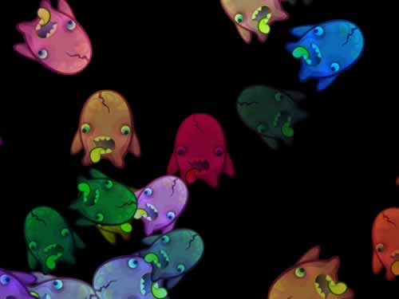
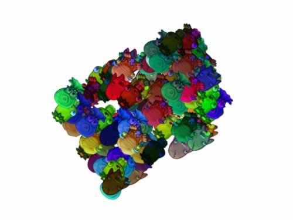
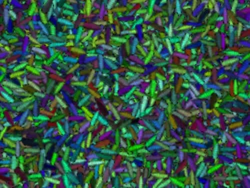

[link](https://pixijs.io/examples)

使用 `npx webpack-dev-server`

# 1. Container


# 2. Transparent Background


黄色背景为 HTML 的 `body`标签的背景色

```js
const sprite = PIXI.Sprite.from('A');
// 等同于以下的简写
const texture = PIXI.Texture.from('A');
const sprite = new PIXI.Sprite(texture);
```

# 3. Tinting




`sprite.tint`改变颜色

# 4. CacheAsBitmap



# 5. Particle Container



# 6. BlendModes


# 7. SimplePlane

