[link](https://pixijs.io/examples)

使用 `npx webpack-dev-server`

# DEMOS - BASIC

## Container


## Transparent Background

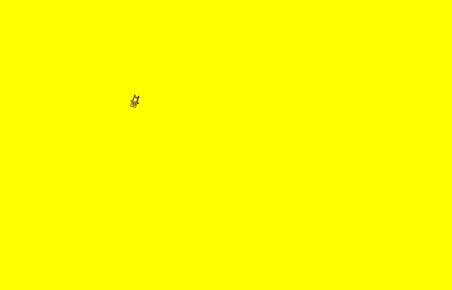

黄色背景为 HTML 的 `body`标签的背景色

```js
const sprite = PIXI.Sprite.from('A');
// 等同于以下的简写
const texture = PIXI.Texture.from('A');
const sprite = new PIXI.Sprite(texture);
```

## Tinting


`sprite.tint`改变颜色

## CacheAsBitmap


只有设置 `interactive = true`, 精灵才能触发鼠标事件.

## Particle Container


## BlendModes


## SimplePlane

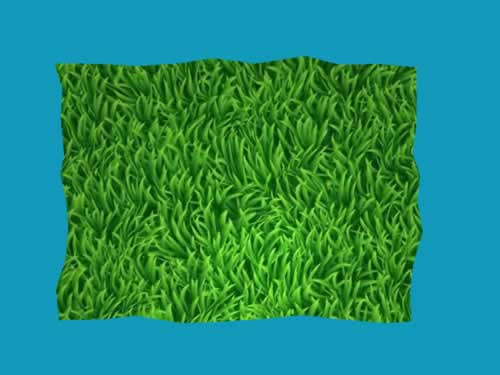

# DEMOS - ADVANCED

## Slots

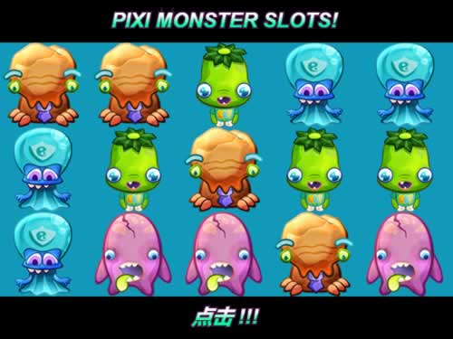

## Scratchcard

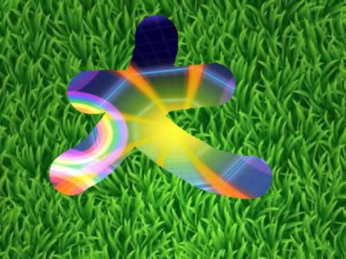

## Mouse Trail

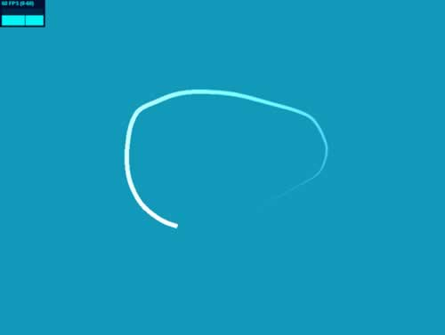

## Star Warp

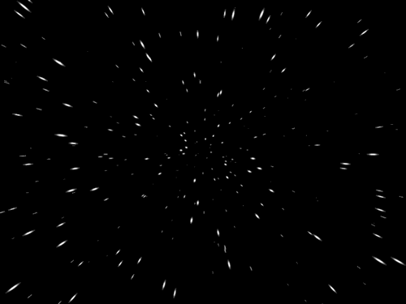

## Screenshot

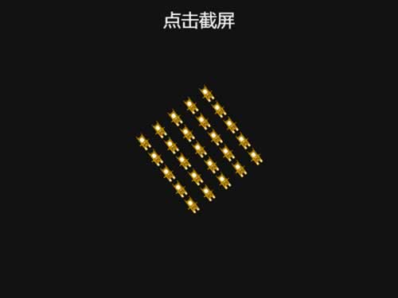

## Collision

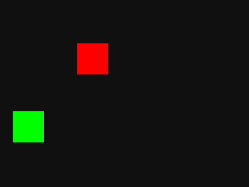

## Spinners

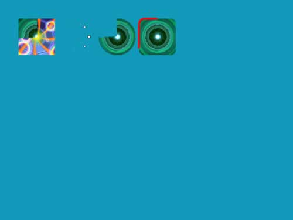

# SPRITE

## Basic

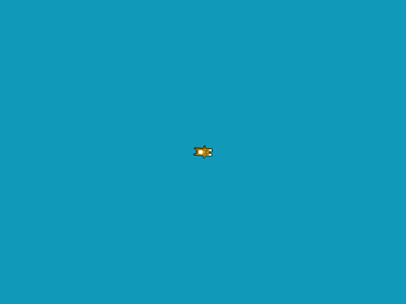

## Texture Swap

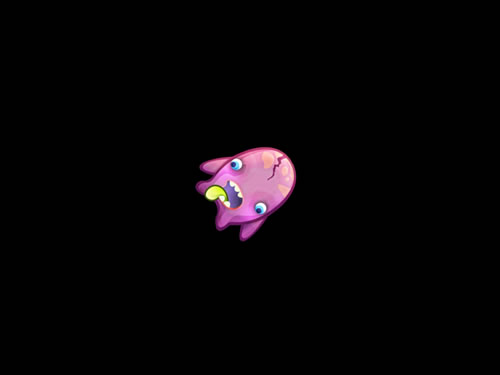

## Animated Sprite - Explosion

