[shadertoy](https://www.shadertoy.com)

| 类型      | 名称                  | 描述                                                         |
| --------- | --------------------- | ------------------------------------------------------------ |
| vec3      | iResolution           | 视口分辨率 (z 为 像素对应的实际像素, 默认为1)                |
| float     | iTime                 | 当前时间 (秒)                                                |
| float     | iTimeDelta            | Time it takes to render a frame, in seconds                  |
| int       | iFrame                | Current frame                                                |
| float     | iFrameRate            | Number of frames rendered per second                         |
| float     | iChannelTime[4]       | Time for channel (if video or sound), in seconds             |
| vec3      | iChannelResolution[4] | Input texture resolution for each channel                    |
| vec4      | iMouse                | xy = current pixel coords (if LMB is down). zw = click pixel |
| sampler2D | iChannel{i}           | Sampler for input textures i                                 |
| vec4      | iDate                 | Year, month, day, time in seconds in .xyzw                   |
| float     | iSampleRate           | The sound sample rate (typically 44100)                      |

`gl_FragCoord`


```bash
# 首次运行先生成 dll
npx webpack --config webpack.dll.config.js
# 开启 webpack 测试服务器
npx webpack-dev-server
```

# GLSL - API

| Syntax                         粗体为方法名(占位符占位符占位符占位符占位符占位符占位符占位符占位符占位符占位符占位符占位符占位符占位符占位符占位符占位符占位符) | Description                                                  |
| ------------------------------------------------------------ | ------------------------------------------------------------ |
| genType **pow**(genType x, genType y)                        | x的y次方. **如果x小于0, 结果为 undefined. 如果x=0且y<=0, 结果也是 undefined.** |
| genType **dFdx**(genType p)                                  | 偏导数. GPU 会同时跑片元着色器的多个实例, 但并不是一个像素一个像素去执行的. 而是会组织在2x2的一组pixels块中并行执行. 偏导数就是通过像素块中变量的差值(变化率)而计算出来的. dFdx 表示的是像素块中右边像素的值减去左边像素的值 |
| genType **dFdy**(genType p)                                  | 下面像素的值减去上面像素的值.                                |
| genType **fract**(genType x)                                 | 返回 x 的小数部分.                                           |
| genType **clamp**(genType x, genType minVal, genType maxVal) | 夹具函数, 取三个参数中中间值. **如果 minVal > maxVal, 返回 undefined.** |
|                                                              |                                                              |
|                                                              |                                                              |
|                                                              |                                                              |
|                                                              |                                                              |


# 1. Fovea detector

4dsXzM


# 2. yonatan fractal

tlyfzt


# 3. Trig-less Hash

WlyBRd


# 4. Creation by Silexars

XsXXDn


# 5. tiny

tiny


# 6. Flame

MdX3zr


# 7. Star Nest

XlfGRj


# 8. Fractal Land

XsBXWt


# 9. Curvature - Parametric 3D

XlfXR4


# 10. Elephant Ear Plants

XsVGzm


# 11. Isopleth

Mllfzl


# 12. Alloy Plated Voronoi

XdfyWM


# 13. Voronoi - smooth

ldB3zc


# 14. Seascape

Ms2SD1


# 15. Mystify Screensaver

MsKcRh

# 16. Ray Marching: Part 6

4tcGDr


# 17. HCL Color Range

MtjBWR


# 18. Very fast procedural ocean

MdXyzX


# 19. Planet #2

fdX3zr


# 20. Liberation of the True Self

tlGfzd


# 21. neuron 1512 "lol"

fdlGRH


# 22. Synthesis ideas

WlycRW


# 23. Fork MANO fract NikolaErce 337

sdX3zH


# 24. Fork Analys Cub NikolaErce 538

sdfGzH


# 25. Cellular noise collection

tlcBDs


# 26. font zoom explorer

NsXGz8


# 27. Layer Slice display

NdX3RH


# 28. ANU - Strategic Management

sdX3Rr


# 29. Fractal 38_gaz

fdfGR8


# 30. Tidal

NdXGRr


# 31. fractal pyramid

tsXBzS


# 32. Neural Stanford Bunny (5 kb)

wtVyWK


# 33. CineShader Lava

3sySRK


# 34. Cyber Fuji 2020

Wt33Wf


# 35. Phantom Star for CineShader

ttKGDt


# 36. DVD Bounce

wtcSzN


# 37. CineShader Test

wlVGWd


# 38. FWA logo

tt3XDn


# 39. Octagrams

tlVGDt


# 40. Planetary Soup

ttKBDd


# 41. Base warp fBM

tdG3Rd


# 42. Prism sdf,test

tlyBW3


# 43. GLSL ray tracing test

3sc3z4


# 44. Happy Jumping

3lsSzf


# 45. Bandlimited Synthesis 1

WtScDt


# 46. Raymarching - Primitives

Xds3zN


# 47. Plasma Globe

XsjXRm


# 48. Clouds

XslGRr


# 49. Auroras

XtGGRt


# 50. IQ_TUT: Greek Holiday 2021

fdl3z8


# 51. stretching white vs blue noise

fdsGz8


# 52. Fractal 39_gaz

sss3R8


# 53. Pencilvester's orthodoodle

wlyfWK


# 54. Extruded Truchet Pattern

ttVBzd


# 55. Faux Layered Extrusion

Wsc3Ds


# 56. 4.8^2 Truchet

MlyBRG


# 57. Snail

ld3Gz2


# 58. 3d simplex noise

XsX3zB


# 59. Noise Lab (3D)

4sc3z2


# 60. Hash without Sine

4djSRW


# 61. 4.6.12 Truchet

llyBRG


# 62. 4.6.12 Truchet Weave

WsyXWR


# 63. Diamond Octagon Truchet Pattern

wdBSRm


# 64. Hologram Boxes

3tX3R4


# 65. 4.8^2 Truchet Weave

3dVSRm


# 66. Integer Hash - I

llGSzw


# 67. Integer Hash - II

XlXcW4


# 68. Integer Hash - III

4tXyWN


# 69. Filtered grid (box, 2D)

XtBfzz


# 70. filtered checker (box, 2D)

XlcSz2


# 71. Filtered checker (box, 3D)

XlXBWs


# 72. Filtered checker (triangle, 3D)

llffWs


# 73. Filtered xor (box, 2D)

tdBXRW


# 74. Integrating a square wave

MtffWs


# 75. Phantom Mode

MtScWW

or

# 76. Palettes

ll2GD3


# 77. Bandlimited Synthesis 2

wtXfRH


# 78. Bandlimited fbm (box, 2D)

3tScWd


# 79. webgl2 grid noise

4tfyW4


# 80. Noise animation - 3D

XdfXRj


# 81. Noise - Value - 2D - Deriv

4dXBRH


# 82. Analytic Normals 2D

MdsSRs


# 83. Noise - Gradient - 2D - Deriv

XdXBRH


# 84. Noise - Value - 3D - Deriv

XsXfRH


# 85. Noise - Gradient - 3D - Deriv

4dffRH


# 86. Noise - value - 2D

lsf3WH


# 87. Noise - gradient - 2D

XdXGW8


# 88. Noise - value - 3D

4sfGzS


# 89. Noise - gradient - 3D

Xsl3Dl


# 90. Noise - simplex - 2D

Msf3WH


# 91. Noise - wave - 2D

tldSRj


# 92. interesting noise algorithm

wttSRj


# 93. Analytic Normals 3D

XttSz2


# 94. Voronoise

Xd23Dh


# 95. Voronoi - distances

ldl3W8


# 96. Voronoi - hierarchical

Xll3zX


# 97. Fractal 43_gaz

sssGWS


# 98. 7dsGWS

7dsGWS


# 99. Parallax view on Cineshader

wtdSR8


# 100. Will it blend

lsdGzN


# 101. 3d color space visualization

XddGRN


# 102. Smooth HSV

MsS3Wc


# 103. Cube lines

NslGRN


# 104. Bilinear Patch - intersection

ltKBzG


# 105. Strange Crystal

tsVXzh


# 106. Tubularity

WlffDn


# 107. Box - fake soft shadow

WslGz4


# 108. BUG Nvidia const to array

NslGR4

bug tested and works Nvidia 960 and 750, OpenGL and Vulkan

# 109. Box - intersection

ld23DV


# 110. Goursat - intersection

3lj3DW


# 111. Sphere4 - intersection

3tj3DW


# 112. Parallelogram - intersection

4tlBDs


# 113. Quad - intersection

XtlBDs


# 114. Triangle - intersection

MlGcDz


# 115. Torus - intersection

4sBGDy


# 116. Rounded Cone - intersection

MlKfzm


# 117. Rounded Box - intersection

WlSXRW


# 118. Disk - intersection

lsfGDB


# 119. Cone - intersection

llcfRf


# 120. Capsule - intersection

Xt3SzX


# 121. Box - occlusion clipping

4sSXDV


# 122. Box - occlusion

4djXDy


# 123. Triangle - occlusion

XdjSDy


# 124. Sphere - occlusion

4djSDy


# 125. Ellipsoid - occlusion

MlsSzn


# 126. Capsule - occlusion

llGyzG


# 127. Capsule - bounding box

3s2SRV


# 128. Box - fog density

Ml3GR8


# 129. Sphere - fog density

XljGDy


# 130. Box - gradient 2D

wlcXD2


# 131. Stained Lights

WlsSzM


# 132. Brush Experiment 3

ltj3Wc


# 133. Rainier mood

ldfyzl


# 134. Texture - Better Filtering

XsfGDn


# 135. Warping - procedural 2

lsl3RH


# 136. (no Music) - Pirates

ldXXDj


# 137. [SIG2014] - Total Noob

XdlSDs


# 138. edge glow

Mdf3zr

视频在网盘 shadertoy.zip


# 139. I/O

XsfGDS


# 140. Brush Experiment 2

lt23D3


# 141. Brush Smear

Xt2GWc


# 142. Grid Paper (+mouse)

4tj3DG


# 143. 2pic


# 144. 38911 BASIC BYTES FREE

MljGWG


# 145. Pixellated Plasma + mouse

4tjGWy


# 146. Floyd-Steinberg Dithering WIP

Xst3W7


# 147. 2D Primitive Distance Functions

XtjGzt


# 148. Hex Master 140ch

ltlSW4


# 149. Palette Quantization & Dithering

4ddGWr


# 150. Distance field drawing methods

ltBGzt


# 151. Quantization & Dithering 2

Xdt3Wr


# 152. Palettization + OrderedDithering

Xdt3Dr


# 153. website background #2

4st3DS


# 154. Neon Hypno Bands

MdcGW4


# 155. Backyard Starleaves

Mdyyzt


# 156. Time-o-matic

MlfXz8


# 157. Keep up little square

wlsXD2


# 158. Donuts can be beautiful too

wtfSW8


# 159. Disk - bounding box

ll3Xzf


# 160. Cylinder - bounding box

MtcXRf


# 161. Ellipse - bounding box

Xtjczw


# 162. Cone - bounding box

WdjSRK


# 163. Cubic Bezier - 2D BBox

XdVBWd


# 164. Quadratic Bezier - 3D

ldj3Wh


# 165. Quadratic Bezier - 2D BBox

lsyfWc


# 166. Box occlusion optimized

ttlBWf


# 167. HexTile Truchet Marching

WlByW3


# 168. Unstable Universe

wtlfz8


# 169. Clooud City

tt3Bz2


# 170. RME4 - Crater

MlSBDt


# 171. Purple Haze

XdSGWy


# 172. Sphere - soft shadow

4d2XWV


# 173. Triangulated Heightfield Trick

XlcBRX


# 174. Balls and shadows

lsSSWV


# 175. Repelling

XdjXWK


# 176. Ellipsoid - soft shadow

llsSzn


# 177. Capsule - soft shadow

MlGczG


# 178. Cylinder - intersection

4lcSRn


# 179. Hexprism - intersection

tljBWy


# 180. Hexagonal Grid Traversal - 3D

WtSfWK


# 181. Cylinder - distance

wdXGDr


# 182. Cone - distance

tsSXzK

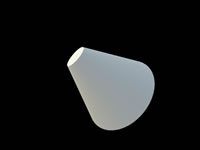

# 183. Hexagonal Grid Traversal - 2D

WtSBWK

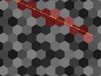

# 184. Quadratic Bezier Stroke

XsX3zf

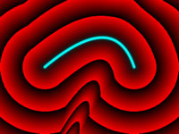

# 185. Cubic Bezier - 3D BBox

MdKBWt

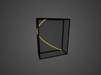

# 186. Quadratic Bezier - 3D BBox

tsBfRD

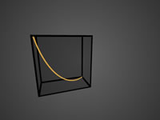

# 187. Bezier - Signed Distance

ltXSDB

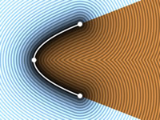

# 188. Magic Fractal

4ljGDd

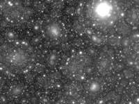

# 189. Hexagons - distance

Xd2GR3

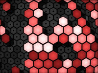

# 190. Triangle - distance 3D

4sXXRN

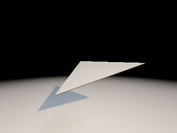

# 191. Triangle - closest

ttfGWl

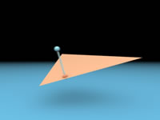

# 192. BUG Nvidia const to array min

Ndl3zr

bug Nvidia 750 OpenGL

# 193. 1D, 2D & 3D Value Noise

4dS3Wd

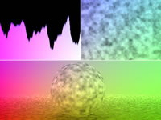

# 194. Triangle - distance 2D

XsXSz4

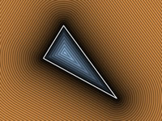

# 195. Triangle - Gradient Boundaries

tlKcDz

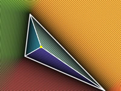

# 196. Quad - Gradient Boundaries

WlycWh

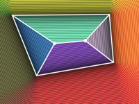

# 197. Inverse Bilinear

lsBSDm

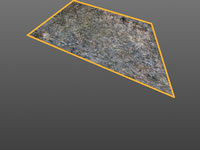

# 198. Day 61

WlKXRR

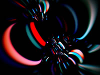

# 199. Circle - gradient 2D

WltSDj

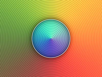

# 200. Subsurface lattice

wljSz1

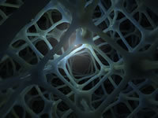

# 201. raymarching

tlKBRd

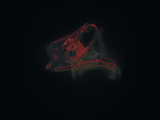

# 202. Fractal 35_gaz

wtKBRd

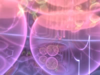

# 203. Tetrahedral Voxel Traversal

wtfXWB

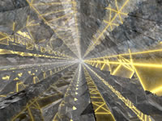

# 204. Rotating donut

fsSGWy

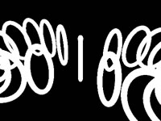

# 205. Simple DoF

wsXBRf

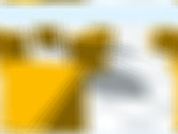

# 206. Red Crash - Procedural GFX

ssBGRG

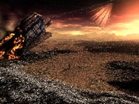

# 207. Verlet Spider!

ltjXzt


# 208. Fruxis (made in 2012)

ldl3zl


# 209. Soul - 22

NsjGRt


# 210. You Are Here

fdSGRy

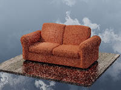

# 211. Fractal 51_gaz

7sB3Dy

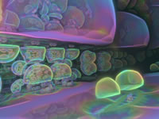

# 212. Spout

lsXGzH


# 213. Pie - gradient 2D

3tGXRc

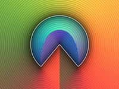

# 214. Arc - gradient 2D

WtGXRc

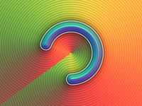

# 215. Isosceles Triangle - gradient 2D

3dyfDd

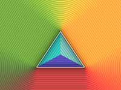

# 216. Triangle - gradient 2D

tlVyWh

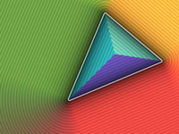

# 217. Quad - gradient 2D

WtVcD1

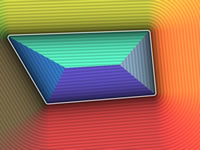

# 218. Cross - gradient 2D

WtdXWj

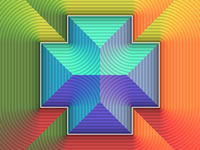

# 219. Segment - gradient 2D

WtdSDj

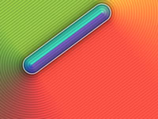

# 220. Hexagon - gradient 2D

WtySRc

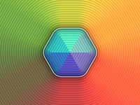

# 221. Vesica - gradient 2D

3lGXRc

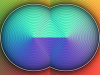

# 222. Smooth Minimum - gradient 2D

tdGBDt

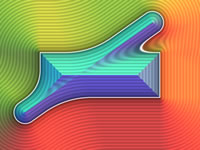

# 223. Parallelogram - gradient 2D

sssGzX

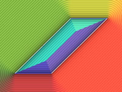

# 224. Shaderdough

4tc3WB

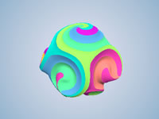

# 225. HG SDF in WebGL

Xs3GRB

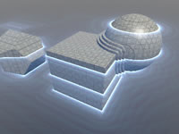

# 226. Icosahedron twist

Mtc3RX

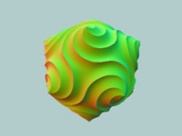

# 227. SDF Tutorial 1 : box & balloon

Xl2XWt


# 228. Remnant X

4sjSW1

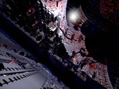

# 229. Cloud Ten

XtS3DD

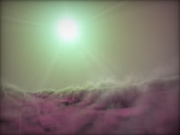

# 230. Spectacles

4lBXWt

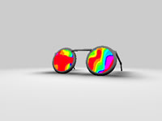

# 231. Voxel Edges

4dfGzs

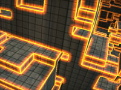

# 232. [NV15] Space Curvature

llj3Rz

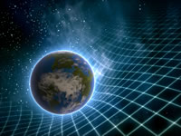

# 233. Menger Sponge

4sX3Rn

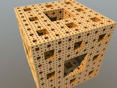

# 234. Monster

4sX3R2

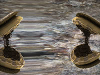

# 235. Ladybug

4tByz3

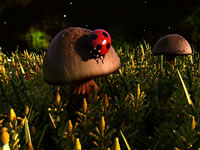

# 236. Hell

MdfGRX

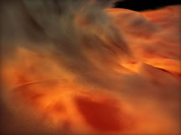

# 237. Mandelbrot - distance

lsX3W4

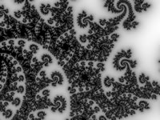

# 238. Flames

MsXGRf


# 239. Storm

Xd23zh


# 240. Heart - 2D

XsfGRn


# 241. Demo - Volumetric Lines

4slGz4


# 242. Fish swimming

ldj3Dm


# 243. Woods

XsfGD4


# 244. Bubbles

4dl3zn


# 245. Warping - procedural 1

4s23zz


# 246. Warping - procedural 4

MdSXzz


# 247. Arlo

4dtGWM


# 248. Texture variation II

lt2GDd


# 249. Bender

4slSWf


# 250. Analytic Motionblur 2D

MdSGDm


# 251. Parametric graph by curvature

Xlf3zl


# 252. Heart - 3D

4lK3Rc


# 253. Flower

4dlGD7


# 254. Input - Time

lsXGz8


# 255. Radial Blur

4sfGRn


# 256. Image - Audrey

4df3D8


# 257. Warping - texture

Xsl3zn


# 258. Deform - holes

4sXGzn


# 259. Weird Thing

XsB3Wc


# 260. Fourier - interpolation

4lGSDw


# 261. Sierpinski - 3D

4dl3Wl


# 262. Sunset

XssSRX


# 263. Stairway to Heaven Curve

4tfGRl


# 264. Xyptonjtroz

4ts3z2


# 265. The Gallery

XsSSzG


# 266. Cheap curvature

Xts3WM


# 267. Input - Mouse

Mss3zH


# 268. Input - TimeDelta & FPS

lsKGWV


# 269. Numbers

4sf3RN


# 270. Smaller Numbers

4sBSWW


# 271. Prints Numbers

lt3GRj


# 272. Fork Creation S gusandr 800

ssXXzn


# 273. Texture variation I

4tsGzf


# 274. digits/sliders/kbd widgets - 2

MdKGRw


# 275. digits/sliders/kbd widgets

lsXXzN


# 276. Digital clock

MdfGzf


# 277. 7 segment display (wip)

3dtSRj


# 278. Polyhedron DE

XtXGRS


# 279. Umbrellar

4t2SRh


# 280. Tribute - Journey!

ldlcRf


# 281. Elevated

MdX3Rr


# 282. TextCandy

4sfGRH


# 283. GLOW TUTORIAL

3s3GDn


# 284. Blackbody Lava

MdBSRW


# 285. Spectral Power Distribution

lsKczc


# 286. Days 480

7sXSz8


# 287. Test font spacing

MsfyDN


# 288. HSV and HSL

lsS3Wc


# 289. Flowing Lava

4djSzR


# 290. Triangulated Heightfield Trick 2

tlXSzB


# 291. Triangulated Heightfield Trick 3

ttsSzX


# 292. [SH17C] Surface Mesh Generation

MdSBRc


# 293. [2TC 15] Mystery Mountains

llsGW7


# 294. box & balloon Minimized

Xt2XDt


# 295. Sirenian Dawn

XsyGWV


# 296. Noise animation - Electric

ldlXRS


# 297. Ether

MsjSW3


# 298. Noise animation - Flow

MdlXRS


# 299. Noise animation - Lava

lslXRS


# 300. Fancy ties

ltfGDs


# 301. Fake glints

Md2Xzm


# 302. Magnetismic

XlB3zV


# 303. Fast edge detection

4s2XRd


# 304. Postcard

XdBSWd


# 305. Artistic shading

Xtj3Dm


# 306. Promethean

4tB3zV


# 307. Spherical polyhedra

4dBXWD


# 308. Sparse grid marching

XlfGDs


# 309. Overly satisfying

Mts3zM


# 310. Flaring

lsSGzy


# 311. Re-entry

4dGyRh


# 312. Dynamism

MtKSWW


# 313. Hyperlepsy

4lB3WV


# 314. Noise animation - Watery

MssSRS


# 315. String theory

XdSSz1


# 316. Graphing

MdjGRy


# 317. Neon parallax

XssXz4


# 318. Somewhere in 1993

Md2XDD


# 319. Music toolbox

MdfXW2


# 320. [2TC 15]2 Tweets Challenge

4tl3W8


# 321. Pustules

XdSXDc


# 322. Curvature average

XsfXzs


# 323. Oblivion

XtX3DH


# 324. Volumetric Helices

4sfXDs


# 325. Sphere mappings

4sjXW1


# 326. Quality hashes collection WebGL2

Xt3cDn


# 327. Cairo tiling

4ssSWf


# 328. [2TC 15]Results

Mtf3Rj


# 329. Koch Snowflake again

Mlf3RX


# 330. Shadertoy Discord server

tljGDh


# 331. Satellite's eye

4tX3Ws


# 332. Colorful tessellation

lslXDn


# 333. [2TC 15]Judging Begins

llXGzB


# 334. Checkerboard reconstruction

llXfzf


# 335. Parallax mapping

4lSGRh


# 336. Cathode

4lXcDH


# 337. Piecewise dragon

lsS3DD


# 338. HURA generator

MtlXD8


# 339. Day at the Lake

wl3czN


# 340. Myrror

XtdGDB


# 341. Triangulator

lllGRr


# 342. Derivative based AA

4sfSzf


# 343. Affine arithmetic 3d

lsfXzj


# 344. Moon voxels

tdlSR8


# 345. Cheap orthonormal basis

4sSSW3


# 346. 2D Voxels

4slXW7


# 347. Famous solid

ltlGWM


# 348. Orbit Noise

4t3yDn


# 349. Procedural Ordering

4dsXzj


# 350. Parametrics

XdSSRw


# 351. C64 Simulation

Mll3DH


# 352. Discs?

XslSWH


# 353. 3d Graphing

lsSXRD


# 354. Cheap Bezier palettes

MlVBDR


# 355. MandelOct

wlcfR8


# 356. 2D Folding

4tX3DS


# 357. Bit Packed Sprites

XtsGRl


# 358. Paper Kaleidoscope

ls3GRr


# 359. Yellow Manypus

ltB3RK


# 360. Superior easing

ltBGDD


# 361. Polyhedron again

XlX3zB


# 362. Honeycomb Pattern

ltXGWS


# 363. Bicubic/Biquadratic noise

XlVcWV


# 364. Filter reference

XtVcWc


# 365. Efficient Barycentric

lslXDf


# 366. Interval Arithmetic

lssSWH


# 367. 2D Vector Graphics Library

lslXW8


# 368. Ellipse - distance 2D

4sS3zz


# 369. Ellipse - distance 2D II

4lsXDN


# 370. Ellipse - distance 2D II No Trig

tttfzr


# 371. Ellipse - SDF (trigless, 3 iter)

tt3yz7


# 372. Ellipse Distance Comparison

wtfyWj


# 373. Pablo

fdfXDH


# 374. Onewarp

3dVczw


# 375. Fork UniverseWi JulianCode 354

7sXSz4


# 376. Ellipse - Distance III

MtXXW7


# 377. Log-Bisection Tracing

4sSXzD


# 378. runes

MsXSRn


# 379. Anisotropic Highlights

XdB3DG


# 380. Koch snowflake IFS

XsfXDH


# 381. [2TC 15] old skool 3d driving

XtlGW4


# 382. [2TC 15] Supernova

MtfGWN


# 383. [2TC 15] Venus

llsGWM


# 384. [2TC 15] Hall of kings

4tfGRB


# 385. [2TC 15] Flying

4ts3DH


# 386. [2TC 15] Night Forest

4lfGDM


# 387. [2TC 15] Cave

ltlGDN


# 388. [2TC 15] Minecraft

4tsGD7


# 389. Tokyo

Xtf3zn


# 390. Misty Lake

MsB3WR


# 391. Voxel Ambient Occlusion

ldl3DS


# 392. cheap sky simulation

ttSGzh


# 393. Canyon

MdBGzG


# 394. 1D Quadratic Dual Interpolation

WtXSR7


# 395. Tone mapping

lslGzl


# 396. Simplest Fastest 2D Hash

MdcfDj


# 397. Toolbox of Noisey Goodness

4dVBzz


# 398. 2D Weyl hash #1 (integer)

MsV3z3


# 399. 2D Weyl hash 32-bit XOR

4dlcR4


# 400. Hash without Sine 2 (WebGL 2)

XdGfRR


# 401. Watercolor painting

NdsXRB


# 402. hash: visualising bitplanes

lt2yDm


# 403. Terrain Tubes

4sjXzG


# 404. Protean clouds

3l23Rh


# 405. Rainforest

4ttSWf


# 406. Rhodium liquid carbon

llK3Dy


# 407. Simplicity Galaxy

MslGWN


# 408. Main Sequence Star

4dXGR4


# 409. Playing marble

MtX3Ws


# 410. The Drive Home

MdfBRX


# 411. Heartfelt

ltffzl


# 412. GLSL 2D Tutorials

Md23DV


# 413. 2D Clouds

4tdSWr


# 414. Cubescape

Msl3Rr


# 415. notebook drawings

XtVGD1


# 416. Goo

lllBDM


# 417. VolumetricIntegration

XlBSRz


# 418. Cloudy Terrain

MdlGW7


# 419. Perspex Web Lattice

Mld3Rn


# 420. Volumetric explosion

lsySzd


# 421. Supernova remnant

MdKXzc


# 422. Cheap Cloud Flythrough

Xsc3R4


# 423. Cloudy spikeball

MljXDw


# 424. Sample Pinning

XdfXzn


# 425. FakeVolumetricClouds

XlsXzN


# 426. Emission clouds

ltBXDm


# 427. Charmap

ldSBzd


# 428. Ball Of Fire

lsf3RH


# 429. The wave

lsj3Dw


# 430. Hash Functions for GPU Rendering

XlGcRh


# 431. Modified FNV-1A hash

WtdfRX


# 432. "Best" Integer Hash

WttXWX


# 433. Simplicity 3d

ls2SDd


# 434. Adaptive Sampling Diagram

llXSD7


# 435. Structured Vol Sampling

Mt3GWs


# 436. Simplicity

lslGWr


# 437. Dusty nebula 4

MsVXWW


# 438. Dusty nebula 3

lsVSRW


# 439. Protoplanetary disk

MdtGRl


# 440. Dusty nebula 1

4lSXD1


# 441. Alien Beacon

ld2SzK


# 442. Anatomy of an explosion

Xss3DS


# 443. Pyroclastic fireball

MtXSzS


# 444. weaved Voronoï

ltsXRM


# 445. UI easy to integrate

ldKSDm


# 446. Structured Sampling Diagram

ll3GWs


# 447. Rounded Box - distance 2D

4llXD7


# 448. 96-bit 8x12 Font

Mt2GWD


# 449. UI readable

XsySzG


# 450. Abstract Corridor

MlXSWX


# 451. Branchless Voxel Raycasting

4dX3zl


# 452. Bumped Sinusoidal Warp

4l2XWK


# 453. Geodesic tiling

llVXRd


# 454. Skyline

XtsSWs


# 455. plop

ltSSDV


# 456. plop 2

MlSSDV


# 457. Sculpture III

XtjSDK


# 458. Lit Sine Warp

Ml2XDV


# 459. hexagonal tiling

4d2GzV


# 460. Buoy

XdsGDB


# 461. [SH17C] Physically Based Shading

4sSfzK


# 462. Bricks Game

MddGzf


# 463. Tileable Water Caustic

MdlXz8


# 464. 2d signed distance functions

4dfXDn


# 465. Planet Shadertoy

4tjGRh


# 466. [SIG15] Mario World 1-1

XtlSD7


# 467. Generators

Xtf3Rn


# 468. Spherical Harmonics lighting

lt2GRD


# 469. Wet stone

ldSSzV


# 470. Atmospheric Scattering Sample

lslXDr


# 471. llamels

ltsGz4


# 472. Lens Flare Example

4sX3Rs


# 473. Flare Mania

lsBGDK


# 474. Water world

lslGDB


# 475. Floating Mountains

XsSGDy


# 476. Clouds and Sun With Flare

4sl3zl


# 477. musk's lens flare mod

XdfXRX


# 478. Digital Brain

4sl3Dr


# 479. furball

XsfGWN


# 480. Where the River Goes

Xl2XRW


# 481. Tiny Planet: Earth

lt3XDM


# 482. Himalayas

MdGfzh


# 483. Interstellar

Xdl3D2


# 484. Shadertoy

lslGDn


# 485. Hot Shower

4lf3Rj


# 486. Mostly Harmless

MdsGzr


# 487. VGA Mandelbrot

4lG3Wz


# 488. Implicit Curve Example

Xds3Dn


# 489. Volumetric Stanford Bunny

MdlyDs


# 490. Humanoid Silhouettes

4scBWN


# 491. jetstream

XlsGRs


# 492. HOWTO: Ray Marching

XllGW4


# 493. Noise Contour

MscSzf


# 494. galaxy3

Xsl3zX


# 495. Oceanic

4sXGRM


# 496. Mountains

4slGD4


# 497. Luminescence

4sXBRn


# 498. sound - acid jam

ldfSW2


# 499. The Universe Within

lscczl


# 500. Super simple raymarching example

4dSBz3


# 501. Crystal Skull

MsS3WV


# 502. ray/cone & ray/frustum

4s23DR


# 503. Hand-drawn Sketch

MsSGD1


# 504. Flux Core

ltlSWf


# 505. Empty Glass

4s2GDV


# 506. Menger Journey

Mdf3z7


# 507. Interactive thinks

Xt3SR4


# 508. Glitch transform

XtyXzW


# 509. Desert Canyon

Xs33Df


# 510. Grid of Cylinders

4dSGW1


# 511. Warped Extruded Skewed Grid

wtfBDf


# 512. Abstract Glassy Field

4ttGDH


# 513. Star Nursery

XsfGzH


# 514. Apollonian

4ds3zn


# 515. Fires

XsXSWS


# 516. Neon Lit Hexagons

MsVfz1


# 517. Greek Temple

ldScDh


# 518. attic

Mdl3Rr


# 519. Tree in the wind

tdjyzz


# 520. [SH16B] Speed Drive 80

4ldGz4


# 521. h e e e l i x

4sVczV


# 522. Frozen wasteland

Xls3D2


# 523. Noise blur

4dlGDN


# 524. starDust

4sSSWz


# 525. Then and Before - PC4k by Altair

3ddGzn


# 526. Hexagonal Maze Flow

llSyDh


# 527. Dolphin

4sS3zG


# 528. doski canady

ldS3Wm


# 529. Colored lines

tsBSWD


# 530. Circuits

XlX3Rj


https://www.shadertoy.com/results?query=&sort=love&from=132&num=12