[shadertoy](https://www.shadertoy.com)

| 类型      | 名称                  | 描述                                                         |
| --------- | --------------------- | ------------------------------------------------------------ |
| vec3      | iResolution           | 视口分辨率 (z 为 像素对应的实际像素, 默认为1)                |
| float     | iTime                 | 当前时间 (秒)                                                |
| float     | iTimeDelta            | Time it takes to render a frame, in seconds                  |
| int       | iFrame                | Current frame                                                |
| float     | iFrameRate            | Number of frames rendered per second                         |
| float     | iChannelTime[4]       | Time for channel (if video or sound), in seconds             |
| vec3      | iChannelResolution[4] | Input texture resolution for each channel                    |
| vec4      | iMouse                | xy = current pixel coords (if LMB is down). zw = click pixel |
| sampler2D | iChannel{i}           | Sampler for input textures i                                 |
| vec4      | iDate                 | Year, month, day, time in seconds in .xyzw                   |
| float     | iSampleRate           | The sound sample rate (typically 44100)                      |

`gl_FragCoord`

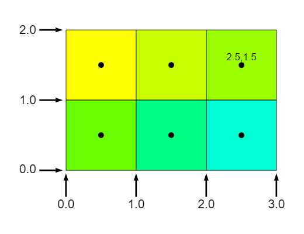

```bash
# 首次运行先生成 dll
npx webpack --config webpack.dll.config.js
# 开启 webpack 测试服务器
npx webpack-dev-server
```

# 1. Fovea detector

4dsXzM

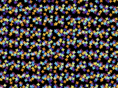

# 2. yonatan fractal

tlyfzt

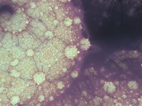

# 3. Trig-less Hash

WlyBRd

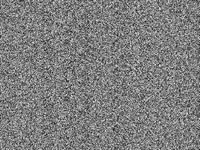

# 4. Creation by Silexars

XsXXDn

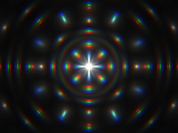

# 5. tiny

tiny

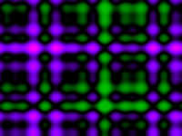

# 6. Flame

MdX3zr

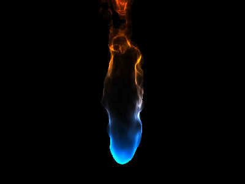

# 7. Star Nest

XlfGRj

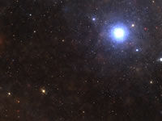

# 8. Fractal Land

XsBXWt

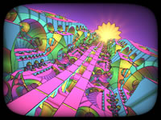

# 9. Curvature - Parametric 3D

XlfXR4

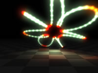

# 10. Elephant Ear Plants

XsVGzm

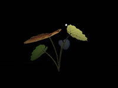

# 11. Isopleth

Mllfzl

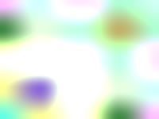

# 12. Alloy Plated Voronoi

XdfyWM

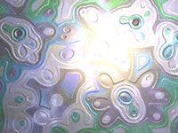

# 13. Voronoi - smooth

ldB3zc

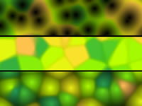

# 14. Seascape

Ms2SD1

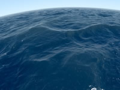

# 15. Mystify Screensaver

MsKcRh

# 16. Ray Marching: Part 6

4tcGDr

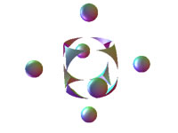

# 17. HCL Color Range

MtjBWR

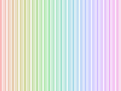

# 18. Very fast procedural ocean

MdXyzX

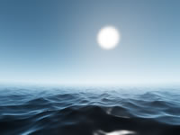

# 19. Planet #2

fdX3zr

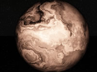

# 20. Liberation of the True Self

tlGfzd

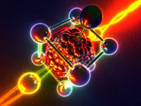

# 21. neuron 1512 "lol"

fdlGRH


# 22. Synthesis ideas

WlycRW

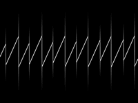

# 23. Fork MANO fract NikolaErce 337

sdX3zH

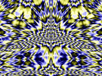

# 24. Fork Analys Cub NikolaErce 538

sdfGzH

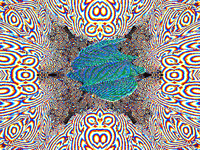

# 25. Cellular noise collection

tlcBDs

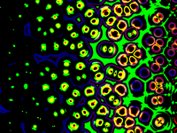

# 26. font zoom explorer

NsXGz8

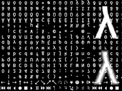

# 27. Layer Slice display

NdX3RH

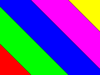

# 28. ANU - Strategic Management

sdX3Rr

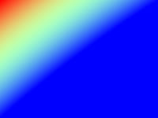

# 29. Fractal 38_gaz

fdfGR8

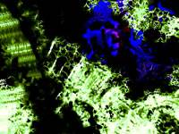

# 30. Tidal

NdXGRr

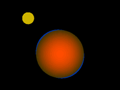

# 31. fractal pyramid

tsXBzS

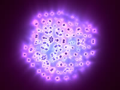

# 32. Neural Stanford Bunny (5 kb)

wtVyWK

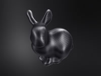

# 33. CineShader Lava

3sySRK

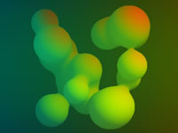

# 34. Cyber Fuji 2020

Wt33Wf

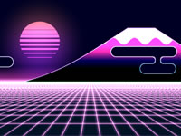

# 35. Phantom Star for CineShader

ttKGDt

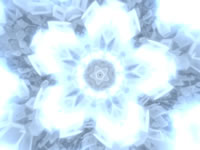

# 36. DVD Bounce

wtcSzN

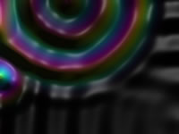

# 37. CineShader Test

wlVGWd

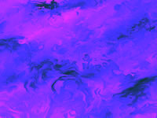

# 38. FWA logo

tt3XDn

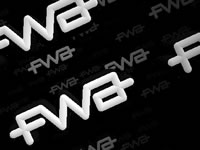

# 39. Octagrams

tlVGDt

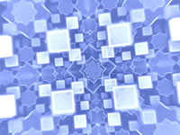

# 40. Planetary Soup

ttKBDd

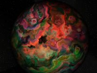

# 41. Base warp fBM

tdG3Rd

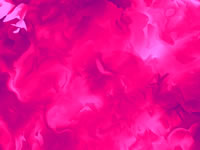

# 42. Prism sdf,test

tlyBW3

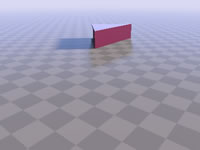

# 43. GLSL ray tracing test

3sc3z4

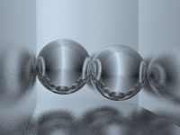

# 44. Happy Jumping

3lsSzf


# 45. Bandlimited Synthesis 1

WtScDt

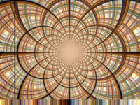

# 46. Raymarching - Primitives

Xds3zN

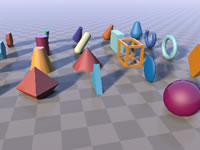

# 47. Plasma Globe

XsjXRm

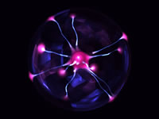

# 48. Clouds

XslGRr

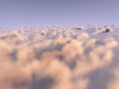

# 49. Auroras

XtGGRt

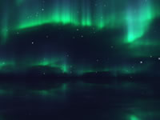

# 50. IQ_TUT: Greek Holiday 2021

fdl3z8

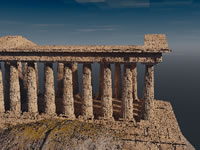

# 51. stretching white vs blue noise

fdsGz8

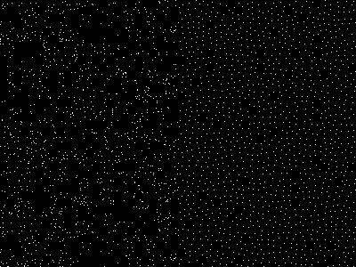

# 52. Fractal 39_gaz

sss3R8

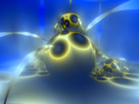

# 53. Pencilvester's orthodoodle

wlyfWK


# 54. Extruded Truchet Pattern

ttVBzd


# 55. Faux Layered Extrusion

Wsc3Ds


# 56. 4.8^2 Truchet

MlyBRG


# 57. Snail

ld3Gz2


# 58. 3d simplex noise

XsX3zB


# 59. Noise Lab (3D)

4sc3z2


# 60. Hash without Sine

4djSRW

