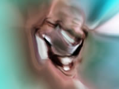

[shadertoy](https://www.shadertoy.com)

| 类型      | 名称                  | 描述                                                         |
| --------- | --------------------- | ------------------------------------------------------------ |
| vec3      | iResolution           | 视口分辨率 (z 为 像素对应的实际像素, 默认为1)                |
| float     | iTime                 | 当前时间 (秒)                                                |
| float     | iTimeDelta            | Time it takes to render a frame, in seconds                  |
| int       | iFrame                | Current frame                                                |
| float     | iFrameRate            | Number of frames rendered per second                         |
| float     | iChannelTime[4]       | Time for channel (if video or sound), in seconds             |
| vec3      | iChannelResolution[4] | Input texture resolution for each channel                    |
| vec4      | iMouse                | xy = current pixel coords (if LMB is down). zw = click pixel |
| sampler2D | iChannel{i}           | Sampler for input textures i                                 |
| vec4      | iDate                 | Year, month, day, time in seconds in .xyzw                   |
| float     | iSampleRate           | The sound sample rate (typically 44100)                      |

`gl_FragCoord`


```bash
# 首次运行先生成 dll
npx webpack --config webpack.dll.config.js
# 开启 webpack 测试服务器
npx webpack-dev-server
```

# GLSL - API

| Syntax                         粗体为方法名(占位符占位符占位符占位符占位符占位符占位符占位符占位符占位符占位符占位符占位符占位符占位符占位符占位符占位符占位符) | Description                                                  |
| ------------------------------------------------------------ | ------------------------------------------------------------ |
| genType **pow**(genType x, genType y)                        | x的y次方. **如果x小于0, 结果为 undefined. 如果x=0且y<=0, 结果也是 undefined.** |
| genType **dFdx**(genType p)                                  | 偏导数. GPU 会同时跑片元着色器的多个实例, 但并不是一个像素一个像素去执行的. 而是会组织在2x2的一组pixels块中并行执行. 偏导数就是通过像素块中变量的差值(变化率)而计算出来的. dFdx 表示的是像素块中右边像素的值减去左边像素的值 |
| genType **dFdy**(genType p)                                  | 下面像素的值减去上面像素的值.                                |
| genType **fract**(genType x)                                 | 返回 x 的小数部分.                                           |
| genType **clamp**(genType x, genType minVal, genType maxVal) | 夹具函数, 取三个参数中中间值. **如果 minVal > maxVal, 返回 undefined.** |
|                                                              |                                                              |
|                                                              |                                                              |
|                                                              |                                                              |
|                                                              |                                                              |


# 1. Fovea detector

4dsXzM


# 2. yonatan fractal

tlyfzt


# 3. Trig-less Hash

WlyBRd


# 4. Creation by Silexars

XsXXDn


# 5. tiny

tiny


# 6. Flame

MdX3zr


# 7. Star Nest

XlfGRj


# 8. Fractal Land

XsBXWt


# 9. Curvature - Parametric 3D

XlfXR4


# 10. Elephant Ear Plants

XsVGzm


# 11. Isopleth

Mllfzl


# 12. Alloy Plated Voronoi

XdfyWM


# 13. Voronoi - smooth

ldB3zc


# 14. Seascape

Ms2SD1


# 15. Mystify Screensaver

MsKcRh

# 16. Ray Marching: Part 6

4tcGDr


# 17. HCL Color Range

MtjBWR


# 18. Very fast procedural ocean

MdXyzX


# 19. Planet #2

fdX3zr


# 20. Liberation of the True Self

tlGfzd


# 21. neuron 1512 "lol"

fdlGRH



# 22. Synthesis ideas

WlycRW


# 23. Fork MANO fract NikolaErce 337

sdX3zH


# 24. Fork Analys Cub NikolaErce 538

sdfGzH


# 25. Cellular noise collection

tlcBDs


# 26. font zoom explorer

NsXGz8


# 27. Layer Slice display

NdX3RH


# 28. ANU - Strategic Management

sdX3Rr


# 29. Fractal 38_gaz

fdfGR8


# 30. Tidal

NdXGRr


# 31. fractal pyramid

tsXBzS


# 32. Neural Stanford Bunny (5 kb)

wtVyWK


# 33. CineShader Lava

3sySRK


# 34. Cyber Fuji 2020

Wt33Wf


# 35. Phantom Star for CineShader

ttKGDt


# 36. DVD Bounce

wtcSzN


# 37. CineShader Test

wlVGWd


# 38. FWA logo

tt3XDn


# 39. Octagrams

tlVGDt


# 40. Planetary Soup

ttKBDd


# 41. Base warp fBM

tdG3Rd


# 42. Prism sdf,test

tlyBW3


# 43. GLSL ray tracing test

3sc3z4


# 44. Happy Jumping

3lsSzf


# 45. Bandlimited Synthesis 1

WtScDt


# 46. Raymarching - Primitives

Xds3zN


# 47. Plasma Globe

XsjXRm


# 48. Clouds

XslGRr


# 49. Auroras

XtGGRt


# 50. IQ_TUT: Greek Holiday 2021

fdl3z8


# 51. stretching white vs blue noise

fdsGz8


# 52. Fractal 39_gaz

sss3R8


# 53. Pencilvester's orthodoodle

wlyfWK


# 54. Extruded Truchet Pattern

ttVBzd


# 55. Faux Layered Extrusion

Wsc3Ds


# 56. 4.8^2 Truchet

MlyBRG


# 57. Snail

ld3Gz2


# 58. 3d simplex noise

XsX3zB


# 59. Noise Lab (3D)

4sc3z2


# 60. Hash without Sine

4djSRW


# 61. 4.6.12 Truchet

llyBRG


# 62. 4.6.12 Truchet Weave

WsyXWR


# 63. Diamond Octagon Truchet Pattern

wdBSRm


# 64. Hologram Boxes

3tX3R4


# 65. 4.8^2 Truchet Weave

3dVSRm


# 66. Integer Hash - I

llGSzw


# 67. Integer Hash - II

XlXcW4


# 68. Integer Hash - III

4tXyWN


# 69. Filtered grid (box, 2D)

XtBfzz


# 70. filtered checker (box, 2D)

XlcSz2


# 71. Filtered checker (box, 3D)

XlXBWs


# 72. Filtered checker (triangle, 3D)

llffWs


# 73. Filtered xor (box, 2D)

tdBXRW


# 74. Integrating a square wave

MtffWs


# 75. Phantom Mode

MtScWW

or

# 76. Palettes

ll2GD3


# 77. Bandlimited Synthesis 2

wtXfRH


# 78. Bandlimited fbm (box, 2D)

3tScWd


# 79. webgl2 grid noise

4tfyW4


# 80. Noise animation - 3D

XdfXRj


# 81. Noise - Value - 2D - Deriv

4dXBRH


# 82. Analytic Normals 2D

MdsSRs


# 83. Noise - Gradient - 2D - Deriv

XdXBRH


# 84. Noise - Value - 3D - Deriv

XsXfRH


# 85. Noise - Gradient - 3D - Deriv

4dffRH


# 86. Noise - value - 2D

lsf3WH


# 87. Noise - gradient - 2D

XdXGW8


# 88. Noise - value - 3D

4sfGzS


# 89. Noise - gradient - 3D

Xsl3Dl


# 90. Noise - simplex - 2D

Msf3WH


# 91. Noise - wave - 2D

tldSRj


# 92. interesting noise algorithm

wttSRj


# 93. Analytic Normals 3D

XttSz2


# 94. Voronoise

Xd23Dh


# 95. Voronoi - distances

ldl3W8


# 96. Voronoi - hierarchical

Xll3zX


# 97. Fractal 43_gaz

sssGWS


# 98. 7dsGWS

7dsGWS


# 99. Parallax view on Cineshader

wtdSR8


# 100. Will it blend

lsdGzN


# 101. 3d color space visualization

XddGRN


# 102. Smooth HSV

MsS3Wc


# 103. Cube lines

NslGRN


# 104. Bilinear Patch - intersection

ltKBzG


# 105. Strange Crystal

tsVXzh


# 106. Tubularity

WlffDn


# 107. Box - fake soft shadow

WslGz4


# 108. BUG Nvidia const to array

NslGR4

bug tested and works Nvidia 960 and 750, OpenGL and Vulkan

# 109. Box - intersection

ld23DV


# 110. Goursat - intersection

3lj3DW


# 111. Sphere4 - intersection

3tj3DW


# 112. Parallelogram - intersection

4tlBDs


# 113. Quad - intersection

XtlBDs


# 114. Triangle - intersection

MlGcDz


# 115. Torus - intersection

4sBGDy


# 116. Rounded Cone - intersection

MlKfzm


# 117. Rounded Box - intersection

WlSXRW


# 118. Disk - intersection

lsfGDB


# 119. Cone - intersection

llcfRf


# 120. Capsule - intersection

Xt3SzX


# 121. Box - occlusion clipping

4sSXDV


# 122. Box - occlusion

4djXDy


# 123. Triangle - occlusion

XdjSDy


# 124. Sphere - occlusion

4djSDy


# 125. Ellipsoid - occlusion

MlsSzn


# 126. Capsule - occlusion

llGyzG


# 127. Capsule - bounding box

3s2SRV


# 128. Box - fog density

Ml3GR8


# 129. Sphere - fog density

XljGDy


# 130. Box - gradient 2D

wlcXD2


# 131. Stained Lights

WlsSzM


# 132. Brush Experiment 3

ltj3Wc


# 133. Rainier mood

ldfyzl


# 134. Texture - Better Filtering

XsfGDn


# 135. Warping - procedural 2

lsl3RH


# 136. (no Music) - Pirates

ldXXDj


# 137. [SIG2014] - Total Noob

XdlSDs


# 138. edge glow

Mdf3zr

视频在网盘 shadertoy.zip


# 139. I/O

XsfGDS


# 140. Brush Experiment 2

lt23D3


# 141. Brush Smear

Xt2GWc


# 142. Grid Paper (+mouse)

4tj3DG


# 143. 2pic


# 144. 38911 BASIC BYTES FREE

MljGWG


# 145. Pixellated Plasma + mouse

4tjGWy


# 146. Floyd-Steinberg Dithering WIP

Xst3W7


# 147. 2D Primitive Distance Functions

XtjGzt


# 148. Hex Master 140ch

ltlSW4


# 149. Palette Quantization & Dithering

4ddGWr


# 150. Distance field drawing methods

ltBGzt


# 151. Quantization & Dithering 2

Xdt3Wr


# 152. Palettization + OrderedDithering

Xdt3Dr


# 153. website background #2

4st3DS


# 154. Neon Hypno Bands

MdcGW4


# 155. Backyard Starleaves

Mdyyzt


# 156. Time-o-matic

MlfXz8


# 157. Keep up little square

wlsXD2


# 158. Donuts can be beautiful too

wtfSW8


# 159. Disk - bounding box

ll3Xzf


# 160. Cylinder - bounding box

MtcXRf


# 161. Ellipse - bounding box

Xtjczw


# 162. Cone - bounding box

WdjSRK


# 163. Cubic Bezier - 2D BBox

XdVBWd


# 164. Quadratic Bezier - 3D

ldj3Wh


# 165. Quadratic Bezier - 2D BBox

lsyfWc


# 166. Box occlusion optimized

ttlBWf


# 167. HexTile Truchet Marching

WlByW3


# 168. Unstable Universe

wtlfz8


# 169. Clooud City

tt3Bz2


# 170. RME4 - Crater

MlSBDt


# 171. Purple Haze

XdSGWy


# 172. Sphere - soft shadow

4d2XWV


# 173. Triangulated Heightfield Trick

XlcBRX


# 174. Balls and shadows

lsSSWV


# 175. Repelling

XdjXWK


# 176. Ellipsoid - soft shadow

llsSzn


# 177. Capsule - soft shadow

MlGczG


# 178. Cylinder - intersection

4lcSRn


# 179. Hexprism - intersection

tljBWy


# 180. Hexagonal Grid Traversal - 3D

WtSfWK


# 181. Cylinder - distance

wdXGDr

