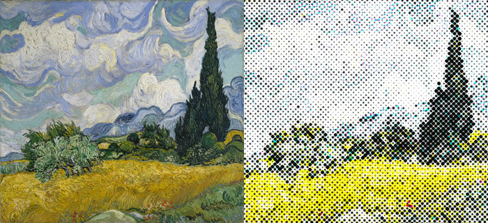
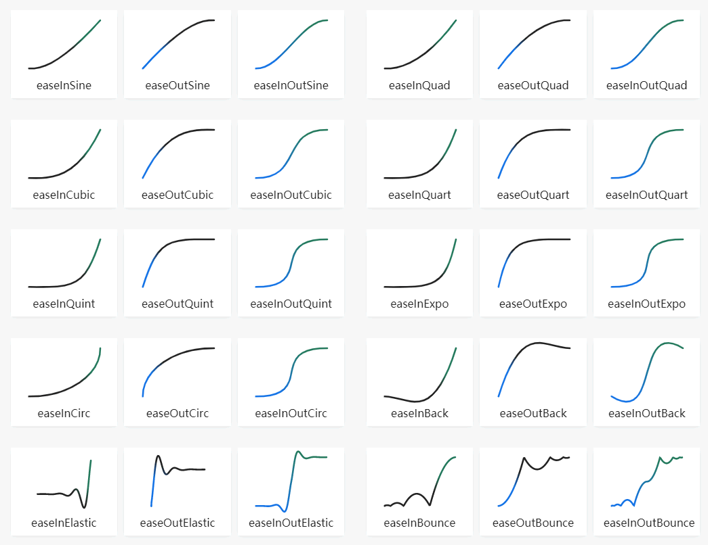

[link](https://thebookofshaders.com/)

```glsl
// Author @patriciogv - 2015
// http://patriciogonzalezvivo.com

#ifdef GL_ES
precision mediump float;
#endif

#define PI 3.1415926535
#define HALF_PI 1.57079632679

uniform vec2 u_resolution;
uniform float u_time;

uniform sampler2D u_tex0;
uniform vec2 u_tex0Resolution;

float speedMoon = 0.01;
float speedSun = 0.25;

vec3 sphereNormals(in vec2 uv) {
    uv = fract(uv)*2.0-1.0;
    vec3 ret;
    ret.xy = sqrt(uv * uv) * sign(uv);
    ret.z = sqrt(abs(1.0 - dot(ret.xy,ret.xy)));
    ret = ret * 0.5 + 0.5;
    return mix(vec3(0.0), ret, smoothstep(1.0,0.98,dot(uv,uv)) );
}

vec2 sphereCoords(vec2 _st, float _scale){
    float maxFactor = sin(1.570796327);
    vec2 uv = vec2(0.0);
    vec2 xy = 2.0 * _st.xy - 1.0;
    float d = length(xy);
    if (d < (2.0-maxFactor)){
        d = length(xy * maxFactor);
        float z = sqrt(1.0 - d * d);
        float r = atan(d, z) / 3.1415926535 * _scale;
        float phi = atan(xy.y, xy.x);

        uv.x = r * cos(phi) + 0.5;
        uv.y = r * sin(phi) + 0.5;
    } else {
        uv = _st.xy;
    }
    return uv;
}

vec4 sphereTexture(in sampler2D _tex, in vec2 _uv) {
    vec2 st = sphereCoords(_uv, 1.0);

    float aspect = u_tex0Resolution.y/u_tex0Resolution.x;
    st.x = fract(st.x*aspect + u_time*speedMoon);

    return texture2D(_tex, st);
}

void main(){
    vec2 st = gl_FragCoord.xy/u_resolution.xy;
    vec3 color = vec3(1.0);

    color *= sphereTexture(u_tex0, st).rgb;

    // Calculate sun direction
    vec3 sunPos = normalize(vec3(cos(u_time*speedSun-HALF_PI),0.0,sin(speedSun*u_time-HALF_PI)));
    vec3 surface = normalize(sphereNormals(st)*2.0-1.0);

    // Add Shadows
    color *= dot(sunPos,surface);

    // Blend black the edge of the sphere
    float radius = 1.0-length( vec2(0.5)-st )*2.0;
    color *= smoothstep(0.001,0.05,radius);

    color = 1.0-color;

    gl_FragColor = vec4(color,1.0);
}

```

# The Book of Shaders

## 0. Introduction (关于这本书)

### 0.1 引言



上面两幅图是由不同的方式制成的. 第一张是梵高一层一层徒手画出来的, 需要花费些时间. 第二张则是用 4个像素矩阵分秒钟生成的: 一个青色, 一个品红, 一个黄色, 和一个黑色矩阵. 关键的区别在于第二张图是用非序列方式实现的 (即不是一步一步实现, 而是多个同时进行).

这本书是关于这个革命性的计算机技术, 片段着色器 (fragment shaders), 它将数字生成的图像提到了新的层次. 你可以把它看做当年的古腾堡印刷术.

```glsl
// Author: tsone
// https://www.shadertoy.com/view/Mdf3Dn

#ifdef GL_ES
precision mediump float;
#endif

#define DOTSIZE 1.48
#define D2R(d) radians(d)
#define MIN_S 07.5
#define MAX_S 15.0
#define SPEED 0.3

#define SST 0.888
#define SSQ 0.288

uniform sampler2D u_tex0;
uniform vec2 u_resolution;
uniform vec2 u_mouse;
uniform float u_time;

vec2 ORIGIN = 0.5*u_resolution.xy;
float S = MIN_S+(MAX_S-MIN_S)*(0.5-0.5*cos(SPEED*u_time));
float R = SPEED*0.333*u_time;

vec4 rgb2cmyki (in vec4 c) {
    float k = max(max(c.r,c.g),c.b);
    return min(vec4(c.rgb/k,k),1.0);
}

vec4 cmyki2rgb (in vec4 c) {
    return vec4(c.rgb*c.a,1.0);
}

vec2 px2uv (in vec2 px) {
    return vec2(px/(u_resolution.xy*vec2(1.0,2.0))-vec2(1.0,0.0) );
}

vec2 grid (in vec2 px) {
    return px-mod(px,S);
}

vec4 ss(in vec4 v) {
    return smoothstep(SST-SSQ,SST+SSQ,v);
}

vec4 halftone (in vec2 fc,in mat2 m) {
    vec2 smp = (grid(m*fc)+0.5*S)*m;
    float s = min(length(fc-smp)/(DOTSIZE*0.5*S),1.0);
    vec4 c = rgb2cmyki(texture2D(u_tex0,px2uv(smp+ORIGIN)));
    return c+s;
}

mat2 rotm (in float r) {
    float cr = cos(r);
    float sr = sin(r);
    return mat2(
        cr,-sr,
        sr,cr
    );
}

void main() {
    vec2 st = gl_FragCoord.xy/u_resolution.xy;

    if (st.x > 0.5) {
        R = 3.14-(u_mouse.y/u_resolution.y)*(3.14/180.);
        S = 12.0-(u_mouse.x/u_resolution.x)*7.0;

        vec2 fc = gl_FragCoord.xy*2.0-ORIGIN;
        mat2 mc = rotm(R+D2R(15.0));
        mat2 mm = rotm(R+D2R(75.0));
        mat2 my = rotm(R);
        mat2 mk = rotm(R+D2R(45.0));

        float k = halftone(fc,mk).a;
        vec4 c = cmyki2rgb(ss(vec4(
            halftone(fc,mc).r,
            halftone(fc,mm).g,
            halftone(fc,my).b,
            halftone(fc,mk).a
        )));

        gl_FragColor = c;
    } else {
        st = vec2(st.x,st.y*0.5)*2.0;
        gl_FragColor = texture2D(u_tex0,st);
    }


}

```

fragment shaders (片断着色器) 可以让你控制像素在屏幕上的快速渲染. 这就是它在各种场合被广泛使用的原因, 从手机的视频滤镜到酷炫的 3D视频游戏.

### 0.2 这本书是为谁而写的 ?

这本书是写给有代码经验和线性代数、三角学的基本知识的创意编程者、游戏开发者和工程师, 还有那些想要提升他们的作品的图像质量到一个令人激动的新层次的人.

这本书会教你如何使用 shaders(着色器) 并把它整合进你的项目里, 以提升作品的表现力和图形质量. 因为 GLSL(OpenGL 的绘制语言) 的 shaders 在很多平台都可以编译和运行, 你将可以把在这里学的运用到任何使用 OpenGL, OpenGL ES 和 WebGl 的环境中.

### 0.3 这本书包含哪些内容 ?

这本书专门关于 GLSL pixel shaders. 首先我们会给出 shaders 的定义; 然后我们会学习如何制作程序里的形状, 图案, 材质, 和与之相关的动画. 你将会学到基础的着色语言并把它们应用到有用的情景中. 比如: 图像处理 (图像运算, 矩阵卷积, 模糊, 颜色滤镜, 查找表及其他效果) 和模拟 (Conway 的生命游戏, Gray-Scott 反应扩散, 水波, 水彩效果, Voronoi 细胞等等). 到书的最后我们将看到一系列基于光线追踪 (Ray Marching) 的进阶技术.

这本书里不包括的内容有:

- 这不是一本 openGL 或 webGL 的书. OpenGL / webGL 是一个比 GLSL 或 fragment shaders 更大的主题. 如果你想要学习 openGL / webGL 推荐看: 《OpenGL Introduction, the 8th edition of the OpenGL Programming Guide》(也被叫做红宝书)或《WebGL: Up and Running》.
- 这不是一本数学书. 虽然我们会涉及到很多关于线代和三角学的算法和技术, 但我们不会详细解释它. 关于数学的问题我推荐手边备一本: 《3rd Edition of Mathematics for 3D Game Programming and computer Graphics》或《2nd Edition of Essential Mathematics for Games and Interactive Applications》.

## 1. Getting started (开始)

### 1.1 什么是 fragment shader (片断着色器) ?

在之前的章节我们把 shaders 和古腾堡印刷术相提并论. 为什么这样类比呢? 更重要的是, 什么是 shader ?

如果你曾经有用计算机绘图的经验, 你就知道在这个过程中你需要画一个圆, 然后一个长方形, 一条线, 一些三角形... 直到画出你想要的图像. 这个过程很像用手写一封信或一本书 —— 都是一系列的指令, 需要你一件一件完成.

Shaders 也是一系列的指令, 但是这些指令会对屏幕上的每个像素同时下达. 也就是说, 你的代码必须根据像素在屏幕上的不同位置执行不同的操作. 就像活字印刷, 你的程序就像一个 function (函数), 输入位置信息, 输出颜色信息, 当它编译完之后会以相当快的速度运行.

### 1.2 为什么 shaders 运行特别快 ?

为了回答这个问题, 不得不给大家介绍并行处理 (parallel processing) 的神奇之处.

想象你的 CPU 是一个大的工业管道, 然后每一个任务都是通过这个管道的某些东西 (就像一个生产流水线那样). 有些任务要比别的大, 也就是说要花费更多时间和精力去处理. 我们就称它要求更强的处理能力. 由于计算机自身的架构, 这些任务需要串行, 即一次一个地依序完成. 现代计算机通常有一组四个处理器, 就像这个管道一样运行, 一个接一个地处理这些任务, 从而使计算机流畅运行. 每个管道通常被称为线程.

视频游戏和其他图形应用比起别的程序来说, 需要高得多的处理能力. 因为它们的图形内容需要操作无数像素. 想想看, 屏幕上的每一个像素都需要计算, 而在 3D游戏中几何和透视也都需要计算.

让我们回到开始那个关于管道和任务的比喻. 屏幕上的每个像素都代表一个最简单的任务. 单独来看完成任何一个像素的任务对 CPU 来说都很容易, 那么问题来了, 屏幕上的每个像素都需要解决这样的小任务! 也就是说, 哪怕是对于一个老式的屏幕 (分辨率 800X600) 来说, 都需要每帧处理 480000个像素, 即每秒进行 14400000次计算! 是的, 这对于 CPU 就是大问题了! 而对于一个现代的 2800X1800 视网膜屏, 每秒运行 60帧, 就需要每秒进行 311040000 次计算. 图形工程师是如何解决这个问题的?

这个时候, 并行处理就是最好的解决方案. 比起用三五个强大的微处理器 (或者说管道) 来处理这些信息, 用一大堆小的微处理器来并行计算, 就要好得多. 这就是图形处理器 (GPU: Graphic Processor Unit)的来由.

设想一堆小型微处理器排成一个平面的画面, 假设每个像素的数据是乒乓球. 14400000个乒乓球可以在一秒内阻塞几乎任何管理. 但是一面 800X600 的管道墙, 每秒接收30波 480000个像素的信息就可以流畅完成. 这在更高的分辨率下也是成立的, 并行的处理器越多, 可以处理的数据流就越大.

另一个 GPU 的魔法是特殊数学函数可以通过硬件加速. 非常复杂的数学操作可以直接被微芯片解决, 而无须通过软件. 这就表示可以有更快的三角和矩阵运算——和电流一样快.

### 1.3 GLSL 是什么 ?

GLSL 代表 OpenGL Shading Language, OpenGL 着色语言, 这是你在接下来章节看到的程序所遵循的具体标准. 根据硬件和操作系统的不同, 还有其他的着色器 (shaders). 这里我们将依照 [Khronos Group](https://www.khronos.org/opengl/) 的规则来执行. 了解 OpenGL 的历史将有助于你理解大多数奇怪的约定, 所以建议不妨阅读 [OpenGLBook](https://openglbook.com/chapter-0-preface-what-is-opengl.html).

### 1.4 为什么 Shaders 有名地不好学 ?

就像蜘蛛侠里的那句名言, 能力越大责任越大, 并行计算也是如此. GPU 的强大的架构设计也有其限制与不足.

为了能使许多管线并行运行, 每一个线程必须与其他的相独立. 我们称这些线程对于其他线程在进行的运算是"盲视"的. 这个限制就会使得所有数据必须以相同的方向流动. 所以就不可能检查其他线程的输出结果, 修改输入的数据, 或者是把一个线程的输出结果输入给另一个线程. 如果允许线程到线程的数据流动将使所有的数据面临威胁.

并且 GPU 会让所有并行的微处理器 (管道们) 一直处在忙碌状态: 只要它们一有空闲就会接到新的信息. 一个线程不可能知道它前一刻在做什么. 它可能是在画操作系统界面上的一个按钮, 然后渲染了游戏中的一部分天空, 然后显示一封 email 中的一些文字. 每个线程不仅是"盲视"的, 而且还是"无记忆"的. 同时, 它要求编写一个通用的规则, 依据像素在不同位置依次输出不同的结果. 这种抽象性, 和盲视, 无记忆的限制使得 shaders 在程序员新手中不是很受欢迎.

## 2. Hello World

"Hello world!" 通常都是学习一个新语言的第一个例子. 这是一个非常简单, 只有一行的程序. 它既是一个热情的欢迎, 也传达了编程所能带来的可能性.

然而在 GPU 的世界里, 第一步就渲染一行文字太难了, 所以我们改为选择一个鲜艳的欢迎色.

```glsl
#ifdef GL_ES
precision mediump float;
#endif

uniform float u_time;

void main() {
    gl_FragColor = vec4(1.0, 0.0, 1.0, 1.0);
}
```

尽管这几行简单的代码看起来不像有很多内容, 我们还是可以据此推测出一些知识点:

1. shader 语言有一个 `main`函数, 会在最后返回颜色值. 这点和 C 语言很像.
2. 最终的像素颜色取决于预设的全局变量 `gl_FragColor`.
3. 这个类 C 语言有内建的变量 (像 `gl_FragColor`), 函数和数据类型. 在本例中我们刚刚介绍了 `vec4`(四分量浮点向量). 之后我们会见到更多的类型, 像 `vec3`(三分量浮点向量) 和 `vec2`(二分量浮点向量), 还有非常著名的 `float`(单精度浮点型), `int`(整型) 和 `bool`(布尔型).
4. 如果我们仔细观察 `vec4`类型, 可以推测这四个变元分别响应红, 绿, 蓝和透明度通道. 同时我们也可以看到这些变量是规范化的, 意思是它们的值是从 0到 1的. 之后我们会学习如何规范化变量, 使得在变量间 map(映射)数值更加容易.
5. 另一个可以从本例看出来的很重要的类 C语言特征是, 预处理程序的宏指令. 宏指令是预编译的一部分. 有了宏才可以 `#define`(定义)全局变量和进行一些基础的条件运算 (通过使用 `#ifdef`和 `#endif`). 所有的宏都以#开头. 预编译会在编译前一刻发生, 把所有的命令复制到 `#defines`里, 检查 `#ifdef`条件句是否已被定义, `#ifdef`条件句是否没有被定义. 在我们刚刚的 "hello world!" 的例子中, 我们在第2行检查了 `GL_ES`是否被定义, 这个通常用在移动端或浏览器的编译中.
6. `float`类型在 shaders 中非常重要, 所以精度非常重要. 更低的精度会有更快的渲染速度, 但是会以质量为代价. 你可以选择每一个浮点值的精度. 在第一行 `precision mediump float;`就是用来设定了所有的浮点值都是中等精度. 我们也可以选择把这个值设为"低"(`precision lowp float;`)或者"高"(`precision highp float;`).
7. 最后可能也是最重要的细节是, GLSL语言规范并不保证变量会被自动转换类别. 这句话是什么意思呢? 显卡的硬件制造商各有不同的显卡加速方式, 但是却被要求有最精简的语言规范. 因而, 自动强制类型转换并没有包括在其中. 在我们的 "hello world!"例子中, `vec4`精确到单精度浮点, 所以应被赋予 `float`格式. 但是如果你想要代码前后一致, 不要之后花费大量时间 debug 的话, 最好养成在 float 型数值里加一个 `.`的好习惯.

```glsl
void main() {
    gl_FragColor = vec4(1, 0, 0, 1); // 可能出错
}
```

接下来可以试试一些好玩的小点子:

- 把单精度浮点值换成整型数值, 猜猜你的显卡能不能容忍这个行为.

- 试试把第八行注释掉, 不给函数赋任何像素的值.

- 尝试另外写个函数, 返回某个颜色, 然后在 `main()`里面使用这个函数. 

  ```glsl
  vec4 red() {
      return vec4(1.0, 0.0, 0.0, 1.0);
  }
  ```

- 有很多种构造 `vec4`类型的方式, 试试看其他方式.

  ```glsl
  vec4 color = vec4(vec3(1.0, 0.0, 1.0), 1.0);
  ```

尽管这个例子看起来不那么刺激, 它却是最最基础的 —— 我们把画布上的每一个像素都改成了一个确切的颜色. 在接下来的章节中我们将会看到如何用两种输入源来改变像素的颜色: 空间(依据像素在屏幕上的位置) 和时间 (依据页面加载了多少秒).

## 3. Uniforms

现在我们知道了 GPU 如何处理并行线程, 每个线程负责给完整图像的一部分配置颜色. 尽管每个线程和其他线程之间不能有数据交换, 但我们能从 CPU 给每个线程输入数据. 因为显卡的架构, 所有线程的输入值必须统一 (uniform), 而且必须设为只读. 也就是说, 每条线程接收相同的数据, 并且是不可改变的数据.

这些输入值叫做 `uniform`(统一值), 它们的数据类型通常为: `float, vec2, vec3, vec4, mat2, mat3, mat4, sampler2D, samplerCube`. uniform 值需要数值类型前后一致. 且在 shader 的开头, 在设定精度之后, 就对其进行定义.

```glsl
#ifdef GL_ES
precision mediump float;
#endif

uniform vec2 u_resolution; // 画布尺寸 (宽, 高)
uniform vec2 u_mouse; // 鼠标位置 (在屏幕上哪个像素)
uniform float u_time; // 时间 (加载后的秒数)
```

你可以把 uniforms 想象成连通 GPU 和 CPU 的许多小的桥梁. 虽然这些 uniforms 的名字千奇百怪, 但是在这一系列的例子中我们会一直用: `u_time`(时间), `u_resolution`(画面尺寸) 和 `u_mouse`(鼠标位置). 按业界传统应在 uniform 值的名字前加 u_, 这样一看即知是 uniform. 但也会有一些其他命名方式, 比如在 shadertoy 就用了如下的名字:

```glsl
uniform vec3 iResolution; // 视口分辨率 (以像素计)
uniform vec4 iMouse; // 鼠标坐标 xy: 当前位置, zw: 点击位置
uniform float iTime; // shader 运行时间 (以秒计)
```

现在来实际操作一下 uniform, 在下面的代码中我们使用 `u_time`加上一个 `sin`函数, 来展示图中红色的动态变化.

```glsl
#ifdef GL_ES
precision mediump float;
#endif

uniform float u_time;

void main() {
    gl_FragColor = vec4(abs(sin(u_time)), 0.0, 0.0, 1.0);
}
```

GLSL 还有更多惊喜. GPU 的硬件加速支持我们使用角度, 三角函数和指数函数.

接下来可以尝试:

- 降低颜色变化的速率, 直到肉眼都看不出来.
- 加速变化, 直到颜色静止不动.
- 玩一玩 RGB 三个通道, 分别给三个颜色不同的变化速度, 看看能不能做出有趣的效果.

**gl_FragCoord**

就像 GLSL 有个默认输出值 `vec4 gl_FragColor`一样, 它也有一个默认输入值 (`vec4 gl_FragCoord`). `gl_FragCoord`存储了活动线程正在处理的像素或屏幕碎片的坐标. 有了它我们就知道了屏幕上的哪一个线程正在运转. 为什么我们不叫 `gl_FragCoord` uniform (统一值)呢? 因为每个像素的坐标都不同, 所以我们把它叫做 varying (变化值).

```glsl
#ifdef GL_ES
precision mediump float;
#endif

uniform vec2 u_resolution;
uniform vec2 u_mouse;
uniform float u_time;

void main() {
    vec2 st = gl_FragCoord.xy / u_resolution;
    gl_FragColor = vec4(st.x, st.y, 0.0, 1.0);
}
```

上述代码中我们用 `gl_FragCoord.xy`除以 `u_resolution`, 对坐标进行了规范化. 这样做是为了使所有的值都落在 0.0 到 1.0 之间, 这样就可以轻松把 X 或 Y 的值映射到红色或绿色通道.

在 shader 的领域我们没有太多要 debug 的, 更多地是试着给变量赋一些很炫的颜色, 试图做出一些效果. 有时你会觉得用 GLSL 编程就像是把一艘船放到了瓶子里. 同等地困难, 美丽而令人满足.

现在我们来检验一下我们对上面代码的理解程度:

- 你明白 `(0.0, 0.0)`坐标在画布上的哪里吗?
- 那 `(1.0, 0.0), (0.0, 1.0), (0.5, 0.5), (1.0, 1.0)`呢?
- 你知道如何用未规范化 (normalized) 的 `u_mouse`吗? 你可以用它来移动颜色吗?
- 你可以用 `u_time`和 `u_mouse`来改变颜色的图案吗? 不妨琢磨一些有趣的途径.

## 4. Running your shader (运行你的 shader)

现在你可能跃跃欲试, 想在你熟悉的平台上小试牛刀了. 接下来会有一些比较流行的平台的示例代码, 展示如何在这些平台上配置 shader.

注释1: 如果你不想用这些平台来运行 shader, 且你想在浏览器外使用 shader, 你可以下载 [glslViewer](https://github.com/patriciogonzalezvivo/glslViewer). 这个 MacOS + 树莓派程序直接在终端运行, 并且是为本书的例子量身打造的.

注释2: 如果你想用 WebGL 显示 shader, 并不关心其他平台, 你可以用 [glslCanvas](https://github.com/patriciogonzalezvivo/glslCanvas).

### 4.1 Three.js

为人谦逊而非常有才华的 Ricardo Cabello (也就是 [MrDoob](https://twitter.com/mrdoob))和许多贡献者一起搭了可能是 WebGL 最知名的平台, [Three.js](https://threejs.org/). 你可以找到无数程序示例, 教程, 书籍, 教你如何用这个 JavaScript 库做出酷炫的 3D 图像.

```html
<body>
    <div id="container"></div>
    <script src="js/three.min.js"></script>
    <script id="vertexShader" type="x-shader/x-vertex">
    	void main() {
    		gl_Position = vec4(position, 1.0);
    	}
    </script>
    <script id="fragmentShader" type="x-shader/x-fragment">
    	uniform vec2 u_resolution;
    	uniform float u_time;
    	void main() {
    		vec2 st = gl_FragCoord.xy / u_resolution.xy;
    		gl_FragColor = vec4(st.x, st.y, 0.0, 1.0);
    	}
    </script>
    <script>
    	var container;
        var camera, scene, renderer;
        var uniforms;
        
        init();
        animate();
        
        function init() {
            container = document.getElementById('container');
            
            camera = new THREE.Camera();
            camera.position.z = 1;
            
            scene = new THREE.Scene();
            
            var geometry = new THREE.PlaneBufferGeometry(2, 2);
            
            uniforms = {
                u_time: { type: 'f', value: 1.0 },
                u_resolution: { type: 'v2', value: new THREE.Vector2() }
            };
            
            var material = new THREE.ShaderMaterial({
                uniforms,
                vertexShader: document.getElementById('vertexShader').textContent,
                fragmentShader: document.getElementById('fragmentShader').textContent
            });
            
            var mesh = new THREE.Mesh(geometry, material);
            scene.add(mesh);
            
            renderer = new THREE.WebGLRenderer();
            renderer.setPixelRatio(window.devicePixelRatio);
            
            container.appendChild(renderer.domElement);
            
            onWindowResize();
            window.addEventListener('resize', onWIndowResize, false);
        }
        
        function onWindowResize(event) {
            renderer.setSize(window.innerWidth, window.innerHeight);
            uniforms.u_resolution.value.x = renderer.domElement.width;
            uniforms.u_resolution.value.y = renderer.domElement.height;
        }
        
        function animate() {
            requestAnimationFrame(animate);
            render();
        }
        
        function render() {
            uniforms.u_time.value += 0.05;
            renderer.render(scene, camera);
        }
    </script>
</body>
```

### 4.2 Processing

2001年由 [Ben Fry](http://benfry.com/) 和 [Casey Reas](http://reas.com/) 创建, [Processing](https://processing.org/) 是一个极其简约而强大的环境, 非常适合初尝代码的人. 关于 OpenGL 和视频, Andres Colubri 为 Processing 平台做了很重要的更新, 使得环境非常友好, 玩 GLSL shader 比起以前大大容易了. 

```js
PShader shader;

void setup() {
    size(640, 360, P2D);
    noStroke();
    
    shader = loadShader('shader.frag');
}

void draw() {
    shader.set('u_resolution', float(width), float(height));
    shader.set('u_mouse', float(mouseX), float(mouseY));
    shader.set('u_time', millis() / 1000.0);
    shader(shader);
    rect(0, 0, width, height);
}
```

在 2.1 版之前的版本运行 shader, 需要在你的 shader 文件开头添加以下代码: `#define PROCESSING_COLOR_SHADER`, 所以 shader.frag 应该看起来是这样:

```glsl
#ifdef GL_ES
precision mediump float;
#endif

#define PROCESSING_COLOR_SHADER

uniform vec2 u_resolution;
uniform vec3 u_mouse;
uniform float u_time;

void main() {
    vec2 st = gl_FragCoord.st / u_resolution;
    gl_FragColor = vec4(st.x, st.y, 0.0, 1.0);
}
```

### 4.3 openFrameworks

[这个](https://openframeworks.cc/) C++ 框架打包了 OpenGL 和其他开源 C++ 库. 在很多方面它和 Processing 非常像, 但是明显和 C++ 编译器打交道一定比较麻烦.

```c++
void ofApp::draw() {
    ofShader shader;
    shader.load("", "shader.frag");
    
    shader.begin();
    shader.setUniform1f("u_time", ofGetElapsedTimef());
    shader.setUniform2f("u_resolution", ofGetWidth(), ofGetHeight());
    ofRect(0, 0, ofGetWidth(), ofGetHeight());
    shader.end();
}
```

## 5. Algorithmic drawing (算法绘画)

### 5.1 造型函数

这一章应该叫做宫城先生的粉刷课 (来自电影《龙威小子》的经典桥段). 之前我们把规范化后的 x,y 坐标映射(map)到了红色和绿色通道. 本质上说我们是建造了这样一个函数: 输入一个二维向量 (x, y), 然后返回一个四维向量 (r, g, b, a). 但在我们跨维度转换数据之前, 我们先从更加...简单的开始. 我们来建一个只有一维变量的函数. 你花越多的时间和精力在这上面, 你的 shader 功夫就越厉害.

接下来的代码结构就是我们的基本功. 在它之中我们对规范化的 x 坐标(st.x) 进行可视化. 有两种途径: 一种是用亮度 (度量从黑色到白色的渐变过程), 另一种是在顶层绘制一条绿色的线 (在这种情况下 x 被直接赋值给 y).

```glsl
#ifdef GL_ES
precision mediump float;
#endif

uniform vec2 u_resolution;
uniform vec2 u_mouse;
uniform float u_time;

float plot(vec2 st) {
    return smoothstep(0.02, 0.0, abs(st.y - st.x));
}

void main() {
    vec2 st = gl_FragCoord.xy / u_resolution.xy;
    
    float y = st.x;
    vec3 color = vec3(y);
    
    float pct = plot(st);
    color = (1.0 - pct) * color + pct * vec3(0.0, 1.0, 0.0);
    
    gl_FragColor = vec4(color, 1.0);
}
```

这些代码就是你的基本功; 遵守和理解它非常重要. 你将会一遍又一遍地回到 0.0 到 1.0 这个区间. 你将会掌握融合与构建这些代码的艺术.

这些 x 与 y(或亮度)之前一对一的关系称作**线性插值**(linear interpolation) (插值是离散函数逼近的重要方法, 利用它可通过函数在有限个点处的取值状态, 估算出函数在其他点处的近似值. 因为对计算机来说, 屏幕像素是离散的而不是连续的, 计算机图形学常用插值来填充图像像素之间的空隙.) 现在起我们可以用一些数学函数来改造这些代码行. 比如说我们可以做一个求 x 的 5次幂的曲线.

```glsl
#ifdef GL_ES
precision mediump float;
#endif

#define PI 3.14159265359

uniform vec2 u_resolution;
uniform vec2 u_mouse;
uniform float u_time;

float plot(vec2 st, float pct) {
    return smoothstep(pct - 0.02, pct, st.y) - smoothstep(pct, pct + 0.02, st.y);
}

void main() {
    vec2 st = gl_FragCoord.xy / u_resolution;
    
    float y = pow(st.x, 5.0);
    
    vec3 color = vec3(y);
    
    float pct = plot(st, y);
    color = (1.0 - pct) * color + pct * vec3(0.0, 1.0, 0.0);
    
    gl_FragColor = vec4(color, 1.0);
}
```

试着把指数 (pow)改为不同的值, 比如: 20.0, 2.0, 1.0, 0.0, 0.2 或 0.02. 理解值和指数之间的关系非常重要. 这些数学函数可以让你灵动地控制你的代码, 就像是给数据做针灸一样.

`pow()`(求 x 的 y 次幂) 是 GLSL 的一个原生函数, GLSL 有很多原生函数. 大多数原生函数都是硬件加速的, 也就是说如何你正确使用这些函数, 你的代码就会跑得更快.

另外可以试着换掉幂函数, 试试看 `exp()`(以自然常数 e 为底的指数函数), `log()`(对数函数) 和 `sqrt()`(平方根函数). 另外还可以利用宏定义的 PI 来使用某些方程.

### 5.2 step 和 smoothstep

GLSL 还有一些独特的原生插值函数可以被硬件加速.

`step()`插值函数需要输入两个参数. 第一个是极限或阈值, 第二个是我们想要检测或通过的值. 对任何小于阈值的值, 返回 0.0, 大于阈值, 则返回 1.0.

另一个 GLSL 的特殊函数是 `smoothstep()`. 当给定一个范围的上下限和一个数值, 这个函数会在已有的范围内给出插值. 前两个参数规定转换的开始和结束点, 第三个是给出一个值用来插值.

### 5.3 正弦和余弦函数

当你想用数学来制造动效, 形态或去混合数值, sin 和 cos 就是你的最佳伙伴.

这两个基础的三角形函数是构造圆的极佳工具. 很重要的一点是你需要知道他们是如何运转的, 还有如何把它们结合起来. 简单来说, 当我们给出一个角度 (这里采用弧度制), 它就会返回半径为1的圆上一个点的 x 坐标(cos) 和 y 坐标(sin). 正因为 sin 和 cos 返回的是规范化的值 (即值域在 -1 和 1 之间), 且如此流畅, 这就使得它成为一个极其强大的工具.


尽管描述三角函数和圆的关系是一件蛮困难的事情, 上图动画很棒地做到了这点, 视觉化展现了它们之间的关系.

```glsl
y = sin(x); // 平滑地在 y 轴 +1 和 -1 之间变化
y = sin(x + u_time); // sin 曲线随着时间在 x 轴动了起来
y = sin(x * PI); // sin 曲线每两个整数循环一次
y = sin(x * u_time); // 循环变得越来越频繁, 当 u_time 非常大时, 图像将难以辨认
y = sin(x) + 1.; // 曲线向上整体移动了
y = sin(x) * 2.; // 曲线增大了两倍
y = abs(sin(x)); // 弹力球的轨迹
y = fract(sin(x)); // 只取小数部分
y = ceil(sin(x)); // 向正无穷取整, 使得 sin 曲线变成只有 1 和 -1 的电子波
y = floor(sin(x)); // 向负无穷取整, 使得 sin 曲线变成只有 1 和 -1 的电子波
```

### 5.4 其他有用的函数

```glsl
y = mod(x, 0.5); // 返回 x 对 0.5 取模的值
y = fract(x); // 仅返回小数部分
y = ceil(x); // 向正无穷取整
y = floor(x); // 向负无穷取整
y = sign(x); // 提取 x 的正负号
y = abs(x); // 返回 x 的绝对值
y = clamp(x, 0.0, 1.0); // 把 x 的值限制在 0.0 到 1.0 之间
y = min(0.0, x); // 返回 x 和 0.0 中的较小值
y = max(0.0, x); // 返回 x 和 0.0 中的较大值
```

### 5.5 造型函数进阶

[Golan Levin](http://www.flong.com/) 写过关于更加复杂的造型函数的文档, 非常有帮助. 把它们引入 GLSL 是非常明智的选择, 这将是你的代码的广阔的素材库.

- [多项式造型函数](http://www.flong.com/archive/texts/code/shapers_poly/) (Polynomial Shaping Functions)
- [指数造型函数](http://www.flong.com/archive/texts/code/shapers_exp/) (Exponential Shaping Functions)
- [圆与椭圆的造型函数](http://www.flong.com/archive/texts/code/shapers_circ/) (Circular & Elliptical Shaping Functions)
- [贝塞尔和其他参数化造型函数](http://www.flong.com/archive/texts/code/shapers_bez/) (Bezier and Other Parametric Shaping Functions)

就像厨师自主选择辣椒和各种原料, 数字艺术家和创意编程者往往钟情于使用他们自己的造型函数.

[Iñigo Quiles](http://www.iquilezles.org/) 收集了一套[有用的函数](https://www.iquilezles.org/www/articles/functions/functions.htm).

- Almost Identity 1

  ```glsl
  float almostIdentity(float x, float m, float n) {
      if(x > m) return x;
      float a = 2.0 * n - m;
      float b = 2.0 * m - 3.0 * n;
      float t = x / m;
      return (a * t + b) * t * t + n;
  }
  // y = almostIdentity(st.x, 1.0, 0.0);
  ```

- Almost Identity 2

  ```glsl
  float almostIdentity(float x, float n) {
      return sqrt(x * x + n);
  }
  // y = almostIdentity(st.x, 0.01);
  ```

- Almost Unit Identity

  ```glsl
  float almostUnitIdentity(float x) {
      return x * x * (2.0 - x);
  }
  // y = almostUnitIdentity(st.x);
  ```

- Smoothstep Integral

  ```glsl
  float integralSmoothstep(float x, float T) {
      if(x > T) return x - T / 2.0;
      return x * x * x * (1.0 - x * 0.5 / T) / T / T;
  }
  // y = integralSmoothstep(st.x, 0.5);
  ```

- Exponential Impulse

  ```glsl
  float impulse(float x, float k) {
      float h = k * x;
      return h * exp(1.0 - h);
  }
  // y = impulse(st.x, 12.0);
  ```

- Polynomial Impulse

  ```glsl
  float quaImpulse(float k, float x) {
      return 2.0 * sqrt(k) * x / (1.0 + k * x * x);
  }
  // y = quaImpulse(st.x, 0.5);
  
  float polyImpulse(float k, float n, float x) {
      return (n / (n - 1.0)) * pow((n - 1.0) * k, 1.0 / n) * x / (1.0 + k * pow(x, n));
  }
  // y = polyImpulse(1.0, 3.14, st.x);
  ```

- Sustained Impulse

  ```glsl
  float expSustainedImpulse(float x, float f, float k) {
      float s = max(x - f, 0.0);
      return min(x * x / (f * f), 1.0 + (2.0 / f) * s * exp(-k * s));
  }
  // y = expSustainedImpulse(st.x, 1.0, 0.0);
  ```

- Cubic Pulse

  ```glsl
  float cubicPulse(float c, float w, float x) {
      x = abs(x - c);
      if(x > w) return 0.0;
      x /= w;
      return 1.0 - x * x * (3.0 - 2.0 * x);
  }
  // y = cubicPulse(0.5, 0.2, st.x);
  ```

- Exponential Step

  ```glsl
  float expStep(float x, float k, float n) {
      return exp(-k * pow(x, n));
  }
  // y = expStep(st.x, 10.0, 1.0);
  ```

- Gain

  ```glsl
  float gain(float x, float k) {
      float a = 0.5 * pow(2.0 * ((x < 0.5) ? x : 1.0 - x), k);
      return (x < 0.5) ? a : 1.0 - a;
  }
  // y = gain(st.x, 2.0);
  ```

- Parabola

  ```glsl
  float parabola(float x, float k) {
      return pow(4.0 * x * (1.0 - x), k);
  }
  // y = parabola(st.x, 1.0);
  ```

- Power Curve

  ```glsl
  float pcurve(float x, float a, float b) {
      float k = pow(a + b, a + b) / (pow(a, a) * pow(b, b));
      return k * pow(x, a) * pow(1.0 - x, b);
  }
  // y = pcurve(st.x, 3.0, 1.0);
  ```

- Sinc curve

  ```glsl
  float sinc(float x, float k) {
      float a = PI * (k * x - 1.0);
      return sin(a) / a;
  }
  // y = sinc(st.x, 10.0);
  ```

### 5.6 练习


来看看 [Kynd](http://www.kynd.info/log/) 帮大家制作的公式表. 看他如何结合各种函数及它们的属性, 始终控制值的范围在 0.0 到 1.0.

```glsl
float curve(float x) {
    return 1.0 - pow(abs(x), 0.5);
    return 1.0 - pow(abs(x), 1.0);
    return 1.0 - pow(abs(x), 1.5);
    return 1.0 - pow(abs(x), 2.0);
    return 1.0 - pow(abs(x), 2.5);
    return 1.0 - pow(abs(x), 3.0);
    return 1.0 - pow(abs(x), 3.5);
    //
    return pow(cos(PI * x / 2.0), 0.5);
    return pow(cos(PI * x / 2.0), 1.0);
    return pow(cos(PI * x / 2.0), 1.5);
    return pow(cos(PI * x / 2.0), 2.0);
    return pow(cos(PI * x / 2.0), 2.5);
    return pow(cos(PI * x / 2.0), 3.0);
    //
    return 1.0 - pow(abs(sin(PI * x / 2.0)), 0.5);
    return 1.0 - pow(abs(sin(PI * x / 2.0)), 1.0);
    return 1.0 - pow(abs(sin(PI * x / 2.0)), 1.5);
    return 1.0 - pow(abs(sin(PI * x / 2.0)), 2.0);
    return 1.0 - pow(abs(sin(PI * x / 2.0)), 2.5);
    return 1.0 - pow(abs(sin(PI * x / 2.0)), 3.0);
    //
    return pow(min(cos(PI * x / 2.0), 1.0 - abs(x)), 0.5);
    return pow(min(cos(PI * x / 2.0), 1.0 - abs(x)), 1.0);
    return pow(min(cos(PI * x / 2.0), 1.0 - abs(x)), 1.5);
    return pow(min(cos(PI * x / 2.0), 1.0 - abs(x)), 2.0);
    return pow(min(cos(PI * x / 2.0), 1.0 - abs(x)), 2.5);
    return pow(min(cos(PI * x / 2.0), 1.0 - abs(x)), 3.0);
    //
    return 1.0 - pow(max(0.0, abs(x) * 2.0 - 1.0), 0.5);
    return 1.0 - pow(max(0.0, abs(x) * 2.0 - 1.0), 1.0);
    return 1.0 - pow(max(0.0, abs(x) * 2.0 - 1.0), 1.5);
    return 1.0 - pow(max(0.0, abs(x) * 2.0 - 1.0), 2.0);
    return 1.0 - pow(max(0.0, abs(x) * 2.0 - 1.0), 2.5);
    return 1.0 - pow(max(0.0, abs(x) * 2.0 - 1.0), 3.0);
}

float y = fn(1.0 - (st.x * 2.0));
```

**填充你的工具箱**

这里有一些工具可以帮你更轻松地可视化这些函数.

- Grapher: 如果你是 MacOS 系统, 用 spotlight 搜 grapher 就会看到这个超级方便的工具了.
- [GraphToy](https://graphtoy.com/): 仍然是 [Iñigo Quilez](http://www.iquilezles.org/) 为大家做的工具, 用于在 WebGL 中可视化 GLSL 函数.
- [Shadershop](http://tobyschachman.com/Shadershop/): 这个超级棒的工具是 [Toy Schachman](http://tobyschachman.com/) 的作品. 它会以一种极其视觉化和直观的方式教你如何建造复杂的函数.

## 6. Colors (颜色)

我们目前为止还未涉及到 GLSL 的向量类型. 在我们深入向量之前, 学习更多关于变量和色彩主题是一个了解向量类型的好方法.

若你熟悉面向对象的编程范式 (或者说编程思维模式), 你一定注意到我们以一种类 C 的 struct 的方式访问向量数据的内部分量.

```glsl
vec3 red = vec3(1.0, 0.0, 0.0);
red.x = 1.0;
red.y = 0.0;
red.z = 0.0;
```

以 x, y, z 定义颜色是不是有些奇怪? 正因如此, 我们有其他方法访问这些变量 —— 以不同的名字. `.x, .y, .z`也可以被写作 `.r, .g, .b` 和 `.s, .t, .p`. (`.s, .t, .p`通常被用做后面章节提到的贴图空间坐标). 你也可以通过使用索引位置 [0], [1] 和 [2] 来访问向量.

```glsl
vec4 vector;
vector[0] = vector.r = vector.x = vector.s;
vector[1] = vector.g = vector.y = vector.t;
vector[2] = vector.b = vector.z = vector.p;
vector[3] = vector.a = vector.w = vector.q;
```

这些指向向量内部变量的不同方式是设计用来帮助你写出干净代码的术语. 着色语言所包含的灵活性为你互换地思考颜色和坐标位置.

GLSL 中向量类型的另一大特点是可以用你需要的任意顺序简单地投射和混合(变量)值. 这种能力被称为: 鸡尾酒.

```glsl
vec3 yellow, magenta, green;

yellow.rg = vec2(1.0); // red 和 green 为 1.0
yellow[2] = 0.0; // blue 为 0.0

magenta = yellow.rbg; // 注意 blue 和 green 互换了

green.rgb = yellow.bgb;
```

### 6.1 混合颜色

现在你了解到如何定义颜色, 是时候将先前所学的整合一下了! 在 GLSL 中, 有个十分有用的函数: `mix()`, 这个函数让你以百分比混合两个值. 百分比的取值范围是 0 到 1.

```glsl
#ifdef GL_ES
precision mediump float;
#endif

uniform vec2 u_resolution;
uniform float u_time;

vec3 colorA = vec3(0.149, 0.141, 0.912);
vec3 colorB = vec3(1.000, 0.833, 0.224);

void main() {
    vec3 color = vec3(0.0);
    
    float pct = abs(sin(u_time));
    
    color = mix(colorA, colorB, pct);
    
    gl_FragColor = vec4(color, 1.0);
}
```

Robert Penner 开发了一系列流行的计算机动画塑形函数, 被称为[缓动函数](https://easings.net/cn).



- easeInSine:

  ```css
  .ani {
      /* CSS */
      transition: transform 0.6s cubic-bezier(0.12, 0, 0.39, 0);
      /* 渐变 */ 
      background: linear-gradient(to bottom, #1473e6, cubic-bezier(0.12, 0, 0.39, 0), #247b5e);
  }
  ```

  ```glsl
  float easeInSine(float x) {
      return 1.0 - cos((x * PI) / 2.0);
  }
  ```

- easeOutSine:

  ```css
  .ani {
      /* CSS */
      transition: transform 0.6s cubic-bezier(0.61, 1, 0.88, 1);
      /* 渐变 */
      background: linear-gradient(to bottom, #1473e6, cubic-bezier(0.61, 1, 0.88, 1), #247b5e);
  }
  ```

  ```glsl
  float easeOutSine(float x) {
      return sin((x * PI) / 2.0);
  }
  ```

- easeInOutSine:

  ```css
  .ani {
      /* CSS */
      transition: transform 0.6s cubic-bezier(0.37, 0, 0.63, 1);
      /* 渐变 */
      background: linear-gradient(to bottom, #1473e6, cubic-bezier(0.37, 0, 0.63, 1), #247b5e);
  }
  ```

  ```glsl
  float easeInOutSine(float x) {
      return -(cos(PI * x) - 1.0) / 2.0;
  }
  ```

- easeInQuad:

  ```css
  .ani {
      /* CSS */
      transition: transform 0.6s cubic-bezier(0.11, 0, 0.5, 0);
      /* 渐变 */
      background: linear-gradient(to bottom, #1473e6, cubic-bezier(0.11, 0, 0.5, 0), #247b5e);
  }
  ```

  ```glsl
  float easeInQuad(float x) {
      return x * x;
  }
  ```

- easeOutQuad:

  ```css
  .ani {
      /* CSS */
      transition: transform 0.6s cubic-bezier(0.5, 1, 0.89, 1);
      /* 渐变 */
      background: linear-gradient(to bottom, #1473e6, cubic-bezier(0.5, 1, 0.89, 1), #247b5e);
  }
  ```

  ```glsl
  float easeOutQuad(float x) {
      return 1.0 - (1.0 - x) * (1.0 - x);
  }
  ```

- easeInOutQuad:

  ```css
  .ani {
      /* CSS */
      transition: transform 0.6s cubic-bezier(0.45, 0, 0.55, 1);
      /* 渐变 */
      background: linear-gradient(to bottom, #1473e6, cubic-bezier(0.45, 0, 0.55, 1), #247b5e);
  }
  ```

  ```glsl
  float easeInOutQuad(float x) {
      return x < 0.5 ? 2.0 * x * x : 1.0 - pow(-2.0 * x + 2.0, 2.0) / 2.0;
  }
  ```

- easeInCubic:

  ```css
  .ani {
      /* CSS */
      transition: transform 0.6s cubic-bezier(0.32, 0, 0.67, 0);
      /* 渐变 */
      background: linear-gradient(to bottom, #1473e6, cubic-bezier(0.32, 0, 0.67, 0), #247b5e);
  }
  ```

  ```glsl
  float easeInCubic(float x) {
      return x * x * x;
  }
  ```

- easeOutCubic:

  ```css
  .ani {
      /* CSS */
      transition: transform 0.6s cubic-bezier(0.33, 1, 0.68, 1);
      /* 渐变 */
      background: linear-gradient(to bottom, #1473e6, cubic-bezier(0.33, 1, 0.68, 1), #247b5e);
  }
  ```

  ```glsl
  float easeOutCubic(float x) {
      return 1.0 - pow(1.0 - x, 3.0);
  }
  ```

- easeInOutCubic:

  ```css
  .ani {
      /* CSS */
      transition: transform 0.6s cubic-bezier(0.65, 0, 0.35, 1);
      /* 渐变 */
      background: linear-gradient(to bottom, #1473e6, cubic-bezier(0.65, 0, 0.35, 1), #247b5e);
  }
  ```

  ```glsl
  float easeInOutCubic(float x) {
      return x < 0.5 ? 4.0 * x * x * x : 1.0 - pow(-2.0 * x + 2.0, 3.0) / 2.0;
  }
  ```

- easeInQuart:

  ```css
  .ani {
      /* CSS */
      transition: transform 0.6s cubic-bezier(0.5, 0, 0.75, 0);
      /* 渐变 */
      background: linear-gradient(to bottom, #1473e6, cubic-bezier(0.5, 0, 0.75, 0), #247b5e);
  }
  ```

  ```glsl
  float easeInQuart(float x) {
      return x * x * x * x;
  }
  ```

- easeOutQuart:

  ```css
  .ani {
      /* CSS */
      transition: transform 0.6s cubic-bezier(0.25, 1, 0.5, 1);
      /* 渐变 */
      background: linear-gradient(to bottom, #1473e6, cubic-bezier(0.25, 1, 0.5, 1), #247b5e);
  }
  ```

  ```glsl
  float easeOutQuart(float x) {
      return 1.0 - pow(1.0 - x, 4.0);
  }
  ```

- easeInOutQuart:

  ```css
  .ani {
      /* CSS */
      transition: transform 0.6s cubic-bezier(0.76, 0, 0.24, 1);
      /* 渐变 */
      background: linear-gradient(to bottom, #1473e6, cubic-bezier(0.76, 0, 0.24, 1), #247b5e);
  }
  ```

  ```glsl
  float easeInOutQuart(float x) {
      return x < 0.5 ? 8.0 * x * x * x * x : 1.0 - pow(-2.0 * x + 2.0, 4.0) / 2.0;
  }
  ```

- easeInQuint:

  ```css
  {
      /* CSS */
      transition: transform 0.6s cubic-bezier(0.64, 0, 0.78, 0);
      /* 渐变 */
      background: linear-gradient(to bottom, #1473e6, cubic-bezier(0.64, 0, 0.78, 0), #247b5e);
  }
  ```

  ```glsl
  float easeInQuint(float x) {
      return x * x * x * x * x;
  }
  ```

- easeOutQuint:

  ```css
  {
      /* CSS */
      transition: transform 0.6s cubic-bezier(0.22, 1, 0.36, 1);
      /* 渐变 */
      background: linear-gradient(to bottom, #1473e6, cubic-bezier(0.22, 1, 0.36, 1), #247b5e);
  }
  ```

  ```glsl
  float easeOutQuint(float x) {
      return 1.0 - pow(1.0 - x, 5.0);
  }
  ```

- easeInOutQuint:

  ```css
  {
      /* CSS */
      transition: transform 0.6s cubic-bezier(0.83, 0, 0.17, 1);
      /* 渐变 */
      background: linear-gradient(to bottom, #1473e6, cubic-bezier(0.83, 0, 0.17, 1), #247b5e);
  }
  ```

  ```glsl
  float easeInOutQuint(float x) {
      return x < 0.5 ? 16.0 * x * x * x * x * x : 1.0 - pow(-2.0 * x + 2.0, 5.0) / 2.0;
  }
  ```

- easeInExpo:

  ```css
  {
      /* CSS */
      transition: transform 0.6s cubic-bezier(0.7, 0, 0.84, 0);
      /* 渐变 */
      background: linear-gradient(to bottom, #1473e6, cubic-bezier(0.7, 0, 0.84, 0), #247b5e);
  }
  ```

  ```glsl
  float easeInExpo(float x) {
      return x == 0.0 ? 0.0 : pow(2.0, 10.0 * x - 10.0);
  }
  ```

- easeOutExpo:

  ```css
  {
      /* CSS */
      transition: transform 0.6s cubic-bezier(0.16, 1, 0.3, 1);
      /* 渐变 */
      background: linear-gradient(to bottom, #1473e6, cubic-bezier(0.16, 1, 0.3, 1), #247b5e);
  }
  ```

  ```glsl
  float easeOutExpo(float x) {
      return x == 1.0 ? 1.0 : 1.0 - pow(2.0, -10.0 * x);
  }
  ```

- easeInOutExpo:

  ```css
  {
      /* CSS */
      transition: transform 0.6s cubic-bezier(0.87, 0, 0.13, 1);
      /* 渐变 */
      background: linear-gradient(to bottom, #1473e6, cubic-bezier(0.87, 0, 0.13, 1), #247b5e);
  }
  ```

  ```glsl
  float easeInOutExpo(float x) {
      return x == 0.0 ? 0.0 : x == 1.0 ? 1.0 : x < 0.5 ? pow(2.0, 20.0 * x - 10.0) / 2.0 : (2.0 - pow(2.0, -20.0 * x + 10.0)) / 2.0;
  }
  ```

- easeInCirc:

  ```css
  {
      /* CSS */
      transition: transform 0.6s cubic-bezier(0.55, 0, 1, 0.45);
      /* 渐变 */
      background: linear-gradient(to bottom, #1473e6, cubic-bezier(0.55, 0, 1, 0.45), #247b5e);
  }
  ```

  ```glsl
  float easeInCirc(float x) {
      return 1.0 - sqrt(1.0 - pow(x, 2.0));
  }
  ```

- easeOutCirc:

  ```css
  {
      /* CSS */
      transition: transform 0.6s cubic-bezier(0, 0.55, 0.45, 1);
      /* 渐变 */
      background: linear-gradient(to bottom, #1473e6, cubic-bezier(0, 0.55, 0.45, 1), #247b5e);
  }
  ```

  ```glsl
  float easeOutCirc(float x) {
      return sqrt(1.0 - pow(x - 1.0, 2.0));
  }
  ```

- easeInOutCirc:

  ```css
  {
      /* CSS */
      transition: transform 0.6s cubic-bezier(0.85, 0, 0.15, 1);
      /* 渐变 */
      background: linear-gradient(to bottom, #1473e6, cubic-bezier(0.85, 0, 0.15, 1), #247b5e);
  }
  ```

  ```glsl
  float easeInOutCirc(float x) {
      return x < 0.5 ? (1.0 - sqrt(1.0 - pow(2.0 * x, 2.0))) / 2.0 : (sqrt(1.0 - pow(-2.0 * x + 2.0, 2.0)) + 1.0) / 2.0;
  }
  ```

- easeInBack:

  ```css
  {
      /* CSS */
      transition: transform 0.6s cubic-bezier(0.36, 0, 0.66, -0.56);
      /* 渐变 */
      background: linear-gradient(to bottom, #1473e6, cubic-bezier(0.36, 0, 0.66, -0.56), #247b5e);
  }
  ```

  ```glsl
  float easeInBack(float x) {
      const float c1 = 1.70158;
      const float c3 = c1 + 1.0;
      return c3 * x * x * x - c1 * x * x;
  }
  ```

- easeOutBack:

  ```css
  {
      /* CSS */
      transition: transform 0.6s cubic-bezier(0.34, 1.56, 0.64, 1);
      /* 渐变 */
      background: linear-gradient(to bottom, #1473e6, cubic-bezier(0.34, 1.56, 0.64, 1), #247b5e);
  }
  ```

  ```glsl
  float easeOutBack(float x) {
      const float c1 = 1.70158;
      const float c3 = c1 + 1.0;
      return 1.0 + c3 * pow(x - 1.0, 3.0) + c1 * pow(x - 1.0, 2.0);
  }
  ```

- easeInOutBack:

  ```css
  {
      /* CSS */
      transition: transform 0.6s cubic-bezier(0.68, -0.6, 0.32, 1.6);
      /* 渐变 */
      background: linear-gradient(to bottom, #1473e6, cubic-bezier(0.68, -0.6, 0.32, 1.6), #247b5e);
  }
  ```

  ```glsl
  float easeInOutBack(float x) {
      const float c1 = 1.70158;
      const float c2 = c1 * 1.525;
      return x < 0.5 ? (pow(2.0 * x, 2.0) * ((c2 + 1.0) * 2.0 * x - c2)) / 2.0 : (pow(2.0 * x - 2.0, 2.0) * ((c2 + 1.0) * (x * 2.0 - 2.0) + c2) + 2.0) / 2.0;
  }
  ```

- easeInElastic:

  ```css
  @keyframes easeInElastic {
      0% { transform: translateX(0%); }
      4% { transform: translateX(-0.04%); }
      8% { transform: translateX(-0.16%); }
      14% { transform: translateX(-0.17%); }
      18% { transform: translateX(0.04%); }
      26% { transform: translateX(0.58%); }
      28% { transform: translateX(0.55%); }
      40% { transform: translateX(-1.56%); }
      42% { transform: translateX(-1.64%); }
      56% { transform: translateX(4.63%); }
      58% { transform: translateX(4.4%); }
      72% { transform: translateX(-13.12%); }
      86% { transform: translateX(37.06%); }
      100% { transform: translateX(-100%); }
  }
  @keyframes opacity-easeInElastic {
      0% { opacity: 1; }
      4% { opacity: 1; }
      8% { opacity: 1; }
      14% { opacity: 1; }
      18% { opacity: 1; }
      26% { opacity: 1.01; }
      28% { opacity: 1.01; }
      40% { opacity: 0.98; }
      42% { opacity: 0.98; }
      56% { opacity: 1.05; }
      58% { opacity: 1.05; }
      72% { opacity: 0.87; }
      86% { opacity: 1.37; }
      100% { opacity: 0; }
  }
  ```

  ```glsl
  float easeInElastic(float x) {
      const float c4 = (2.0 * PI) / 3.0;
      return x == 0.0 ? 0.0 : x == 1.0 ? 1.0 : -pow(2.0, 10.0 * x - 10.0) * sin((x * 10.0 - 10.75) * c4);
  }
  ```

- easeOutElastic:

  ```css
  @keyframes easeOutElastic {
  	0% {
  		transform: translateX(0%);
  	}
  
  	16% {
  		transform: translateX(-132.27%);
  	}
  
  	28% {
  		transform: translateX(-86.88%);
  	}
  
  	44% {
  		transform: translateX(-104.63%);
  	}
  
  	59% {
  		transform: translateX(-98.36%);
  	}
  
  	73% {
  		transform: translateX(-100.58%);
  	}
  
  	88% {
  		transform: translateX(-99.8%);
  	}
  
  	100% {
  		transform: translateX(-100%);
  	}
  
  }
  
  @keyframes opacity-easeOutElastic {
  	0% {
  		opacity: 1;
  	}
  
  	16% {
  		opacity: -0.32;
  	}
  
  	28% {
  		opacity: 0.13;
  	}
  
  	44% {
  		opacity: -0.05;
  	}
  
  	59% {
  		opacity: 0.02;
  	}
  
  	73% {
  		opacity: -0.01;
  	}
  
  	88% {
  		opacity: 0;
  	}
  
  	100% {
  		opacity: 0;
  	}
  
  }
  ```

  ```glsl
  float easeOutElastic(float x) {
      const float c4 = (2.0 * PI) / 3.0;
      return x == 0.0 ? 0.0 : x == 1.0 ? 1.0 : pow(2.0, -10.0 * x) * sin((x * 10.0 - 0.75) * c4) + 1.0;
  }
  ```

- easeInOutElastic:

  ```css
  @keyframes easeInOutElastic {
  	0% {
  		transform: translateX(0%);
  	}
  
  	4% {
  		transform: translateX(-0.08%);
  	}
  
  	8% {
  		transform: translateX(-0.1%);
  	}
  
  	18% {
  		transform: translateX(0.52%);
  	}
  
  	20% {
  		transform: translateX(0.39%);
  	}
  
  	28% {
  		transform: translateX(-2.35%);
  	}
  
  	30% {
  		transform: translateX(-2.39%);
  	}
  
  	38% {
  		transform: translateX(9.27%);
  	}
  
  	40% {
  		transform: translateX(11.75%);
  	}
  
  	60% {
  		transform: translateX(-111.75%);
  	}
  
  	62% {
  		transform: translateX(-109.27%);
  	}
  
  	70% {
  		transform: translateX(-97.61%);
  	}
  
  	72% {
  		transform: translateX(-97.65%);
  	}
  
  	80% {
  		transform: translateX(-100.39%);
  	}
  
  	82% {
  		transform: translateX(-100.52%);
  	}
  
  	90% {
  		transform: translateX(-99.97%);
  	}
  
  	92% {
  		transform: translateX(-99.9%);
  	}
  
  	100% {
  		transform: translateX(-100%);
  	}
  
  }
  
  @keyframes opacity-easeInOutElastic {
  	0% {
  		opacity: 1;
  	}
  
  	4% {
  		opacity: 1;
  	}
  
  	8% {
  		opacity: 1;
  	}
  
  	18% {
  		opacity: 1.01;
  	}
  
  	20% {
  		opacity: 1;
  	}
  
  	28% {
  		opacity: 0.98;
  	}
  
  	30% {
  		opacity: 0.98;
  	}
  
  	38% {
  		opacity: 1.09;
  	}
  
  	40% {
  		opacity: 1.12;
  	}
  
  	60% {
  		opacity: -0.12;
  	}
  
  	62% {
  		opacity: -0.09;
  	}
  
  	70% {
  		opacity: 0.02;
  	}
  
  	72% {
  		opacity: 0.02;
  	}
  
  	80% {
  		opacity: 0;
  	}
  
  	82% {
  		opacity: -0.01;
  	}
  
  	90% {
  		opacity: 0;
  	}
  
  	92% {
  		opacity: 0;
  	}
  
  	100% {
  		opacity: 0;
  	}
  
  }
  ```

  ```glsl
  float easeInOutElastic(float x) {
      const float c5 = (2.0 * PI) / 4.5;
      return x == 0.0 ? 0.0 : x == 1.0 ? 1.0 : x < 0.5 ? -(pow(2.0, 20.0 * x - 10.0) * sin((20.0 * x - 11.125) * c5)) / 2.0 : (pow(2.0, -20.0 * x + 10.0) * sin((20.0 * x - 11.125) * c5)) / 2.0 + 1.0;
  }
  ```

- easeInBounce:

  ```css
  @keyframes easeInBounce {
  	0% {
  		transform: translateX(0%);
  	}
  
  	4% {
  		transform: translateX(-1.54%);
  	}
  
  	8% {
  		transform: translateX(-0.66%);
  	}
  
  	18% {
  		transform: translateX(-6.25%);
  	}
  
  	26% {
  		transform: translateX(-1.63%);
  	}
  
  	46% {
  		transform: translateX(-24.98%);
  	}
  
  	64% {
  		transform: translateX(-1.99%);
  	}
  
  	76% {
  		transform: translateX(-56.44%);
  	}
  
  	88% {
  		transform: translateX(-89.11%);
  	}
  
  	100% {
  		transform: translateX(-100%);
  	}
  
  }
  
  @keyframes opacity-easeInBounce {
  	0% {
  		opacity: 1;
  	}
  
  	4% {
  		opacity: 0.98;
  	}
  
  	8% {
  		opacity: 0.99;
  	}
  
  	18% {
  		opacity: 0.94;
  	}
  
  	26% {
  		opacity: 0.98;
  	}
  
  	46% {
  		opacity: 0.75;
  	}
  
  	64% {
  		opacity: 0.98;
  	}
  
  	76% {
  		opacity: 0.44;
  	}
  
  	88% {
  		opacity: 0.11;
  	}
  
  	100% {
  		opacity: 0;
  	}
  
  }
  ```

  ```glsl
  float easeInBounce(float x) {
      return 1.0 - easeOutBounce(1.0 - x);
  }
  ```

- easeOutBounce:

  ```css
  @keyframes easeOutBounce {
  	0% {
  		transform: translateX(0%);
  	}
  
  	12% {
  		transform: translateX(-10.89%);
  	}
  
  	24% {
  		transform: translateX(-43.56%);
  	}
  
  	36% {
  		transform: translateX(-98.01%);
  	}
  
  	54% {
  		transform: translateX(-75.02%);
  	}
  
  	74% {
  		transform: translateX(-98.37%);
  	}
  
  	82% {
  		transform: translateX(-93.75%);
  	}
  
  	92% {
  		transform: translateX(-99.34%);
  	}
  
  	96% {
  		transform: translateX(-98.46%);
  	}
  
  	100% {
  		transform: translateX(-100%);
  	}
  
  }
  
  @keyframes opacity-easeOutBounce {
  	0% {
  		opacity: 1;
  	}
  
  	12% {
  		opacity: 0.89;
  	}
  
  	24% {
  		opacity: 0.56;
  	}
  
  	36% {
  		opacity: 0.02;
  	}
  
  	54% {
  		opacity: 0.25;
  	}
  
  	74% {
  		opacity: 0.02;
  	}
  
  	82% {
  		opacity: 0.06;
  	}
  
  	92% {
  		opacity: 0.01;
  	}
  
  	96% {
  		opacity: 0.02;
  	}
  
  	100% {
  		opacity: 0;
  	}
  
  }
  ```

  ```glsl
  float easeOutBounce(float x) {
      const float n1 = 7.5625;
      const float d1 = 2.75;
      
      if(x < 1.0 / d1) {
          return n1 * x * x;
      } else if(x < 2.0 / d1) {
          return n1 * (x -= 1.5 / d1) * x + 0.75;
      } else if(x < 2.5 / d1) {
          return n1 * (x -= 2.25 / d1) * x + 0.9375;
      } else {
          return n1 * (x -= 2.625 / d1) * x + 0.984375;
      }
  }
  ```

- easeInOutBounce:

  ```css
  @keyframes easeInOutBounce {
  	0% {
  		transform: translateX(0%);
  	}
  
  	2% {
  		transform: translateX(-0.77%);
  	}
  
  	4% {
  		transform: translateX(-0.33%);
  	}
  
  	10% {
  		transform: translateX(-3%);
  	}
  
  	14% {
  		transform: translateX(-0.98%);
  	}
  
  	22% {
  		transform: translateX(-12.42%);
  	}
  
  	32% {
  		transform: translateX(-1%);
  	}
  
  	42% {
  		transform: translateX(-40.32%);
  	}
  
  	50% {
  		transform: translateX(-50%);
  	}
  
  	58% {
  		transform: translateX(-59.68%);
  	}
  
  	68% {
  		transform: translateX(-99.01%);
  	}
  
  	78% {
  		transform: translateX(-87.58%);
  	}
  
  	86% {
  		transform: translateX(-99.02%);
  	}
  
  	90% {
  		transform: translateX(-97%);
  	}
  
  	96% {
  		transform: translateX(-99.67%);
  	}
  
  	98% {
  		transform: translateX(-99.23%);
  	}
  
  	100% {
  		transform: translateX(-100%);
  	}
  
  }
  
  @keyframes opacity-easeInOutBounce {
  	0% {
  		opacity: 1;
  	}
  
  	2% {
  		opacity: 0.99;
  	}
  
  	4% {
  		opacity: 1;
  	}
  
  	10% {
  		opacity: 0.97;
  	}
  
  	14% {
  		opacity: 0.99;
  	}
  
  	22% {
  		opacity: 0.88;
  	}
  
  	32% {
  		opacity: 0.99;
  	}
  
  	42% {
  		opacity: 0.6;
  	}
  
  	50% {
  		opacity: 0.5;
  	}
  
  	58% {
  		opacity: 0.4;
  	}
  
  	68% {
  		opacity: 0.01;
  	}
  
  	78% {
  		opacity: 0.12;
  	}
  
  	86% {
  		opacity: 0.01;
  	}
  
  	90% {
  		opacity: 0.03;
  	}
  
  	96% {
  		opacity: 0;
  	}
  
  	98% {
  		opacity: 0.01;
  	}
  
  	100% {
  		opacity: 0;
  	}
  
  }
  ```

  ```glsl
  float easeInOutBounce(float x) {
      return x < 0.5 ? (1.0 - easeOutBounce(1.0 - 2.0 * x)) / 2.0 : (1.0 + easeOutBounce(2.0 * x - 1.0)) / 2.0;
  }
  ```

### 6.2 玩玩渐变

`mix()`函数有更多的用处. 我们可以输入两个互相匹配的变量类型而不仅仅是单独的 `float`变量, 在我们这个例子中用的是 `vec3`. 这样我们便获得了混合颜色单独通道 `.r, .g, .b`的能力.

```glsl
#ifdef GL_ES
precision mediump float;
#endif

#define PI 3.14159265359
    
uniform vec2 u_resolution;
uniform vec2 u_mouse;
uniform float u_time;

vec3 colorA = vec3(0.149, 0.141, 0.912);
vec3 colorB = vec3(1.000, 0.833, 0.224);

float plot(vec2 st, float pct) {
    return smoothstep(pct - 0.01, pct, st.y) - smoothstep(pct, pct + 0.01, st.y);
}

void main() {
    vec2 st = gl_FragCoord.xy / u_resolution.xy;
    vec3 color = vec3(0.0);
    
    vec3 pct = vec3(st.x);
    
    // pct.r = smoothstep(0.0, 1.0, st.x);
    // pct.g = sin(st.x * PI);
    // pct.b = pow(st.x, 0.5);
    
    color = mix(colorA, colorB, pct);
    
    color = mix(color, vec3(1.0, 0.0, 0.0), plot(st, pct.r));
    color = mix(color, vec3(0.0, 1.0, 0.0), plot(st, pct.g));
    color = mix(color, vec3(0.0, 0.0, 1.0), plot(st, pct.b));
    
    gl_FragColor = vec4(color, 1.0);
}
```

试试下列挑战:

- 创建一个渐变来代表 William Turner 的落日.

  

- 用 u_time 做一个日出和日落的动画.

- 能用我们所学的做一道彩虹吗?

- 用 step() 函数做一个五彩的旗子.

### 6.3 HSB

