[参考链接](http://www.yanhuangxueyuan.com/Three.js_course.html)

# 1. 第一个 three.js 三维场景

## 1.1 第一个3D场景

[代码](1.1.html)

- 几何体 Geometry : `THREE.BoxGeometry(100, 100, 100)` 创建了一个长宽高都是100的立方体.
- 材质 Material : `THREE.MeshLambertMaterial` 用于创建一个可以用于立方体的材质对象, 可以包含颜色, 透明度等属性.
- 光照 Light : `THREE.PointLight` 用于创建一个点光源对象.参数表示RGB对应的光照强度.
- 相机 Camera : `THREE.ORthographicCamera` 创建一个正射投影相机对象.

### 程序结构树状图

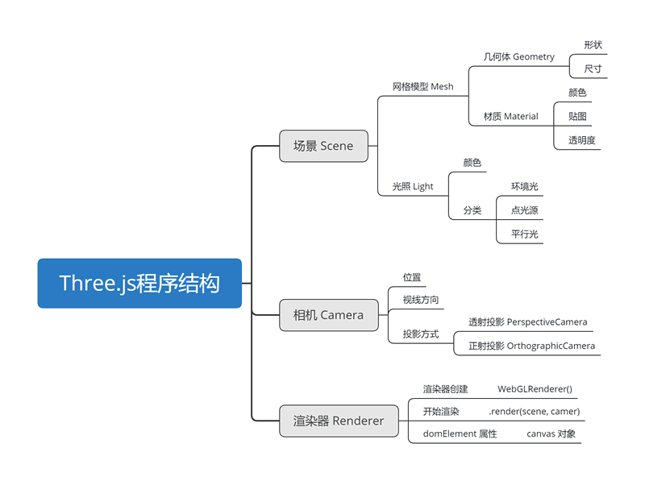

### 场景 - 相机 - 渲染器

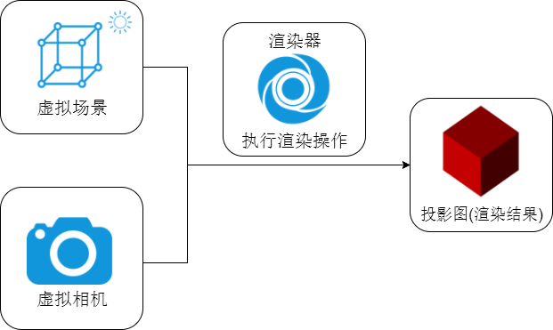

### 对象, 方法和属性

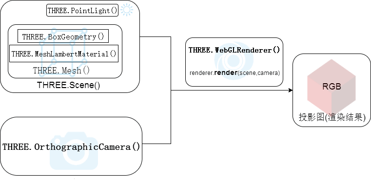

### WebGL 封装

## 1.2 插入新的几何体

[代码](1.2.html)

- SphereGeometry(radius, widthSegments, heightSegments) : 创建一个球体

  | 参数           | 含义     |
  | -------------- | -------- |
  | radius         | 球体半径 |
  | widthSegments  | 球面精度 |
  | heightSegments | 球面精度 |

## 1.3 设置透明度和高光

[代码](1.3.html)

### 设置透明度

更改材质对象参数中的 opacity 和 transparent 属性实现透明度.

opacity : 表示透明, 值的范围是0~1.

transparent : 表示是否开启透明度效果, 默认是 false 表示透明度设置不起作用.

### 添加高光

MeshLambertMaterial() 实现的是漫反射渲染, 高光效果要通过 MeshPhongMaterial() 模拟镜面反射实现. 

specular : 表示高光颜色, 高光颜色的 RGB 值会与光照颜色的 RGB 分量相乘. 

shininess : 可以理解为光照强度的系数.

## 1.4 添加旋转动画

[代码](1.4.html)

## 1.5 鼠标操作三维场景

[代码](1.5.html)

- THREE.OrbitControls(camera, renderer.domElement) : 创建操作控件, 注意第二个参数.
- controls.addEventListener('change', render) : 监听到 change 事件后触发渲染, 但一般都会有 requestAnimationFrame 循环调用, 所以一般不用特意注册事件.

# 2. 点、线、面
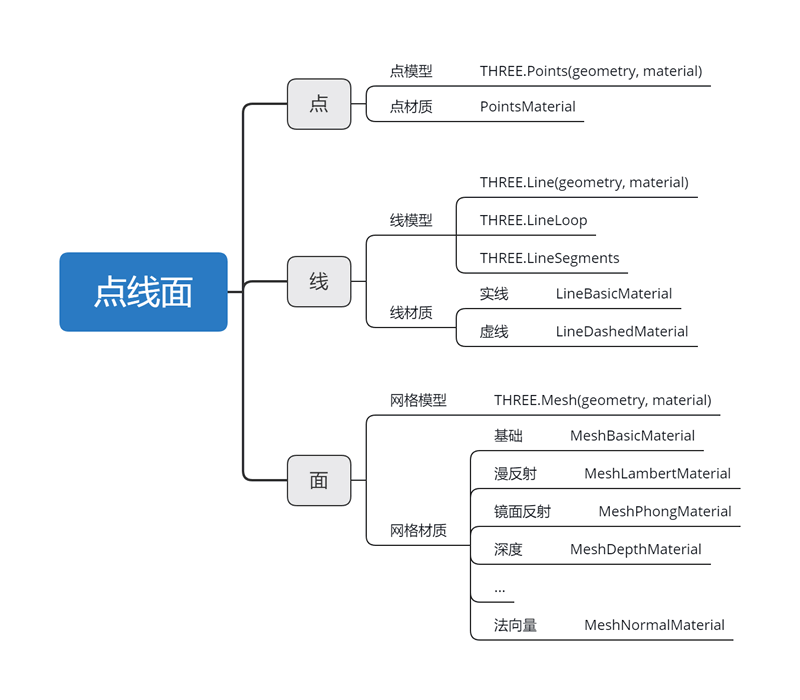

[代码](2.html)

## 2.1 颜色插值

[代码](2.1.html)

## 2.2 几何体三种渲染方式

- THREE.Line : 四个点可以连续绘制出3条直线.
- THREE.LineLoop : 与 Line 模式基本一致, 最后会产生闭合.
- THREE.LineSegments : 两个点确定1条直线, 四个点确定2条直线.

- 立方体构造函数后三个参数为立方体的细分度, 默认都是1.

# 3. 几何体对象 (三维建模)

## 3.1 常见三维几何体构造函数

## 3.2 多面体 PolyhedronGeometry

[代码](3.2.html)

## 3.3 平面构造函数

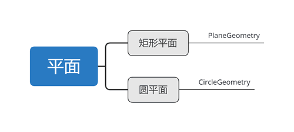

[代码](3.3.html)

- 矩形平面 PlaneGeometry(width, height, widthSegments, heightSegments) : 

  | 参数           | 含义                  |
  | -------------- | --------------------- |
  | width          | 宽                    |
  | height         | 高                    |
  | widthSegments  | 宽的细分数, 默认值为1 |
  | heightSegments | 高的细分数, 默认值为1 |

  从 WebGL 角度看三个顶点确定一个三角面, 一个矩形面至少需要两个三角面组成, 换句话说细分数就是1, 细分数越大, 就有越多的三角面组成一个矩形面, 本质上也就是顶点数量的增加.

- 圆平面 CircleGeometry(radius, segments, thetaStart, thetaLength) : 

  | 参数        | 含义                  |
  | ----------- | --------------------- |
  | radius      | 圆弧半径              |
  | segments    | 圆的细分数量          |
  | thetaStart  | 起始角度, 默认值是 0  |
  | thetaLength | 结束角度, 默认值是 2π |

## 3.4 二维轮廓线

[代码](3.4.html)

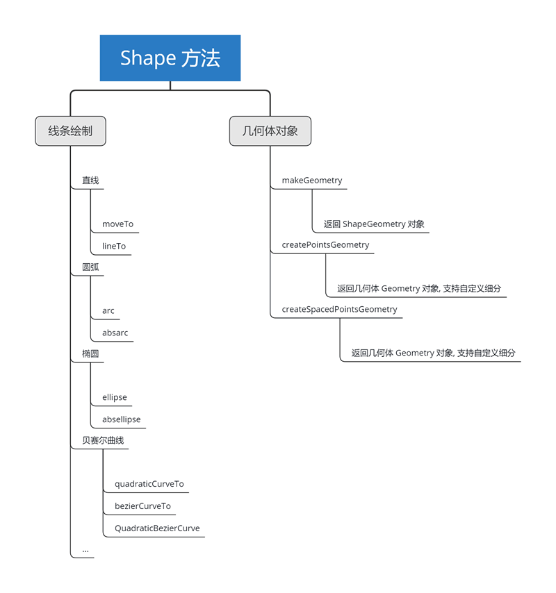

Shape 对象创建的轮廓线要想渲染出来, 首先要转化为几何体对象 Geometry, Shape 对象本身并不是顶点数据, 可以理解为是一种绘图方法, 就像数学中的曲线函数. Shape 对象转化为几何体, 本质上就是利用 Shape 定义的曲线函数生成顶点数据供 GPU 使用.

## 3.5 拉伸与扫描成型

`ExtrudeGeometry()` 和 `ShapeGeometry()` 一样是利用 Shape 对象生成几何体对象, 区别在于 `ExtrudeGeometry()` 是利用2D轮廓生成3D模型. 

`ExtrudeGeometry()` 第二个参数是拉伸参数, 数据类型是 Object.

| 属性                             | 含义                                  |
| -------------------------------- | ------------------------------------- |
| ~~amount~~(老版本) depth(新版本) | 拉伸长度, 默认100                     |
| bevelEnabled                     | 是否使用倒角                          |
| bevelSegments                    | 倒角细分数, 默认3                     |
| bevelThickness                   | 倒角尺寸 (经向)                       |
| curveSegments                    | 拉伸轮廓细分数                        |
| steps                            | 拉伸方向细分数                        |
| extrudePath                      | 扫描路径 THREE.CurvePath, 默认Z轴方向 |
| material                         | 前后面材质索引号                      |
| extrudeMaterial                  | 拉伸面, 倒角面材质索引号              |
| bevelSize                        | 倒角尺寸(拉伸方向)                    |

[代码](3.5.html)
扫描:
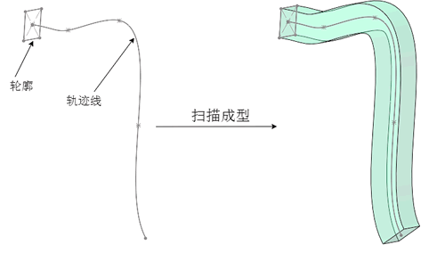

## 3.6 3D样条曲线生成管道

实际生活中的圆形截面电线, 软管等呈现样条状的几何体, 可以通过管道构造函数 `TubeGeometry()` 生成. 它和 ExtrudeGeometry() 一样是利用已有的 2D 或 3D 线条生成相关顶点数据的.

[代码](3.6.html)

- TubeGeometry(path, tubularSegments, radius, radiusSegments, closed) :

  | 参数            | 值                      |
  | --------------- | ----------------------- |
  | path            | 扫描路径                |
  | tubularSegments | 路径方向细分数, 默认64  |
  | radius          | 管道半径, 默认1         |
  | radiusSegments  | 管道圆弧细分数, 默认8   |
  | closed          | Boolean值, 管道是否闭合 |

## 3.7 参数化曲面

参数化曲面简单的说就是数学函数插值计算后生成一个曲面的顶点数据, 这需要借助构造函数 ParametricGeometry() 实现, 立方体、球体等规则几何体都是该构造函数的进一步封装.

[代码](3.7.html)

## 3.8 旋转造型

[代码](3.8.html)

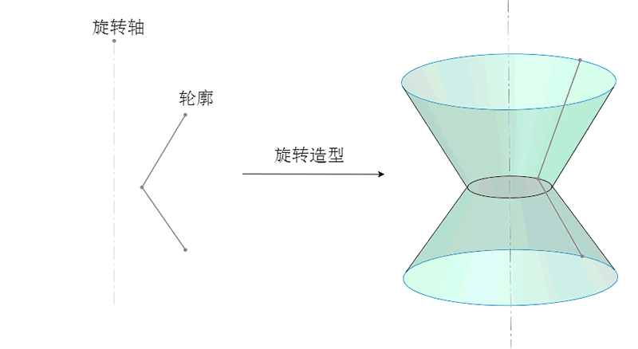

# 4. ThreeBSP 布尔运算

three.js 本身并没有提供用于几何布尔运算的构造函数, 需要借助一个库 ThreeBSP.js 实现.

几何体的布尔运算可以借助数学中学习的差集, 并集, 交集概念去理解. 几何体之间的运算本质上就是两个顶点集合的运算.

两个几何体位置关系

差集 (相减)

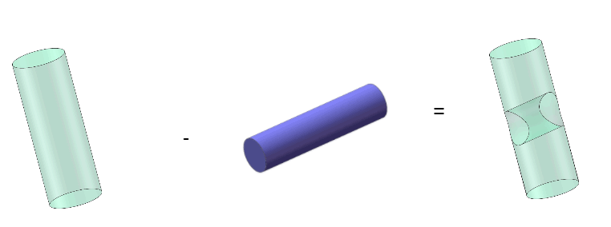

并集 (组合, 相加)

交集 (两个几何体重合的部分)

[代码](4.html)

网格 Mesh 模型对象作为构造函数 `ThreeBSP()` 的参数, 可以把普通的 Mesh 模型包装为 ThreeBSP 对象, 表示对应 Mesh 对象的 ThreeBSP 对象可以进行布尔运算, 计算结果在执行 toMesh() 方法可以把 ThreeBSP 对象重新转化为 Mesh 对象.

布尔计算方法

| 方法      | 作用             |
| --------- | ---------------- |
| intersect | 交集, 重合的部分 |
| union     | 并集, 组合, 相加 |
| subtract  | 差集, 相减       |

# 5. 几何变换

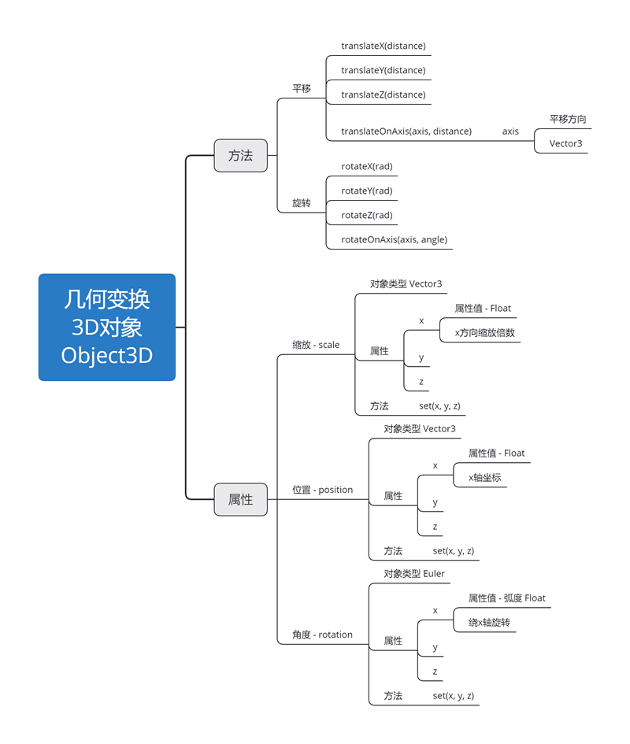

[代码](5.html)

## position 和 translateX()

位置属性 `position` 和平移方法 `translateX()` 一样都是设置距离, 方法 `translateX()` 设置的是相对上一次位置进行平移, 两次执行该方法, 距离会叠加. `position` 属性设置的距离是相对坐标系原点位置, 两次执行 `position` 属性, 只会更新定位, 两次的距离参数不是叠加关系, 而是替换关系.

## rotation 和 rotateX()

`rotation` 属性和旋转方法 `rotateX()` 差异和 `position` 属性与平移方法 `translateX()` 的差异类似. 一个是相对坐标系设置角度, 位置. 一个是相对当前的三维模型的状态设置角度, 位置参数. 旋转和平移参考的都是坐标系, 不过参考的坐标系稍有不同. 平移参考的是世界坐标系或者说三维场景对象 `Scene` 的坐标系. 三维模型的旋转参考的是模型坐标系, 也就是对三维模型本身建立的坐标系.

## 坐标系

- 场景中的立方体, 圆柱等三维模型的位置属性, 平移方法参照 Scene 对象的世界坐标系.
- 场景中的立方体, 圆柱等三维模型的角度属性, 旋转方法参照模型自身的模型坐标系.

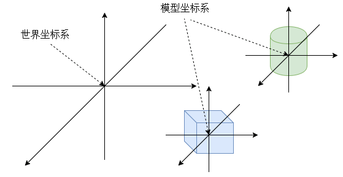

## 一个几何体 - 多个网格模型

可以通过一个几何体创建多个网格模型, 网格模型可以共享几何体对象和材质对象. 针对网格模型对象进行缩放平移旋转变换, 并不会影响其他网格模型.

几何体对象也可以进行缩放平移旋转变换, 一旦修改, 通过几何体对象创建的网格模型都会受影响.

[代码](5-1.html)

# 6. 三维模型复制、克隆

[代码](6.html)

# 7. 三维模型阵列

three.js 并没有提供几何体或网格模型阵列的API, 不过可以通过 for 循环自定义.

[代码](7.html)

## 整体平移立方体

创建好一批立方体网格模型后, 如果希望整体进行平移操作, 不需要一个个执行平移操作, 可以利用 Object3D 对象对网格模型进行分组, 对这个组 Object3D 进行平移操作即可. Object3D 对象支持嵌套.

# 8. 材质

