# webgl_animation_cloth


- main.js : 包含场景, 模拟风/球等全局代码.
- cloth.js : 模拟布料

# webgl_animation_keyframes


gltf 包含模型文件, 文件较大故单独放到网盘上了.

# webgl-animation-skinning-blending

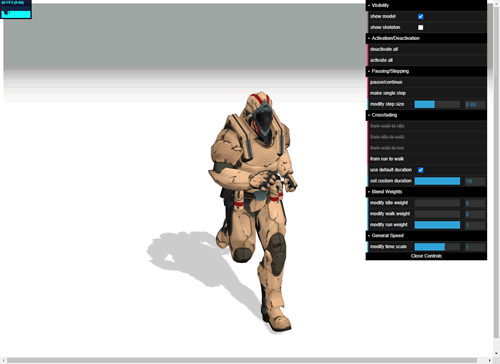

```bash
# 首次运行先生成 dll
npx webpack --config webpack.dll.config.js
# 开启 webpack 测试服务器
npx webpack-dev-server
```

# webgl_animation_skinning_morph

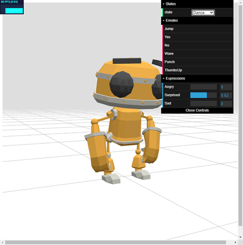

# webgl_animation_skinning_additive_blending

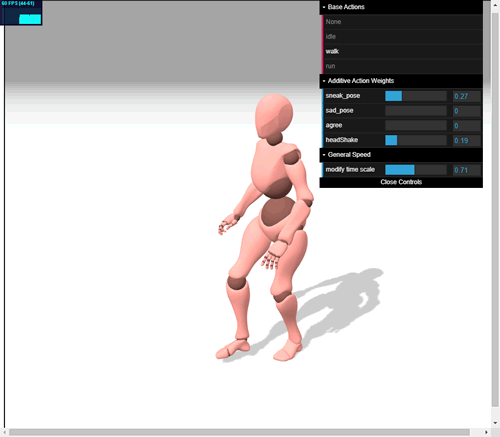

# webgl_animation_multiple

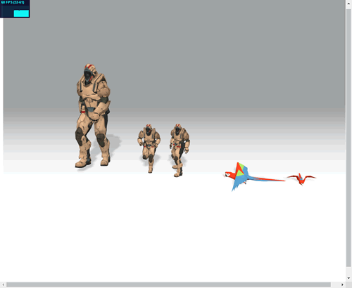

# webgl_camera

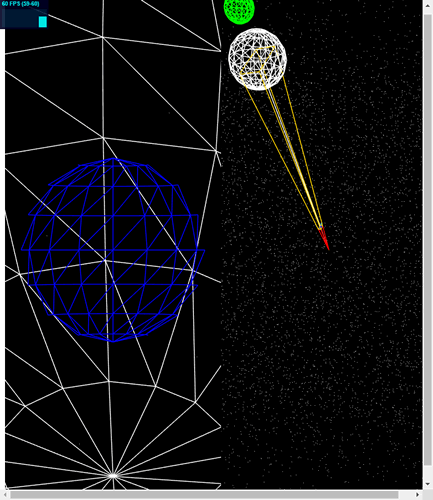

# webgl_camera_array

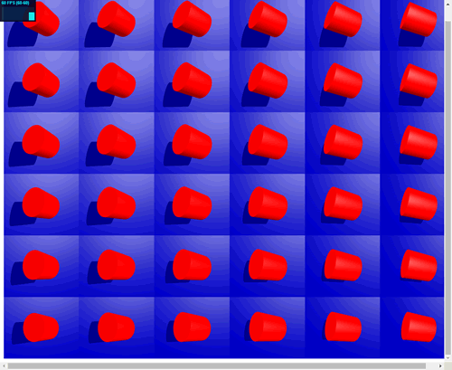

# webgl_camera_cinematic

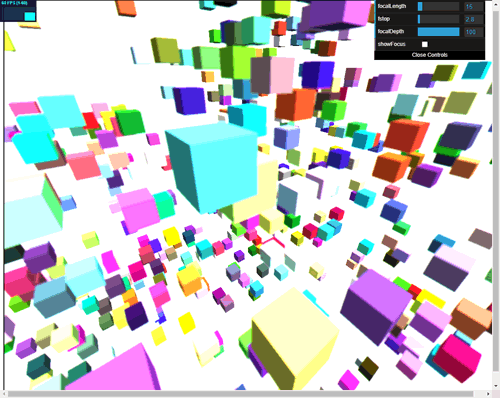

# webgl_camera_logarithmicdepthbuffer

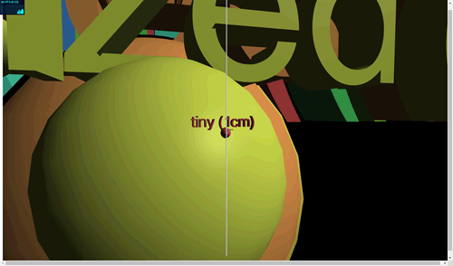

# webgl_clipping

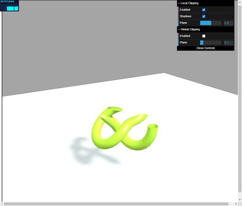

# webgl_clipping_advanced

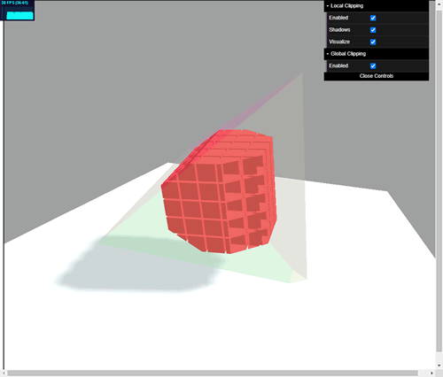

# webgl_clipping_intersection

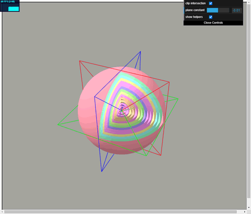

# webgl_clipping_stencil

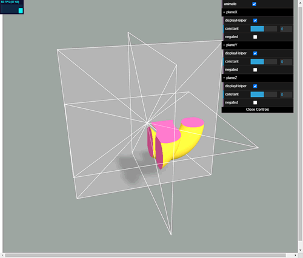

# webgl_decals

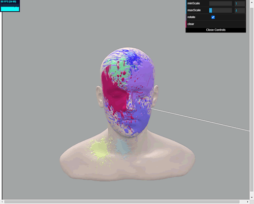