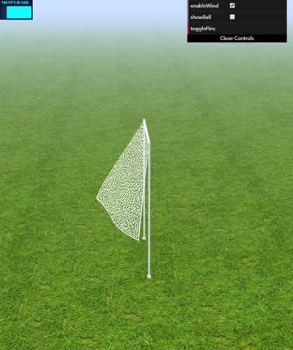

[link](https://threejs.org/examples)

# webgl_animation_cloth



- main.js : 包含场景, 模拟风/球等全局代码.
- cloth.js : 模拟布料

# webgl_animation_keyframes


gltf 包含模型文件, 文件较大故单独放到网盘上了.

# webgl-animation-skinning-blending


# webpack 运行的项目:

```bash
# 首次运行先生成 dll
npx webpack --config webpack.dll.config.js
# 开启 webpack 测试服务器
npx webpack-dev-server
```

# webgl_animation_skinning_morph


# webgl_animation_skinning_additive_blending


# webgl_animation_multiple


# webgl_camera


# webgl_camera_array


# webgl_camera_cinematic


# webgl_camera_logarithmicdepthbuffer


# webgl_clipping


# webgl_clipping_advanced


# webgl_clipping_intersection


# webgl_clipping_stencil


# webgl_decals


# webgl_depth_texture


# webgl_effects_anaglyph


# webgl_effects_ascii


# webgl_effects_parallaxbarrier


# webgl_effects_peppersghost


# webgl_effects_stereo


# webgl_geometries


# webgl_geometries_parametric


# webgl_geometry_colors


# webgl_geometry_colors_lookuptable

webgl/geometry/webgl_geometry_colors_lookuptable


# webgl_geometry_convex

webgl/geometry/webgl_geometry_convex


# webgl_geometry_cube

webgl/geometry/webgl_geometry_cube


# webgl_geometry_dynamic

webgl/geomerty/webgl_geometry_dynamic


# webgl_geometry_extrude_shapes

webgl/geomerty/webgl_geometry_extrude_shapes


# webgl_geometry_extrude_shapes2

webgl/geomerty/webgl_geometry_extrude_shapes2


# webgl_geometry_extrude_splines

webgl/geometry/webgl_geometry_extrude_splines


# webgl_geometry_hierarchy

webgl/geometry/webgl_geometry_hierarchy


# webgl_geometry_hierarchy2

webgl/geometry/webgl_geometry_hierarchy2


# webgl_geometry_minecraft

webgl/geometry/webgl_geometry_minecraft


# webgl_geometry_minecraft_ao

webgl/geometry/webgl_geometry_minecraft_ao


# webgl_geometry_normals

webgl/geometry/webgl_geometry_normals


# webgl_geometry_nurbs

webgl/geometry/webgl_geometry_nurbs


# webgl_geometry_shapes

webgl/geometry/webgl_geometry_shapes


# webgl_geometry_spline_editor

webgl/geometry/webgl_geometry_spline_editor


# webgl_geometry_teapot

webgl/geometry/webgl_geometry_teapot


# webgl_geometry_terrain

webgl/geometry/webgl_geometry_terrain


# webgl_geometry_terrain_fog

webgl/geometry/webgl_geometry_terrain[DemoFog]


# webgl_geometry_terrain_raycast

webgl/geometry/webgl_geometry_terrain[DemoRaycast]

# webgl_geometry_text

webgl/geometry/webgl_geometry_text


# webgl_geometry_text_shapes

webgl/geometry/webgl_geometry_text_shapes


# webgl_geometry_text_stroke

webgl/geometry/webgl_geometry_text_stroke


# webgl_helpers

webgl/helpers/webgl_helpers


# webgl_instancing_dynamic

webgl/instancing/webgl_instancing_dynamic


# webgl_instancing_performance

webgl/instancing/webgl_instancing_performance


# webgl_instancing_raycast

webgl/instancing/webgl_instancing_raycast


# webgl_instancing_scatter

webgl/instancing/webgl_instancing_scatter


# webgl_interactive_buffergeometry

webgl/interactive/webgl_interactive_buffergeometry


# webgl_interactive_cubes

webgl/interactive/webgl_interactive_cubes


# webgl_interactive_cubes_gpu

webgl/interactive/webgl_interactive_cubes_gpu


# webgl_interactive_cubes_ortho

webgl/interactive/webgl_interactive_cubes_ortho


# brunch 运行的项目:

```bash
brunch new -s threeJS

npm start
```

# webgl_framebuffer_texture

