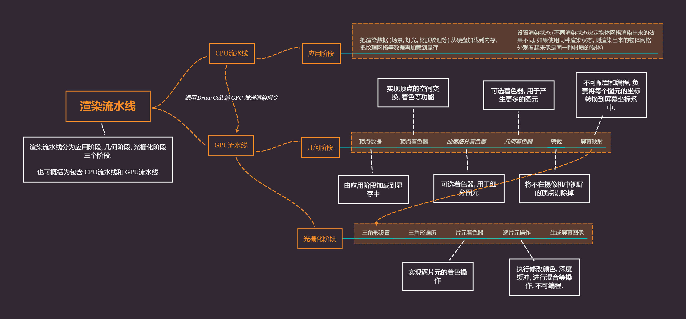
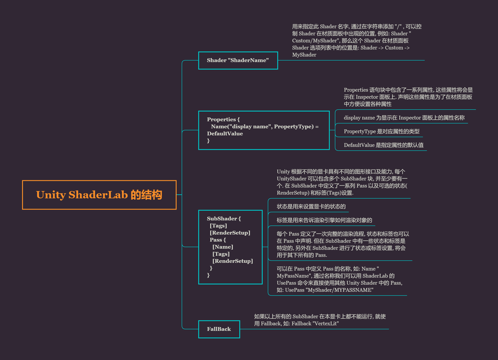

# Unity Shader 的学习笔记

# 1. 基本 Shader

1.1 shader 是运行在 GPU 上的程序.

1.2 目前主流针对 GPU 编程的技术有:

- HLSL: 微软研发, 只能供 Direct3D 使用.
- GLSL: 是用来在 OpenGL 中编程的着色器语言
- CG: NVIDIA 和微软合作开发, 独立的三维编程接口, 不依赖于 D3D 和 OpenGL, 可以和这两种图形渲染库结合起来使用.

1.3 Unity 中的着色器可以分为三类

- 固定管线着色器: 为了兼容老一代 GPU 而设计, 最早的图形学版本都是基于这个着色器来编写
- 顶点片元着色器: 比固定管线着色器要新, 功能强大, 可编程, 缺点是不支持光照
- 表面着色器: Unity 官方推荐的着色器, 可编程, 支持光照, 自定义光照模型, 自由度高

1.4 Unity shader 编程语言:

ShaderLab 基本语法结构:

```glsl
Shader "name" {
    [Properties] // 属性
    Subshaders {} // 子着色器
    [Fallback] // 降级着色器
}
```

1.4.1 在 Properties 块中代表的是着色器中使用到的所有属怀, 这些参数可以在 Inspector 中进行编辑和调整.

Properies 的示例语法:

```glsl
属性名("Inspector显示的名字", 数据类型) = 初始值
数据类型有:
Range(min, max), Float, Int, Color(num, num, num, num), Vector(num, num, num, num), 2D, 3D 等
```

真正用于呈现渲染的代码都放在 SubShader 块, 其主要由可选标签, 通用状态以及一个通道列表构成.

每个 Shader 都包含一个 SubShader 列表, 游戏运行时会根据实际的运行环境从上到下选择一个合适的 SubShader 来使用. 


1.4.2 SubShader 语法结构:

```glsl
SubShader {
    [Tags]
    [CommonState]
    Pass {}
}
```

重要的代码和核心渲染逻辑基本都在 Pass 块中, 一个 SubShader 可以包含多个 Pass 块, Pass 的语法:

```glsl
Pass {
    [Name and Tags]
    [RenderSetup] // 可以设置显卡的各种状态
    // 例如:
    // Lighting (光照, 开启或者关闭对应 On 和 Off)
    // Material {材质块}
    // SeparateSpecular (开启或者关闭顶点光照相关的镜面高光颜色, 允许高光有不同的颜色)
    [TextureSetup]
}
```

1.4.3 最后是使用降级着色器 Fallback , 作用是当编写的 Shader 无法完成渲染任务时备选的渲染方案, 以防渲染程序报错崩溃.

# 2. 镂空透明

早期做 3D 模型时会用到透明贴图来表现人物模型头发镂空的效果, 具体讲究"黑透白不透", 意为用一张带 alpha 通道的黑白贴图做 mask 遮罩, 黑色的部分表示透明, 白色的部分表示不透明. 将这张特殊的贴图放到三维软件特殊的通道上即可实现模型的镂空透明的效果.

Shader 里的镂空透明效果和上面有一定联系, 大致就是利用 alpha 的混合, 两种不同的重叠的色值按照一定的比例混合, 得到一个最终颜色. 当这两个重叠的颜色中有一个颜色的混合系数为零, 那么重叠的部分就只会显示另一种颜色. 即, 这个混合系数为零的颜色被另一个颜色遮挡一样, 相对的当上方的颜色混合系数为零, 那么就只显示下方的颜色了, 这样就实现了透明的效果.

```glsl
Shader "Custom/Shader2"
{
    Properties
    {
        _Color("Color", Color) = (1, 1, 1, 1) // 设置主颜色
        _MainTex("Albedo(RGB)", 2D) = "white"{} // 设置主纹理
    }
    SubShader
    {
        // 使用透明队列渲染标签
        Tags{"Queue" = "Transparent"}
        Pass
        {
            // 定义材质
            Material
            {
                Diffuse[_Color] // 漫反射
                Ambient[_Color] // 环境光
            }
            // 使用 Alpha 混合功能必须要预先开启, 使用 Blend 指令
            Blend SrcAlpha OneMinusSrcAlpha
            // 开启标准顶点光照
            Lighting On
            // 纹理设置
            SetTexture[_MainTex]
            {
                constantColor[_Color]
                Combine texture*primary DOUBLE, texture*constant
            }
        }
    }
    Fallback "Diffuse"
}
```

这里的 Material 代码块可以将 Properties 块中的属性值绑定到固定函数光照材质设置上. SetTexture 代码块定义了我们想要使用的纹理以及如何在渲染中混合, 组合和应用这些纹理.

我们设置一个恒定的颜色值, 即材质的颜色: _Color. 之后用 Combine 命令执行将纹理和颜色值混合, 通常写为 `Combine ColorPart, AlphaPart`, 这里的 ColorPart 和 AlphaPart 分别定义颜色(RGB)和Alpha(A) 分量的混合, AlphaPart 可以省略.

上面代码中的 `Combine texture*primary DOUBLE, texture*constant` 这里的 texture 是来自当前纹理 (_MainTex) 的颜色, 它与 primary 顶点颜色相乘 (*). 主色是顶点光照颜色, 根据上面的材质值计算得出, 最后将结果乘以 2 来增加光照强度 (DOUBLE). Alpha 值则是由 `texture * constant`(constant 是 constantColor 设置的).

和 Standard Shader 相比, 当 Standard Shader 的 Rendering Mode 选择为 Transparent 后, 也会有镂空效果, 并且场景中的光线可以在平面上产生相对应穿过物体透明部分的阴影, 但目前我们自己编写的 Shader 影子还是实心的, 这里涉及到光照阴影处理部分, 后面再研究.

# 3. AlphaTest

AlphaTest 通俗来讲就是给定一个 Alpha 阈值, 之后在给定一个测试公式, Alpha 阈值配合 Alpha 测试公式对屏幕上所有的像素点进行测试, 通过测试的像素点就保留, 没有通过测试的像素点就会被拣选掉. 

比如, 有一个红色的值为 ColorRed(255, 0, 0), 紫色的值为 ColorPurple(255, 0, 255). 此时我们给定一个 Alpha 阈值为 125, 拟定一个测试公式是 `Color.Green > Alpha 阈值`, 即颜色的 Green 数值大于 Alpha 阈值. 之后就用这个阈值和测试公式对屏幕上所有像素点进行测试, 通过测试的就留下, 没有通过的就被拣选掉. 此时, 因为红色和紫色的 G 数值为 0 , 因此结果就是都没有通过测试, 此时屏幕上就看不见红色和紫色, 只能看见屏幕中的背景了.

# 4. 渲染流水线



ShaderLab 的结构



## Properties

| 属性类型        | 默认值的定义语法                 | 例子                                     |
| --------------- | -------------------------------- | ---------------------------------------- |
| Int             | number                           | _Int("int", Int) = 2                     |
| Float           | number                           | _Float("float", Float) = 1.5             |
| Range(min, max) | number                           | _Range("Range", Range(0.0, 5.0)) = 3.0   |
| Color           | (number, number, number, number) | _Color("Color", Color) = (1, 1, 1, 1)    |
| Vector          | (number, number, number, number) | _Vector("Vector", Vector) = (2, 3, 6, 1) |
| 2D              | "defaulttexture" {}              | _2D("2D", 2D) = ""{}                     |
| Cube            | "defaulttexture" {}              | _Cube("Cube", Cube) = "white" {}         |
| 3D              | "defaulttexture" {}              | _3D("3D", 3D) = "black" {}               |

对于 2D, Cube, 3D 这3种纹理类型定义要稍微复杂些, 它们的默认值是通过一个字符串后跟一对花括号来指定的. 其中字符串要么是空, 要么是内置的纹理名称, 如: "white", "black" "gray" 或者 "bump", 花括号的用处原本是用于指定一些纹理属性的, 但现在已经被移除了. 如有需要, 则要自己在顶点着色器中编写计算相应的纹理坐标代码.

## RenderSetup

| 状态名称 | 设置指令                                               | 解释                                 |
| -------- | ------------------------------------------------------ | ------------------------------------ |
| Cull     | Cull Back/Front/Off                                    | 设置剔除模式, 剔除背面/正面/关闭剔除 |
| ZTest    | ZTest Less/Greater/LEqual/GEqual/Equal/NotEqual/Always | 设置深度测试时使用的函数             |
| ZWrite   | Zwrite On/Off                                          | 开启/关闭深度写入                    |
| Blend    | Blend SrcFactor DstFactor                              | 开启并设置混合模式                   |

## Tags

| SubShader 标签类型   | 说明                                                         | 例子例子例子例子例子例子例子例子例子例子例子例子例子例子例子例子例子例子例子例子例子例子例子例子例子例子例子 |
| -------------------- | ------------------------------------------------------------ | ------------------------------------------------------------ |
| Queue                | 控制渲染顺序, 指定该物体属于哪一个渲染队列, 可用于指定所有透明物体在不透明物体后面被渲染. | Tags{"Queue" = "Transparent"}                                |
| RenderType           | 对着色器进行分类, 可以被用于着色器替换功能.                  | Tags{"RenderType" = "Opaqure"}                               |
| DisableBatching      | 一些 SubShader 在使用批处理功能时会出现问题, 例如使用了模型空间下的坐标进行顶点动画, 这时可以用这个标签来指定是否使用批处理. | Tags{"DisableBatching" = "True"}                             |
| ForceNoShadowCasting | 控制使用该 SubShader 的物体是否会投射阴影.                   | Tags{"ForceNoShadowCasting" = "True"}                        |
| IgnoreProjector      | 通常用于半透明物体, 如果为 True, 那么使用该 SubShader 的物体将不会受 projector 的影响. | Tags{"IgnoreProjector" = "True"}                             |
| CanUseSpriteAtlas    | 当该 SubShader 是用于 sprite 时, 将该标签设为 False.         | Tags{"CanUseSpriteAtlas" = "False"}                          |
| PreviewType          | 指定材质面板如何预览材质, 默认显示一个球形, 可以将该标签的值设置为 "Plane", "SkyBox" 来改变预览类型. | Tags{"PreviewType" = "Plane"}                                |

## Pass Tags

| Pass 标签类型  | 说明                                      | 例子                                       |
| -------------- | ----------------------------------------- | ------------------------------------------ |
| LightMode      | 定义该 Pass 在 Unity 的渲染流水线中的角色 | Tags{"LightMode" = "ForwardBase"}          |
| RequireOptions | 用于指定当满足某些条件时才渲染该 Pass     | Tags{"RequireOptions" = "SoftVergetation"} |

