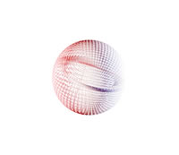

[link](https://www.vertexshaderart.com/)

```bash
# 首次运行先生成 dll
npx webpack --config webpack.dll.config.js
# 开启 webpack 测试服务器
npx webpack-dev-server
```

# 1. point cloud vs spheres by Kabuto

nL6YpkW8YvGKNEKtj


# 2. Bilinear Patch

mFr92RbhPmuJXKXWK


# 3. undul 👾

wFtvqKAQ3wB8Hho3p


# 4. run 🌳🌲🎄🎋🌴

Yudd65BQfx92kHBcH


# 5. flwr

PFHJfQrt3knT8K8sQ


# 6. sbd

PponkZdtktgJHhipC


# 7. morp ⭕️⭕️⭕️⭕️⭕️⭕️⭕️

RnwjSt42YXLcGjsgT

